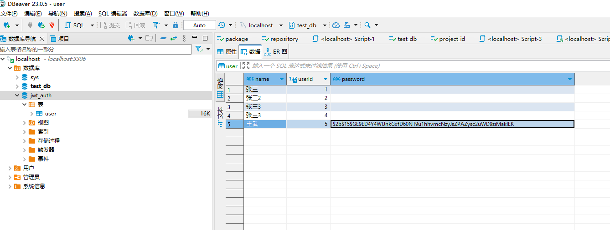
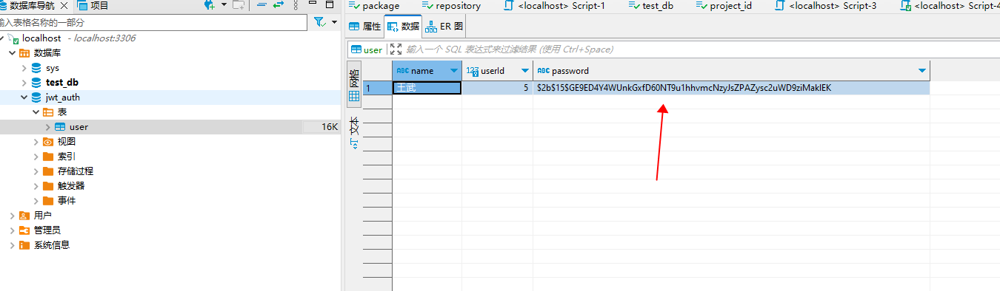
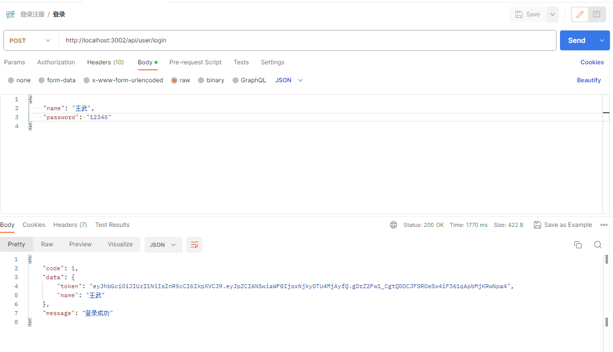
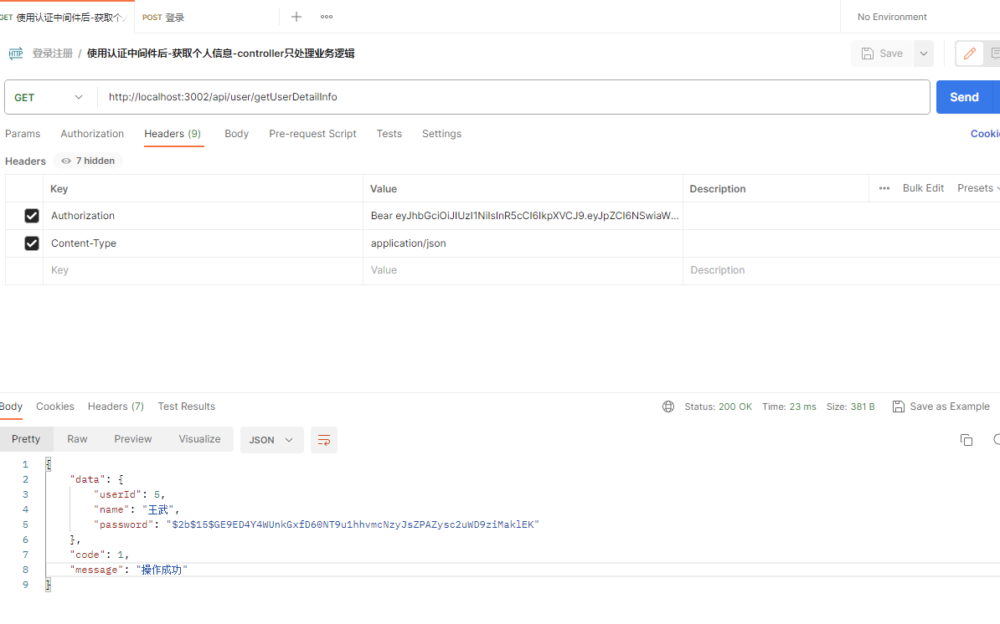

# 登录注册

### 环境准备
```javascript
node v14.21.3  以上

mysql 8.x
```

```json
{
  "name": "jwt",
  "main": "index.js",
  "type": "module",
  "scripts": {
    "dev": "nodemon src/index.js"
  },
  "dependencies": {
    "bcrypt": "^5.1.1",
    "express": "^4.18.2",
    "jsonwebtoken": "^9.0.1",
    "mysql2": "^3.6.0",
    "typeorm": "^0.3.17"
  },
  "devDependencies": {
    "nodemon": "^3.0.1"
  },
}
```

#### bcrypt安装
这边包的安装是比较费劲的， 需要多次尝试

1、 安装python 3<br />window下，直接在应用商店安装即可[window-应用商店-python](https://apps.microsoft.com/store/detail/python-310/9PJPW5LDXLZ5?hl=en-us&gl=us)<br />安装python V3.x版本， 可能存在网络中断，需要多次尝试

2、安装node-gyp
```shell

测试版本: node-gyp 9.4.0 ，截止 2023-08-25 该版本为最新版本
npm i node-gyp -g
```
3、最后才安装   "bcrypt": "^5.1.1" ， 截止  2023-08-25 该版本为最新版本
```shell
npm i bcrypt -S
```
可能因为网络原因，需要多次尝试安装

### 项目结构
```shell
|-- 目录
    |-- package.json
    |-- README.md
    |-- src
        |-- index.js   			项目入口
        |-- db
        |   |-- index.js    数据库初始化
        |-- middleware
        |   |-- auth.js     token认证中间件
        |-- model
        |   |-- userModel.js 用户实体
        |-- router
            |-- index.js
            |-- user.js
```

### 初始化数据库
```javascript
import express from 'express'

import { datasource } from './db/index.js'
// 初始化数据库
await datasource.initialize()

const app = express()

import authMiddleware from './middleware/auth.js'

import router from './router/index.js'

app.use(express.json())

app.use(authMiddleware)

router(app)

app.listen(3002, () => {
  console.log('监听 http://localhost:3002')
})

```

#### 数据库初始化
```javascript
import {DataSource} from 'typeorm'
import UserModel from '../model/userModel.js'

export const datasource = await new DataSource({
	type: 'mysql',
	host: 'localhost',
	port: 3306,
	username: 'root',
	password: '123456',
	database: 'jwt_auth',
	// 是否将实体同步到数据库
	synchronize: true,
	// 自动加载实体配置， forFeature() 注册的每个实体都自动加载
	autoLoadEntities: true,
	// 指定时区
	timezone: '+08:00',
  entities: [
    UserModel
  ]
})

```
datasource 导出， 方便我们在具体的路由业务中做数据的 增删改查

需要提前创建好数据库 **jwt_auth** ,  User 表不需要管， 因为我们这里使用了 **synchronize** 自动同步， 项目启动后， 自动会在 mysql中创建好 user表



#### 定义用户实体
```javascript
import { EntitySchema } from 'typeorm'
import bcrypt from 'bcrypt'

export default new EntitySchema({
  name: 'User',
  columns: {
    userId: {
      type: 'int',
      primary: true,
      // 自增主键
      generated: 'increment'
    },
    name: {
      type: 'varchar',
      length: 50,
      nullable: false,
      comment: '用户名',
      // 是否唯一
      // unique: true
    },
    password: {
      type: 'varchar',
      length: 100,
      nullable: false,
      comment: '用户密码',
      transformer: {
        to (val) {
          let v = bcrypt.hashSync(val, 10)
          // 加密密码
          // console.log('散列后的值', v);

          return v
        },
        from (val) {
          console.log('读取数据', val);
          return val
        }
      }
    }
  }
})
```
当前用户表，仅创建了3个字段做测试。 其中 userId  作为表的主键， 采用自增的形式， 也可以用其他模式

generated : "increment"   从1 ， 2，3，4 。。。。等<br />generated： "uuid"     插入数据时， 自动生成一个唯一的 uuid<br />generated： "rowid"


password 字段的  transformer 2个函数， 后面做密码加密会讲解


### 初始化路由

```javascript
import userRouter from './user.js'

export default (app) => {
  app.use('/api/user', userRouter)
}
```
这里将 app示例当做参数传入， 方便统一维护和管理 应用的路由， 比如有  用户相关的路由，有订单， 数据分析，支付路由等等， 比较直观


#### 用户路由
```javascript

import express from 'express'
const router = express.Router()

router.post('/login', async (req, res) => {
	res.send('登录成功')

})

router.post('/register', async (req, res) => {
  res.send('注册成功')
})

export default router
```
初始化2个路由的雏形

<a name="AHWTt"></a>
### 注册
注册应该包含如下逻辑

- 前端 用户名 + 密码 必传
- 后端 验证用户名 + 密码是否为空， 做空判断
- 后端 ： 用户名 ， 密码都有值， 对密码进行加密， 然后将用户信息存储入库
- 后端： 根据用户的id， 生成token并返回给前端

```javascript

import express from 'express'
import { datasource } from '../db/index.js'
import userEntity from '../model/userModel.js'

const userRepository = datasource.getRepository(userEntity)

router.post('/register', async (req, res) => {
  let { name, password } = req.body

  if (!name || !name.trim()) {

    res.json({
      code: -1,
      data: null,
      message: '用户名不能为空'
    })

    return
  }

  if (!password || !password.trim()) {

    res.json({
      code: -1,
      data: null,
      message: '密码不能为空'
    })

    return
  }

  let result = await userRepository.insert({
    name: name.trim(),
    password: password.trim()
  })

  console.log(result)

  res.send('注册成功')
})
```
上面代码仅仅是看到了对 name 和 password字段的非空判断，并没有看到密码是怎么从**明文** 变成**密文**的


#### 密码加密
我们再看看 用户实体类

```javascript
import { EntitySchema } from 'typeorm'
import bcrypt from 'bcrypt'

export default new EntitySchema({
  name: 'User',
  columns: {
    password: {
      type: 'varchar',
      length: 100,
      nullable: false,
      comment: '用户密码',
      transformer: {
        to (val) {
          let v = bcrypt.hashSync(val, 10)
          // 加密密码
          // console.log('散列后的值', v);

          return v
        },
        from (val) {
          console.log('读取数据', val);
          return val
        }
      }
    }
  }
})
```
typeorm 在实体里面的 column字段上， 插入数据库之前 支持对数据进行转换操作， 也就是 transformer

to:  业务代码将数据插入到数据库， 会执行 to函数<br />from: 从数据库读取代码，会执行 from函数

2个函数方便在一些场景做数据转换， 密码明文变成 密文，本质也是一种 数据转换 动作

我们使用 bcrypt 将明文 val 变成散列后的密文， 然后 返回， 即入库， 此时数据库中的密码就是密文<br />



到此， 用户注册+ 密码加密 都做完了


### 登录
登录需要做的事情如下

- 验证前端传入的用户名和密码是否为空
- 后端： 用户名，密码不为空， 查询用户是否存在， 如果不存在，则返回提示信息给前端
- 后端： 验证前端传入的密码是否正确， 如果不正确，则返回提示信息给前端
- 后端： 将用户id 采用 jwt 进行签名，生成token， 并返回给前端
- 前端拿到登录的token后， 存入localStorage / sessionStorage

#### 用户信息进行签名，返回token
```javascript
import express from 'express'
import { datasource } from '../db/index.js'
import userEntity from '../model/userModel.js'
import bcrypt from 'bcrypt'
import jwt from 'jsonwebtoken'

// 生成/验证token 的秘钥
export const SECRET = 'abcdefg'

router.post('/login', async (req, res) => {

  let { name, password } = req.body

  if (!name || !name.trim()) {

    res.json({
      code: -1,
      data: null,
      message: '用户名不能为空'
    })

    return
  }

  if (!password || !password.trim()) {

    res.json({
      code: -1,
      data: null,
      message: '密码不能为空'
    })

    return
  }

  let result = await userRepository.findOne({
    where: {
      name: name.trim()
    }
  })

  if (!result) {
    res.json({
      code: -1,
      data: null,
      message: "用户不存在,请先注册"
    })
    return
  }

  // 验证密码

  let compareResult = await bcrypt.compare(password.trim(), result.password)

  console.log('密码比较', compareResult);

  if (compareResult) {
    // 生成token
    console.log(result.userId, '用户id');
    // 签名
    let token = jwt.sign({
      id: result.userId
    }, SECRET)

    res.json({
      code: 1,
      data: {
        token,
        name: result.name
      },
      message: '登录成功'
    })
  } else {
    res.json({
      code: -1,
      data: null,
      message: '密码错误'
    })
  }
})
```





### token认证中间件

中间件对接口做统一认证

- 对部分接口需要做白名单处理， 并不是所有接口都有token
- headers里面是否有 authorization ， token信息， 没有则返回提示信息
- 拿到token （签名后的）， 解析里面的用户id
- 为了方便，将用户id 挂载到 req 全局对象上


#### 解析token
```javascript
/**
 * token认证的中间件
 */
import jwt from 'jsonwebtoken'
import { SECRET } from '../router/user.js'

// 路由白名单，否则登录接口也会验证token
let whiteList = ['/api/user/login', '/api/user/register']

export default (req, res, next) => {
  let url = req.path

  console.log('url', url);

  if (whiteList.includes(url)) {
    // 直接放行
    next()

    return
  }

  let authorization = req.headers.authorization

  // 从token里面拿到用户id

  if (!authorization) {
    res.status(401).json({
      code: -1,
      data: null,
      message: '未授权'
    })
    // 没有验证通过，就不要执行next
    return
  }

  let token = authorization.split(' ')[1]

  try {
    let decoded = jwt.verify(token, SECRET)

    // 将用户信息挂载到req全局对象上
    req.userId = decoded.id

    // console.log('decoded 包含2个内容，一个是用户id， 一个是iat', decoded);

    next()
  } catch (error) {
    console.log(error);
    res.json({
      code: -1,
      data: null,
      message: 'token错误'
    })
  }

}
```


### 业务代码
基本大部分业务代码， 都需要做token的认证， 前面已经将token认证写成了中间件， 业务代码只需要关注业务相关逻辑即可

假设某个业务中需要拿到token里面的用户id

```javascript

import express from 'express'
import { datasource } from '../db/index.js'
import userEntity from '../model/userModel.js'

const userRepository = datasource.getRepository(userEntity)

const router = express.Router()

router.get('/getUserDetailInfo', async (req, res) => {
  console.log('authMiddleware 已经拿到了用户的id， 这里可以直接使用', req.userId);

  // 根据token里面的用户id查询到用户信息
  let userItem = await userRepository.findOne({
    where: {
      userId: req.userId
    }
  })

  res.send({
    data: userItem,
    code: 1,
    message: '操作成功'
  })
})
```

### 完整的user.js代码

```javascript

import express from 'express'
import { datasource } from '../db/index.js'
import userEntity from '../model/userModel.js'
import bcrypt from 'bcrypt'
import jwt from 'jsonwebtoken'

const userRepository = datasource.getRepository(userEntity)

const router = express.Router()

// 生成/验证token 的秘钥
export const SECRET = 'abcdefg'


router.post('/login', async (req, res) => {

  let { name, password } = req.body

  if (!name || !name.trim()) {

    res.json({
      code: -1,
      data: null,
      message: '用户名不能为空'
    })

    return
  }

  if (!password || !password.trim()) {

    res.json({
      code: -1,
      data: null,
      message: '密码不能为空'
    })

    return
  }

  let result = await userRepository.findOne({
    where: {
      name: name.trim()
    }
  })

  if (!result) {
    res.json({
      code: -1,
      data: null,
      message: "用户不存在,请先注册"
    })
    return
  }

  // 验证密码

  let compareResult = await bcrypt.compare(password.trim(), result.password)

  console.log('密码比较', compareResult);

  if (compareResult) {
    // 生成token
    console.log(result.userId, '用户id');
    // 签名
    let token = jwt.sign({
      id: result.userId
    }, SECRET)

    res.json({
      code: 1,
      data: {
        token,
        name: result.name
      },
      message: '登录成功'
    })
  } else {
    res.json({
      code: -1,
      data: null,
      message: '密码错误'
    })
  }
})

router.post('/register', async (req, res) => {

  let { name, password } = req.body

  if (!name || !name.trim()) {

    res.json({
      code: -1,
      data: null,
      message: '用户名不能为空'
    })

    return
  }

  if (!password || !password.trim()) {

    res.json({
      code: -1,
      data: null,
      message: '密码不能为空'
    })

    return
  }

  let result = await userRepository.insert({
    name: name.trim(),
    password: password.trim()
  })

  console.log(result)

  res.send('注册成功')
})


/**
 * 获取个人信息
 *
 * 示例： 将token的获取和验证放在 getUserInfo这个 controller里面 ，见下面的优化后的路由-token验证是使用中间件（authMiddleware）实现
 */
router.get('/getUserInfo', async (req, res) => {
  let authorization = req.headers.authorization

  // 从token里面拿到用户id

  if (!authorization) {
    res.status(401).end({
      code: -1,
      data: null,
      message: '未授权'
    })
    return
  }


  let token = authorization.split(' ')[1]
  console.log('token', token);

  try {
    let decoded = jwt.verify(token, SECRET)

    console.log('decoded 包含2个内容，一个是用户id， 一个是iat', decoded);
    let userId = decoded.id

    // 根据token里面的用户id查询到用户信息
    let userItem = await userRepository.findOne({
      where: {
        userId: userId
      }
    })

    res.send({
      data: userItem,
      code: 1,
      message: '操作成功'
    })
  } catch (error) {
    console.log(error);
    res.json({
      code: -1,
      data: null,
      message: 'token错误'
    })
  }
})

/**
 * 通过中间件-已经解析过token， 这里直接使用
 */
router.get('/getUserDetailInfo', async (req, res) => {
  console.log('authMiddleware 已经拿到了用户的id， 这里可以直接使用', req.userId);

  // 根据token里面的用户id查询到用户信息
  let userItem = await userRepository.findOne({
    where: {
      userId: req.userId
    }
  })

  res.send({
    data: userItem,
    code: 1,
    message: '操作成功'
  })
})

export default router
```


### 参考

- [全栈之巅-1小时搞定NodeJs(Express)的用户注册、登录和授权](https://www.bilibili.com/video/BV1Nb411j7AC/?spm_id_from=333.999.0.0&vd_source=b99f9e0267e4a70c0359deb77c246458)
- [node+mysql实现用户登录注册以及token校验](https://www.bilibili.com/video/BV1fp4y1D7Vb/?spm_id_from=333.788.recommend_more_video.1&vd_source=b99f9e0267e4a70c0359deb77c246458)