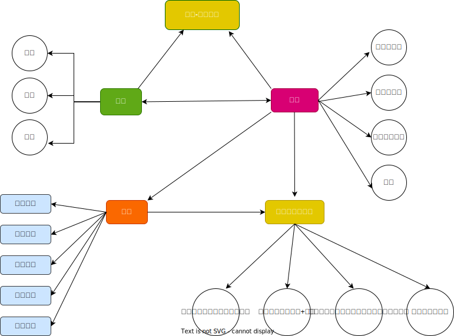

# RBAC 权限

> RBAC基于角色的权限访问控制(Rble-Based Access Control)是商业系统中最常见的权限管理技术之一。
>
> RBAC
是一种思想，任何编程语言都可以实现，其成熟简单的控制思想越来越受广大开发人员喜欢。
>
> 在RBAC中，权限与
角色相关联，用户通过成为适当角色的成员而得到这些角色的权限。这就极大地简化了权限的管理。在一个组织
中，角色是为了完成各种工作而创造，用户则依据它的责任和资格来被指派相应的角色，用户可以很容易地从一个
角色被指派到另一个角色。角色可依新的需求和系统的合并而赋予新的权限，而权限也可根据需要而从某角色中回
收。

### 数据库设计



从上面的关系图中，可以看出，一般需要设计出几张表

5张表设计：

- 用户表：存储用户数据信息
- 角色表：储角色相关的信息-角色名称， 角色创建时间，是否启用
- 权限表：系统中有哪些权限
- 用户与角色关系表
- 角色与权限关系表

---

4张表设计
- 用户表
- 角色表: 将用户id存储在角色表里，省去角色-用户 关联表
- 权限表
- 权限与角色关系表

---

3张表设计

- 用户表：
- 角色表:
- 权限表


#### 用户表(User)


```sql
CREATE TABLE User(
  id INT PRIMARY KEY AUTO_INCREMENT,
  username VARCHAR(255) NOT NULL,
  password VARCHAR(255) NOT NULL,
  phone VARCHAR(11) COMMENT '手机号',
  email VARCHAR(100) COMMENT '邮箱',
  status INT COMMENT "用户状态",

  role_id TINYINT COMMENT "角色id"
)

```

#### 角色表(Role)

```sql
CREATE TABLE Role (
  role_id INT PRIMARY KEY AUTO_INCREMENT,
  role_name VARCHAR(255) NOT NULL,
  role_desc TEXT COMMENT "角色描述"
)


```

#### 权限表

```sql
CREATE TABLE Permission(
  id INT PRIMARY KEY AUTO_INCREMENT COMMENT "权限id",
  name VARCHAR(255) NOT NULL COMMENT "权限名称",
  pid SMALLINT UNSIGNED COMMENT "父权限id",
  level enum COMMENT "菜单层级"
)
```


#### 用户-角色的关联表（User_Role）


#### 角色-权限的关联表(Role_Permission)


