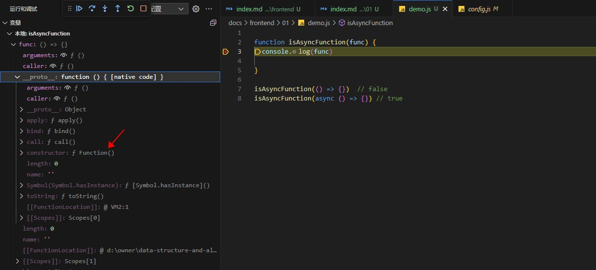
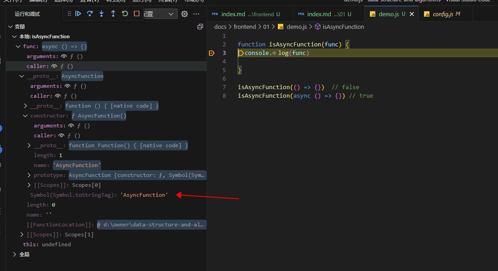

# 判断函数是否标记了async

<<<./demo.js{7,10}

普通函数的  `constructor` 是  Function , 被 `async` 包裹的函数是  `AsyncFunction`

```js
fn.constructor --> Function
asyncFn.constructor ---> AsyncFunction
```

AsyncFunction 里面有一个特殊的属性， `Symbol(Symbol.toStringTag)`  它是 `"AsyncFunction"`


普通函数


---

标记了async 的函数


