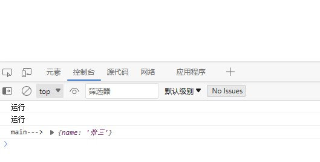

# 消除异步的传染性

只要有一个函数被标记为 `async，` 且存在异步逻辑, 则使用的地方，也会使用 `await` , 导致调用方也自然也加上了 `async` , 也从一个普通函数变成 `AsyncFunction`

这是不合适的

### 案例

<<<./demo.js

### 修改后的

<<<./case-2.js

<el-tag>异步</el-tag>
<el-tag>函数式编程</el-tag>
<el-tag>代数效应</el-tag>

