# 原理与运行时分析

## webpack runtime

写一个最简单的webpack案例

```bash
pnpm init

pnpm install webpack webpack-cli -D

```

```json
{
  "devDependencies": {
    "webpack": "^5.89.0",
    "webpack-cli": "^5.1.4"
  }
}

```

webpack.config.js
```js
const path = require('path')

module.exports = {
  mode: 'development',
  entry: "./app.js",
  output: {
    path: path.resolve(__dirname, 'dist'),
    filename: 'bundle.js'
  }
}
```

### 测试代码

```js
import { sum } from "./sum.js"
const a = 1

let c = sum(1, 2)

console.log(c);

export default {
  say () {
    console.log(a)
  }
}
```

sum.js
```js
export const sum = (a, b) => {
  return a + b
}
```

运行

```
npx webpack
```

打包后，查看当前dist目录里面的 bundle.js文件

### runtime做的事情

1、 `__webpack_modules__` 维护所有模块的一个大对象

2、`__webpack_require__(moduleId)` 手动实现一个加载函数， 对已经加载过的模块进行缓存，对未加载的模块通过 moduleId 到 `__webpack_modules__`  去找,拿到里面的函数， 执行并返回  `module.exports`

3、执行入口文件的代码 `__webpack_require__("./app.js")`


### 完整bundle.js代码

#### 下面生成的bundle.js 区别

- ES Module 会生成  hasOwnProperty 和 在 exports上挂载 _esModule: true 属性， CommonJs 不会有这个
- ES Module 会有 `__webpack_require__.d` ， CommonJs 不会
- ES Module 会有 `__webpack_require__.r`， CommonJs 不会

#### ES Module 的bundle
当我们 app.js 和 sum.js 使用 ESModule 的方式定义导入导出，源码如下
```js
/*
 * ATTENTION: The "eval" devtool has been used (maybe by default in mode: "development").
 * This devtool is neither made for production nor for readable output files.
 * It uses "eval()" calls to create a separate source file in the browser devtools.
 * If you are trying to read the output file, select a different devtool (https://webpack.js.org/configuration/devtool/)
 * or disable the default devtool with "devtool: false".
 * If you are looking for production-ready output files, see mode: "production" (https://webpack.js.org/configuration/mode/).
 */
/******/ (() => { // webpackBootstrap
/******/ 	"use strict";
/******/ 	var __webpack_modules__ = ({

/***/ "./app.js":
/*!****************!*\
  !*** ./app.js ***!
  \****************/
/***/ ((__unused_webpack_module, __webpack_exports__, __webpack_require__) => {

eval("__webpack_require__.r(__webpack_exports__);\n/* harmony export */ __webpack_require__.d(__webpack_exports__, {\n/* harmony export */   \"default\": () => (__WEBPACK_DEFAULT_EXPORT__)\n/* harmony export */ });\n/* harmony import */ var _sum_js__WEBPACK_IMPORTED_MODULE_0__ = __webpack_require__(/*! ./sum.js */ \"./sum.js\");\n\r\nconst a = 1\r\n\r\nlet c = (0,_sum_js__WEBPACK_IMPORTED_MODULE_0__.sum)(1, 2)\r\n\r\n/* harmony default export */ const __WEBPACK_DEFAULT_EXPORT__ = ({\r\n  say () {\r\n    console.log(c);\r\n    console.log(a)\r\n  }\r\n});\n\n//# sourceURL=webpack://webpack/./app.js?");

/***/ }),

/***/ "./sum.js":
/*!****************!*\
  !*** ./sum.js ***!
  \****************/
/***/ ((__unused_webpack_module, __webpack_exports__, __webpack_require__) => {

eval("__webpack_require__.r(__webpack_exports__);\n/* harmony export */ __webpack_require__.d(__webpack_exports__, {\n/* harmony export */   sum: () => (/* binding */ sum)\n/* harmony export */ });\nconst sum = (a, b) => {\r\n  return a + b\r\n}\n\n//# sourceURL=webpack://webpack/./sum.js?");

/***/ })

/******/ 	});
/************************************************************************/
/******/ 	// The module cache
/******/ 	var __webpack_module_cache__ = {};
/******/
/******/ 	// The require function
/******/ 	function __webpack_require__(moduleId) {
/******/ 		// Check if module is in cache
/******/ 		var cachedModule = __webpack_module_cache__[moduleId];
/******/ 		if (cachedModule !== undefined) {
/******/ 			return cachedModule.exports;
/******/ 		}
/******/ 		// Create a new module (and put it into the cache)
/******/ 		var module = __webpack_module_cache__[moduleId] = {
/******/ 			// no module.id needed
/******/ 			// no module.loaded needed
/******/ 			exports: {}
/******/ 		};
/******/
/******/ 		// Execute the module function
/******/ 		__webpack_modules__[moduleId](module, module.exports, __webpack_require__);
/******/
/******/ 		// Return the exports of the module
/******/ 		return module.exports;
/******/ 	}
/******/
/************************************************************************/
/******/ 	/* webpack/runtime/define property getters */
/******/ 	(() => {
/******/ 		// define getter functions for harmony exports
/******/ 		__webpack_require__.d = (exports, definition) => {
/******/ 			for(var key in definition) {
/******/ 				if(__webpack_require__.o(definition, key) && !__webpack_require__.o(exports, key)) {
/******/ 					Object.defineProperty(exports, key, { enumerable: true, get: definition[key] });
/******/ 				}
/******/ 			}
/******/ 		};
/******/ 	})();
/******/
/******/ 	/* webpack/runtime/hasOwnProperty shorthand */
/******/ 	(() => {
/******/ 		__webpack_require__.o = (obj, prop) => (Object.prototype.hasOwnProperty.call(obj, prop))
/******/ 	})();
/******/
/******/ 	/* webpack/runtime/make namespace object */
/******/ 	(() => {
/******/ 		// define __esModule on exports
/******/ 		__webpack_require__.r = (exports) => {
/******/ 			if(typeof Symbol !== 'undefined' && Symbol.toStringTag) {
/******/ 				Object.defineProperty(exports, Symbol.toStringTag, { value: 'Module' });
/******/ 			}
/******/ 			Object.defineProperty(exports, '__esModule', { value: true });
/******/ 		};
/******/ 	})();
/******/
/************************************************************************/
/******/
/******/ 	// startup
/******/ 	// Load entry module and return exports
/******/ 	// This entry module can't be inlined because the eval devtool is used.
/******/ 	var __webpack_exports__ = __webpack_require__("./app.js");
/******/
/******/ })()
;
```


#### CommonJs 的bundle.js
使用 requqire 和 module.exports 生成bundle.js

```js
/*
 * ATTENTION: The "eval" devtool has been used (maybe by default in mode: "development").
 * This devtool is neither made for production nor for readable output files.
 * It uses "eval()" calls to create a separate source file in the browser devtools.
 * If you are trying to read the output file, select a different devtool (https://webpack.js.org/configuration/devtool/)
 * or disable the default devtool with "devtool: false".
 * If you are looking for production-ready output files, see mode: "production" (https://webpack.js.org/configuration/mode/).
 */
/******/ (() => { // webpackBootstrap
/******/ 	var __webpack_modules__ = ({

/***/ "./app.js":
/*!****************!*\
  !*** ./app.js ***!
  \****************/
/***/ ((module, __unused_webpack_exports, __webpack_require__) => {

eval("const { sum } = __webpack_require__(/*! ./sum.js */ \"./sum.js\")\r\nconst a = 1\r\n\r\nlet c = sum(1, 2)\r\n\r\nconsole.log(c);\r\n\r\nmodule.exports = {\r\n  say () {\r\n    console.log(a)\r\n  }\r\n}\n\n//# sourceURL=webpack://webpack/./app.js?");

/***/ }),

/***/ "./sum.js":
/*!****************!*\
  !*** ./sum.js ***!
  \****************/
/***/ ((module) => {

eval("module.exports = {\r\n  sum(a, b) {\r\n    return a + b\r\n  }\r\n}\n\n//# sourceURL=webpack://webpack/./sum.js?");

/***/ })

/******/ 	});
/************************************************************************/
/******/ 	// The module cache
/******/ 	var __webpack_module_cache__ = {};
/******/
/******/ 	// The require function
/******/ 	function __webpack_require__(moduleId) {
/******/ 		// Check if module is in cache
/******/ 		var cachedModule = __webpack_module_cache__[moduleId];
/******/ 		if (cachedModule !== undefined) {
/******/ 			return cachedModule.exports;
/******/ 		}
/******/ 		// Create a new module (and put it into the cache)
/******/ 		var module = __webpack_module_cache__[moduleId] = {
/******/ 			// no module.id needed
/******/ 			// no module.loaded needed
/******/ 			exports: {}
/******/ 		};
/******/
/******/ 		// Execute the module function
/******/ 		__webpack_modules__[moduleId](module, module.exports, __webpack_require__);
/******/
/******/ 		// Return the exports of the module
/******/ 		return module.exports;
/******/ 	}
/******/
/************************************************************************/
/******/
/******/ 	// startup
/******/ 	// Load entry module and return exports
/******/ 	// This entry module is referenced by other modules so it can't be inlined
/******/ 	var __webpack_exports__ = __webpack_require__("./app.js");
/******/
/******/ })()
;
```

### 简化，去掉注释后的代码

```js
var  __webpack_modules__ = {
  "./app.js": (__unused_webpack_module, __webpack_exports__, __webpack_require__) => {},
  "./sum.js": (__unused_webpack_module, __webpack_exports__, __webpack_require__) => {}
}

var __webpack_module_cache__ = {};

function __webpack_require__(moduleId) {

  // 有缓存
  var cachedModule = __webpack_module_cache__[moduleId];
  if (cachedModule !== undefined) {
    return cachedModule.exports;
  }

  // 无缓存
  __webpack_modules__[moduleId](module, module.exports, __webpack_require__);

  return module.exports
}

// 最后运行入口模块
__webpack_require__("./app.js")
```

### 逐步webpack分析产物

1、最外层就是一个 IIFE 立即执行函数

```js
(() => {})();
```

2、在内部定义了一个 收集模块的对象 `__webpack_modules__`

模块的key，是我们的资源文件名，值是一个函数

```js
  var __webpack_modules__ = ({
    './app.js': ((__unused_webpack_module, __webpack_exports__, __webpack_require__) => {
      ... 我们的业务代码， 使用 eval函数包裹
    })
  })
```
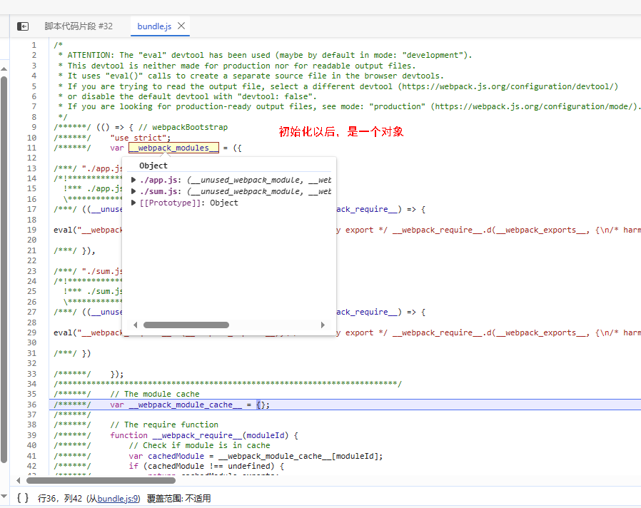


主入口代码执行

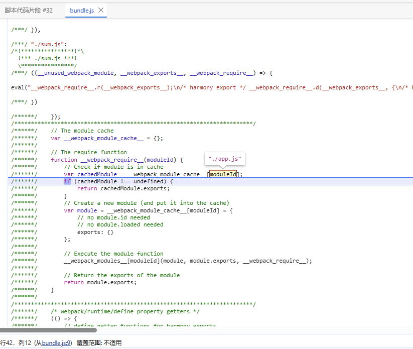


3. 定义了一个 `__webpack_require__`

这里收集所需要的依赖, 初始化是一个空对象，后续在各种 ()()  自执行函数里面将依赖分别添加到 `__webpack_require__` 上

```js
var __webpack_require__ = {};
```

4. __webpack_module_cache__  缓存对象

定义一个缓存对象， 在测试过程中，如果webpack 只对一个文件（没有导入任何模块内容）进行打包， 则不会在 bundle.js 中产生这个缓存对象

```js
var __webpack_module_cache__ = {};
```

### require实现

我们使用的时候，也是传入一个要导入的目标地址， 返回一个对象

```js
const a = require('./sum.js')
```

ES Module 规范 和 CommonJs 的 `__webpack_require__`  是一样的
```js
function __webpack_require__(moduleId) {
  // 先从缓存对象里面根据缓存id去找
  var cachedModule = __webpack_module_cache__[moduleId];
  if (cachedModule !== undefined) {
    // 如果找到了直接返回
    return cachedModule.exports;
  }
  // 先给资源文件出生一个 exports对象
  var module = __webpack_module_cache__[moduleId] = {
    exports: {}
  };

  // 如果找 sum.js
  // __webpack_modules__["./sum.js"] --> 得到一个函数，将 module都注入进去
  // 因为我们在 这个函数里面具体的 eveal会使用到这几个对象module， module.exports， __webpack_require__
  __webpack_modules__[moduleId](module, module.exports, __webpack_require__);

  // 最终导出模块
  return module.exports;
}
```

`__webpack_require__` 里面的module 一开始就是一个空对象，添加了一个属性 `exports`

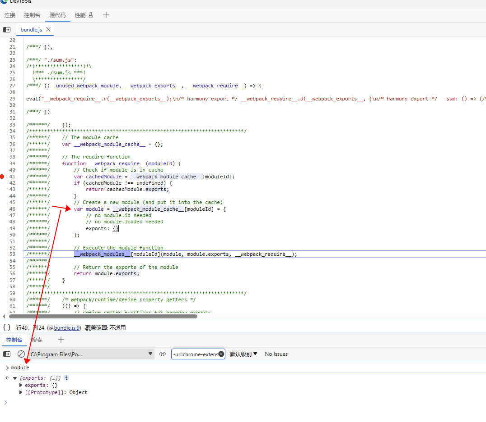

拿到模块对应的函数以后，我们再看一下

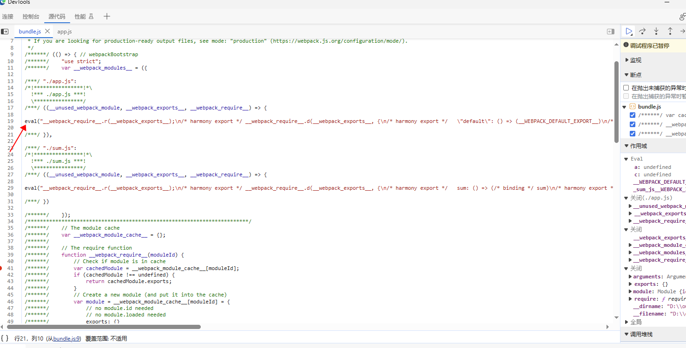

eval 开辟出来的一个运行时， 里面就是会去执行 `require` 的动作, 而 `require`这个是 webpack 模拟出来的, 这里跟下面的有一点点**区别**， 下面截图为 ES Module 规范的代码，那么webpack要模拟 `import {} from 'xxx'` 这种行为。 而 CommonJs则不需要

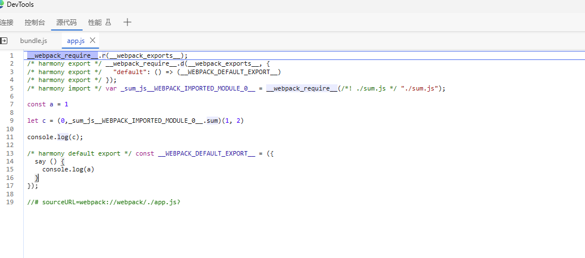

<div style='color: red; text-align: center;'>ES Module 规范拿到的bundle</div>

对于 sum.js 里面使用 `export const sum = () => {}` 这样的导出方式，  `module` 如下

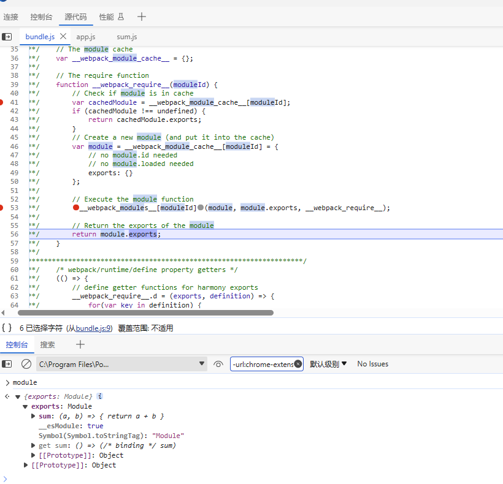

CommonJs 拿到源文件的内容，比较简洁

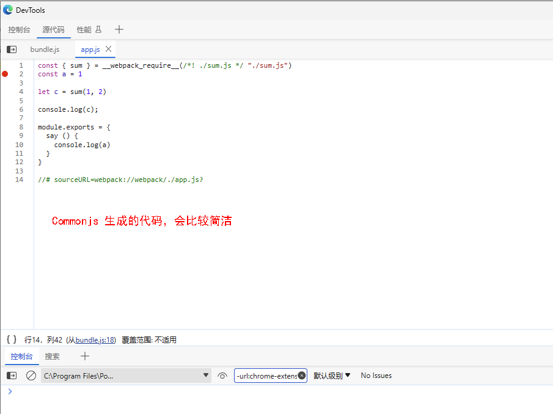
<div style='color: red; text-align: center;'>commonjs 拿到的bundle</div>


### webpack runtime hasOwnProperty
> ES Module 规范会生成的代码片段， Commonjs 不会生成这段代码

判断一个对象上是否有某个属性, webpack 自己实现了一个工具方法，挂载到了 `__webpack_require__` 对象上

```js
(() => {
  __webpack_require__.o = (obj, prop) => (Object.prototype.hasOwnProperty.call(obj, prop))
})();
```


### exports.module 和 exports._esModule
> ES Module 规范会生成的代码片段， Commonjs 不会生成这段代码

定义我们commonjs规范里面的导出函数，在运行 `eval` 的时候会用到这个, 因为 `eval` 里面包裹的就是 `export` 或者 `require` 一些模块的内容

使用 __esModule 标记我们的代码为  ESModule规范的内容

```js
(() => {
  __webpack_require__.r = (exports) => {
    if (typeof Symbol !== 'undefined' && Symbol.toStringTag) {
      Object.defineProperty(exports, Symbol.toStringTag, { value: 'Module' });
    }
    Object.defineProperty(exports, '__esModule', { value: true });
  };
})();
```

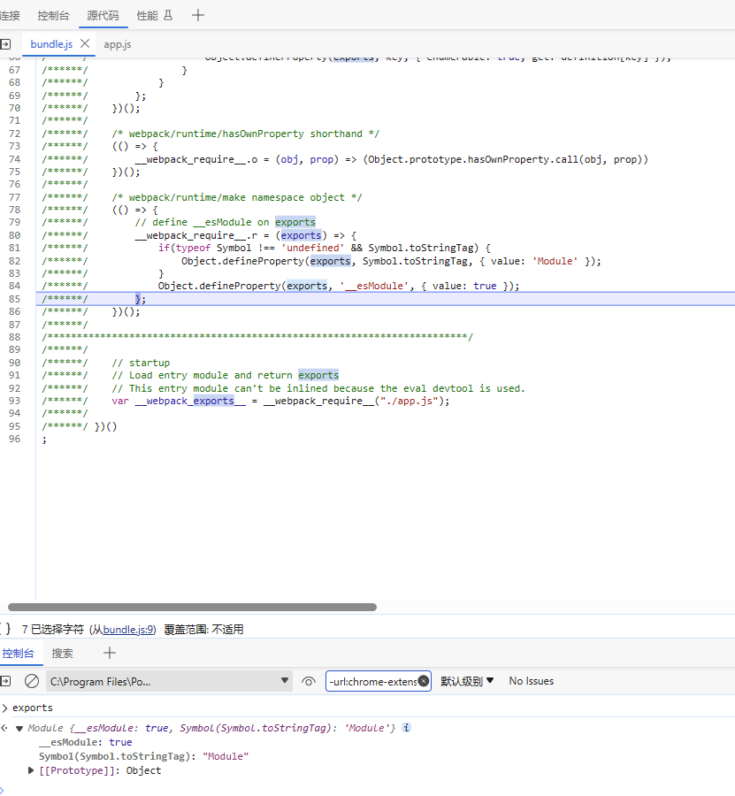

仅仅只是定义了一个 对象的key， 此处 还没有实现逻辑


### export.defalt 或者具名导出
> ES Module 规范会生成的代码片段， Commonjs 不会生成这段代码

```js
(() => {
  __webpack_require__.d = (exports, definition) => {
    for (var key in definition) {
    /**
     * 给对象上添加属性，如果我们是 export default  导出模块，则这里 definition 就是
     * {
     *   "defalut": () => {具体导出的代码}
     * }
     *
     * 如果我们想 sum.js里面使用 具名导出， 则这里 definition 就是下面这样
     * {
     *   "sum":  () => {}
     * }
     */

    /**
     * exports 一开始是这样的， 它的初始化过程在上面的代码分析中
     * exports: {
     *  __esModule: true,
     * Symbol(Symbol.toStringTag): "Module"
     * }
     */

    // 如果 exports 对象上没有 导出的 key， 则将内容附加上去
      if (__webpack_require__.o(definition, key) && !__webpack_require__.o(exports, key)) {
        // 这里使用 get 访问器， 也就是我们在使用导入的对象，就会拿到的函数或者值
        Object.defineProperty(exports, key, { enumerable: true, get: definition[key] });
      }
    }
  };
})();
```

### ES Moule 和 Commonjs 里面的eval区别

Commonjs规范是是支持模块的导入导出。 所以比较简洁

```js
eval("module.exports = {\r\n  sum(a, b) {\r\n    return a + b\r\n  }\r\n}\n\n//# sourceURL=webpack://webpack/./sum.js?");
```

ES Module 在node端， webpack需要模拟出这种行为

```js
eval("__webpack_require__.r(__webpack_exports__);\n/* harmony export */ __webpack_require__.d(__webpack_exports__, {\n/* harmony export */   sum: () => (/* binding */ sum)\n/* harmony export */ });\nconst sum = (a, b) => {\r\n  return a + b\r\n}\n\n//# sourceURL=webpack://webpack/./sum.js?");
```

### 执行入口代码

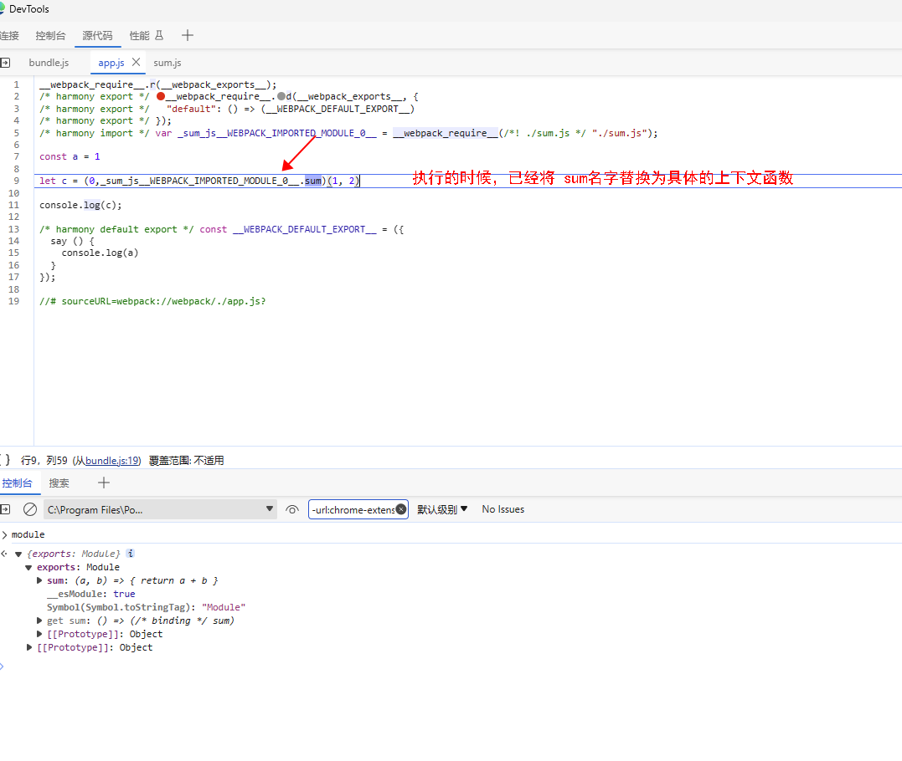


### 调试webpack bundle

这里可以使用 chrome浏览器调试

```js
cd dist

node inspect bundl.js
```

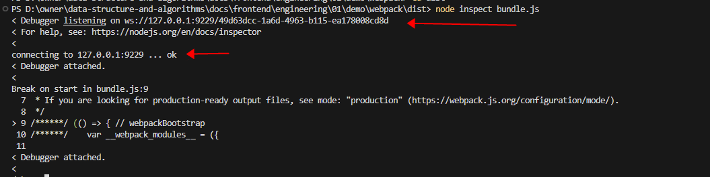

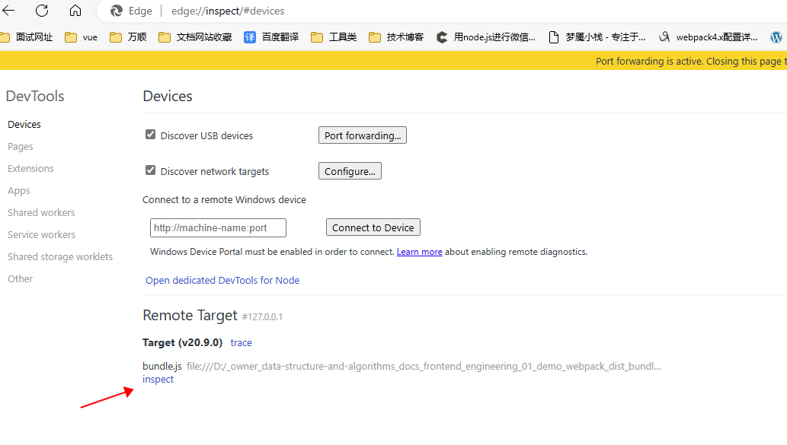

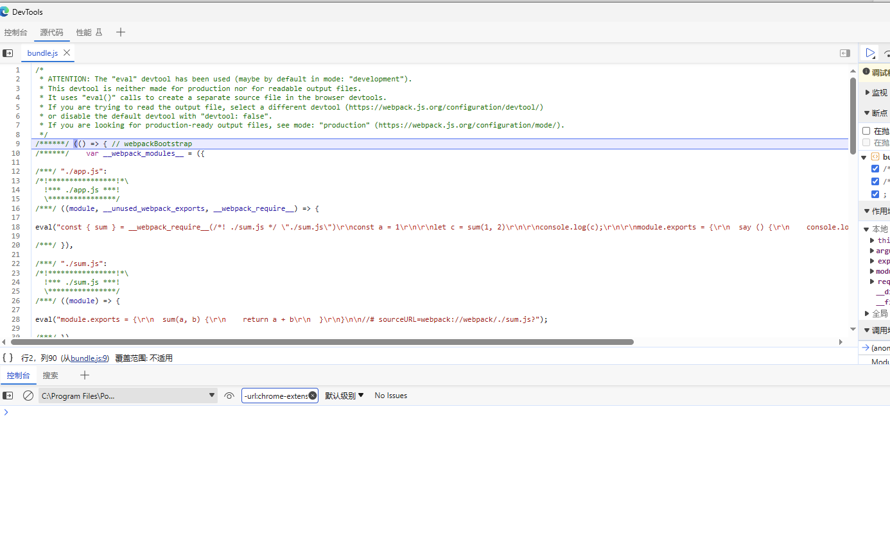

已经可以打断点调试了

## rollup