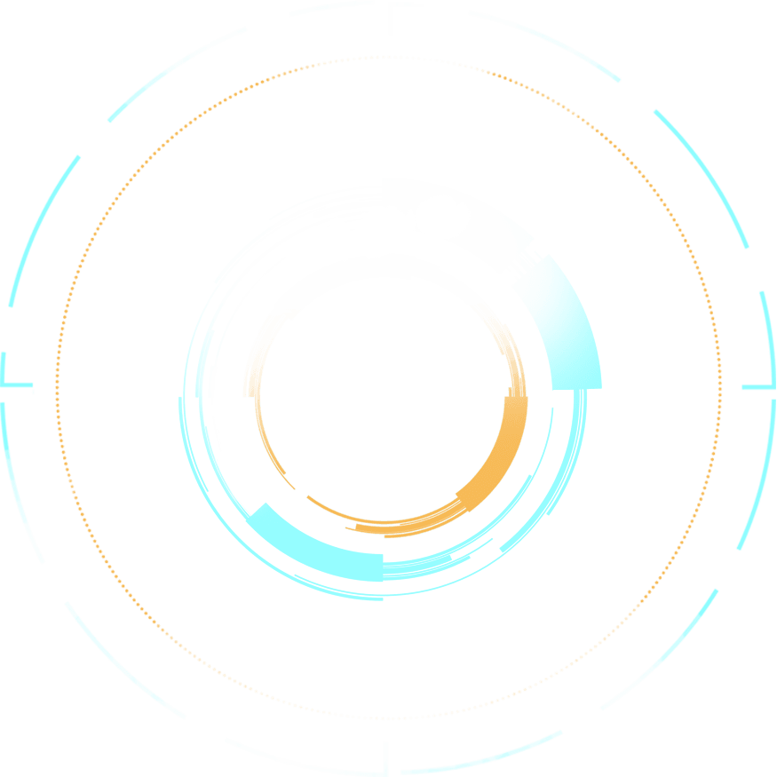

# 3D 旋转动画

<demo src="./demo.vue" />

### 代码

<<< ./demo.vue

### 原理说明

- 这其实是一个平面图片， 所以设计作图的时候，一开始就不要设计为立体的。
- rotateX(75deg)
  - 这一步把一个「平面图片」沿 X 轴倾斜了 75°。
  - 原来是一张 正对屏幕的圆图，倾斜后看起来像是「平放的圆盘」。
  - 这样就产生了立体透视感，看起来像是一个桌面上的圆。

- translateX(-50%)
  - 简单的水平平移，让圆盘位置居中。
  - 和旋转的视觉效果关系不大，只是做位置调整。
  - 这一步把一个「平面图片」沿 X 轴倾斜了 75°。
  - 原来是一张 正对屏幕的圆图，倾斜后看起来像是「平放的圆盘」。
  - 这样就产生了立体透视感，看起来像是一个桌面上的圆。

- rotateZ(…)
  - 因为已经倾斜过（rotateX(75deg)），所以绕 Z 轴旋转，看上去就像圆盘在水平面上旋转。
  - 如果没有倾斜，rotateZ 只是一个「平面的顺时针旋转」。
  - 加了倾斜以后，就产生了「俯视的旋转感」。

- animation: rotate3 20s linear infinite
  - 定义了一个循环动画：
  - 从 rotateZ(0) 到 rotateZ(360deg)。
  - 用时 20s，linear 表示匀速旋转，infinite 表示无限循环。

### 参考案例

- [数据可视化](https://www.hereitis.cn/soundCodeView/)