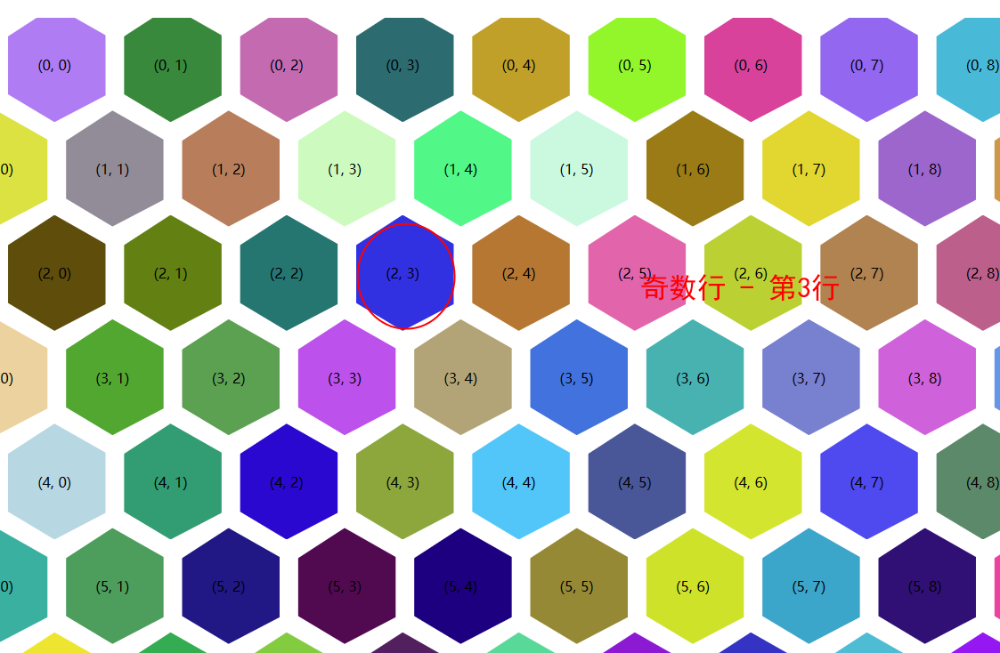
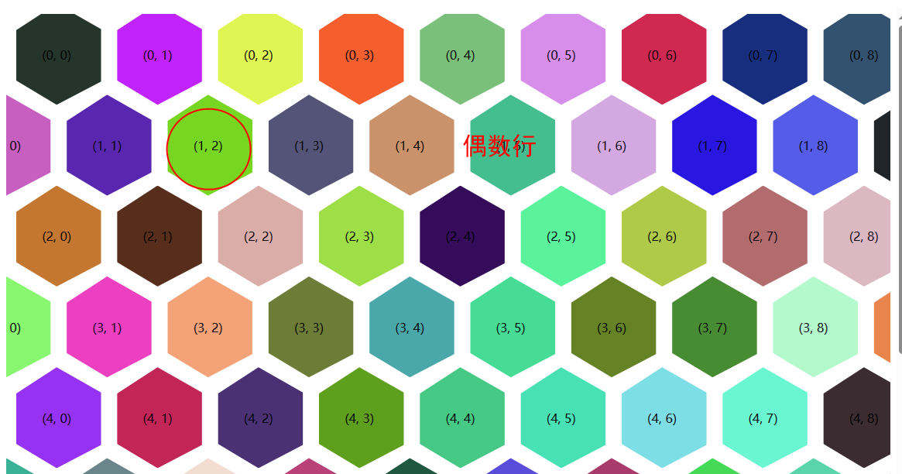

# 六边形布局

<script setup>
  import demo1 from './demo/01.vue'
  import demo2 from './demo/02.vue'
</script>

## 源码
<demo1></demo1>

里面使用了 vw单位，所以无法直接放在vue文件里面，因为vitepress 有左右的导航栏等，会计算有问题


### 查找当hover周围节点

假设当前 hover 的元素坐标为 `(x, y)`

最简单的左侧的就是 `(x-1, y)`, 右边`(x+1, y)`,  这就找出了2个周围元素， 都在一条X轴上， 现在分析上下 几个相邻的节点

超出屏幕外的，以及最边缘的元素为中心节点的， 则它周围并没有6个相邻的元素，就做一下边缘判断即可，我们从普通规律中找到查找方式


1. 假设当前节点为 `奇数`(数行数，下标从1开始数，不是数组的索引0)， 则周围6个元素的位置坐标如下



- 左上角： (x-1, y)
- 右上角： (x - 1, y + 1)
- 左下角： (x+1, y)
- 右下角： (x+1, y+ 1)


2. 假设当前节点行为  `偶数`， 则周围6个元素的位置坐标如下



- 左上角： (x-1, y-1)
- 右上角： (x - 1, y)
- 左下角： (x+1, y-1)
- 右下角： (x+1, y)

#### 注意事项
- 获取的周围节点可能是 Text 文本， 需要做排查
- 元素一行排列几个，是看代码设置，这里一行10个，实际可能只能看到9个， 属于正常的，那么就调整 css 里面的 变量

### parentNode 与parentElement 区别

我们在鼠标Hover 某一个元素的时候，可能要拿它上一行的数据，但是我们的HTML布局是 外层套了一个div， 形成了一个父节点， 我们要根据当前节点拿到父节点中指定的元素， 所以要学习一下这2个`属性`的区别

- [parentElement](https://developer.mozilla.org/zh-CN/docs/Web/API/Node/parentElement)： 返回当前节点的父元素节点，如果该元素没有父节点，或者父节点不是一个 DOM 元素，则返回 null。当该元素的父节点为html元素时，其parentElement会返回null。
- [parentNode](https://developer.mozilla.org/zh-CN/docs/Web/API/Node/parentNode)：这是一个属性，返回指定元素的父节点。这个父节点可以是任何类型的节点，不仅仅限于元素节点。换句话说，parentNode返回的是DOM树中的父节点，它可能是元素、文本、注释、文档片段或文档节点。

因此，当你需要获取元素的父节点并进一步操作时，可能会选择使用parentNode；

而如果你只关心元素的直接父元素，特别是当这个元素不是html元素时，你可以选择使用parentElement。

### 编译scss代码
修改了源码以后，使用以下命令编译

```shell
npx sass ./public/06/06.scss ./public/06/06.css
```

::: code-group

<<<./demo/06.html

<<<./demo/06.scss
:::

### 裁剪 clip-path

<demo2></demo2>


## 知识点

- 六边形，需要利用css的 `裁剪`  [在线裁剪工具](http://tools.jb51.net/code/css3path)
- 需要找到对应的位置进行偏移，偏移的目的是让画面看起来更像  蜂窝状
- 六边形默认是挨的比较紧凑，调整 clip-path的值，主要是调整左右2边 4个点的x轴坐标，就可以，同一侧的2个点，Y轴的值应该一样，否则图形是变形的

### sass使用除法

错误的

```scss
$w: 10px;

.a {
  width: $w / 2
}
```
sass 1.69.7 目前测试是无法编译通过的。 以为 css的发展，导致sass无法区分用户到底是要使用 / 除法还是使用 css 原生的分隔符


正确的

```scss
@use "sass:math";

$w: 10px;

.a {
  width: math.div($w, 2)
}

.b {
  width: math.div(-$w, 2)
}
```

负数，是不能将 `-` 放在 `math.div` 前面的