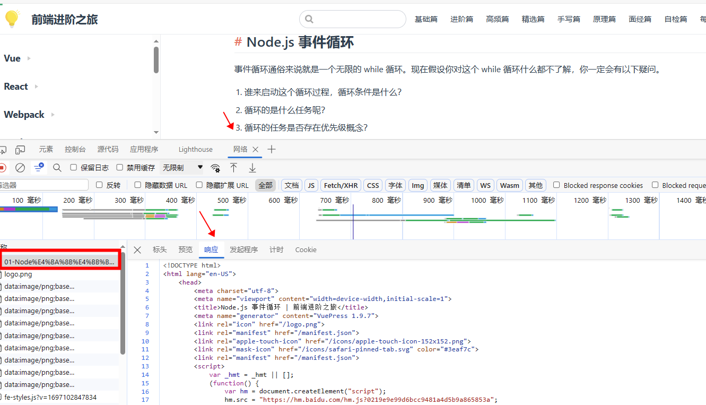
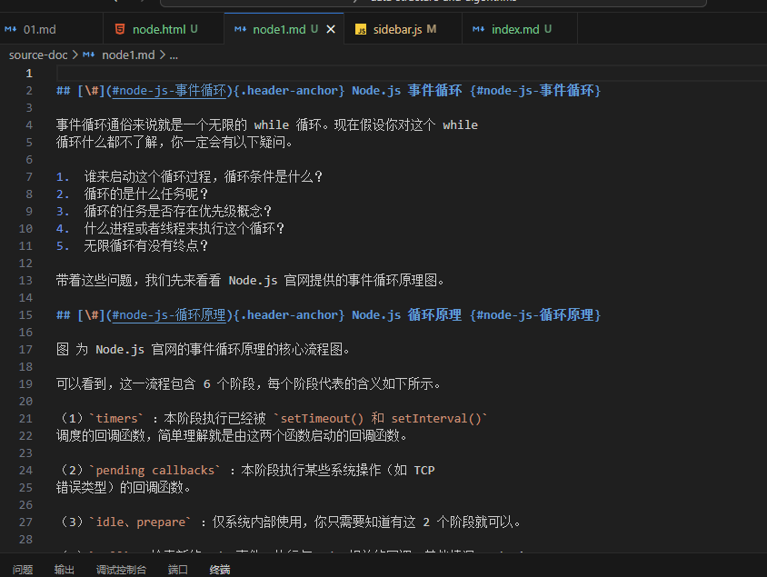

# 将html转成md

[pandoc](https://www.pandoc.org/)

看到一个好看的网站，想将其中的内容转换成 `markdown` 语法。 可以使用 `pandoc` 工具进行实现

转换效果比较好的一些前提

- 原网站本身使用 markdown 生成标准的html代码
- 原网站没有过多的个性化的内容，比如各种特效等


```shell
pandoc -f html -t markdown -o 要输出的文档名称 目标文档名称

pandoc -f html -t markdown -o ./source-doc/node1.md ./source-doc/node.html
```

pandoc 还可以将 html转成 pdf 以及其他格式

## 操作步骤

1、 打开 chrome 浏览器， 找到目标网页

例如： https://interview.poetries.top/principle-docs/node/01-Node%E4%BA%8B%E4%BB%B6%E5%BE%AA%E7%8E%AF%E6%9C%BA%E5%88%B6%E5%8E%9F%E7%90%86.html#node-js-%E4%BA%8B%E4%BB%B6%E5%BE%AA%E7%8E%AF

2、拷贝整个 HTML 内容



3、新建一个文件，将HTML内容拷贝进去

4、 执行上面的脚本

转换后的效果如下

