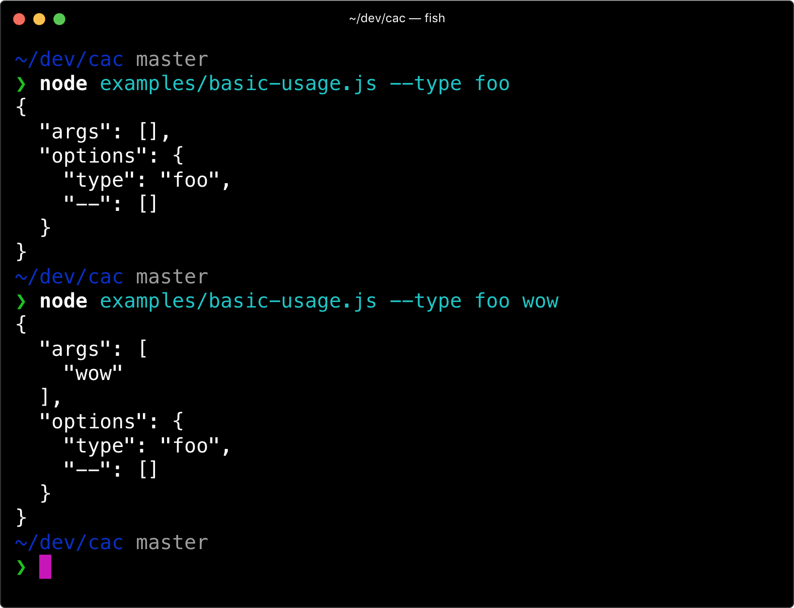
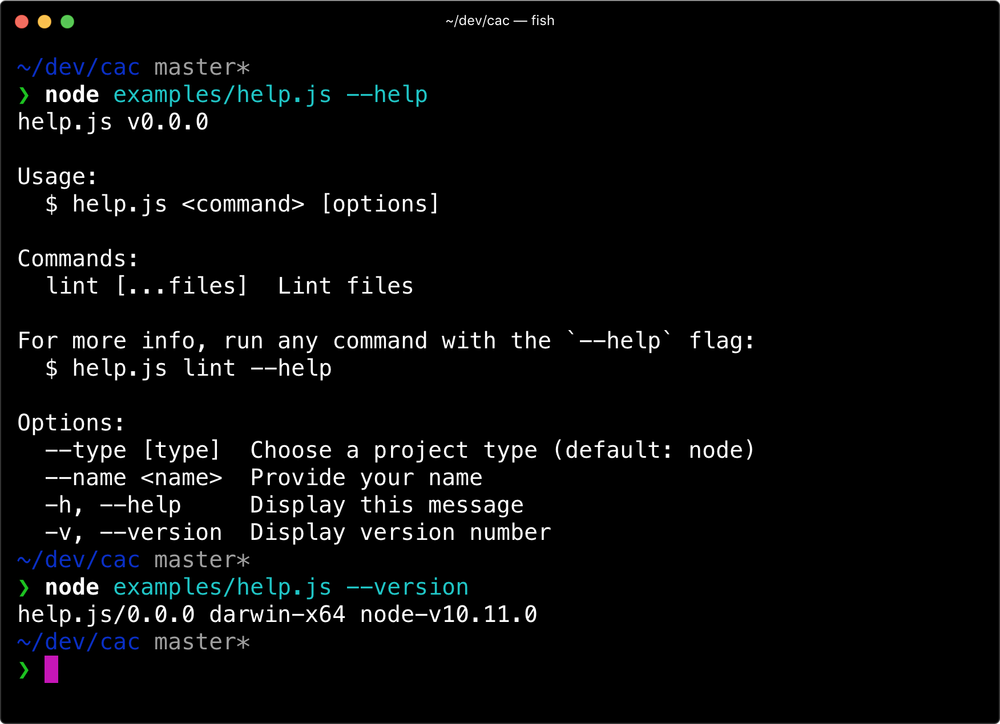
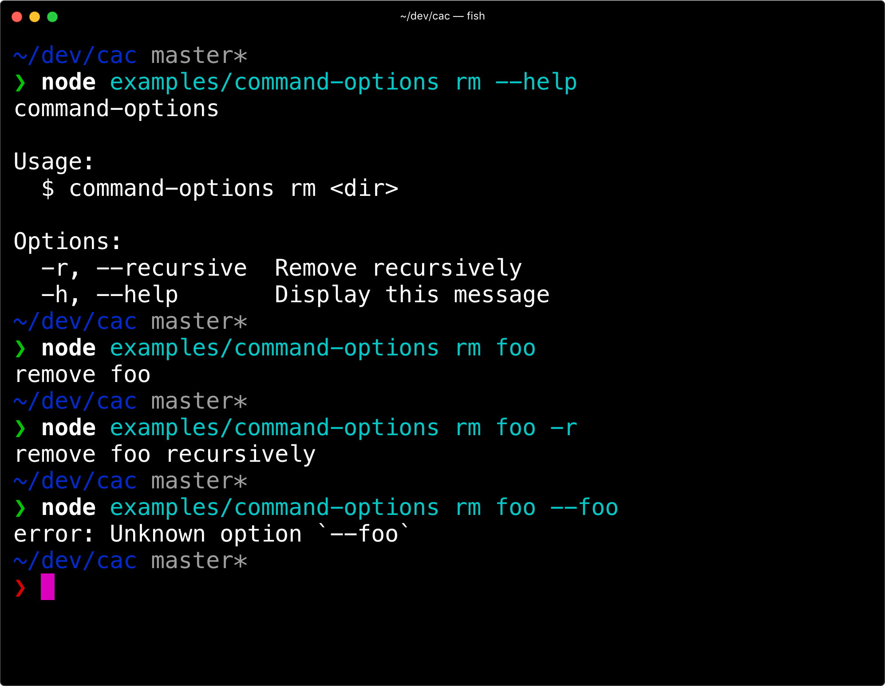
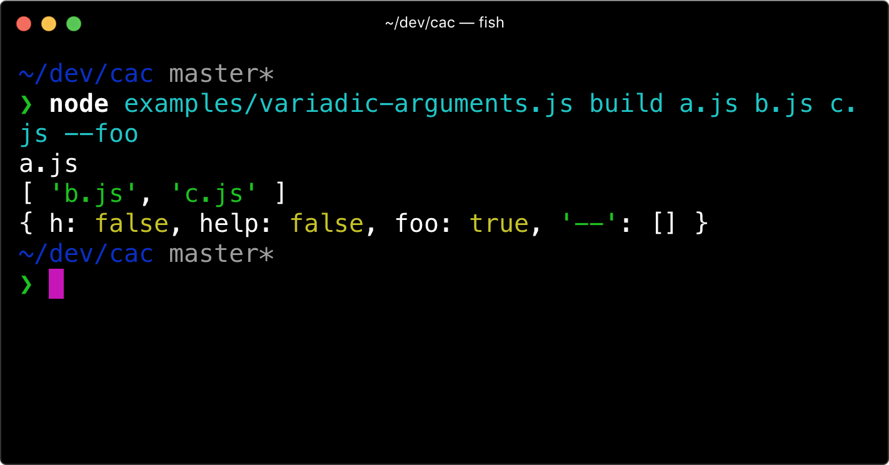
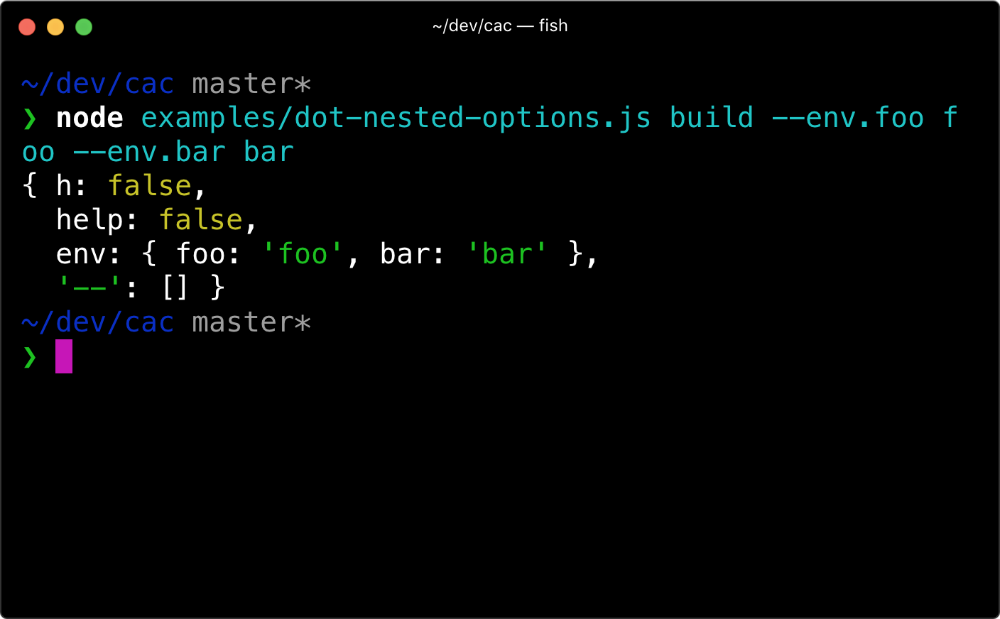

# cac

> Command And Conquer 是一个用于构建 CLI 应用程序的 JavaScript 库。

## 特点

- 超轻量级：无依赖，只需一个文件。
- 简单易学。构建简单的 CLI 只需要学习 4 个 API： `cli.option` `cli.version` `cli.help` `cli.parse` .
- 非常强大。启用默认命令、类似 git 的子命令、所需参数和选项的验证、可变参数、点嵌套选项、自动帮助消息生成等功能。
- 开发人员友好。用 TypeScript 编写。


## 安装

```shell
npm i cac
```

## 用法

### 简单解析

> 使用 CAC 作为简单的参数解析器：

::: code-group
<<<./example/01.js

<<<./example/01-1.js
:::

```
node 01-1.mjs --help
```

输出
```shell
01-1.mjs/0.0.1

Usage:
  $ 01-1.mjs <command> [options]

Commands:
  lint [...files]  验证文件

For more info, run any command with the `--help` flag:
  $ 01-1.mjs lint --help

Options:
  --type <type>  选择一个项目类型 (default: node)
  --name <name>  提供一个名字
  -h, --help     Display this message
  -v, --version  Display version number
```




### 显示帮助信息和版本号

```javascript
// examples/help.js
const cli = require('cac')()

cli.option('--type [type]', 'Choose a project type', {
  default: 'node',
})
cli.option('--name <name>', 'Provide your name')

cli.command('lint [...files]', 'Lint files').action((files, options) => {
  console.log(files, options)
})

// Display help message when `-h` or `--help` appears
cli.help()
// Display version number when `-v` or `--version` appears
// It's also used in help message
cli.version('0.0.0')

cli.parse()
```



### 命令的特定选项options

可以将选项附加到命令上

```javascript
const cli = require('cac')()

cli
  .command('rm <dir>', 'Remove a dir')
  .option('-r, --recursive', 'Remove recursively')
  .action((dir, options) => {
    console.log('remove ' + dir + (options.recursive ? ' recursively' : ''))
  })

cli.help()

cli.parse()
```

使用命令时，将验证命令的选项。任何未知选项都将报告为错误。

但是，如果基于操作的命令未定义操作，则不会验证选项。如果确实要使用未知选项，请使用 command.allowUnknownOptions .




### 选项中的破折号 --

> kebab-case 中的选项应在代码的 camelCase 中引用： 意思是，选项中的 -- 在代码中解析成的参数为 camelCase 风格字段

例如： --clear-screen , 在代码中为 clearScreen

```javascript
cli
  .command('dev', 'Start dev server')
  .option('--clear-screen', 'Clear screen')
  .action((options) => {
    console.log(options.clearScreen)
  })
```

事实上 --clear-screen ，和 --clearScreen 都将解析为 options.clearScreen 字段


### 括号

在命令 `command` 中

- 使用`[]方括号`时, 表示可选参数
- 使用`<>尖括号`, 表示必需的命令参数

在 选项 option 中 使用括号

- `<>尖括号` 表示需要字符串/数字值
- `[]方括号` 表示该值也可以是 true


```javascript
const cli = require('cac')()

cli
  .command('deploy <folder>', 'Deploy a folder to AWS')
  .option('--scale [level]', 'Scaling level')
  .action((folder, options) => {
    // ...
  })

cli
  .command('build [project]', 'Build a project')
  .option('--out <dir>', 'Output directory')
  .action((folder, options) => {
    // ...
  })

cli.parse()
```

### 否定选项

> 要允许值为 false 的选项，您需要手动指定否定选项

```javascript
cli
  .command('build [project]', 'Build a project')
  .option('--no-config', 'Disable config file')
  .option('--config <path>', 'Use a custom config file')
```

这将允许 CAC 将默认值 config 设置为 true，您可以使用 --no-config flag 将其设置为 false 。

###  可变参数

命令的最后一个参数可以是可变的，并且只能是最后一个参数。

要使参数可变，您必须添加到 ... 参数名称的开头，就像 JavaScript 中的 rest 运算符一样。
下面是一个示例：


```javascript
const cli = require('cac')()

cli
  .command('build <entry> [...otherFiles]', 'Build your app')
  .option('--foo', 'Foo option')
  .action((entry, otherFiles, options) => {
    console.log(entry)
    console.log(otherFiles)
    console.log(options)
  })

cli.help()

cli.parse()
```



### 点嵌套选项

点嵌套 选项`option`将合并为一个选项 `option`

```javascript
const cli = require('cac')()

cli
  .command('build', 'desc')
  .option('--env <env>', 'Set envs')
  .example('--env.API_SECRET xxx')
  .action((options) => {
    console.log(options)
  })

cli.help()

cli.parse()
```



### 默认命令

注册一个命令，当没有其他命令匹配时将使用该命令。

```javascript
const cli = require('cac')()

cli
  // Simply omit the command name, just brackets
  .command('[...files]', 'Build files')
  .option('--minimize', 'Minimize output')
  .action((files, options) => {
    console.log(files)
    console.log(options.minimize)
  })

cli.parse()
```

### 提供数组作为选项值

```shell
node cli.js --include project-a
# The parsed options will be:
# { include: 'project-a' }

node cli.js --include project-a --include project-b
# The parsed options will be:
# { include: ['project-a', 'project-b'] }
```

### 错误处理
要全局处理命令错误，请执行以下操作：

```javascript
try {
  // Parse CLI args without running the command
  cli.parse(process.argv, { run: false })
  // Run the command yourself
  // You only need `await` when your command action returns a Promise
  await cli.runMatchedCommand()
} catch (error) {
  // Handle error here..
  // e.g.
  // console.error(error.stack)
  // process.exit(1)
}
```

### 使用typescript

首先，您需要 @types/node 在项目中作为开发依赖项安装：

```shell
yarn add @types/node --dev
```

```shell
const { cac } = require('cac')
// OR ES modules
import { cac } from 'cac'
```

### 在deno中使用

```javascript
import { cac } from 'https://unpkg.com/cac/mod.ts'

const cli = cac('my-program')
```

## 使用 cac 的项目

- VuePress：📝简约的 Vue 驱动的静态站点生成器。
- SAO：⚔️未来派脚手架工具。
- DocPad：🏹强大的静态站点生成器。
- Poi：⚡️令人愉快的 Web 开发。
- bili：🥂用于捆绑 JavaScript 库的瑞士军刀。
- Lad：👦 Lad为Node.js搭建了Koa Web应用和API框架。
- Lass：💁🏻为 Node.js 搭建一个现代包样板。
- Foy：🏗一个轻量级和现代的任务运行器和通用构建工具。
- Vuese：🤗 vue 组件文档的一站式解决方案。
- NUT：🌰为微前端而生的框架

## 引用

> 💁 如果您想要更深入的 API 参考，请查看从源代码生成的文档。

下面是一个简短的概述。

### CLI 实例

CLI 实例是通过调用以下 cac 函数创建的：

```javascript
const cac = require('cac')
const cli = cac()
```

#### cac(name?) 可选的名称
创建一个 CLI 实例，可以选择指定将用于在帮助和版本消息中显示的程序名称。如果未设置，我们使用 argv[1] 的 basename 。

#### cli.command(name， description， config?)

Type: (name: string, description: string) => Command

创建命令实例。

该选项还接受其他命令配置的第三个参数 config ：

- config.allowUnknownOptions ： boolean 允许此命令中的未知选项。
- config.ignoreOptionDefaultValue ： boolean 不要在解析的选项中使用选项的默认值，只在帮助消息中显示它们。


#### cli.option（name， description， config？）

Type: (name: string, description: string, config?: OptionConfig)

添加全局选项。

该选项还接受其他选项配置的第三个参数 config ：

- config.default ：选项的默认值。
- config.type ： any[] 设置为 [] 时，选项值返回数组类型。您还可以使用转换函数，例如 [String] ，它将使用 String 调用选项值。


#### cli.parse(argv?)

Type: (argv = process.argv) => ParsedArgv

```ts
interface ParsedArgv {
  args: string[]
  options: {
    [k: string]: any
  }
}
```

调用此方法时， cli.rawArgs cli.args cli.options cli.matchedCommand 也将可用。

#### cli.version（version， customFlags？）

Type: (version: string, customFlags = '-v, --version') => CLI

出现标志时 -v, --version 输出版本号。

#### cli.help(callback?)

Type: (callback?: HelpCallback) => CLI

出现标志时 -h, --help 输出帮助消息。

可选允许 callback 在显示帮助文本之前对其进行后处理：

```ts
type HelpCallback = (sections: HelpSection[]) => void

interface HelpSection {
  title?: string
  body: string
}
```

#### cli.outputHelp()
Type: () => CLI

输出帮助消息。

#### cli.usage(text)
Type: (text: string) => CLI

添加全局用法文本。子命令不使用此命令。

### Command 实例
Command 实例是通过调用以下 cli.command 方法创建的：

```javascript
const command = cli.command('build [...files]', 'Build given files')
```

#### command.option()
基本相同， cli.option 但这会为特定命令添加选项。

#### command.action(callback)
Type: (callback: ActionCallback) => Command

当命令与用户输入匹配时，使用回调函数作为命令操作。

```ts
type ActionCallback = (
  // Parsed CLI args
  // The last arg will be an array if it's a variadic argument
  ...args: string | string[] | number | number[]
  // Parsed CLI options
  options: Options
) => any

interface Options {
  [k: string]: any
}
```

#### command.alias(name) 别名

在此命令中添加别名， name 此处不能包含括号。

#### command.allowUnknownOptions()
Type: () => Command

在此命令中允许未知选项，默认情况下，当使用未知选项时，CAC 将记录错误。

#### command.example(example)

添加一个示例，该示例将显示在帮助消息的末尾。

```ts
type CommandExample = ((name: string) => string) | string
```

#### command.usage(text)
Type: (text: string) => Command

为此命令添加用法文本。


### Events 事件

监听事件

```javascript
// Listen to the `foo` command
cli.on('command:foo', () => {
  // Do something
})

// Listen to the default command
cli.on('command:!', () => {
  // Do something
})

// Listen to unknown commands
cli.on('command:*', () => {
  console.error('Invalid command: %s', cli.args.join(' '))
  process.exit(1)
})
```

## FAQ 常见问题


