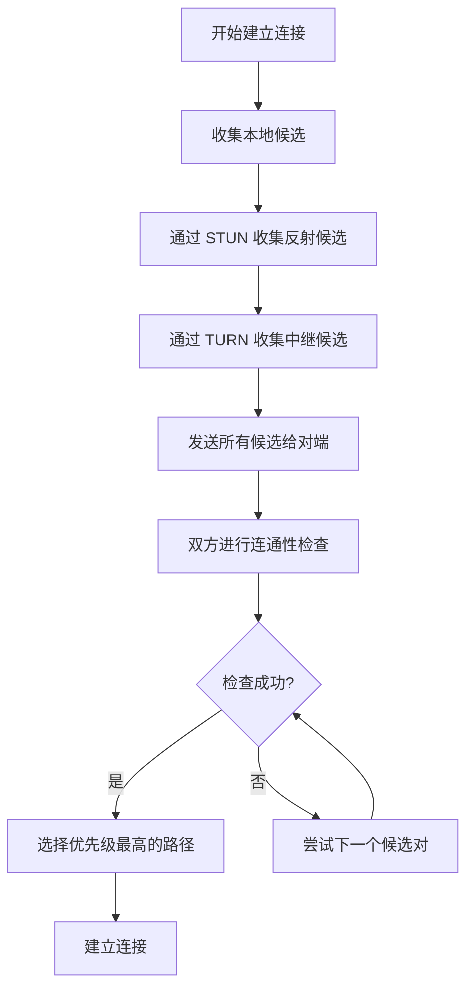
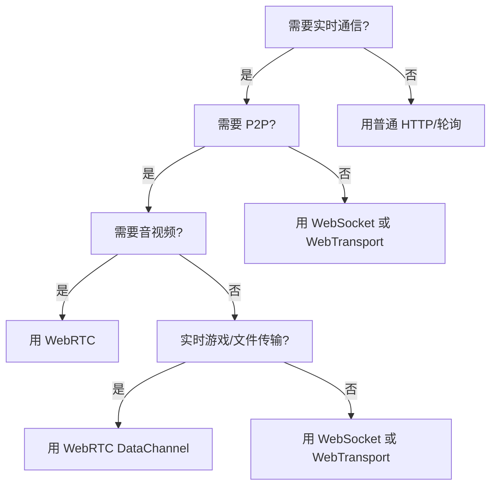

# WebRTC 基础科普

> 目标读者：熟悉 Vue3 / Vite / Node.js / TypeScript 的前端工程师
>
> 阅读时间：约 25 分钟

---

## 1. 什么是 WebRTC

**一句话定义**：WebRTC（Web Real-Time Communication）是浏览器内置的一套**实时音视频通信 + P2P 数据传输**技术栈，无需安装插件，几行 JavaScript 就能实现浏览器之间的视频通话。

### 核心能力（三大金刚）

| 能力 | 类比理解 | 典型场景 |
|------|---------|---------|
| **音视频通话** | 浏览器自带的"微信视频通话" | 在线面试、远程医疗、视频会议 |
| **P2P 数据传输** | 浏览器之间直接传文件的"快递通道" | 大文件传输、实时游戏状态同步 |
| **屏幕共享** | 把浏览器标签页/整个屏幕"直播"给对方 | 远程协助、在线演示、直播推流 |

> 类比：如果把浏览器比作手机，WebRTC 就是手机自带的"FaceTime + AirDrop"功能，不需要下载任何 App。

---

## 2. 为什么需要 WebRTC

### 传统实时通信方案的痛点

作为前端工程师，你可能用过这些方案做"实时"功能：

#### 方案 A：WebSocket 中转（最常见）

```
浏览器 A  -->  WebSocket Server  -->  浏览器 B
```

**问题**：
- 所有数据都要经过服务器中转，延迟高（至少多一跳网络）
- 服务器带宽成本爆炸（音视频数据量巨大）
- 服务器成为性能瓶颈，并发一高就扛不住

#### 方案 B：HTTP 轮询（古老方案）

```javascript
// 噩梦般的代码
setInterval(() => {
  fetch('/api/messages').then(res => res.json())
}, 1000) // 最快也要 1 秒延迟
```

**问题**：
- 延迟不可接受（秒级）
- 大量无效请求，浪费带宽和电量

### WebRTC 的优势

```
浏览器 A  <========P2P 直连========>  浏览器 B
              （数据不经过服务器）
```

| 维度 | WebSocket 中转 | WebRTC P2P |
|------|---------------|-----------|
| **延迟** | 50~200ms（取决于服务器位置） | 20~80ms（直连） |
| **带宽成本** | 服务器承担全部流量 | 服务器只传信令，媒体数据走 P2P |
| **扩展性** | 服务器是瓶颈 | 去中心化，用户越多越省 |
| **适用场景** | 文字聊天、信令控制 | 音视频、大文件传输 |

> 类比：WebSocket 像"写信寄到邮局，邮局再转寄"；WebRTC 像"直接打电话"，不需要中间人传话。

---

## 3. 核心架构图

WebRTC 采用三层架构，从上到下越来越靠近硬件：

```
┌─────────────────────────────────────────────────────────────┐
│  JavaScript API 层（你写的代码在这里）                        │
│  ┌──────────────┐  ┌──────────────────┐  ┌──────────────┐   │
│  │ getUserMedia │  │ RTCPeerConnection │  │ RTCDataChannel│   │
│  │ getDisplayMedia│  │                  │  │              │   │
│  └──────────────┘  └──────────────────┘  └──────────────┘   │
├─────────────────────────────────────────────────────────────┤
│  C++ API 层（浏览器内核实现，Chrome/Firefox 源码里）          │
│  ┌──────────────────────────────────────────────────────┐   │
│  │  PeerConnection（连接管理）                            │   │
│  │  DataChannel（数据通道抽象）                           │   │
│  └──────────────────────────────────────────────────────┘   │
├─────────────────────────────────────────────────────────────┤
│  C++ 底层引擎（跨平台，高性能）                               │
│  ┌──────────────┐  ┌──────────────┐  ┌──────────────────┐   │
│  │   音频引擎    │  │   视频引擎    │  │    网络传输层     │   │
│  │ (VoiceEngine)│  │(VideoEngine) │  │  (Transport)     │   │
│  │ • 回声消除    │  │ • 编解码     │  │ • ICE/STUN/TURN  │   │
│  │ • 噪声抑制    │  │ • 自适应码率  │  │ • DTLS/SRTP      │   │
│  │ • 自动增益    │  │ • 抖动缓冲    │  │ • 拥塞控制        │   │
│  └──────────────┘  └──────────────┘  └──────────────────┘   │
└─────────────────────────────────────────────────────────────┘
```

### 各层详解

#### JavaScript API 层 —— 你的战场

这是前端工程师直接打交道的层，四个核心 API：

- `navigator.mediaDevices.getUserMedia()` —— 获取摄像头/麦克风
- `navigator.mediaDevices.getDisplayMedia()` —— 获取屏幕共享
- `RTCPeerConnection` —— 管理点对点连接（核心中的核心）
- `RTCDataChannel` —— 在连接上传输任意数据

#### C++ API 层 —— 浏览器的黑盒

这一层在浏览器内核中实现（Chromium 源码在 `//third_party/webrtc/`）。前端不需要关心，但了解有助于理解 API 行为：

- `PeerConnection` 负责整个连接的"生命周期管理"
- 自动处理编解码协商、网络穿透、加密传输

#### C++ 底层引擎 —— 硬核技术

- **音频引擎**：自动做回声消除（AEC）、噪声抑制（NS）、自动增益控制（AGC）。你不需要懂信号处理，浏览器自动帮你搞定。
- **视频引擎**：VP8/VP9/H.264 编解码、自适应码率（网络差时自动降画质）、前向纠错（FEC）。
- **网络传输层**：ICE 框架做 NAT 穿透、DTLS 握手建加密通道、SRTP 加密媒体数据、GCC 算法做拥塞控制。

> 类比：这就像一个三层架构的 Web 应用 —— JavaScript API 是前端页面，C++ API 是后端 Controller，底层引擎是数据库 + 缓存 + 消息队列。你只和前端页面交互，但了解后端架构能帮你更好地 Debug。

---

## 4. 三大核心 API 详解

### 4.1 getUserMedia / getDisplayMedia（媒体捕获）

这两个 API 用于从硬件获取媒体流（MediaStream）。

#### getUserMedia —— 摄像头 + 麦克风

```typescript
// 基础用法：获取摄像头和麦克风
async function getLocalStream() {
  try {
    const stream = await navigator.mediaDevices.getUserMedia({
      video: {
        width: { ideal: 1280 },
        height: { ideal: 720 },
        facingMode: 'user' // 'user' = 前置摄像头, 'environment' = 后置
      },
      audio: {
        echoCancellation: true,  // 回声消除
        noiseSuppression: true,  // 噪声抑制
        autoGainControl: true    // 自动增益
      }
    })

    // 将视频流绑定到 <video> 元素
    const videoElement = document.getElementById('localVideo') as HTMLVideoElement
    videoElement.srcObject = stream

    return stream
  } catch (err) {
    console.error('获取媒体失败:', err)
    // 常见错误：
    // NotAllowedError - 用户拒绝授权
    // NotFoundError - 没找到摄像头/麦克风
    // NotReadableError - 设备被其他应用占用
  }
}
```

#### getDisplayMedia —— 屏幕共享

```typescript
// 屏幕共享（整个屏幕、某个窗口、某个浏览器标签页）
async function getScreenStream() {
  try {
    const stream = await navigator.mediaDevices.getDisplayMedia({
      video: {
        cursor: 'always',        // 始终显示鼠标
        displaySurface: 'monitor' // 'monitor' | 'window' | 'browser'
      },
      audio: true // 是否共享系统音频（Chrome 支持，Firefox 部分支持）
    })

    // 用户点击"停止共享"时的回调
    const videoTrack = stream.getVideoTracks()[0]
    videoTrack.onended = () => {
      console.log('用户停止了屏幕共享')
    }

    return stream
  } catch (err) {
    console.error('屏幕共享失败:', err)
  }
}
```

#### MediaStream 的重要操作

```typescript
const stream: MediaStream = await getLocalStream()

// 获取所有轨道
const tracks = stream.getTracks() // AudioTrack[] | VideoTrack[]

// 单独获取视频/音频轨道
const videoTracks = stream.getVideoTracks()
const audioTracks = stream.getAudioTracks()

// 停止某个轨道（关闭摄像头指示灯）
videoTracks.forEach(track => track.stop())

// 静音/取消静音（不停止轨道，只是发送空数据）
audioTracks.forEach(track => {
  track.enabled = false // 静音
  track.enabled = true  // 取消静音
})

// 切换摄像头（高级用法）
async function switchCamera() {
  const newStream = await navigator.mediaDevices.getUserMedia({
    video: { facingMode: 'environment' } // 切换到后置摄像头
  })
  const newVideoTrack = newStream.getVideoTracks()[0]

  // 如果是 RTCPeerConnection，需要替换发送器中的轨道
  const sender = pc.getSenders().find(s =>
    s.track?.kind === 'video'
  )
  await sender?.replaceTrack(newVideoTrack)
}
```

> 类比：`getUserMedia` 就像 `input type="file"` 的实时版本 —— 不是选择文件，而是选择"实时硬件输入"。返回的 `MediaStream` 就像一个有多个轨道（音轨/视频轨）的"播放列表"。

---

### 4.2 RTCPeerConnection（连接管理）

这是 WebRTC 最核心的 API，负责建立和维护两个浏览器之间的 P2P 连接。

#### 基础用法

```typescript
// 创建 RTCPeerConnection
const pc = new RTCPeerConnection({
  iceServers: [
    // STUN 服务器：帮助发现自己的公网 IP
    { urls: 'stun:stun.l.google.com:19302' },
    // TURN 服务器：P2P 失败时中转数据（需要账号密码）
    {
      urls: 'turn:your-turn-server.com:3478',
      username: 'user',
      credential: 'pass'
    }
  ]
})

// 1. 添加本地媒体轨道到连接
const localStream = await getLocalStream()
localStream.getTracks().forEach(track => {
  pc.addTrack(track, localStream)
})

// 2. 监听远端媒体轨道
pc.ontrack = (event) => {
  const remoteStream = event.streams[0]
  const remoteVideo = document.getElementById('remoteVideo') as HTMLVideoElement
  remoteVideo.srcObject = remoteStream
}

// 3. 监听 ICE 候选（网络地址）
pc.onicecandidate = (event) => {
  if (event.candidate) {
    // 通过信令服务器发送给远端
    signalingServer.send({
      type: 'ice-candidate',
      candidate: event.candidate
    })
  }
}

// 4. 监听连接状态变化
pc.onconnectionstatechange = () => {
  console.log('连接状态:', pc.connectionState)
  // 'new' -> 'connecting' -> 'connected' -> 'disconnected' -> 'failed' -> 'closed'
}

// 5. 监听 ICE 连接状态
pc.oniceconnectionstatechange = () => {
  console.log('ICE 状态:', pc.iceConnectionState)
}
```

#### 完整通话建立流程（发起方）

```typescript
// ===== 发起方（Offerer）=====
async function createOffer(pc: RTCPeerConnection) {
  // 步骤 1：创建 SDP Offer（描述本地媒体能力）
  const offer = await pc.createOffer()

  // 步骤 2：设置本地描述
  await pc.setLocalDescription(offer)

  // 步骤 3：通过信令服务器发送 Offer 给远端
  signalingServer.send({
    type: 'offer',
    sdp: offer.sdp
  })
}

// 收到远端的 Answer 后
async function handleAnswer(answerSdp: string) {
  await pc.setRemoteDescription(new RTCSessionDescription({
    type: 'answer',
    sdp: answerSdp
  }))
}

// 收到远端的 ICE Candidate 后
async function handleRemoteIceCandidate(candidate: RTCIceCandidateInit) {
  await pc.addIceCandidate(new RTCIceCandidate(candidate))
}
```

#### 完整通话建立流程（接收方）

```typescript
// ===== 接收方（Answerer）=====
async function handleOffer(offerSdp: string, pc: RTCPeerConnection) {
  // 步骤 1：设置远端描述（收到 Offer）
  await pc.setRemoteDescription(new RTCSessionDescription({
    type: 'offer',
    sdp: offerSdp
  }))

  // 步骤 2：创建 SDP Answer
  const answer = await pc.createAnswer()

  // 步骤 3：设置本地描述
  await pc.setLocalDescription(answer)

  // 步骤 4：通过信令服务器发送 Answer
  signalingServer.send({
    type: 'answer',
    sdp: answer.sdp
  })
}
```

#### 常用配置选项

```typescript
const pc = new RTCPeerConnection({
  iceServers: [...],           // ICE 服务器列表（STUN/TURN）
  iceTransportPolicy: 'all',   // 'all' | 'relay'（强制走 TURN 中转）
  bundlePolicy: 'balanced',    // 'balanced' | 'max-compat' | 'max-bundle'
  rtcpMuxPolicy: 'require',    // RTCP 复用策略
  iceCandidatePoolSize: 10     // 预收集候选数量（加快连接速度）
})
```

> 类比：`RTCPeerConnection` 就像一个"智能路由器" —— 你告诉它"我有这些媒体流"，它自动去协商最佳传输路径（ICE）、协商编解码格式（SDP）、建立加密通道（DTLS），最终把数据包送到对端。

---

### 4.3 RTCDataChannel（数据传输）

在已建立的 PeerConnection 上，可以创建任意数据的传输通道，类似于 WebSocket，但是 P2P 直连。

#### 基础用法

```typescript
// 在已有的 RTCPeerConnection 上创建 DataChannel
const dataChannel = pc.createDataChannel('chat', {
  ordered: true,           // 保证消息按序到达（类似 TCP）
  maxRetransmits: 3,       // 最大重传次数
  // 或 maxPacketLifeTime: 3000 // 消息最大存活时间（毫秒）
})

// 监听通道状态
dataChannel.onopen = () => {
  console.log('DataChannel 已连接')
}

dataChannel.onclose = () => {
  console.log('DataChannel 已关闭')
}

dataChannel.onerror = (err) => {
  console.error('DataChannel 错误:', err)
}

// 接收消息
dataChannel.onmessage = (event) => {
  if (typeof event.data === 'string') {
    console.log('收到文本:', event.data)
  } else if (event.data instanceof Blob) {
    console.log('收到二进制数据（Blob）')
  } else if (event.data instanceof ArrayBuffer) {
    console.log('收到二进制数据（ArrayBuffer）')
  }
}

// 发送消息
function sendMessage(msg: string) {
  if (dataChannel.readyState === 'open') {
    dataChannel.send(msg)
  }
}

// 发送二进制数据（如文件）
function sendFile(file: File) {
  const reader = new FileReader()
  reader.onload = () => {
    dataChannel.send(reader.result as ArrayBuffer)
  }
  reader.readAsArrayBuffer(file)
}
```

#### 接收方的 DataChannel

```typescript
// 接收方通过 ondatachannel 事件获取远端创建的 DataChannel
pc.ondatachannel = (event) => {
  const receiveChannel = event.channel

  receiveChannel.onopen = () => console.log('接收通道已打开')
  receiveChannel.onmessage = (e) => console.log('收到:', e.data)
}
```

#### 两种传输模式对比

```typescript
// 模式 A：可靠传输（类似 TCP）—— 默认模式
const reliableChannel = pc.createDataChannel('reliable', {
  ordered: true,
  maxRetransmits: null // 无限重传直到成功
})

// 模式 B：不可靠传输（类似 UDP）—— 适合实时游戏
const unreliableChannel = pc.createDataChannel('unreliable', {
  ordered: false,        // 不保证顺序
  maxRetransmits: 0      // 不重传
})
```

> 类比：`RTCDataChannel` 就像 WebSocket 的"P2P 版本"。WebSocket 需要服务器中转，DataChannel 是浏览器直连。而且 DataChannel 更灵活 —— 你可以选择"可靠模式"（像 HTTP）或"不可靠模式"（像 UDP 游戏包）。

---

## 5. 信令（Signaling）流程

WebRTC 本身**不规定**信令协议，但建立连接前必须交换一些元数据。这就是"信令"的作用 —— 像一个"婚介所"，帮两个浏览器交换联系方式，之后它们就可以自己联系了。

### 需要交换的信息

1. **SDP（Session Description Protocol）**：描述媒体能力（支持什么编解码、分辨率等）
2. **ICE Candidate**：网络地址（内网 IP、公网 IP、TURN 中继地址等）

### 完整时序图

```
┌──────────┐                              ┌──────────┐
│  浏览器 A  │        信令服务器              │  浏览器 B  │
│ (发起方)  │      (WebSocket/Socket.io)    │ (接收方)  │
└────┬─────┘                              └────┬─────┘
     │                                         │
     │  1. A 加入房间                            │
     │ ───────────────────────────────────────>  │
     │                                         │
     │         2. B 加入房间（A 收到通知）         │
     │ <───────────────────────────────────────  │
     │                                         │
     │  3. A: getUserMedia() 获取本地媒体          │
     │     A: pc.addTrack() 添加轨道              │
     │     A: createOffer() 创建 Offer            │
     │     A: setLocalDescription(offer)         │
     │                                         │
     │  4. A 发送 Offer SDP                      │
     │ ───────────────────────────────────────>  │
     │                                         │
     │         5. B 收到 Offer                   │
     │            B: setRemoteDescription(offer) │
     │            B: getUserMedia()              │
     │            B: addTrack()                  │
     │            B: createAnswer()              │
     │            B: setLocalDescription(answer) │
     │                                         │
     │         6. B 发送 Answer SDP              │
     │ <───────────────────────────────────────  │
     │                                         │
     │  7. A 收到 Answer                         │
     │     A: setRemoteDescription(answer)       │
     │                                         │
     │  8. A 收集 ICE Candidate                  │
     │     (onicecandidate 触发多次)              │
     │                                         │
     │  9. A 发送 ICE Candidate                  │
     │ ───────────────────────────────────────>  │
     │                                         │
     │         10. B 收到 ICE Candidate          │
     │             B: addIceCandidate()          │
     │                                         │
     │         11. B 收集 ICE Candidate          │
     │                                         │
     │         12. B 发送 ICE Candidate          │
     │ <───────────────────────────────────────  │
     │                                         │
     │  13. A 收到 ICE Candidate                 │
     │     A: addIceCandidate()                  │
     │                                         │
     │  ╔═══════════════════════════════════════╗ │
     │  ║  14. ICE 连通性检查完成，建立 P2P 连接   ║ │
     │  ║     DTLS 握手 -> SRTP 密钥协商          ║ │
     │  ║     连接状态: 'connected'              ║ │
     │  ╚═══════════════════════════════════════╝ │
     │                                         │
     │  15. 音视频数据直接 P2P 传输                │
     │ <=======================================>  │
     │     （不再经过信令服务器）                    │
     │                                         │
```

### 用 Vue3 实现的简化信令服务

```typescript
// 信令服务器（Node.js + Socket.io）
// server.ts
import { Server } from 'socket.io'

const io = new Server(3000, { cors: { origin: '*' } })

io.on('connection', (socket) => {
  socket.on('join-room', (roomId: string) => {
    socket.join(roomId)
    // 通知房间内其他人
    socket.to(roomId).emit('user-joined', socket.id)
  })

  // 转发 SDP Offer/Answer
  socket.on('offer', ({ roomId, offer }) => {
    socket.to(roomId).emit('offer', { offer, from: socket.id })
  })

  socket.on('answer', ({ roomId, answer }) => {
    socket.to(roomId).emit('answer', { answer, from: socket.id })
  })

  // 转发 ICE Candidate
  socket.on('ice-candidate', ({ roomId, candidate }) => {
    socket.to(roomId).emit('ice-candidate', { candidate, from: socket.id })
  })
})
```

```typescript
// 前端信令客户端（Vue3 Composable）
// composables/useSignaling.ts
import { ref } from 'vue'
import { io, Socket } from 'socket.io-client'

export function useSignaling(roomId: string) {
  const socket = ref<Socket | null>(null)
  const isConnected = ref(false)

  function connect() {
    socket.value = io('ws://localhost:3000')

    socket.value.on('connect', () => {
      isConnected.value = true
      socket.value?.emit('join-room', roomId)
    })

    return socket.value
  }

  function sendOffer(offer: RTCSessionDescriptionInit) {
    socket.value?.emit('offer', { roomId, offer })
  }

  function sendAnswer(answer: RTCSessionDescriptionInit) {
    socket.value?.emit('answer', { roomId, answer })
  }

  function sendIceCandidate(candidate: RTCIceCandidateInit) {
    socket.value?.emit('ice-candidate', { roomId, candidate })
  }

  function onOffer(callback: (offer: RTCSessionDescriptionInit) => void) {
    socket.value?.on('offer', ({ offer }) => callback(offer))
  }

  function onAnswer(callback: (answer: RTCSessionDescriptionInit) => void) {
    socket.value?.on('answer', ({ answer }) => callback(answer))
  }

  function onIceCandidate(callback: (candidate: RTCIceCandidateInit) => void) {
    socket.value?.on('ice-candidate', ({ candidate }) => callback(candidate))
  }

  return {
    connect, sendOffer, sendAnswer, sendIceCandidate,
    onOffer, onAnswer, onIceCandidate, isConnected
  }
}
```

> 类比：信令流程就像两个人打电话前的"拨号过程" —— 你打电话给运营商（信令服务器），说"我要找张三"，运营商把你们的线路接通，之后你们直接对话，不需要运营商参与了。SDP 是"自我介绍"（"我支持中文/英文"），ICE Candidate 是"我的电话号码"（"你可以打这个号找我"）。

---

## 6. NAT 穿透原理

### 为什么需要 NAT 穿透？

大多数设备都在内网（路由器后面），没有独立的公网 IP。两个内网设备无法直接找到对方。

```
内网 A (192.168.1.10) ──> 路由器 A (公网 1.2.3.4)
                              ↕ 互联网
内网 B (192.168.2.20) ──> 路由器 B (公网 5.6.7.8)
```

A 知道自己在内网的地址是 `192.168.1.10`，但 B 在互联网上找不到这个地址。

### 三大组件：STUN、TURN、ICE

#### STUN（Session Traversal Utilities for NAT）

**作用**：帮助内网设备发现自己的公网 IP 和端口。

```
内网设备 ──> STUN 服务器（如 stun.l.google.com:19302）
              ↓
         "你的公网地址是 1.2.3.4:56789"
              ↓
内网设备 保存这个地址，告诉对端
```

**比喻**：STUN 像"查号台" —— 你打电话问"我的公开号码是多少？"，查号台告诉你之后，你把号码给对方，对方就能打给你了。

**限制**：STUN 只适用于"对称型 NAT"以外的 NAT 类型。某些企业防火墙、对称 NAT 会阻止 STUN 工作。

#### TURN（Traversal Using Relays around NAT）

**作用**：当 P2P 直连失败时，作为中继服务器转发数据。

```
设备 A ──> TURN 服务器 <── 设备 B
         （A 和 B 都连到 TURN，
          TURN 转发双方数据）
```

**比喻**：TURN 像"传纸条的中间人" —— 两个人被隔开了，不能直接说话，就找一个人站在中间，A 说给中间人，中间人传给 B。

**代价**：TURN 服务器带宽成本高（所有媒体数据都要经过它）。

#### ICE（Interactive Connectivity Establishment）

**作用**：框架，自动尝试所有可能的连接方式，选择最优路径。

ICE 尝试的连接优先级：

```
1. 主机候选（Host Candidate）
   直接内网连接（同一局域网时）
   延迟最低

2. 反射候选（Server Reflexive / STUN）
   通过 STUN 发现的公网地址
   次优选择

3. 中继候选（Relay / TURN）
   通过 TURN 服务器中转
   保底方案，延迟最高
```



> 类比：ICE 就像一个"智能导航" —— 它同时查地图（STUN 获取公网地址）、问交警（TURN 作为备选路线）、试走几条路（连通性检查），最终自动选择最快的那条路。你不需要手动选择，ICE 全帮你搞定。

---

## 7. 安全性

WebRTC 从设计之初就强制加密，**不允许明文传输**。

### 两层加密

```
┌─────────────────────────────────────────┐
│  应用数据（音视频/自定义数据）              │
├─────────────────────────────────────────┤
│  SRTP 加密（媒体数据）                    │ ← 音视频流
│  或 DTLS 加密（DataChannel 数据）         │ ← 任意数据
├─────────────────────────────────────────┤
│  UDP 传输层                              │
└─────────────────────────────────────────┘
```

#### DTLS（Datagram Transport Layer Security）

- **是什么**：TLS 的 UDP 版本，就是 HTTPS 用的那个 TLS，适配到了 UDP 上
- **作用**：在 PeerConnection 建立时，双方交换证书，协商加密密钥
- **验证方式**：自签名证书 + 指纹比对（通过 SDP 交换证书指纹）

#### SRTP（Secure Real-time Transport Protocol）

- **是什么**：专门用于实时音视频传输的加密协议
- **作用**：加密实际的音视频 RTP 数据包
- **密钥来源**：从 DTLS 握手导出

### 为什么 WebRTC 强制加密？

1. **隐私保护**：摄像头和麦克风是敏感设备，明文传输不可接受
2. **防止中间人攻击**：DTLS 证书验证确保你在和对端通信，不是和攻击者
3. **合规要求**：GDPR 等法规要求音视频数据加密

```typescript
// 你可以查询使用的加密算法
const sender = pc.getSenders()[0]
const stats = await sender.getStats()
stats.forEach((report) => {
  if (report.type === 'outbound-rtp') {
    console.log('使用的编解码器:', report.codecId)
    // 加密是自动的，不需要配置
  }
})
```

> 类比：DTLS 就像"微信的首次好友验证" —— 加好友时验证身份（证书），之后发消息都是加密的。SRTP 就像"微信的端到端加密" —— 消息内容只有你和对方能看，连腾讯服务器都看不到明文。

---

## 8. 浏览器兼容性

### 主流浏览器支持情况（2025 年）

| 浏览器 | 版本要求 | getUserMedia | RTCPeerConnection | RTCDataChannel | getDisplayMedia | 备注 |
|--------|---------|-------------|-------------------|----------------|-----------------|------|
| **Chrome** | 当前版本 | 支持 | 支持 | 支持 | 支持 | 功能最全，开发首选 |
| **Firefox** | 当前版本 | 支持 | 支持 | 支持 | 支持 | 部分 API 行为略有差异 |
| **Safari** | 14.1+ | 支持 | 支持 | 支持 | 14.0.2+ | 移动端 iOS 14.3+ 支持 |
| **Edge** | 79+ (Chromium) | 支持 | 支持 | 支持 | 支持 | 和 Chrome 一致 |
| **Opera** | 当前版本 | 支持 | 支持 | 支持 | 支持 | Chromium 内核 |

### 移动端支持

| 平台 | 浏览器 | 支持情况 |
|------|--------|---------|
| iOS | Safari | 完整支持（14.3+） |
| iOS | Chrome/Firefox | 支持（但底层仍是 WebKit） |
| Android | Chrome | 完整支持 |
| Android | Firefox | 完整支持 |

### 特性检测

```typescript
// 检查浏览器是否支持 WebRTC
function checkWebRTCSupport(): boolean {
  return !!(
    window.RTCPeerConnection &&
    navigator.mediaDevices &&
    navigator.mediaDevices.getUserMedia
  )
}

// 更详细的检测
async function getWebRTCInfo() {
  const info = {
    rtcpc: 'RTCPeerConnection' in window,
    getUserMedia: 'getUserMedia' in navigator.mediaDevices,
    getDisplayMedia: 'getDisplayMedia' in navigator.mediaDevices,
    datachannel: false,
    screenshare: false
  }

  if (info.rtcpc) {
    const pc = new RTCPeerConnection()
    info.datachannel = 'createDataChannel' in pc
    pc.close()
  }

  return info
}
```

### 已知差异和坑

1. **Safari 的坑**：
   - 不支持 `addTrack` + `ontrack` 的旧版 Plan-B SDP，只支持 Unified Plan
   - 需要在用户交互（点击事件）后调用 `getUserMedia`
   - 自动播放策略严格，`<video autoplay>` 可能需要 `playsinline` 属性

2. **移动端坑**：
   - iOS 后台切出时，WebRTC 连接会断开
   - Android 某些国产浏览器（如微信内置浏览器）可能阉割 WebRTC

3. **编解码差异**：
   - Safari 优先 H.264，Chrome 优先 VP8/VP9
   - 跨浏览器通话时，SDP 协商会自动选择共同支持的编解码

---

## 9. WebRTC vs WebSocket vs WebTransport

这三者经常被混淆，但它们是完全不同的技术，适用不同场景。

### 对比表格

| 维度 | WebRTC | WebSocket | WebTransport |
|------|--------|-----------|--------------|
| **传输层** | UDP（可靠/不可靠可选） | TCP | QUIC (基于 UDP) |
| **连接方式** | P2P（可选 TURN 中继） | 客户端-服务器 | 客户端-服务器 |
| **延迟** | 极低（20~80ms） | 中等（50~200ms） | 低（30~100ms） |
| **适用数据** | 音视频、实时游戏、文件传输 | 文字聊天、信令、通知 | 游戏、实时流、替代 WebSocket |
| **浏览器 API** | RTCPeerConnection 等复杂 | 非常简单 | 较新，API 简洁 |
| **服务器依赖** | 仅需信令服务器 | 必须依赖服务器 | 必须依赖服务器 |
| **带宽成本** | 低（P2P） | 高（服务器中转） | 高（服务器中转） |
| **NAT 穿透** | 内置 ICE/STUN/TURN | 不需要（C/S 架构） | 不需要 |
| **加密** | 强制 DTLS/SRTP | 可选 TLS (wss://) | 强制 TLS 1.3 |
| **浏览器支持** | 成熟，所有现代浏览器 | 非常成熟 | 较新，Chrome 97+ |
| **建立连接复杂度** | 高（SDP、ICE、信令） | 低（一次握手） | 中（QUIC 握手） |

### 如何选择？



### 具体场景推荐

| 场景 | 推荐技术 | 理由 |
|------|---------|------|
| 视频会议/语音通话 | **WebRTC** | P2P 低延迟，节省服务器带宽 |
| 直播（一对多） | **WebRTC** 或 **WebTransport** | WebRTC 可用 SFU 架构，WebTransport 适合低延迟分发 |
| 在线聊天室（文字） | **WebSocket** | 简单成熟，服务器可持久化消息 |
| 实时游戏（状态同步） | **WebRTC DataChannel** 或 **WebTransport** | 低延迟，支持不可靠传输 |
| 大文件传输（1:1） | **WebRTC DataChannel** | P2P 不经过服务器，速度快 |
| 协同编辑 | **WebSocket** | 需要服务器协调冲突、持久化 |
| IoT 设备控制 | **WebTransport** | 低延迟 + 可靠传输，比 WebSocket 更高效 |

### 代码风格对比

```typescript
// ===== WebSocket（最简单）=====
const ws = new WebSocket('wss://example.com/socket')
ws.onopen = () => ws.send('hello')
ws.onmessage = (e) => console.log(e.data)

// ===== WebTransport（较新，基于 QUIC）=====
const wt = new WebTransport('https://example.com/wt')
await wt.ready
const writer = wt.datagrams.writable.getWriter()
await writer.write(new TextEncoder().encode('hello'))

// ===== WebRTC DataChannel（最复杂，但功能最强）=====
const pc = new RTCPeerConnection({ iceServers: [...] })
// ... 复杂的 SDP/ICE 信令交换 ...
const dc = pc.createDataChannel('chat')
dc.onopen = () => dc.send('hello')
```

> 类比：
> - **WebSocket** 像"发短信给服务器，服务器转发" —— 简单可靠，但必经服务器。
> - **WebRTC** 像"打电话" —— 建立连接麻烦（拨号），但建立后直接对话，不需要中间人。
> - **WebTransport** 像"发微信" —— 基于新协议（QUIC），比短信功能更强，但仍需服务器。

---

## 总结

| 概念 | 一句话记住 |
|------|-----------|
| WebRTC | 浏览器内置的"视频通话 + P2P 传文件"能力 |
| getUserMedia | 获取摄像头/麦克风 |
| RTCPeerConnection | 管理 P2P 连接的"大管家" |
| RTCDataChannel | P2P 版本的 WebSocket |
| SDP | "自我介绍"，描述媒体能力 |
| ICE Candidate | "我的地址"，让对方找到我 |
| STUN | "查号台"，查自己的公网地址 |
| TURN | "传纸条的中间人"，P2P 失败时兜底 |
| ICE | "智能导航"，自动选最优路径 |
| DTLS + SRTP | 强制加密，保护隐私 |
| 信令 | "婚介所"，帮双方交换联系方式 |

### 学习路径建议

1. **第一步**：本地跑通 `getUserMedia`，把摄像头画面显示到页面上
2. **第二步**：同一台机器开两个浏览器标签，用 `RTCPeerConnection` 实现视频通话（不需要服务器，手动复制粘贴 SDP）
3. **第三步**：加入 Socket.io 信令服务器，实现真正的跨设备通话
4. **第四步**：尝试 `RTCDataChannel` 传文件
5. **第五步**：部署 STUN/TURN 服务器（coturn），解决 NAT 穿透问题

### 推荐资源

- [WebRTC 官方示例](https://webrtc.github.io/samples/)
- [WebRTC for the Curious](https://webrtcforthecurious.com/)（开源电子书，深度解析原理）
- MDN 文档：`RTCPeerConnection`、`RTCDataChannel`、`getUserMedia`
- <a href='/data-structure-and-algorithms/webrtc-技术分享.html' target="_blank">webrtc-技术分享.html</a>
