# 1-27 基础
<div class='interview-page-container'>

**建议优先掌握：**

-   `instanceof` - 考察对原型链的理解
-   `new` - 对创建对象实例过程的理解
-   `call/apply/bind` - 对`this` 指向的理解
-   手写`promise` - 对异步的理解
-   手写原生`ajax` - 对`ajax` 原理和`http` 请求方式的理解，重点是`get`
    和`post` 请求的实现

## 1 实现防抖函数（debounce）

> 防抖函数原理：**把触发非常频繁的事件合并成一次去执行**
> 在指定时间内只执行一次回调函数，如果在指定的时间内又触发了该事件，则回调函数的执行时间会基于此刻重新开始计算

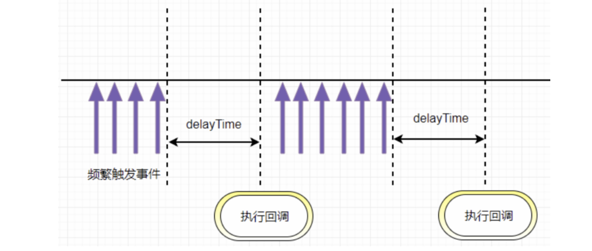

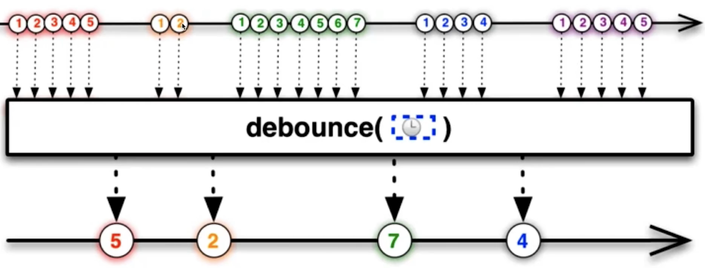

防抖动和节流本质是不一样的。 **防抖动是将多次执行变为`最后一次执行`
，节流是将多次执行变成`每隔一段时间执行`**

> eg.
> 像百度搜索，就应该用防抖，当我连续不断输入时，不会发送请求；当我一段时间内不输入了，才会发送一次请求；如果小于这段时间继续输入的话，时间会重新计算，也不会发送请求。


**手写简化版:**

::: code-group
<<<./code/01/01.js
<<<./code/01/01-2.js
:::

**适用场景：**

-   文本输入的验证，连续输入文字后发送 AJAX 请求进行验证，验证一次就好
-   按钮提交场景：防止多次提交按钮，只执行最后提交的一次
-   服务端验证场景：表单验证需要服务端配合，只执行一段连续的输入事件的最后一次，还有搜索联想词功能类似

## 2 实现节流函数（throttle）

> 节流函数原理:指频繁触发事件时，只会在指定的时间段内执行事件回调，即触发事件间隔大于等于指定的时间才会执行回调函数。总结起来就是：**事件，按照一段时间的间隔来进行触发**
> 。

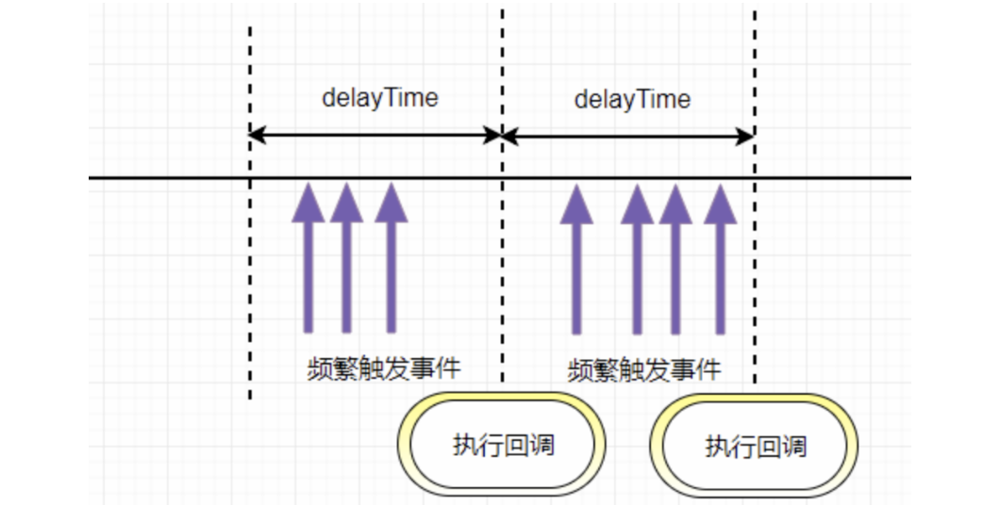

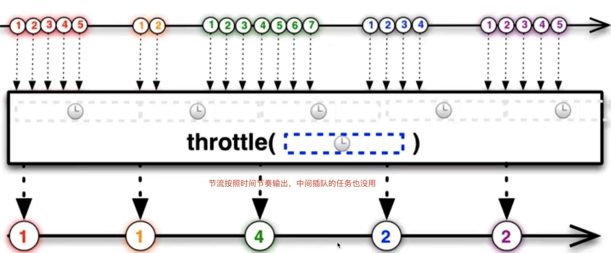

> 像dom的拖拽，如果用消抖的话，就会出现卡顿的感觉，因为只在停止的时候执行了一次，这个时候就应该用节流，在一定时间内多次执行，会流畅很多

**手写简版**

使用时间戳的节流函数会在第一次触发事件时立即执行，以后每过 `wait`
秒之后才执行一次，并且最后一次触发事件不会被执行

**时间戳方式：**

<<<./code/01/02.js

**定时器方式：**

> 使用定时器的节流函数在第一次触发时不会执行，而是在 delay秒之后才执行，当最后一次停止触发后，还会再执行一次函数

::: code-group

<<<./code/01/02-2.js

<<<./code/01/02-3.js
:::

**小结**

第一种实现（使用时间差）：
- 优点：可以保证函数的执行频率更稳定，不会出现函数执行时间不断延迟的问题。
- 缺点：需要精确的时间计算，对于高精度的时间控制可能存在误差。

第二种实现（使用定时器）：
- 优点：代码更简洁，容易理解。
- 缺点
  - 执行时间延迟：
    - 每次调用节流函数时，如果定时器正在运行，函数不会立即执行，而是等待定时器结束后才会执行。这可能导致函数执行时间的延迟，尤其在连续触发事件时，函数的执行时间会不断往后推迟。
    - 例如，假设延迟时间为 1000 毫秒，用户在 0 毫秒、200 毫秒、400 毫秒、600 毫秒、800 毫秒、1000 毫秒都触发了事件，函数只会在 1000 毫秒时执行一次，后续的触发将重置定时器，导致函数执行时间延迟。

- 性能开销：每次调用节流函数时，都会创建一个新的定时器（如果之前的定时器已执行完毕），这可能会产生额外的性能开销，尤其是在高频率触发的情况下。
  虽然定时器本身的性能开销通常较小，但在极端情况下，大量的定时器创建和销毁可能会影响性能，尤其是在移动设备或低性能设备上。

- 精度问题：
  由于 setTimeout 是基于事件循环和定时器的，其时间精度可能受到系统和浏览器的影响，实际执行时间可能会有偏差。
  例如，设置延迟为 100 毫秒，但实际执行时间可能会有几毫秒的误差，对于对时间精度要求极高的场景可能不适用。


**适用场景：**

-   拖拽场景：固定时间内只执行一次，防止超高频次触发位置变动。`DOM`
    元素的拖拽功能实现（`mousemove` ）
-   缩放场景：监控浏览器`resize`
-   滚动场景：监听滚动`scroll` 事件判断是否到页面底部自动加载更多
-   动画场景：避免短时间内多次触发动画引起性能问题

**总结**

-   **函数防抖** ：`限制执行次数，多次密集的触发只执行一次`
    -   将几次操作合并为一次操作进行。原理是维护一个计时器，规定在`delay`
        时间后触发函数，但是在`delay`
        时间内再次触发的话，就会取消之前的计时器而重新设置。这样一来，只有最后一次操作能被触发。
-   **函数节流** ：`限制执行的频率，按照一定的时间间隔有节奏的执行`
    -   使得一定时间内只触发一次函数。原理是通过判断是否到达一定时间来触发函数。

## 3 实现instanceOf

**思路：**

-   步骤1：先取得当前类的原型，当前实例对象的原型链
-   ​步骤2：一直循环（执行原型链的查找机制）
    -   取得当前实例对象原型链的原型链（`proto = proto.__proto__`
        ，沿着原型链一直向上查找）
    -   如果 当前实例的原型链`__proto__` 上找到了当前类的原型`prototype`
        ，则返回 `true`
    -   如果 一直找到`Object.prototype.__proto__ == null` ，`Object`
        的基类(`null` )上面都没找到，则返回 `false`


        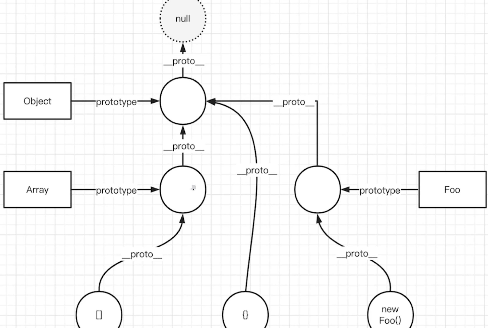

        ```js
        // 实例.__ptoto__ === 构造函数.prototype
        function _instanceof(instance, classOrFunc) {
        // 由于instance要检测的是某对象，需要有一个前置判断条件
        //基本数据类型直接返回false
        if(typeof instance !== 'object' || instance == null) return false;
        let proto = Object.getPrototypeOf(instance); // 等价于 instance.__ptoto__
        while(proto) { // 当proto == null时，说明已经找到了Object的基类null 退出循环
        // 实例的原型等于当前构造函数的原型
        if(proto == classOrFunc.prototype) return true;
        // 沿着原型链__ptoto__一层一层向上查
        proto = Object.getPrototypeof(proto); // 等价于 proto.__ptoto__
        }

        return false
        }

        console.log('test', _instanceof(null, Array)) // false
        console.log('test', _instanceof([], Array)) // true
        console.log('test', _instanceof('', Array)) // false
        console.log('test', _instanceof({}, Object)) // true
        ```
## 4 实现new的过程

**new操作符做了这些事：**

-   创建一个全新的对象`obj` ，继承构造函数的原型：这个对象的`__proto__`
    要指向构造函数的原型`prototype`
-   执行构造函数，使用 `call/apply` 改变 `this` 的指向（将`obj`
    作为`this` ）
-   返回值为`object` 类型则作为`new`
    方法的返回值返回，否则返回上述全新对象`obj`

```js
function myNew(constructor, ...args) {
    // 1. 基于原型链 创建一个新对象，继承构造函数constructor的原型对象（Person.prototype）上的属性
    let newObj = Object.create(constructor.prototype);
    // 添加属性到新对象上 并获取obj函数的结果
    // 调用构造函数，将this调换为新对象，通过强行赋值的方式为新对象添加属性
    // 2. 将newObj作为this，执行 constructor ，传入参数
    let res = constructor.apply(newObj, args); // 改变this指向新创建的对象

    // 3. 如果函数的执行结果有返回值并且是一个对象, 返回执行的结果, 否则, 返回新创建的对象地址
    return typeof res === 'object' ? res: newObj;
}

```

```js
// 用法
function Person(name, age) {
    this.name = name;
    this.age = age;
    // 如果构造函数内部，return 一个引用类型的对象，则整个构造函数失效，返回这个引用类型的对象，而不是返回this
    // 在实例中就没法获取Person原型上的getName方法
}
Person.prototype.say = function() {
    console.log(this.age);
};
let p1 = myNew(Person, "poety", 18);
console.log(p1.name);
console.log(p1);
p1.say();
```

demo：

<<<./01-demo/new.js


##  5 实现call方法

**call做了什么:**

-   将函数设为对象的属性
-   执行和删除这个函数
-   指定`this` 到函数并传入给定参数执行函数
-   如果不传入参数，默认指向 `window`

**分析：如何在函数执行时绑定this**

-   如`var obj = {x:100,fn() { this.x }}`
-   执行`obj.fn()` ,此时`fn` 内部的`this` 就指向了`obj`
-   可借此来实现函数绑定`this`

> 原生`call` 、`apply` 传入的`this` 如果是值类型，会被`new Object`
> （如`fn.call('abc')` ）

```js
//实现call方法

// 相当于在obj上调用fn方法，this指向obj
// var obj = {fn: function(){console.log(this)}}
// obj.fn() fn内部的this指向obj
// call就是模拟了这个过程
// context 相当于obj

Function.prototype.myCall = function(context = window, ...args) {
  if (typeof context !== 'object') context = new Object(context) // 值类型，变为对象

  // args 传递过来的参数
  // this 表示调用call的函数fn
  // context 是call传入的this

  // 在context上加一个唯一值，不会出现属性名称的覆盖
  let fnKey = Symbol()
  // 相等于 obj[fnKey] = fn
  context[fnKey] = this; // this 就是当前的函数

  // 绑定了this
  let result = context[fnKey](...args);// 相当于 obj.fn()执行 fn内部this指向context(obj)

  // 清理掉 fn ，防止污染（即清掉obj上的fnKey属性）
  delete context[fnKey];

  // 返回结果
  return result;
};
```

```js
//用法：f.call(this,arg1)
function f(a,b){
 console.log(a+b)
 console.log(this.name)
}
let obj={
 name:1
}
f.myCall(obj,1,2) // 不传obj，this指向window
```


### 原生call

<<<./01-demo/1-call.js

<<<./01-demo/2-call.js

<<<./01-demo/3-call.js

**演示 call传入一个对象**

<<<./01-demo/4-call-example.js


## 6 实现apply方法

> 思路: 利用`this` 的上下文特性。`apply` 其实就是改一下参数的问题

```js
Function.prototype.myApply = function(context = window, args) {  // 这里传参和call传参不一样
  if (typeof context !== 'object') context = new Object(context) // 值类型，变为对象

  // args 传递过来的参数
  // this 表示调用call的函数
  // context 是apply传入的this

  // 在context上加一个唯一值，不会出现属性名称的覆盖
  let fnKey = Symbol()
  context[fnKey] = this; // this 就是当前的函数

  // 绑定了this
  let result = context[fnKey](...args);

  // 清理掉 fn ，防止污染
  delete context[fnKey];

  // 返回结果
  return result;
}
```

```js
// 使用
function f(a,b){
 console.log(a,b)
 console.log(this.name)
}
let obj={
 name:'张三'
}
f.myApply(obj,[1,2])
```

#### 原生apply

<<<./01-demo/5-1-apply.js


## 7 实现bind方法

> `bind`
> 的实现对比其他两个函数略微地复杂了一点，涉及到参数合并(类似函数柯里化)，因为
> `bind` 需要返回一个函数，需要判断一些边界问题，以下是 `bind` 的实现

-   `bind`
    返回了一个函数，对于函数来说有两种方式调用，一种是直接调用，一种是通过
    `new` 的方式，我们先来说直接调用的方式
-   对于直接调用来说，这里选择了 `apply`
    的方式实现，但是对于参数需要注意以下情况：因为 `bind`
    可以实现类似这样的代码 `f.bind(obj, 1)(2)`
    ，所以我们需要将两边的参数拼接起来
-   最后来说通过 `new` 的方式，对于 `new` 的情况来说，不会被任何方式改变
    `this` ，所以对于这种情况我们需要忽略传入的 `this`
-   箭头函数的底层是`bind` ，无法改变`this` ，只能改变参数

**简洁版本**

-   对于普通函数，绑定`this` 指向
-   对于构造函数，要保证原函数的原型对象上的属性不能丢失

```js
Function.prototype.myBind = function(context = window, ...args) {
  // context 是 bind 传入的 this
  // args 是 bind 传入的各个参数
  // this表示调用bind的函数
  let self = this; // fn.bind(obj) self就是fn

  //返回了一个函数，...innerArgs为实际调用时传入的参数
  let fBound = function(...innerArgs) {
      //this instanceof fBound为true表示构造函数的情况。如new func.bind(obj)
      // 当作为构造函数时，this 指向实例，此时 this instanceof fBound 结果为 true，可以让实例获得来自绑定函数的值
      // 当作为普通函数时，this 默认指向 window，此时结果为 false，将绑定函数的 this 指向 context
      return self.apply( // 函数执行
        this instanceof fBound ? this : context,
        args.concat(innerArgs) // 拼接参数
      );
  }

  // 如果绑定的是构造函数，那么需要继承构造函数原型属性和方法：保证原函数的原型对象上的属性不丢失
  // 实现继承的方式: 使用Object.create
  fBound.prototype = Object.create(this.prototype);
  return fBound;
}
```

```js
// 测试用例

function Person(name, age) {
  console.log('Person name：', name);
  console.log('Person age：', age);
  console.log('Person this：', this); // 构造函数this指向实例对象
}

// 构造函数原型的方法
Person.prototype.say = function() {
  console.log('person say');
}

// 普通函数
function normalFun(name, age) {
  console.log('普通函数 name：', name);
  console.log('普通函数 age：', age);
  console.log('普通函数 this：', this);  // 普通函数this指向绑定bind的第一个参数 也就是例子中的obj
}


var obj = {
  name: 'poetries',
  age: 18
}

// 先测试作为构造函数调用
var bindFun = Person.myBind(obj, 'poetry1') // undefined
var a = new bindFun(10) // Person name: poetry1、Person age: 10、Person this: fBound {}
a.say() // person say

// 再测试作为普通函数调用
var bindNormalFun = normalFun.myBind(obj, 'poetry2') // undefined
bindNormalFun(12)
// 普通函数name: poetry2
// 普通函数 age: 12
// 普通函数 this: {name: 'poetries', age: 18}
```

> **注意** ： `bind` 之后不能再次修改`this`
> 的指向（箭头函数的底层实现原理依赖`bind` 绑定this后不能再次修改`this`
> 的特性），`bind` 多次后执行，函数`this` 还是指向第一次`bind` 的对象

## 8 实现深拷贝

### 1 简洁版本

**简单版：**

```js
const newObj = JSON.parse(JSON.stringify(oldObj));
```

**局限性：**

-   他无法实现对函数 、RegExp等特殊对象的克隆
-   会抛弃对象的`constructo` r,所有的构造函数会指向`Object`
-   对象有循环引用,会报错

**面试简版**

```js
function deepClone(obj) {
  // 如果是 值类型 或 null，则直接return
  if(typeof obj !== 'object' || obj === null) {
    return obj
  }

  // 定义结果对象
  let copy = {}

  // 如果对象是数组，则定义结果数组
  if(obj instanceof Array) {
    copy = []
  }

  // 遍历对象的key
  for(let key in obj) {
      // 如果key是对象的自有属性
      if(obj.hasOwnProperty(key)) {
        // 递归调用深拷贝方法
        copy[key] = deepClone(obj[key])
      }
  }

  return copy
}
```

> 调用深拷贝方法，若属性为值类型，则直接返回；若属性为引用类型，则递归遍历。这就是我们在解这一类题时的核心的方法。

**进阶版**

-   解决拷贝循环引用问题
-   解决拷贝对应原型问题

```js
// 递归拷贝 (类型判断)
function deepClone(value,hash = new WeakMap){ // 弱引用，不用map，weakMap更合适一点
  // null 和 undefiend 是不需要拷贝的
  if(value == null){ return value;}
  if(value instanceof RegExp) { return new RegExp(value) }
  if(value instanceof Date) { return new Date(value) }
  // 函数是不需要拷贝
  if(typeof value != 'object') return value;
  let obj = new value.constructor(); // [] {}
  // 说明是一个对象类型
  if(hash.get(value)){
    return hash.get(value)
  }
  hash.set(value,obj);
  for(let key in value){ // in 会遍历当前对象上的属性 和 __proto__指代的属性
    // 补拷贝 对象的__proto__上的属性
    if(value.hasOwnProperty(key)){
      // 如果值还有可能是对象 就继续拷贝
      obj[key] = deepClone(value[key],hash);
    }
  }
  return obj
  // 区分对象和数组 Object.prototype.toString.call
}
```
```js
// test

var o = {};
o.x = o;
var o1 = deepClone(o); // 如果这个对象拷贝过了 就返回那个拷贝的结果就可以了
console.log(o1);
```

### 2 实现完整的深拷贝

**1. 简易版及问题**

```js
JSON.parse(JSON.stringify());
```

> 估计这个api能覆盖大多数的应用场景，没错，谈到深拷贝，我第一个想到的也是它。但是实际上，对于某些严格的场景来说，这个方法是有巨大的坑的。问题如下：

1.  无法解决`循环引用` 的问题。举个例子：

```js
const a = {val:2};
a.target = a;
```

> 拷贝`a` 会出现系统栈溢出，因为出现了无限递归的情况。

2.  无法拷贝一些特殊的对象，诸如 `RegExp, Date, Set, Map` 等
3.  无法拷贝`函数` (划重点)。

因此这个api先pass掉，我们重新写一个深拷贝，简易版如下:

```js
const deepClone = (target) => {
  if (typeof target === 'object' && target !== null) {
    const cloneTarget = Array.isArray(target) ? []: {};
    for (let prop in target) {
      if (target.hasOwnProperty(prop)) {
          cloneTarget[prop] = deepClone(target[prop]);
      }
    }
    return cloneTarget;
  } else {
    return target;
  }
}
```

现在，我们以刚刚发现的三个问题为导向，一步步来完善、优化我们的深拷贝代码。

**2. 解决循环引用**

现在问题如下:

```js
let obj = {val : 100};
obj.target = obj;

deepClone(obj);//报错: RangeError: Maximum call stack size exceeded
```

这就是循环引用。我们怎么来解决这个问题呢？

> 创建一个Map。记录下已经拷贝过的对象，如果说已经拷贝过，那直接返回它行了。

```js
const isObject = (target) => (typeof target === 'object' || typeof target === 'function') && target !== null;

const deepClone = (target, map = new Map()) => {
  if(map.get(target))
    return target;


  if (isObject(target)) {
    map.set(target, true);
    const cloneTarget = Array.isArray(target) ? []: {};
    for (let prop in target) {
      if (target.hasOwnProperty(prop)) {
          cloneTarget[prop] = deepClone(target[prop],map);
      }
    }
    return cloneTarget;
  } else {
    return target;
  }
}
```

现在来试一试：

```js
const a = {val:2};
a.target = a;
let newA = deepClone(a);
console.log(newA)//{ val: 2, target: { val: 2, target: [Circular] } }
```

> 好像是没有问题了, 拷贝也完成了。但还是有一个潜在的坑, 就是map 上的 key
> 和 map
> 构成了强引用关系，这是相当危险的。我给你解释一下与之相对的弱引用的概念你就明白了

在计算机程序设计中，弱引用与强引用相对，

> 被弱引用的对象可以在任何时候被回收，而对于强引用来说，只要这个强引用还在，那么对象无法被回收。拿上面的例子说，map
> 和 a一直是强引用的关系， 在程序结束之前，a
> 所占的内存空间一直不会被释放。

**怎么解决这个问题？**

> 很简单，让 map 的 key 和 map
> 构成弱引用即可。ES6给我们提供了这样的数据结构，它的名字叫WeakMap，它是一种特殊的Map,
> 其中的键是弱引用的。其键必须是对象，而值可以是任意的

稍微改造一下即可:

```js
const deepClone = (target, map = new WeakMap()) => {
  //...
}
```

**3. 拷贝特殊对象**

**可继续遍历**

对于特殊的对象，我们使用以下方式来鉴别:

```js
Object.prototype.toString.call(obj);
```

梳理一下对于可遍历对象会有什么结果：

```js
["object Map"]
["object Set"]
["object Array"]
["object Object"]
["object Arguments"]
```
以这些不同的字符串为依据，我们就可以成功地鉴别这些对象。

```js
const getType = Object.prototype.toString.call(obj);

const canTraverse = {
  '[object Map]': true,
  '[object Set]': true,
  '[object Array]': true,
  '[object Object]': true,
  '[object Arguments]': true,
};

const deepClone = (target, map = new Map()) => {
  if(!isObject(target))
    return target;
  let type = getType(target);
  let cloneTarget;
  if(!canTraverse[type]) {
    // 处理不能遍历的对象
    return;
  }else {
    // 这波操作相当关键，可以保证对象的原型不丢失！
    let ctor = target.prototype;
    cloneTarget = new ctor();
  }

  if(map.get(target))
    return target;
  map.put(target, true);

  if(type === mapTag) {
    //处理Map
    target.forEach((item, key) => {
      cloneTarget.set(deepClone(key), deepClone(item));
    })
  }

  if(type === setTag) {
    //处理Set
    target.forEach(item => {
      target.add(deepClone(item));
    })
  }

  // 处理数组和对象
  for (let prop in target) {
    if (target.hasOwnProperty(prop)) {
        cloneTarget[prop] = deepClone(target[prop]);
    }
  }
  return cloneTarget;
}
```

**不可遍历的对象**

```js
const boolTag = '[object Boolean]';
const numberTag = '[object Number]';
const stringTag = '[object String]';
const dateTag = '[object Date]';
const errorTag = '[object Error]';
const regexpTag = '[object RegExp]';
const funcTag = '[object Function]';
```

对于不可遍历的对象，不同的对象有不同的处理。

```js
const handleRegExp = (target) => {
  const { source, flags } = target;
  return new target.constructor(source, flags);
}

const handleFunc = (target) => {
  // 待会的重点部分
}

const handleNotTraverse = (target, tag) => {
  const Ctor = targe.constructor;
  switch(tag) {
    case boolTag:
    case numberTag:
    case stringTag:
    case errorTag:
    case dateTag:
      return new Ctor(target);
    case regexpTag:
      return handleRegExp(target);
    case funcTag:
      return handleFunc(target);
    default:
      return new Ctor(target);
  }
}
```

**4. 拷贝函数**

-   虽然函数也是对象，但是它过于特殊，我们单独把它拿出来拆解。
-   提到函数，在JS种有两种函数，一种是普通函数，另一种是箭头函数。每个普通函数都是
-   Function的实例，而箭头函数不是任何类的实例，每次调用都是不一样的引用。那我们只需要
-   处理普通函数的情况，箭头函数直接返回它本身就好了。

那么如何来区分两者呢？

> 答案是: 利用原型。箭头函数是不存在原型的。

```js
const handleFunc = (func) => {
  // 箭头函数直接返回自身
  if(!func.prototype) return func;
  const bodyReg = /(?<={)(.|\n)+(?=})/m;
  const paramReg = /(?<=\().+(?=\)\s+{)/;
  const funcString = func.toString();
  // 分别匹配 函数参数 和 函数体
  const param = paramReg.exec(funcString);
  const body = bodyReg.exec(funcString);
  if(!body) return null;
  if (param) {
    const paramArr = param[0].split(',');
    return new Function(...paramArr, body[0]);
  } else {
    return new Function(body[0]);
  }
}
```

**5. 完整代码展示**

```js
const getType = obj => Object.prototype.toString.call(obj);

const isObject = (target) => (typeof target === 'object' || typeof target === 'function') && target !== null;

const canTraverse = {
  '[object Map]': true,
  '[object Set]': true,
  '[object Array]': true,
  '[object Object]': true,
  '[object Arguments]': true,
};
const mapTag = '[object Map]';
const setTag = '[object Set]';
const boolTag = '[object Boolean]';
const numberTag = '[object Number]';
const stringTag = '[object String]';
const symbolTag = '[object Symbol]';
const dateTag = '[object Date]';
const errorTag = '[object Error]';
const regexpTag = '[object RegExp]';
const funcTag = '[object Function]';

const handleRegExp = (target) => {
  const { source, flags } = target;
  return new target.constructor(source, flags);
}

const handleFunc = (func) => {
  // 箭头函数直接返回自身
  if(!func.prototype) return func;
  const bodyReg = /(?<={)(.|\n)+(?=})/m;
  const paramReg = /(?<=\().+(?=\)\s+{)/;
  const funcString = func.toString();
  // 分别匹配 函数参数 和 函数体
  const param = paramReg.exec(funcString);
  const body = bodyReg.exec(funcString);
  if(!body) return null;
  if (param) {
    const paramArr = param[0].split(',');
    return new Function(...paramArr, body[0]);
  } else {
    return new Function(body[0]);
  }
}

const handleNotTraverse = (target, tag) => {
  const Ctor = target.constructor;
  switch(tag) {
    case boolTag:
      return new Object(Boolean.prototype.valueOf.call(target));
    case numberTag:
      return new Object(Number.prototype.valueOf.call(target));
    case stringTag:
      return new Object(String.prototype.valueOf.call(target));
    case symbolTag:
      return new Object(Symbol.prototype.valueOf.call(target));
    case errorTag:
    case dateTag:
      return new Ctor(target);
    case regexpTag:
      return handleRegExp(target);
    case funcTag:
      return handleFunc(target);
    default:
      return new Ctor(target);
  }
}

const deepClone = (target, map = new WeakMap()) => {
  if(!isObject(target))
    return target;
  let type = getType(target);
  let cloneTarget;
  if(!canTraverse[type]) {
    // 处理不能遍历的对象
    return handleNotTraverse(target, type);
  }else {
    // 这波操作相当关键，可以保证对象的原型不丢失！
    let ctor = target.constructor;
    cloneTarget = new ctor();
  }

  if(map.get(target))
    return target;
  map.set(target, true);

  if(type === mapTag) {
    //处理Map
    target.forEach((item, key) => {
      cloneTarget.set(deepClone(key, map), deepClone(item, map));
    })
  }

  if(type === setTag) {
    //处理Set
    target.forEach(item => {
      cloneTarget.add(deepClone(item, map));
    })
  }

  // 处理数组和对象
  for (let prop in target) {
    if (target.hasOwnProperty(prop)) {
        cloneTarget[prop] = deepClone(target[prop], map);
    }
  }
  return cloneTarget;
}
```

## [\#](#_9-实现类的继承){.header-anchor} 9 实现类的继承 {#_9-实现类的继承}

### [\#](#_1-实现类的继承-简版){.header-anchor} 1 实现类的继承-简版 {#_1-实现类的继承-简版}

> 类的继承在几年前是重点内容，有n种继承方式各有优劣，es6普及后越来越不重要，那么多种写法有点『回字有四样写法』的意思，如果还想深入理解的去看红宝书即可，我们目前只实现一种最理想的继承方式。

```js
// 寄生组合继承
function Parent(name) {
  this.name = name
}
Parent.prototype.say = function() {
  console.log(this.name + ` say`);
}
Parent.prototype.play = function() {
  console.log(this.name + ` play`);
}

function Child(name, parent) {
  // 将父类的构造函数绑定在子类上
  Parent.call(this, parent)
  this.name = name
}

/**
 1. 这一步不用Child.prototype = Parent.prototype的原因是怕共享内存，修改父类原型对象就会影响子类
 2. 不用Child.prototype = new Parent()的原因是会调用2次父类的构造方法（另一次是call），会存在一份多余的父类实例属性
3. Object.create是创建了父类原型的副本，与父类原型完全隔离
*/
Child.prototype = Object.create(Parent.prototype);
Child.prototype.say = function() {
  console.log(this.name + ` say`);
}

// 注意记得把子类的构造指向子类本身
Child.prototype.constructor = Child;
```

```js
// 测试
var parent = new Parent('parent');
parent.say()

var child = new Child('child');
child.say()
child.play(); // 继承父类的方法
```

### [\#](#_2-es5实现继承-详细){.header-anchor} 2 ES5实现继承-详细 {#_2-es5实现继承-详细}

**第一种方式是借助call实现继承**

```js
function Parent1(){
    this.name = 'parent1';
}
function Child1(){
    Parent1.call(this);
    this.type = 'child1'
}
console.log(new Child1);
```

> 这样写的时候子类虽然能够拿到父类的属性值，但是问题是父类中一旦存在方法那么子类无法继承。那么引出下面的方法

**第二种方式借助原型链实现继承：**

```js
  function Parent2() {
    this.name = 'parent2';
    this.play = [1, 2, 3]
  }
  function Child2() {
    this.type = 'child2';
  }
  Child2.prototype = new Parent2();

  console.log(new Child2());
```

看似没有问题，父类的方法和属性都能够访问，但实际上有一个潜在的不足。举个例子：

```js
  var s1 = new Child2();
  var s2 = new Child2();
  s1.play.push(4);
  console.log(s1.play, s2.play); // [1,2,3,4] [1,2,3,4]
```

明明我只改变了s1的play属性，为什么s2也跟着变了呢？很简单，因为两个实例使用的是同一个原型对象

**第三种方式：将前两种组合：**

```js
function Parent3 () {
    this.name = 'parent3';
    this.play = [1, 2, 3];
  }
  function Child3() {
    Parent3.call(this);
    this.type = 'child3';
  }
  Child3.prototype = new Parent3();
  var s3 = new Child3();
  var s4 = new Child3();
  s3.play.push(4);
  console.log(s3.play, s4.play); // [1,2,3,4] [1,2,3]
```

> 之前的问题都得以解决。但是这里又徒增了一个新问题，那就是Parent3的构造函数会多执行了一次（`Child3.prototype = new Parent3()`
> ;）。这是我们不愿看到的。那么如何解决这个问题？

**第四种方式: 组合继承的优化1**

```js
  function Parent4 () {
    this.name = 'parent4';
    this.play = [1, 2, 3];
  }
  function Child4() {
    Parent4.call(this);
    this.type = 'child4';
  }
  Child4.prototype = Parent4.prototype;
```

> 这里让将父类原型对象直接给到子类，父类构造函数只执行一次，而且父类属性和方法均能访问，但是我们来测试一下

```js
  var s3 = new Child4();
  var s4 = new Child4();
  console.log(s3)
```

> 子类实例的构造函数是Parent4，显然这是不对的，应该是Child4。

**第五种方式(最推荐使用)：优化2**

```js
  function Parent5 () {
    this.name = 'parent5';
    this.play = [1, 2, 3];
  }
  function Child5() {
    Parent5.call(this);
    this.type = 'child5';
  }
  Child5.prototype = Object.create(Parent5.prototype);
  Child5.prototype.constructor = Child5;
```

> 这是最推荐的一种方式，接近完美的继承。

## 10 实现Promise相关方法

###  1 实现Promise的resolve

> 实现 resolve 静态方法有三个要点:

-   传参为一个 `Promise` , 则直接返回它。
-   传参为一个 `thenable` 对象，返回的 `Promise`
    会跟随这个对象，采用它的最终状态作为自己的状态。
-   其他情况，直接返回以该值为成功状态的`promise` 对象。

```js
Promise.resolve = (param) => {
  if(param instanceof Promise) return param;
  return new Promise((resolve, reject) => {
    if(param && param.then && typeof param.then === 'function') {
      // param 状态变为成功会调用resolve，将新 Promise 的状态变为成功，反之亦然
      param.then(resolve, reject);
    }else {
      resolve(param);
    }
  })
}
```

### 2 实现 Promise.reject

> Promise.reject 中传入的参数会作为一个 reason 原封不动地往下传,
> 实现如下:

```js
Promise.reject = function (reason) {
    return new Promise((resolve, reject) => {
        reject(reason);
    });
}
```

### 3 实现 Promise.prototype.finally

> 前面的`promise` 不管成功还是失败，都会走到`finally` 中，并且`finally`
> 之后，还可以继续`then`
> （说明它还是一个then方法是关键），并且会将初始的`promise`
> 值原封不动的传递给后面的`then` .

**Promise.prototype.finally最大的作用**

-   `finally`
    里的函数，无论如何都会执行，并会把前面的值原封不动传递给下一个`then`
    方法中
-   如果`finally` 函数中有`promise`
    等异步任务，会等它们全部执行完毕，再结合之前的成功与否状态，返回值

**Promise.prototype.finally六大情况用法**

```js
// 情况1
Promise.resolve(123).finally((data) => { // 这里传入的函数，无论如何都会执行
  console.log(data); // undefined
})

// 情况2 (这里，finally方法相当于做了中间处理，起一个过渡的作用)
Promise.resolve(123).finally((data) => {
  console.log(data); // undefined
}).then(data => {
  console.log(data); // 123
})

// 情况3 (这里只要reject，都会走到下一个then的err中)
Promise.reject(123).finally((data) => {
  console.log(data); // undefined
}).then(data => {
  console.log(data);
}, err => {
  console.log(err, 'err'); // 123 err
})

// 情况4 (一开始就成功之后，会等待finally里的promise执行完毕后，再把前面的data传递到下一个then中)
Promise.resolve(123).finally((data) => {
  console.log(data); // undefined
  return new Promise((resolve, reject) => {
    setTimeout(() => {
      resolve('ok');
    }, 3000)
  })
}).then(data => {
  console.log(data, 'success'); // 123 success
}, err => {
  console.log(err, 'err');
})

// 情况5 (虽然一开始成功，但是只要finally函数中的promise失败了，就会把其失败的值传递到下一个then的err中)
Promise.resolve(123).finally((data) => {
  console.log(data); // undefined
  return new Promise((resolve, reject) => {
    setTimeout(() => {
      reject('rejected');
    }, 3000)
  })
}).then(data => {
  console.log(data, 'success');
}, err => {
  console.log(err, 'err'); // rejected err
})

// 情况6 (虽然一开始失败，但是也要等finally中的promise执行完，才能把一开始的err传递到err的回调中)
Promise.reject(123).finally((data) => {
  console.log(data); // undefined
  return new Promise((resolve, reject) => {
    setTimeout(() => {
      resolve('resolve');
    }, 3000)
  })
}).then(data => {
  console.log(data, 'success');
}, err => {
  console.log(err, 'err'); // 123 err
})
```

**源码实现**

```js
Promise.prototype.finally = function (callback) {
  return this.then((data) => {
    // 让函数执行 内部会调用方法，如果方法是promise，需要等待它完成
    // 如果当前promise执行时失败了，会把err传递到，err的回调函数中
    return Promise.resolve(callback()).then(() => data); // data 上一个promise的成功态
  }, err => {
    return Promise.resolve(callback()).then(() => {
      throw err; // 把之前的失败的err，抛出去
    });
  })
}
```

### [\#](#_4-实现-promise-all){.header-anchor} 4 实现 Promise.all {#_4-实现-promise-all}

> 对于 all 方法而言，需要完成下面的核心功能:

-   传入参数为一个空的可迭代对象，则直接进行`resolve` 。
-   如果参数中有一个`promise` 失败，那么`Promise.all` 返回的`promise`
    对象失败。
-   在任何情况下，`Promise.all` 返回的 `promise`
    的完成状态的结果都是一个数组

```js
    Promise.all = function(promises) {
  return new Promise((resolve, reject) => {
    let result = [];
    let index = 0;
    let len = promises.length;
    if(len === 0) {
      resolve(result);
      return;
    }

    for(let i = 0; i < len; i++) {
      // 为什么不直接 promise[i].then, 因为promise[i]可能不是一个promise
      Promise.resolve(promise[i]).then(data => {
        result[i] = data;
        index++;
        if(index === len) resolve(result);
      }).catch(err => {
        reject(err);
      })
    }
  })
}
```

### 5 实现promise.allsettle

> MDN: `Promise.allSettled()` 方法返回一个在所有给定的`promise` 都`已经`
> fulfilled`或` rejected`后的`
> promise`，并带有一个对象数组，每个对象表示对应的` promise\`结果

当您有多个彼此不依赖的异步任务成功完成时，或者您总是想知道每个`promise`
的结果时，通常使用它。

> 【译】`Promise.allSettled` 跟 `Promise.all` 类似,
> 其参数接受一个`Promise` 的数组, 返回一个新的`Promise` ,
> 唯一的不同在于, 其不会进行短路,
> 也就是说当Promise全部处理完成后我们可以拿到每个`Promise` 的状态,
> 而不管其是否处理成功。

**用法 \| 测试用例**

```js
let fs = require('fs').promises;

let getName = fs.readFile('./name.txt', 'utf8'); // 读取文件成功
let getAge = fs.readFile('./age.txt', 'utf8');

Promise.allSettled([1, getName, getAge, 2]).then(data => {
    console.log(data);
});
// 输出结果
/*
    [
    { status: 'fulfilled', value: 1 },
    { status: 'fulfilled', value: 'zf' },
    { status: 'fulfilled', value: '11' },
    { status: 'fulfilled', value: 2 }
    ]
*/

let getName = fs.readFile('./name123.txt', 'utf8'); // 读取文件失败
let getAge = fs.readFile('./age.txt', 'utf8');
// 输出结果
/*
    [
    { status: 'fulfilled', value: 1 },
    {
      status: 'rejected',
      value: [Error: ENOENT: no such file or directory, open './name123.txt'] {
        errno: -2,
        code: 'ENOENT',
        syscall: 'open',
        path: './name123.txt'
      }
    },
    { status: 'fulfilled', value: '11' },
    { status: 'fulfilled', value: 2 }
  ]
*/
```

**实现**

```js
function isPromise (val) {
  return typeof val.then === 'function'; // (123).then => undefined
}

Promise.allSettled = function(promises) {
  return new Promise((resolve, reject) => {
    let arr = [];
    let times = 0;
    const setData = (index, data) => {
      arr[index] = data;
      if (++times === promises.length) {
        resolve(arr);
      }
      console.log('times', times)
    }

    for (let i = 0; i < promises.length; i++) {
      let current = promises[i];
      if (isPromise(current)) {
        current.then((data) => {
          setData(i, { status: 'fulfilled', value: data });
        }, err => {
          setData(i, { status: 'rejected', value: err })
        })
      } else {
        setData(i, { status: 'fulfilled', value: current })
      }
    }
  })
}
```

### 6 实现 Promise.race

> race 的实现相比之下就简单一些，只要有一个 promise 执行完，直接 resolve
> 并停止执行

```js
Promise.race = function(promises) {
  return new Promise((resolve, reject) => {
    let len = promises.length;
    if(len === 0) return;
    for(let i = 0; i < len; i++) {
      Promise.resolve(promise[i]).then(data => {
        resolve(data);
        return;
      }).catch(err => {
        reject(err);
        return;
      })
    }
  })
}
```

### 7 实现一个简版Promise

```js
// 使用
var promise = new Promise((resolve,reject) => {
    if (操作成功) {
        resolve(value)
    } else {
        reject(error)
    }
})
promise.then(function (value) {
    // success
},function (value) {
    // failure
})
```

```js
function myPromise(constructor) {
    let self = this;
    self.status = "pending"   // 定义状态改变前的初始状态
    self.value = undefined;   // 定义状态为resolved的时候的状态
    self.reason = undefined;  // 定义状态为rejected的时候的状态
    function resolve(value) {
       if(self.status === "pending") {
          self.value = value;
          self.status = "resolved";
       }
    }
    function reject(reason) {
       if(self.status === "pending") {
          self.reason = reason;
          self.status = "rejected";
       }
    }
    // 捕获构造异常
    try {
       constructor(resolve,reject);
    } catch(e) {
       reject(e);
    }
}
```

```js
// 添加 then 方法
myPromise.prototype.then = function(onFullfilled,onRejected) {
   let self = this;
   switch(self.status) {
      case "resolved":
        onFullfilled(self.value);
        break;
      case "rejected":
        onRejected(self.reason);
        break;
      default:
   }
}

var p = new myPromise(function(resolve,reject) {
    resolve(1)
});
p.then(function(x) {
    console.log(x) // 1
})
```

**使用class实现**

```js
class MyPromise {
  constructor(fn) {
    this.resolvedCallbacks = [];
    this.rejectedCallbacks = [];

    this.state = 'PENDING';
    this.value = '';

    fn(this.resolve.bind(this), this.reject.bind(this));

  }

  resolve(value) {
    if (this.state === 'PENDING') {
      this.state = 'RESOLVED';
      this.value = value;

      this.resolvedCallbacks.map(cb => cb(value));
    }
  }

  reject(value) {
    if (this.state === 'PENDING') {
      this.state = 'REJECTED';
      this.value = value;

      this.rejectedCallbacks.map(cb => cb(value));
    }
  }

  then(onFulfilled, onRejected) {
    if (this.state === 'PENDING') {
      this.resolvedCallbacks.push(onFulfilled);
      this.rejectedCallbacks.push(onRejected);

    }

    if (this.state === 'RESOLVED') {
      onFulfilled(this.value);
    }

    if (this.state === 'REJECTED') {
      onRejected(this.value);
    }
  }
}
```

### 8 Promise 实现-详细

-   可以把 `Promise` 看成一个状态机。初始是 `pending` 状态，可以通过函数
    `resolve` 和 `reject` ，将状态转变为 `resolved` 或者 `rejected`
    状态，状态一旦改变就不能再次变化。
-   `then` 函数会返回一个 `Promise`
    实例，并且该返回值是一个新的实例而不是之前的实例。因为 `Promise`
    规范规定除了 `pending`
    状态，其他状态是不可以改变的，如果返回的是一个相同实例的话，多个
    `then` 调用就失去意义了。
-   对于 `then` 来说，本质上可以把它看成是 `flatMap`

```js
// 三种状态
const PENDING = "pending";
const RESOLVED = "resolved";
const REJECTED = "rejected";
// promise 接收一个函数参数，该函数会立即执行
function MyPromise(fn) {
  let _this = this;
  _this.currentState = PENDING;
  _this.value = undefined;
  // 用于保存 then 中的回调，只有当 promise
  // 状态为 pending 时才会缓存，并且每个实例至多缓存一个
  _this.resolvedCallbacks = [];
  _this.rejectedCallbacks = [];

  _this.resolve = function (value) {
    if (value instanceof MyPromise) {
      // 如果 value 是个 Promise，递归执行
      return value.then(_this.resolve, _this.reject)
    }
    setTimeout(() => { // 异步执行，保证执行顺序
      if (_this.currentState === PENDING) {
        _this.currentState = RESOLVED;
        _this.value = value;
        _this.resolvedCallbacks.forEach(cb => cb());
      }
    })
  };

  _this.reject = function (reason) {
    setTimeout(() => { // 异步执行，保证执行顺序
      if (_this.currentState === PENDING) {
        _this.currentState = REJECTED;
        _this.value = reason;
        _this.rejectedCallbacks.forEach(cb => cb());
      }
    })
  }
  // 用于解决以下问题
  // new Promise(() => throw Error('error))
  try {
    fn(_this.resolve, _this.reject);
  } catch (e) {
    _this.reject(e);
  }
}

MyPromise.prototype.then = function (onResolved, onRejected) {
  var self = this;
  // 规范 2.2.7，then 必须返回一个新的 promise
  var promise2;
  // 规范 2.2.onResolved 和 onRejected 都为可选参数
  // 如果类型不是函数需要忽略，同时也实现了透传
  // Promise.resolve(4).then().then((value) => console.log(value))
  onResolved = typeof onResolved === 'function' ? onResolved : v => v;
  onRejected = typeof onRejected === 'function' ? onRejected : r => throw r;

  if (self.currentState === RESOLVED) {
    return (promise2 = new MyPromise(function (resolve, reject) {
      // 规范 2.2.4，保证 onFulfilled，onRjected 异步执行
      // 所以用了 setTimeout 包裹下
      setTimeout(function () {
        try {
          var x = onResolved(self.value);
          resolutionProcedure(promise2, x, resolve, reject);
        } catch (reason) {
          reject(reason);
        }
      });
    }));
  }

  if (self.currentState === REJECTED) {
    return (promise2 = new MyPromise(function (resolve, reject) {
      setTimeout(function () {
        // 异步执行onRejected
        try {
          var x = onRejected(self.value);
          resolutionProcedure(promise2, x, resolve, reject);
        } catch (reason) {
          reject(reason);
        }
      });
    }));
  }

  if (self.currentState === PENDING) {
    return (promise2 = new MyPromise(function (resolve, reject) {
      self.resolvedCallbacks.push(function () {
        // 考虑到可能会有报错，所以使用 try/catch 包裹
        try {
          var x = onResolved(self.value);
          resolutionProcedure(promise2, x, resolve, reject);
        } catch (r) {
          reject(r);
        }
      });

      self.rejectedCallbacks.push(function () {
        try {
          var x = onRejected(self.value);
          resolutionProcedure(promise2, x, resolve, reject);
        } catch (r) {
          reject(r);
        }
      });
    }));
  }
};
// 规范 2.3
function resolutionProcedure(promise2, x, resolve, reject) {
  // 规范 2.3.1，x 不能和 promise2 相同，避免循环引用
  if (promise2 === x) {
    return reject(new TypeError("Error"));
  }
  // 规范 2.3.2
  // 如果 x 为 Promise，状态为 pending 需要继续等待否则执行
  if (x instanceof MyPromise) {
    if (x.currentState === PENDING) {
      x.then(function (value) {
        // 再次调用该函数是为了确认 x resolve 的
        // 参数是什么类型，如果是基本类型就再次 resolve
        // 把值传给下个 then
        resolutionProcedure(promise2, value, resolve, reject);
      }, reject);
    } else {
      x.then(resolve, reject);
    }
    return;
  }
  // 规范 2.3.3.3.3
  // reject 或者 resolve 其中一个执行过得话，忽略其他的
  let called = false;
  // 规范 2.3.3，判断 x 是否为对象或者函数
  if (x !== null && (typeof x === "object" || typeof x === "function")) {
    // 规范 2.3.3.2，如果不能取出 then，就 reject
    try {
      // 规范 2.3.3.1
      let then = x.then;
      // 如果 then 是函数，调用 x.then
      if (typeof then === "function") {
        // 规范 2.3.3.3
        then.call(
          x,
          y => {
            if (called) return;
            called = true;
            // 规范 2.3.3.3.1
            resolutionProcedure(promise2, y, resolve, reject);
          },
          e => {
            if (called) return;
            called = true;
            reject(e);
          }
        );
      } else {
        // 规范 2.3.3.4
        resolve(x);
      }
    } catch (e) {
      if (called) return;
      called = true;
      reject(e);
    }
  } else {
    // 规范 2.3.4，x 为基本类型
    resolve(x);
  }
}
```

### 9 实现Promisify

```js
const fs = require('fs')
const path = require('path')

// node中使用
// const fs = require('fs').promises 12.18版
// const promisify = require('util').promisify

// 包装node api promise化 典型的高级函数
const promisify = fn=>{
  return (...args)=>{
    return new Promise((resolve,reject)=>{
      fn(...args, (err,data)=>{
        if(err) {
          reject(err)
        }
        resolve(data)
      })
    })
  }
}

// const read = promisify(fs.readFile)

// read(path.join(__dirname, './promise.js'), 'utf8').then(d=>{
//   console.log(d)
// })

// promise化node所有api
const promisifyAll = target=>{
  Reflect.ownKeys(target).forEach(key=>{
    if(typeof target[key] === 'function') {
      target[key+'Async'] = promisify(target[key])
    }
  })
  return target
}

// promise化fs下的函数
const promisifyNew = promisifyAll(fs)

promisifyNew.readFileAsync(path.join(__dirname, './promise.js'), 'utf8').then(d=>{
  console.log(d)
})

module.exports = {
  promisify,
  promisifyAll
}
```

### 10 完整实现Promises/A+规范

```js
/**
 * Promises/A+规范 实现一个promise
 * https://promisesaplus.com/
*/

const EMUM = {
  PENDING: 'PENDING',
  FULFILLED: 'FULFILLED',
  REJECTED: 'REJECTED'
}

// x 返回值
// promise2 then的时候new的promise
// promise2的resolve, reject
const resolvePromise = (x, promise2, resolve, reject)=>{
  // 解析promise的值解析promise2是成功还是失败 传递到下层then
  if(x === promise2) {
    reject(new TypeError('类型错误'))
  }
  // 这里的x如果是一个promise的话 可能是其他的promise，可能调用了成功 又调用了失败
  // 防止resolve的时候 又throw err抛出异常到reject了
  let called
  // 如果x是promise 那么就采用他的状态
  // 有then方法是promise
  if(typeof x === 'object' && typeof x!== null || typeof x === 'function') {
    // x是对象或函数
    try {
      let then = x.then // 缓存，不用多次取值
      if(typeof then === 'function') {
        // 是promise，调用then方法里面有this，需要传入this为x才能取到then方法里面的值this.value
        then.call(x, y=>{// 成功
          // y值可能也是一个promise 如resolve(new Promise()) 此时的y==new Promise()
          // 递归解析y，直到拿到普通的值resolve(x出去)
          if(called) return;
          called = true;

          resolvePromise(y, promise2, resolve, reject)
        },r=>{// 一旦失败直接失败
          if(called) return;
          called = true;
          reject(r)
        })
      } else {
        // 普通对象不是promise
        resolve(x)
      }
    } catch (e) {
      // 对象取值可能报错，用defineProperty定义get 抛出异常
      if(called) return;
      called = true;
      reject(e)
    }
  } else {
    // x是普通值
    resolve(x) // 直接成功
  }

}
class myPromise {
  constructor(executor) {
    this.status = EMUM.PENDING // 当前状态
    this.value = undefined // resolve接收值
    this.reason = undefined // reject失败返回值

    /**
     * 同一个promise可以then多次(发布订阅模式)
     * 调用then时 当前状态是等待态，需要将当前成功或失败的回调存放起来（订阅）
     * 调用resolve时 将订阅函数进行执行（发布）
    */
    // 成功队列
    this.onResolvedCallbacks = []
    // 失败队列
    this.onRejectedCallbacks = []
    const resolve = value =>{
      // 如果value是一个promise，需要递归解析
      // 如 myPromise.resolve(new myPromise()) 需要解析value
      if(value instanceof myPromise) {
        // 不停的解析 直到值不是promise
        return value.then(resolve,reject)
      }

      if(this.status === EMUM.PENDING) {
        this.status = EMUM.FULFILLED
        this.value = value

        this.onResolvedCallbacks.forEach(fn=>fn())
      }
    }
    const reject = reason =>{
      if(this.status === EMUM.PENDING) {
        this.status = EMUM.REJECTED
        this.reason = reason

        this.onRejectedCallbacks.forEach(fn=>fn())
      }
    }
    try {
      executor(resolve,reject)
    } catch(e) {
      reject(e)
    }
  }
  then(onFulFilled, onRejected) {
    // 透传 处理默认不传的情况
    // new Promise((resolve,reject)=>{
    //   resolve(1)
    // }).then().then().then(d=>{})
    // new Promise((resolve,reject)=>{
    //   resolve(1)
    // }).then(v=>v).then(v=>v).then(d=>{})
    // new Promise((resolve,reject)=>{
    //   reject(1)
    // }).then().then().then(null, e=>{console.log(e)})
    // new Promise((resolve,reject)=>{
    //   reject(1)
    // }).then(null,e=>{throw e}).then(null,e=>{throw e}).then(null,e=>{console.log(e)})
    onFulFilled = typeof onFulFilled === 'function' ? onFulFilled : v => v
    onRejected = typeof onRejected === 'function' ? onRejected : err => {throw err}

    // 调用then 创建一个新的promise
    let promise2 = new myPromise((resolve,reject)=>{
      // 根据value判断是resolve 还是reject value也可能是promise
      if(this.status === EMUM.FULFILLED) {
        setTimeout(() => {
          try {
            // 成功回调结果
            let x = onFulFilled(this.value)
            // 解析promise
            resolvePromise(x, promise2,resolve,reject)
          } catch (error) {
            reject(error)
          }
        }, 0);
      }
      if(this.status === EMUM.REJECTED) {
        setTimeout(() => {
          try {
            let x = onRejected(this.reason)
            // 解析promise
            resolvePromise(x, promise2,resolve,reject)
          } catch (error) {
            reject(error)
          }
        }, 0);
      }
      // 用户还未调用resolve或reject方法
      if(this.status === EMUM.PENDING) {
        this.onResolvedCallbacks.push(()=>{
          try {
            let x = onFulFilled(this.value)
            // 解析promise
            resolvePromise(x, promise2,resolve,reject)
          } catch (error) {
            reject(error)
          }
        })
        this.onRejectedCallbacks.push(()=>{
          try {
            let x = onRejected(this.reason)
            // 解析promise
            resolvePromise(x, promise2,resolve,reject)
          } catch (error) {
            reject(error)
          }
        })
      }
    })

    return promise2
  }
  catch(errCallback) {
    // 等同于没有成功，把失败放进去而已
    return this.then(null, errCallback)
  }
  // myPromise.resolve 具备等待功能的 如果参数的promise会等待promise解析完毕在向下执行
  static resolve(val) {
    return new myPromise((resolve,reject)=>{
      resolve(val)
    })
  }
  // myPromise.reject 直接将值返回
  static reject(reason) {
    return new myPromise((resolve,reject)=>{
      reject(reason)
    })
  }
  // finally传入的函数 无论成功或失败都执行
  // Promise.reject(100).finally(()=>{console.log(1)}).then(d=>console.log('success',d)).catch(er=>console.log('faild',er))
  // Promise.reject(100).finally(()=>new Promise()).then(d=>console.log(d)).catch(er=>)
  finally(callback) {
    return this.then((val)=>{
      return myPromise.resolve(callback()).then(()=>val)
    },(err)=>{
      return myPromise.resolve(callback()).then(()=>{throw err})
    })
  }
  // Promise.all
  static all(values) {
    return new myPromise((resolve,reject)=>{
      let resultArr = []
      let orderIndex = 0
      const processResultByKey = (value,index)=>{
        resultArr[index] = value
        // 处理完全部
        if(++orderIndex === values.length) {
          resolve(resultArr) // 处理完成的结果返回去
        }
      }
      for (let i = 0; i < values.length; i++) {
        const value = values[i];
        // 是promise
        if(value && typeof value.then === 'function') {
          value.then((val)=>{
            processResultByKey(val,i)
          },reject)
        } else {
          // 不是promise情况
          processResultByKey(value,i)
        }
      }
    })
  }
  static race(promises) {
    // 采用最新成功或失败的作为结果
    return new myPromise((resolve,reject)=>{
      for (let i = 0; i < promises.length; i++) {
        let val = promises[i]
        if(val && typeof val.then === 'function') {
          // 任何一个promise先调用resolve或reject就返回结果了 也就是返回执行最快的那个promise的结果
          val.then(resolve,reject)
        }else{
          // 普通值
          resolve(val)
        }
      }
    })
  }
}


/**
 * =====测试用例-====
 */
// let promise1 = new myPromise((resolve,reject)=>{
//   setTimeout(() => {
//     resolve('成功')
//   }, 900);
// })

// promise1.then(val=>{
//   console.log('success', val)
// },reason=>{
//   console.log('fail', reason)
// })

/**
 * then的使用方式 普通值意味不是promise
 *
 * 1、then中的回调有两个方法 成功或失败 他们的结果返回（普通值）会传递给外层的下一个then中
 * 2、可以在成功或失败中抛出异常，走到下一次then的失败中
 * 3、返回的是一个promsie，那么会用这个promise的状态作为结果，会用promise的结果向下传递
 * 4、错误处理，会默认先找离自己最新的错误处理，找不到就向下查找，找打了就执行
 */

// read('./name.txt').then(data=>{
//   return '123'
// }).then(data=>{

// }).then(null,err=>{

// })
// // .catch(err=>{ // catch就是没有成功的promise

// // })

/**
 * promise.then实现原理：通过每次返回一个新的promise来实现（promise一旦成功就不能失败，失败就不能成功）
 *
 */

// function read(data) {
//   return new myPromise((resolve,reject)=>{
//     setTimeout(() => {
//       resolve(new myPromise((resolve,reject)=>resolve(data)))
//     }, 1000);
//   })
// }

// let promise2 = read({name: 'poetry'}).then(data=>{
//   return data
// }).then().then().then(data=>{
//   console.log(data,'-data-')
// },(err)=>{
//   console.log(err,'-err-')
// })

// finally测试
// myPromise
//   .resolve(100)
//   .finally(()=>{
//     return new myPromise((resolve,reject)=>setTimeout(() => {
//       resolve(100)
//     }, 100))
//   })
//   .then(d=>console.log('finally success',d))
//   .catch(er=>console.log(er, 'finally err'))


/**
 * promise.all 测试
 *
 * myPromise.all 解决并发问题 多个异步并发获取最终的结果
*/

// myPromise.all([1,2,3,4,new myPromise((resolve,reject)=>{
//   setTimeout(() => {
//     resolve('ok1')
//   }, 1000);
// }),new myPromise((resolve,reject)=>{
//   setTimeout(() => {
//     resolve('ok2')
//   }, 1000);
// })]).then(d=>{
//   console.log(d,'myPromise.all.resolve')
// }).catch(err=>{
//   console.log(err,'myPromise.all.reject')
// })


// 实现promise中断请求
let promise = new Promise((resolve,reject)=>{
  setTimeout(() => {
    // 模拟接口调用 ajax调用超时
    resolve('成功')
  }, 10000);
})

function promiseWrap(promise) {
  // 包装一个promise 可以控制原来的promise是成功 还是失败
  let abort
  let newPromsie = new myPromise((resolve,reject)=>{
    abort = reject
  })
  // 只要控制newPromsie失败，就可以控制被包装的promise走向失败
  // Promise.race 任何一个先成功或者失败 就可以获得结果
  let p = myPromise.race([promise, newPromsie])
  p.abort = abort

  return p
}

let newPromise = promiseWrap(promise)

setTimeout(() => {
  // 超过3秒超时
  newPromise.abort('请求超时')
}, 3000);

newPromise.then(d=>{
  console.log('d',d)
}).catch(err=>{
  console.log('err',err)
})


// 使用promises-aplus-tests 测试写的promise是否规范
// 全局安装 cnpm i -g promises-aplus-tests
// 命令行执行 promises-aplus-tests promise.js
// 测试入口 产生延迟对象
myPromise.defer = myPromise.deferred = function () {
  let dfd = {}
  dfd.promise = new myPromise((resolve,reject)=>{
    dfd.resolve = resolve
    dfd.reject = reject
  })
  return dfd
}

// 延迟对象用户
// 
// promise解决嵌套问题
// function readData(url) {
//   let dfd = myPromise.defer()
//   fs.readFile(url, 'utf8', function (err,data) {
//     if(err) {
//       dfd.reject()
//     }
//     dfd.resolve(data)
//   })
//   return dfd.promise
// }
// readData().then(d=>{
//   return d
// })

module.exports = myPromise
```

## 11 实现发布订阅模式

**简介：**

发布订阅者模式，一种对象间一对多的依赖关系，但一个对象的状态发生改变时，所依赖它的对象都将得到状态改变的通知。

**主要的作用(优点)：**

1.  广泛应用于异步编程中(替代了传递回调函数)
2.  对象之间松散耦合的编写代码

**缺点：**

-   创建订阅者本身要消耗一定的时间和内存
-   多个发布者和订阅者嵌套一起的时候，程序难以跟踪维护

**实现的思路：**

-   创建一个对象(缓存列表)
-   `on` 方法用来把回调函数`fn` 都加到缓存列表中
-   `emit` 根据`key` 值去执行对应缓存列表中的函数
-   `off` 方法可以根据`key` 值取消订阅

```js
class EventEmiter {
  constructor() {
    // 事件对象，存放订阅的名字和事件
    this._events = {}
  }
  // 订阅事件的方法
  on(eventName,callback) {
    if(!this._events) {
      this._events = {}
    }
    // 合并之前订阅的cb
    this._events[eventName] = [...(this._events[eventName] || []),callback]
  }
  // 触发事件的方法
  emit(eventName, ...args) {
    if(!this._events[eventName]) {
      return
    }
    // 遍历执行所有订阅的事件
    this._events[eventName].forEach(fn=>fn(...args))
  }
  off(eventName,cb) {
    if(!this._events[eventName]) {
      return
    }
    // 删除订阅的事件
    this._events[eventName] = this._events[eventName].filter(fn=>fn != cb && fn.l != cb)
  }
  // 绑定一次 触发后将绑定的移除掉 再次触发掉
  once(eventName,callback) {
    const one = (...args)=>{
      // 等callback执行完毕在删除
      callback(args)
      this.off(eventName,one)
    }
    one.l = callback // 自定义属性
    this.on(eventName,one)
  }
}
```

**测试用例**

```js
let event = new EventEmiter()

let login1 = function(...args) {
  console.log('login success1', args)
}
let login2 = function(...args) {
  console.log('login success2', args)
}
// event.on('login',login1)
event.once('login',login2)
event.off('login',login1) // 解除订阅
event.emit('login', 1,2,3,4,5)
event.emit('login', 6,7,8,9)
event.emit('login', 10,11,12)
```

**发布订阅者模式和观察者模式的区别？**

-   发布/订阅模式是观察者模式的一种变形，两者区别在于，**发布/订阅模式在观察者模式的基础上，在目标和观察者之间增加一个调度中心。**
-   **观察者模式** 是由具体目标调度，比如当事件触发，`Subject`
    就会去调用观察者的方法，所以观察者模式的订阅者与发布者之间是存在依赖的。
-   **发布/订阅模式**
    由统一调度中心调用，因此发布者和订阅者不需要知道对方的存在。

## 12 实现观察者模式

> 观察者模式（基于发布订阅模式） 有观察者，也有被观察者

**观察者需要放到被观察者中，被观察者的状态变化需要通知观察者** 我变化了
内部也是基于发布订阅模式，收集观察者，状态变化后要主动通知观察者

```js
class Subject { // 被观察者 学生
  constructor(name) {
    this.state = 'happy'
    this.observers = []; // 存储所有的观察者
  }
  // 收集所有的观察者
  attach(o){ // Subject. prototype. attch
    this.observers.push(o)
  }
  // 更新被观察者 状态的方法
  setState(newState) {
    this.state = newState; // 更新状态
    // this 指被观察者 学生
    this.observers.forEach(o => o.update(this)) // 通知观察者 更新它们的状态
  }
}

class Observer{ // 观察者 父母和老师
  constructor(name) {
    this.name = name
  }
  update(student) {
    console.log('当前' + this.name + '被通知了', '当前学生的状态是' + student.state)
  }
}

let student = new Subject('学生');

let parent = new Observer('父母');
let teacher = new Observer('老师');

// 被观察者存储观察者的前提，需要先接纳观察者
student.attach(parent);
student.attach(teacher);
student.setState('被欺负了');
```

## 13 实现单例模式

> 核心要点: 用闭包和`Proxy` 属性拦截

```js
function proxy(func) {
    let instance;
    let handler = {
        constructor(target, args) {
            if(!instance) {
                instance = Reflect.constructor(fun, args);
            }
            return instance;
        }
    }
    return new Proxy(func, handler);
}
```

## 14 实现Ajax

**步骤**

-   创建 `XMLHttpRequest` 实例
-   发出 HTTP 请求
-   服务器返回 XML 格式的字符串
-   JS 解析 XML，并更新局部页面
-   不过随着历史进程的推进，XML 已经被淘汰，取而代之的是 JSON。

了解了属性和方法之后，根据 AJAX 的步骤，手写最简单的 GET 请求。

### 1 原生实现
```js
function ajax() {
  let xhr = new XMLHttpRequest() //实例化，以调用方法
  xhr.open('get', 'https://www.google.com')  //参数2，url。参数三：异步
  xhr.onreadystatechange = () => {  //每当 readyState 属性改变时，就会调用该函数。
    if (xhr.readyState === 4) {  //XMLHttpRequest 代理当前所处状态。
      if (xhr.status >= 200 && xhr.status < 300) {  //200-300请求成功
        let string = request.responseText
        //JSON.parse() 方法用来解析JSON字符串，构造由字符串描述的JavaScript值或对象
        let object = JSON.parse(string)
      }
    }
  }
  request.send() //用于实际发出 HTTP 请求。不带参数为GET请求
}
```

### 2 Promise实现

基于`Promise` 封装`Ajax`

-   返回一个新的`Promise` 实例
-   创建`HMLHttpRequest` 异步对象
-   调用`open` 方法，打开`url` ，与服务器建立链接（发送前的一些处理）
-   监听`Ajax` 状态信息
-   如果`xhr.readyState == 4`
    （表示服务器响应完成，可以获取使用服务器的响应了）
    -   `xhr.status == 200` ，返回`resolve` 状态
    -   `xhr.status == 404` ，返回`reject` 状态
-   `xhr.readyState !== 4` ，把请求主体的信息基于`send` 发送给服务器

```js
function ajax(url) {
  return new Promise((resolve, reject) => {
    let xhr = new XMLHttpRequest()
    xhr.open('get', url)
    xhr.onreadystatechange = () => {
      if (xhr.readyState == 4) {
        if (xhr.status >= 200 && xhr.status <= 300) {
          resolve(JSON.parse(xhr.responseText))
        } else {
          reject('请求出错')
        }
      }
    }
    xhr.send()  //发送hppt请求
  })
}

let url = '/data.json'
ajax(url).then(res => console.log(res))
  .catch(reason => console.log(reason))
```

## 15 实现JSONP方法

> 利用`<script >` 标签不受跨域限制的特点，缺点是只能支持 `get` 请求

-   创建`script` 标签
-   设置`script` 标签的`src`
    属性，以问号传递参数，设置好回调函数`callback` 名称
-   插入到`html` 文本中
-   调用回调函数，`res` 参数就是获取的数据

```js
function jsonp({url,params,callback}) {
  return new Promise((resolve,reject)=>{
  let script = document.createElement('script')

    window[callback] = function (data) {
      resolve(data)
      document.body.removeChild(script)
    }
    var arr = []
    for(var key in params) {
      arr.push(`${key}=${params[key]}`)
    }
    script.type = 'text/javascript'
    script.src = `${url}?callback=${callback}&${arr.join('&')}`
    document.body.appendChild(script)
  })
}
```

```js
// 测试用例
jsonp({
  url: 'http://suggest.taobao.com/sug',
  callback: 'getData',
  params: {
    q: 'iphone手机',
    code: 'utf-8'
  },
}).then(data=>{console.log(data)})
```

-   设置 `CORS: Access-Control-Allow-Origin：*`
-   `postMessage`

## 16 实现async/await

**分析**

```js
// generator生成器  生成迭代器iterator

// 默认这样写的类数组是不能被迭代的，缺少迭代方法
let likeArray = {'0': 1, '1': 2, '2': 3, '3': 4, length: 4}

// // 使用迭代器使得可以展开数组
// // Symbol有很多元编程方法，可以改js本身功能
// likeArray[Symbol.iterator] = function () {
//   // 迭代器是一个对象 对象中有next方法 每次调用next 都需要返回一个对象 {value,done}
//   let index = 0
//   return {
//     next: ()=>{
//       // 会自动调用这个方法
//       console.log('index',index)
//       return {
//         // this 指向likeArray
//         value: this[index],
//         done: index++ === this.length
//       }
//     }
//   }
// }
// let arr = [...likeArray]

// console.log('arr', arr)

// 使用生成器返回迭代器
// likeArray[Symbol.iterator] = function *() {
//   let index = 0
//   while (index != this.length) {
//     yield this[index++]
//   }
// }
// let arr = [...likeArray]

// console.log('arr', arr)


// 生成器 碰到yield就会暂停
// function *read(params) {
//   yield 1;
//   yield 2;
// }
// 生成器返回的是迭代器
// let it = read()
// console.log(it.next())
// console.log(it.next())
// console.log(it.next())

// 通过generator来优化promise（promise的缺点是不停的链式调用）
const fs = require('fs')
const path = require('path')
// const co = require('co') // 帮我们执行generator

const promisify = fn=>{
  return (...args)=>{
    return new Promise((resolve,reject)=>{
      fn(...args, (err,data)=>{
        if(err) {
          reject(err)
        }
        resolve(data)
      })
    })
  }
}

// promise化
let asyncReadFile = promisify(fs.readFile)

function * read() {
  let content1 = yield asyncReadFile(path.join(__dirname,'./data/name.txt'),'utf8')
  let content2 = yield asyncReadFile(path.join(__dirname,'./data/' + content1),'utf8')
  return content2
}

// 这样写太繁琐 需要借助co来实现
// let re = read()
// let {value,done} = re.next()
// value.then(data=>{
//   // 除了第一次传参没有意义外 剩下的传参都赋予了上一次的返回值
//   let {value,done} = re.next(data)
//   value.then(d=>{
//     let {value,done} = re.next(d)
//     console.log(value,done)
//   })
// }).catch(err=>{
//   re.throw(err) // 手动抛出错误 可以被try catch捕获
// })


// 实现co原理
function co(it) {// it 迭代器
  return new Promise((resolve,reject)=>{
    // 异步迭代 需要根据函数来实现
    function next(data) {
      // 递归得有中止条件
      let {value,done} = it.next(data)
      if(done) {
        resolve(value) // 直接让promise变成成功 用当前返回的结果
      } else {
        // Promise.resolve(value).then(data=>{
        //   next(data)
        // }).catch(err=>{
        //   reject(err)
        // })
        // 简写
        Promise.resolve(value).then(next,reject)
      }
    }
    // 首次调用
    next()
  })
}

co(read()).then(d=>{
  console.log(d)
}).catch(err=>{
  console.log(err,'--')
})
```

**整体看一下结构**

```js
function asyncToGenerator(generatorFunc) {
    return function() {
      const gen = generatorFunc.apply(this, arguments)
      return new Promise((resolve, reject) => {
        function step(key, arg) {
          let generatorResult
          try {
            generatorResult = gen[key](arg)
          } catch (error) {
            return reject(error)
          }
          const { value, done } = generatorResult
          if (done) {
            return resolve(value)
          } else {
            return Promise.resolve(value).then(val => step('next', val), err => step('throw', err))
          }
        }
        step("next")
      })
    }
}
```

**分析**

```js
function asyncToGenerator(generatorFunc) {
  // 返回的是一个新的函数
  return function() {

    // 先调用generator函数 生成迭代器
    // 对应 var gen = testG()
    const gen = generatorFunc.apply(this, arguments)

    // 返回一个promise 因为外部是用.then的方式 或者await的方式去使用这个函数的返回值的
    // var test = asyncToGenerator(testG)
    // test().then(res => console.log(res))
    return new Promise((resolve, reject) => {

      // 内部定义一个step函数 用来一步一步的跨过yield的阻碍
      // key有next和throw两种取值，分别对应了gen的next和throw方法
      // arg参数则是用来把promise resolve出来的值交给下一个yield
      function step(key, arg) {
        let generatorResult

        // 这个方法需要包裹在try catch中
        // 如果报错了 就把promise给reject掉 外部通过.catch可以获取到错误
        try {
          generatorResult = gen[key](arg)
        } catch (error) {
          return reject(error)
        }

        // gen.next() 得到的结果是一个 { value, done } 的结构
        const { value, done } = generatorResult

        if (done) {
          // 如果已经完成了 就直接resolve这个promise
          // 这个done是在最后一次调用next后才会为true
          // 以本文的例子来说 此时的结果是 { done: true, value: 'success' }
          // 这个value也就是generator函数最后的返回值
          return resolve(value)
        } else {
          // 除了最后结束的时候外，每次调用gen.next()
          // 其实是返回 { value: Promise, done: false } 的结构，
          // 这里要注意的是Promise.resolve可以接受一个promise为参数
          // 并且这个promise参数被resolve的时候，这个then才会被调用
          return Promise.resolve(
            // 这个value对应的是yield后面的promise
            value
          ).then(
            // value这个promise被resove的时候，就会执行next
            // 并且只要done不是true的时候 就会递归的往下解开promise
            // 对应gen.next().value.then(value => {
            //    gen.next(value).value.then(value2 => {
            //       gen.next()
            //
            //      // 此时done为true了 整个promise被resolve了
            //      // 最外部的test().then(res => console.log(res))的then就开始执行了
            //    })
            // })
            function onResolve(val) {
              step("next", val)
            },
            // 如果promise被reject了 就再次进入step函数
            // 不同的是，这次的try catch中调用的是gen.throw(err)
            // 那么自然就被catch到 然后把promise给reject掉啦
            function onReject(err) {
              step("throw", err)
            },
          )
        }
      }
      step("next")
    })
  }
}
```

## 17 基于Generator函数实现async/await原理

> 核心：传递给我一个`Generator` 函数，把函数中的内容基于`Iterator`
> 迭代器的特点一步步的执行

```js
function readFile(file) {
    return new Promise(resolve => {
        setTimeout(() => {
            resolve(file);
    }, 1000);
    })
};

function asyncFunc(generator) {
    const iterator = generator(); // 接下来要执行next
  // data为第一次执行之后的返回结果，用于传给第二次执行
  const next = (data) => {
        let { value, done } = iterator.next(data); // 第二次执行，并接收第一次的请求结果 data

    if (done) return; // 执行完毕(到第三次)直接返回
    // 第一次执行next时，yield返回的 promise实例 赋值给了 value
    value.then(data => {
      next(data); // 当第一次value 执行完毕且成功时，执行下一步(并把第一次的结果传递下一步)
    });
  }
  next();
};

asyncFunc(function* () {
    // 生成器函数：控制代码一步步执行
  let data = yield readFile('a.js'); // 等这一步骤执行执行成功之后，再往下走，没执行完的时候，直接返回
  data = yield readFile(data + 'b.js');
  return data;
})
```

## [\#](#_18-实现es6的const){.header-anchor} 18 实现ES6的const {#_18-实现es6的const}

> 由于ES5环境没有`block` 的概念，所以是无法百分百实现`const`
> ，只能是挂载到某个对象下，要么是全局的`windo`
> w，要么就是自定义一个`object` 来当容器

```js
var __const = function __const (data, value) {
    window.data = value // 把要定义的data挂载到window下，并赋值value
    Object.defineProperty(window, data, { // 利用Object.defineProperty的能力劫持当前对象，并修改其属性描述符
      enumerable: false,
      configurable: false,
      get: function () {
        return value
      },
      set: function (data) {
        if (data !== value) { // 当要对当前属性进行赋值时，则抛出错误！
          throw new TypeError('Assignment to constant variable.')
        } else {
          return value
        }
      }
    })
  }
  __const('a', 10)
  console.log(a)
  delete a
  console.log(a)
  for (let item in window) { // 因为const定义的属性在global下也是不存在的，所以用到了enumerable: false来模拟这一功能
    if (item === 'a') { // 因为不可枚举，所以不执行
      console.log(window[item])
    }
  }
  a = 20 // 报错
```

> `Vue` 目前双向绑定的核心实现思路就是利用`Object.defineProperty`
> 对`get` 跟`set`
> 进行劫持，监听用户对属性进行调用以及赋值时的具体情况，从而实现的双向绑定

## 19 实现一个迭代器生成函数

### 1 ES6对迭代器的实现

JS原生的集合类型数据结构，只有`Array` （数组）和`Object`
（对象）；而`ES6` 中，又新增了`Map` 和`Set`
。四种数据结构各自有着自己特别的内部实现，但我们仍期待以同样的一套规则去遍历它们，所以`ES6`
在推出新数据结构的同时也推出了一套**统一的接口机制**
------迭代器（`Iterator` ）。

> `ES6` 约定，任何数据结构只要具备`Symbol.iterator`
> 属性（这个属性就是`Iterator`
> 的具体实现，它本质上是当前数据结构默认的迭代器生成函数），就可以被遍历------准确地说，是被`for...of...`
> 循环和迭代器的next方法遍历。 事实上，`for...of...` 的背后正是对`next`
> 方法的反复调用。

在ES6中，针对`Array` 、`Map` 、`Set` 、`String` 、`TypedArray` 、函数的
`arguments` 对象、`NodeList`
对象这些原生的数据结构都可以通过`for...of...`
进行遍历。原理都是一样的，此处我们拿最简单的数组进行举例，当我们用`for...of...`
遍历数组时：

```js
const arr = [1, 2, 3]
const len = arr.length
for(item of arr) {
   console.log(`当前元素是${item}`)
}
```

> 之所以能够按顺序一次一次地拿到数组里的每一个成员，是因为我们借助数组的`Symbol.iterator`
> 生成了它对应的迭代器对象，通过反复调用迭代器对象的`next`
> 方法访问了数组成员，像这样：

```js
const arr = [1, 2, 3]
// 通过调用iterator，拿到迭代器对象
const iterator = arr[Symbol.iterator]()

// 对迭代器对象执行next，就能逐个访问集合的成员
iterator.next()
iterator.next()
iterator.next()
```

丢进控制台，我们可以看到`next` 每次会按顺序帮我们访问一个集合成员：

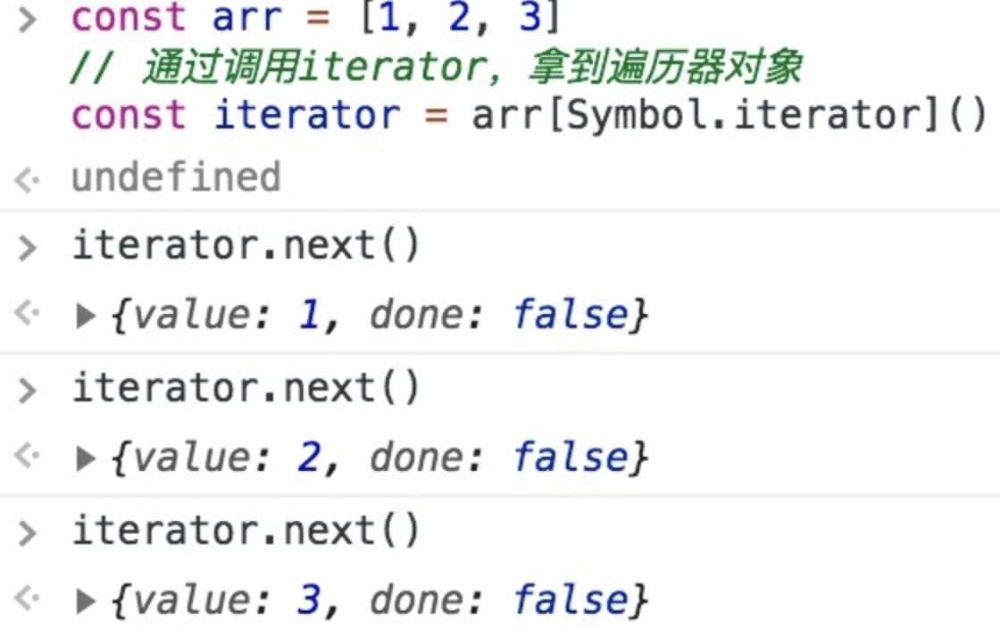

> 而`for...of...` 做的事情，基本等价于下面这通操作：

```js
// 通过调用iterator，拿到迭代器对象
const iterator = arr[Symbol.iterator]()

// 初始化一个迭代结果
let now = { done: false }

// 循环往外迭代成员
while(!now.done) {
    now = iterator.next()
    if(!now.done) {
        console.log(`现在遍历到了${now.value}`)
    }
}
```

> 可以看出，`for...of...` 其实就是`iterator`
> 循环调用换了种写法。在ES6中我们之所以能够开心地用`for...of...`
> 遍历各种各种的集合，全靠迭代器模式在背后给力。

ps：此处推荐阅读 [迭代协议](https://developer.mozilla.org/zh-CN/docs/Web/JavaScript/Reference/Iteration_protocols)，相信大家读过后会对迭代器在ES6中的实现有更深的理解。

### 2 实现迭代器生成函数

我们说**迭代器对象** 全凭**迭代器生成函数** 帮我们生成。在`ES6`
中，实现一个迭代器生成函数并不是什么难事儿，因为ES6早帮我们考虑好了全套的解决方案，内置了贴心的**生成器**
（`Generator` ）供我们使用：

```js
// 编写一个迭代器生成函数
function *iteratorGenerator() {
    yield '1号选手'
    yield '2号选手'
    yield '3号选手'
}

const iterator = iteratorGenerator()

iterator.next()
iterator.next()
iterator.next()
```
丢进控制台，不负众望：

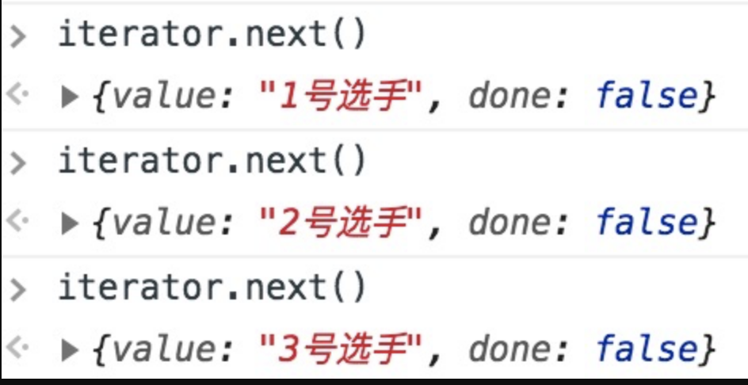

写一个生成器函数并没有什么难度，但在面试的过程中，面试官往往对生成器这种语法糖背后的实现逻辑更感兴趣。下面我们要做的，不仅仅是写一个迭代器对象，而是用`ES5`
去写一个能够生成迭代器对象的迭代器生成函数（解析在注释里）：

```js
// 定义生成器函数，入参是任意集合
function iteratorGenerator(list) {
    // idx记录当前访问的索引
    var idx = 0
    // len记录传入集合的长度
    var len = list.length
    return {
        // 自定义next方法
        next: function() {
            // 如果索引还没有超出集合长度，done为false
            var done = idx >= len
            // 如果done为false，则可以继续取值
            var value = !done ? list[idx++] : undefined

            // 将当前值与遍历是否完毕（done）返回
            return {
                done: done,
                value: value
            }
        }
    }
}

var iterator = iteratorGenerator(['1号选手', '2号选手', '3号选手'])
iterator.next()
iterator.next()
iterator.next()
```
此处为了记录每次遍历的位置，我们实现了一个闭包，借助自由变量来做我们的迭代过程中的"游标"。

运行一下我们自定义的迭代器，结果符合预期：

## 20 实现ES6的extends

```js
function B(name){
  this.name = name;
};
function A(name,age){
  //1.将A的原型指向B
  Object.setPrototypeOf(A,B);
  //2.用A的实例作为this调用B,得到继承B之后的实例，这一步相当于调用super
  Object.getPrototypeOf(A).call(this, name)
  //3.将A原有的属性添加到新实例上
  this.age = age;
  //4.返回新实例对象
  return this;
};
var a = new A('poetry',22);
console.log(a);
```

## 21 实现Object.create

> `Object.create()`
> 方法创建一个新对象，使用现有的对象来提供新创建的对象的 `__proto__`

```js
// 模拟 Object.create

function create(proto) {
  function F() {}
  F.prototype = proto;

  return new F();
}
```

## 22 实现Object.freeze

> `Object.freeze`
> 冻结一个对象，让其不能再添加/删除属性，也不能修改该对象已有属性的可枚举性、可配置可写性，也不能修改已有属性的值和它的原型属性，最后返回一个和传入参数相同的对象

```js
function myFreeze(obj){
  // 判断参数是否为Object类型，如果是就封闭对象，循环遍历对象。去掉原型属性，将其writable特性设置为false
  if(obj instanceof Object){
    Object.seal(obj);  // 封闭对象
    for(let key in obj){
      if(obj.hasOwnProperty(key)){
        Object.defineProperty(obj,key,{
          writable:false   // 设置只读
        })
        // 如果属性值依然为对象，要通过递归来进行进一步的冻结
        myFreeze(obj[key]);
      }
    }
  }
}
```

## 23 实现Object.is

`Object.is` 不会转换被比较的两个值的类型，这点和`===`
更为相似，他们之间也存在一些区别

-   `NaN` 在`===` 中是不相等的，而在`Object.is` 中是相等的
-   `+0` 和`-` 0在`===` 中是相等的，而在`Object.is` 中是不相等的

```js
Object.is = function (x, y) {
  if (x === y) {
    // 当前情况下，只有一种情况是特殊的，即 +0 -0
    // 如果 x !== 0，则返回true
    // 如果 x === 0，则需要判断+0和-0，则可以直接使用 1/+0 === Infinity 和 1/-0 === -Infinity来进行判断
    return x !== 0 || 1 / x === 1 / y;
  }

  // x !== y 的情况下，只需要判断是否为NaN，如果x!==x，则说明x是NaN，同理y也一样
  // x和y同时为NaN时，返回true
  return x !== x && y !== y;
};
```

## 24 实现一个compose函数

> 组合多个函数，从右到左，比如：`compose(f, g, h)` 最终得到这个结果
> `(...args) =>f(g(h(...args))).`

题目描述:实现一个 `compose` 函数

```js
// 用法如下:
function fn1(x) {
  return x + 1;
}
function fn2(x) {
  return x + 2;
}
function fn3(x) {
  return x + 3;
}
function fn4(x) {
  return x + 4;
}
const a = compose(fn1, fn2, fn3, fn4);
console.log(a(1)); // 1+4+3+2+1=11
```

**实现代码如下**

```js
function compose(...funcs) {
  if (!funcs.length) return (v) => v;

  if (funcs.length === 1) {
    return funcs[0]
  }

  return funcs.reduce((a, b) => {
    return (...args) => a(b(...args)))
  }
}
```

> `compose`
> 创建了一个从右向左执行的数据流。如果要实现从左到右的数据流，可以直接更改`compose`
> 的部分代码即可实现

-   更换`Api` 接口：把`reduce` 改为`reduceRight`
-   交互包裹位置：把`a(b(...args))` 改为`b(a(...args))`

## 25 setTimeout与setInterval实现

### 1 setTimeout 模拟实现 setInterval

题目描述: `setInterval` 用来实现循环定时调用 可能会存在一定的问题 能用
`setTimeout` 解决吗

实现代码如下:

```js
function mySetInterval(fn, t) {
  let timerId = null;
  function interval() {
    fn();
    timerId = setTimeout(interval, t); // 递归调用
  }
  timerId = setTimeout(interval, t); // 首次调用
  return {
    // 利用闭包的特性 保存timerId
    cancel:() => {
      clearTimeout(timerId)
    }
  }
}
```
```js
// 测试
var a = mySetInterval(()=>{
  console.log(111);
},1000)
var b = mySetInterval(() => {
  console.log(222)
}, 1000)

// 终止定时器
a.cancel()
b.cancel()
```

> 为什么要用 `setTimeout` 模拟实现 `setInterval` ？`setInterval`
> 的缺陷是什么？

```js
setInterval(fn(), N);
```

> 上面这句代码的意思其实是`fn()` 将会在 `N` 秒之后被推入任务队列。在
> `setInterval`
> 被推入任务队列时，如果在它前面有很多任务或者某个任务等待时间较长比如网络请求等，那么这个定时器的执行时间和我们预定它执行的时间可能并不一致

```js
// 最常见的出现的就是，当我们需要使用 ajax 轮询服务器是否有新数据时，必定会有一些人会使用 setInterval，然而无论网络状况如何，它都会去一遍又一遍的发送请求，最后的间隔时间可能和原定的时间有很大的出入

// 做一个网络轮询，每一秒查询一次数据。
let startTime = new Date().getTime();
let count = 0;

setInterval(() => {
    let i = 0;
    while (i++ < 10000000); // 假设的网络延迟
    count++;
    console.log(
        "与原设定的间隔时差了：",
        new Date().getTime() - (startTime + count * 1000),
        "毫秒"
    );
}, 1000)

// 输出：
// 与原设定的间隔时差了： 567 毫秒
// 与原设定的间隔时差了： 552 毫秒
// 与原设定的间隔时差了： 563 毫秒
// 与原设定的间隔时差了： 554 毫秒(2次)
// 与原设定的间隔时差了： 564 毫秒
// 与原设定的间隔时差了： 602 毫秒
// 与原设定的间隔时差了： 573 毫秒
// 与原设定的间隔时差了： 633 毫秒
```

> **再次强调**
> ，定时器指定的时间间隔，表示的是何时将定时器的代码添加到消息队列，而不是何时执行代码。所以真正何时执行代码的时间是不能保证的，取决于何时被主线程的事件循环取到，并执行。

```js
setInterval(function, N)
//即：每隔N秒把function事件推到消息队列中
```

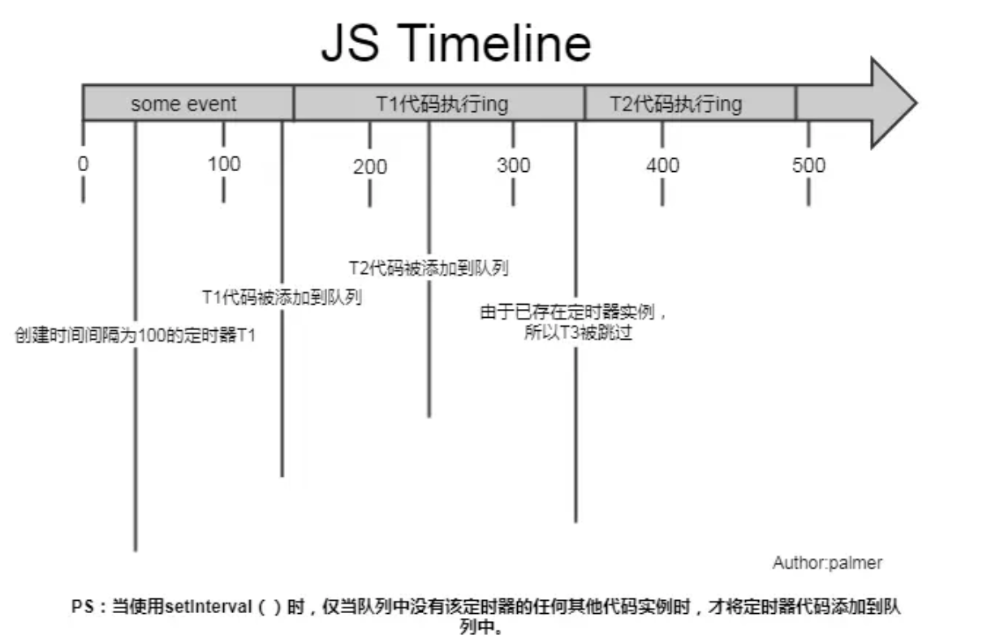

> 上图可见，`setInterval` 每隔 `100ms` 往队列中添加一个事件；`100ms`
> 后，添加 `T1`
> 定时器代码至队列中，主线程中还有任务在执行，所以等待，`some event`
> 执行结束后执行 `T1` 定时器代码；又过了 `100ms` ，`T2`
> 定时器被添加到队列中，主线程还在执行 `T1` 代码，所以等待；又过了
> `100ms` ，理论上又要往队列里推一个定时器代码，但由于此时 `T2`
> 还在队列中，所以 `T3` 不会被添加（`T3`
> 被跳过），结果就是此时被跳过；这里我们可以看到，`T1`
> 定时器执行结束后马上执行了 T2 代码，所以并没有达到定时器的效果

**setInterval有两个缺点**

-   使用`setInterval` 时，某些间隔会被跳过
-   可能多个定时器会连续执行

> **可以这么理解** ：每个`setTimeout` 产生的任务会直接`push`
> 到任务队列中；而`setInterval` 在每次把任务`push`
> 到任务队列前，都要进行一下判断(看上次的任务是否仍在队列中)。因而我们一般用`setTimeout`
> 模拟`setInterval` ，来规避掉上面的缺点

### 2 setInterval 模拟实现 setTimeout

```js
const mySetTimeout = (fn, t) => {
  const timer = setInterval(() => {
    clearInterval(timer);
    fn();
  }, t);
};
```
```js
// 测试
// mySetTimeout(()=>{
//   console.log(1);
// },1000)
```

## 26 实现Node的require方法

**require 基本原理**

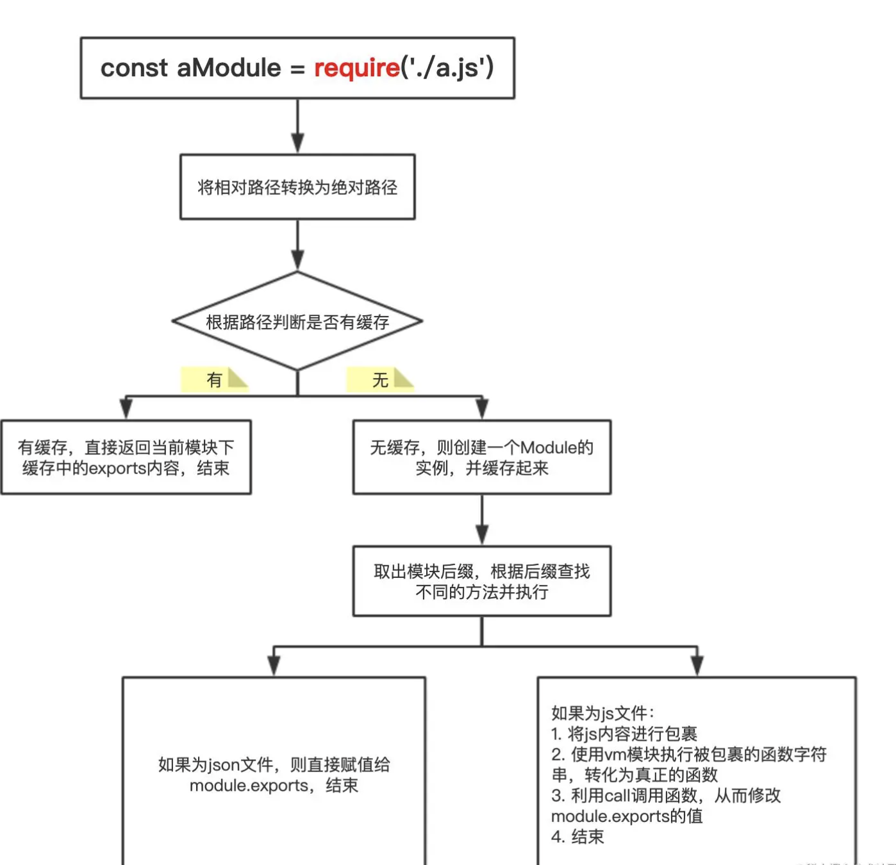

**require 查找路径**

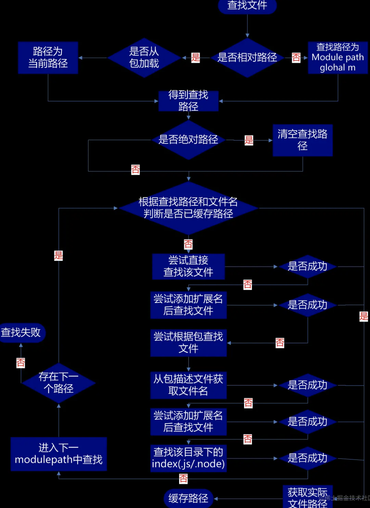

> `require` 和 `module.exports`
> 干的事情并不复杂，我们先假设有一个全局对象`{}`
> ，初始情况下是空的，当你 `require`
> 某个文件时，就将这个文件拿出来执行，如果这个文件里面存在`module.exports`
> ，当运行到这行代码时将 `module.exports`
> 的值加入这个对象，键为对应的文件名，最终这个对象就长这样：

```json
{
  "a.js": "hello world",
  "b.js": function add(){},
  "c.js": 2,
  "d.js": { num: 2 }
}
```

> 当你再次 `require`
> 某个文件时，如果这个对象里面有对应的值，就直接返回给你，如果没有就重复前面的步骤，执行目标文件，然后将它的
> `module.exports`
> 加入这个全局对象，并返回给调用者。这个全局对象其实就是我们经常听说的缓存。所以
> `require` 和 `module.exports`
> 并没有什么黑魔法，就只是运行并获取目标文件的值，然后加入缓存，用的时候拿出来用就行

**手写实现一个require**

```js
const path = require('path'); // 路径操作
const fs = require('fs'); // 文件读取
const vm = require('vm'); // 文件执行

// node模块化的实现
// node中是自带模块化机制的，每个文件就是一个单独的模块，并且它遵循的是CommonJS规范，也就是使用require的方式导入模块，通过module.export的方式导出模块。
// node模块的运行机制也很简单，其实就是在每一个模块外层包裹了一层函数，有了函数的包裹就可以实现代码间的作用域隔离

// require加载模块
// require依赖node中的fs模块来加载模块文件，fs.readFile读取到的是一个字符串。
// 在javascrpt中我们可以通过eval或者new Function的方式来将一个字符串转换成js代码来运行。

// eval
// const name = 'poetry';
// const str = 'const a = 123; console.log(name)';
// eval(str); // poetry;

// new Function
// new Function接收的是一个要执行的字符串，返回的是一个新的函数，调用这个新的函数字符串就会执行了。如果这个函数需要传递参数，可以在new Function的时候依次传入参数，最后传入的是要执行的字符串。比如这里传入参数b，要执行的字符串str
// const b = 3;
// const str = 'let a = 1; return a + b';
// const fun = new Function('b', str);
// console.log(fun(b, str)); // 4
// 可以看到eval和Function实例化都可以用来执行javascript字符串，似乎他们都可以来实现require模块加载。不过在node中并没有选用他们来实现模块化，原因也很简单因为他们都有一个致命的问题，就是都容易被不属于他们的变量所影响。
// 如下str字符串中并没有定义a，但是确可以使用上面定义的a变量，这显然是不对的，在模块化机制中，str字符串应该具有自身独立的运行空间，自身不存在的变量是不可以直接使用的
// const a = 1;
// const str = 'console.log(a)';
// eval(str);
// const func = new Function(str);
// func();

// node存在一个vm虚拟环境的概念，用来运行额外的js文件，他可以保证javascript执行的独立性，不会被外部所影响
// vm 内置模块
// 虽然我们在外部定义了hello，但是str是一个独立的模块，并不在村hello变量，所以会直接报错。
// 引入vm模块， 不需要安装，node 自建模块
// const vm = require('vm');
// const hello = 'poetry';
// const str = 'console.log(hello)';
// wm.runInThisContext(str); // 报错
// 所以node执行javascript模块时可以采用vm来实现。就可以保证模块的独立性了

// 分析实现步骤
// 1.导入相关模块，创建一个Require方法。
// 2.抽离通过Module._load方法，用于加载模块。
// 3.Module.resolveFilename 根据相对路径，转换成绝对路径。
// 4.缓存模块 Module._cache，同一个模块不要重复加载，提升性能。
// 5.创建模块 id: 保存的内容是 exports = {}相当于this。
// 6.利用tryModuleLoad(module, filename) 尝试加载模块。
// 7.Module._extensions使用读取文件。
// 8.Module.wrap: 把读取到的js包裹一个函数。
// 9.将拿到的字符串使用runInThisContext运行字符串。
// 10.让字符串执行并将this改编成exports

// 定义导入类，参数为模块路径
function Require(modulePath) {
    // 获取当前要加载的绝对路径
    let absPathname = path.resolve(__dirname, modulePath);

    // 自动给模块添加后缀名，实现省略后缀名加载模块，其实也就是如果文件没有后缀名的时候遍历一下所有的后缀名看一下文件是否存在
    // 获取所有后缀名
    const extNames = Object.keys(Module._extensions);
    let index = 0;
    // 存储原始文件路径
    const oldPath = absPathname;
    function findExt(absPathname) {
        if (index === extNames.length) {
            throw new Error('文件不存在');
        }
        try {
            fs.accessSync(absPathname);
            return absPathname;
        } catch(e) {
            const ext = extNames[index++];
            findExt(oldPath + ext);
        }
    }
    // 递归追加后缀名，判断文件是否存在
    absPathname = findExt(absPathname);

    // 从缓存中读取，如果存在，直接返回结果
    if (Module._cache[absPathname]) {
        return Module._cache[absPathname].exports;
    }

    // 创建模块，新建Module实例
    const module = new Module(absPathname);

    // 添加缓存
    Module._cache[absPathname] = module;

    // 加载当前模块
    tryModuleLoad(module);

    // 返回exports对象
    return module.exports;
}

// Module的实现很简单，就是给模块创建一个exports对象，tryModuleLoad执行的时候将内容加入到exports中，id就是模块的绝对路径
// 定义模块, 添加文件id标识和exports属性
function Module(id) {
    this.id = id;
    // 读取到的文件内容会放在exports中
    this.exports = {};
}

Module._cache = {};

// 我们给Module挂载静态属性wrapper，里面定义一下这个函数的字符串，wrapper是一个数组，数组的第一个元素就是函数的参数部分，其中有exports，module. Require，__dirname, __filename, 都是我们模块中常用的全局变量。注意这里传入的Require参数是我们自己定义的Require
// 第二个参数就是函数的结束部分。两部分都是字符串，使用的时候我们将他们包裹在模块的字符串外部就可以了
Module.wrapper = [
    "(function(exports, module, Require, __dirname, __filename) {",
    "})"
]

// _extensions用于针对不同的模块扩展名使用不同的加载方式，比如JSON和javascript加载方式肯定是不同的。JSON使用JSON.parse来运行。
// javascript使用vm.runInThisContext来运行，可以看到fs.readFileSync传入的是module.id也就是我们Module定义时候id存储的是模块的绝对路径，读取到的content是一个字符串，我们使用Module.wrapper来包裹一下就相当于在这个模块外部又包裹了一个函数，也就实现了私有作用域。
// 使用call来执行fn函数，第一个参数改变运行的this我们传入module.exports，后面的参数就是函数外面包裹参数exports, module, Require, __dirname, __filename
Module._extensions = {
    '.js'(module) {
        const content = fs.readFileSync(module.id, 'utf8');
        const fnStr = Module.wrapper[0] + content + Module.wrapper[1];
        const fn = vm.runInThisContext(fnStr);
        fn.call(module.exports, module.exports, module, Require,__filename,__dirname);
    },
    '.json'(module) {
        const json = fs.readFileSync(module.id, 'utf8');
        module.exports = JSON.parse(json); // 把文件的结果放在exports属性上
    }
}

// tryModuleLoad函数接收的是模块对象，通过path.extname来获取模块的后缀名，然后使用Module._extensions来加载模块
// 定义模块加载方法
function tryModuleLoad(module) {
    // 获取扩展名
    const extension = path.extname(module.id);
    // 通过后缀加载当前模块
    Module._extensions[extension](module);
}

// 至此Require加载机制我们基本就写完了，我们来重新看一下。Require加载模块的时候传入模块名称，在Require方法中使用path.resolve(__dirname, modulePath)获取到文件的绝对路径。然后通过new Module实例化的方式创建module对象，将模块的绝对路径存储在module的id属性中，在module中创建exports属性为一个json对象
// 使用tryModuleLoad方法去加载模块，tryModuleLoad中使用path.extname获取到文件的扩展名，然后根据扩展名来执行对应的模块加载机制
// 最终将加载到的模块挂载module.exports中。tryModuleLoad执行完毕之后module.exports已经存在了，直接返回就可以了


// 给模块添加缓存
// 添加缓存也比较简单，就是文件加载的时候将文件放入缓存中，再去加载模块时先看缓存中是否存在，如果存在直接使用，如果不存在再去重新，加载之后再放入缓存

// 测试
let json = Require('./test.json');
let test2 = Require('./test2.js');
console.log(json);
console.log(test2);
```

## 27 实现LRU淘汰算法

`LRU`
缓存算法是一个非常经典的算法，在很多面试中经常问道，不仅仅包括前端面试

> `LRU` 英文全称是 `Least Recently Used` ，英译过来就是"**最近最少使用**
> "的意思。`LRU`
> 是一种常用的页面置换算法，选择最近最久未使用的页面予以淘汰。该算法赋予每个页面一个访问字段，用来记录一个页面自上次被访问以来所经历的时间
> `t` ，当须淘汰一个页面时，选择现有页面中其 `t`
> 值最大的，即最近最少使用的页面予以淘汰

通俗的解释：

> 假如我们有一块内存，专门用来缓存我们最近发访问的网页，访问一个新网页，我们就会往内存中添加一个网页地址，随着网页的不断增加，内存存满了，这个时候我们就需要考虑删除一些网页了。这个时候我们找到内存中最早访问的那个网页地址，然后把它删掉。这一整个过程就可以称之为
> `LRU` 算法

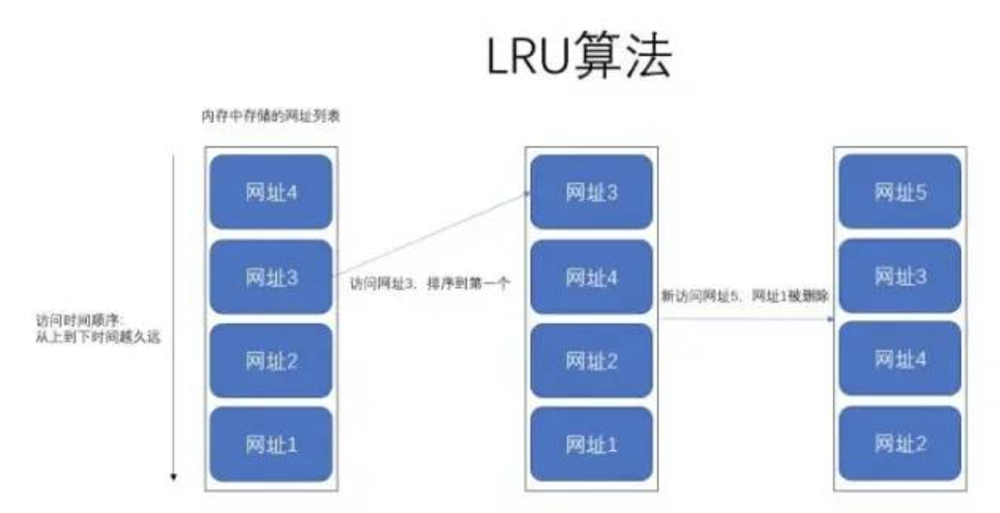

上图就很好的解释了 `LRU`
算法在干嘛了，其实非常简单，无非就是我们往内存里面添加或者删除元素的时候，遵循**最近最少使用原则**

**使用场景**

`LRU` 算法使用的场景非常多，这里简单举几个例子即可：

-   我们操作系统底层的内存管理，其中就包括有 `LRU` 算法
-   我们常见的缓存服务，比如 `redis` 等等
-   比如浏览器的最近浏览记录存储
-   `vue` 中的`keep-alive` 组件使用了`LRU` 算法

**梳理实现 LRU 思路**

-   特点分析：
    -   我们需要一块有限的存储空间，因为无限的化就没必要使用`LRU`
        算发删除数据了。
    -   我们这块存储空间里面存储的数据需要是有序的，因为我们必须要顺序来删除数据，所以可以考虑使用
        `Array` 、`Map` 数据结构来存储，不能使用 `Object`
        ，因为它是无序的。
    -   我们能够删除或者添加以及获取到这块存储空间中的指定数据。
    -   存储空间存满之后，在添加数据时，会自动删除时间最久远的那条数据。
-   实现需求：
    -   实现一个 `LRUCache` 类型，用来充当存储空间
    -   采用 `Map` 数据结构存储数据，因为它的存取时间复杂度为 `O(1)`
        ，数组为 `O(n)`
    -   实现 `get` 和 `set` 方法，用来获取和添加数据
    -   我们的存储空间有长度限制，所以无需提供删除方法，存储满之后，自动删除最久远的那条数据
    -   当使用 `get` 获取数据后，该条数据需要更新到最前面

**具体实现**

```js
class LRUCache {
  constructor(length) {
    this.length = length; // 存储长度
    this.data = new Map(); // 存储数据
  }
  // 存储数据，通过键值对的方式
  set(key, value) {
    const data = this.data;

    // 有的话 删除 重建放到map最前面
    if (data.has(key)) {
      data.delete(key)
    }

    data.set(key, value);

    // 如果超出了容量，则需要删除最久的数据
    if (data.size > this.length) {
      // 删除map最老的数据
      const delKey = data.keys().next().value;
      data.delete(delKey);
    }
  }
  // 获取数据
  get(key) {
    const data = this.data;
    // 未找到
    if (!data.has(key)) {
      return null;
    }
    const value = data.get(key); // 获取元素
    data.delete(key); // 删除元素
    data.set(key, value); // 重新插入元素到map最前面

    return value // 返回获取的值
  }
}
var lruCache = new LRUCache(5);
```

-   `set 方法` ：往 `map`
    里面添加新数据，如果添加的数据存在了，则先删除该条数据，然后再添加。如果添加数据后超长了，则需要删除最久远的一条数据。`data.keys().next().value`
    便是获取最后一条数据的意思。
-   `get 方法` ：首先从 `map`
    对象中拿出该条数据，然后删除该条数据，最后再重新插入该条数据，确保将该条数据移动到最前面

```js
// 测试

// 存储数据 set：

lruCache.set('name', 'test');
lruCache.set('age', 10);
lruCache.set('sex', '男');
lruCache.set('height', 180);
lruCache.set('weight', '120');
console.log(lruCache);
```

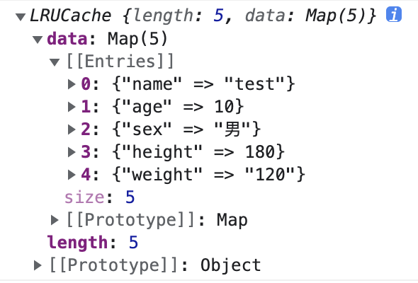

继续插入数据，此时会超长，代码如下：

```js
lruCache.set('grade', '100');
console.log(lruCache);
```

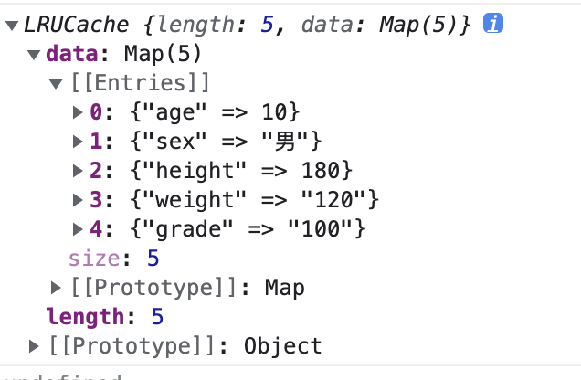

此时我们发现存储时间最久的 name
已经被移除了，新插入的数据变为了最前面的一个。

我们使用 `get` 获取数据，代码如下：

我们发现此时 `sex` 字段已经跑到最前面去了

**总结**

> `LRU`
> 算法其实逻辑非常的简单，明白了原理之后实现起来非常的简单。最主要的是我们需要使用什么数据结构来存储数据，因为
> `map`
> 的存取非常快，所以我们采用了它，当然数组其实也可以实现的。还有一些小伙伴使用链表来实现
> `LRU` ，这当然也是可以的。

</div>