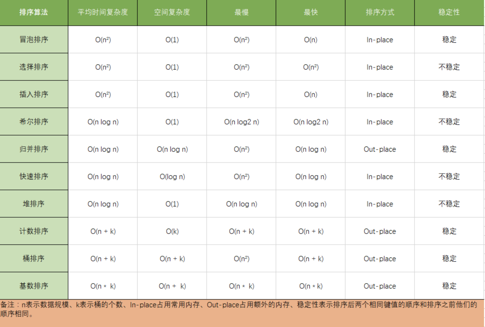
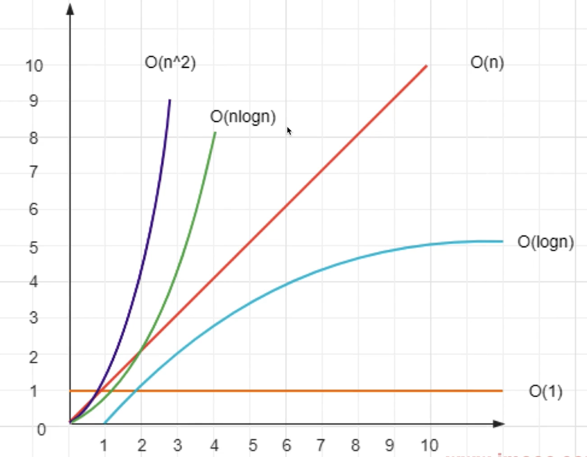

# 34 手写常见排序

<div class='interview-page-container'>



### 1 冒泡排序

> 冒泡排序的原理如下，从第一个元素开始，把当前元素和下一个索引元素进行比较。如果当前元素大，那么就交换位置，重复操作直到比较到最后一个元素，那么此时最后一个元素就是该数组中最大的数。下一轮重复以上操作，但是此时最后一个元素已经是最大数了，所以不需要再比较最后一个元素，只需要比较到
> `length - 1` 的位置。


```js
function bubbleSort(list) {
  var n = list.length;
  if (!n) return [];

  for (var i = 0; i < n; i++) {
    // 注意这里需要 n - i - 1
    for (var j = 0; j < n - i - 1; j++) {
      if (list[j] > list[j + 1]) {
        var temp = list[j + 1];
        list[j + 1] = list[j];
        list[j] = temp;
      }
    }
  }
  return list;
}

```

### 2 快速排序

**思路分析**

-   找到中间位置`midValue`
-   遍历数组，小于`midValue` 放在`left` ，否则放在`right`
-   继续递归，最后`concat` 拼接返回
-   使用`splice` 会修改原数组，使用`slice` 不会修改原数组（推荐）
-   一层遍历+二分的时间复杂度是`O(nlogn)`



**快速排序（使用 splice）**

```js
/**
 * 快速排序（使用 splice）
 * @param arr:number[] number arr
 */
function quickSort1(arr) {
  const length = arr.length
  if (length === 0) return arr

  // 获取中间的数
  const midIndex = Math.floor(length / 2)
  const midValue = arr.splice(midIndex, 1)[0] // splice会修改原数组，传入开始位置和长度是1

  const left = []
  const right = []

  // 注意：这里不用直接用 length ，而是用 arr.length 。因为 arr 已经被 splice 给修改了
  for (let i = 0; i < arr.length; i++) {
    const n = arr[i]
    if (n < midValue) {
      // 小于 midValue ，则放在 left
      left.push(n)
    } else {
      // 大于 midValue ，则放在 right
      right.push(n)
    }
  }

  return quickSort1(left).concat([midValue], quickSort1(right))
}

```

**快速排序（使用 slice）**

```js
/**
 * 快速排序（使用 slice）
 * @param arr number arr
 */
function quickSort2(arr) {
  const length = arr.length
  if (length === 0) return arr

  // 获取中间的数
  const midIndex = Math.floor(length / 2)
  const midValue = arr.slice(midIndex, midIndex + 1)[0] // 使用slice不会修改原数组，传入开始位置和结束位置

  const left = []
  const right = []

  for (let i = 0; i < length; i++) {
    if (i !== midIndex) { // 这里要忽略掉midValue
      const n = arr[i]
      if (n < midValue) {
        // 小于 midValue ，则放在 left
        left.push(n)
      } else {
        // 大于 midValue ，则放在 right
        right.push(n)
      }
    }
  }

  return quickSort2(left).concat([midValue], quickSort2(right))
}

```


```js
// 功能测试
const arr1 = [1, 6, 2, 7, 3, 8, 4, 9, 5]
console.info(quickSort2(arr1))

```


```js
// 性能测试

// 快速排序（使用 splice）
const arr1 = []
for (let i = 0; i < 10 * 10000; i++) {
  arr1.push(Math.floor(Math.random() * 1000))
}
console.time('quickSort1')
quickSort1(arr1)
console.timeEnd('quickSort1') // 74ms

// 快速排序（使用 slice）
const arr2 = []
for (let i = 0; i < 10 * 10000; i++) {
  arr2.push(Math.floor(Math.random() * 1000))
}
console.time('quickSort2')
quickSort2(arr2)
console.timeEnd('quickSort2') // 82ms

```

```js
// 单独比较 splice 和 slice

const arr1 = []
for (let i = 0; i < 10 * 10000; i++) {
  arr1.push(Math.floor(Math.random() * 1000))
}
console.time('splice')
arr1.splice(5 * 10000, 1)
console.timeEnd('splice') // 0.08ms

const arr2 = []
for (let i = 0; i < 10 * 10000; i++) {
  arr2.push(Math.floor(Math.random() * 1000))
}
console.time('slice')
arr2.slice(5 * 10000, 5 * 10000 + 1)
console.timeEnd('slice') // 0.008ms

```

### 3 选择排序

```js
function selectSort(arr) {
  // 缓存数组长度
  const len = arr.length;
  // 定义 minIndex，缓存当前区间最小值的索引，注意是索引
  let minIndex;
  // i 是当前排序区间的起点
  for (let i = 0; i < len - 1; i++) {
    // 初始化 minIndex 为当前区间第一个元素
    minIndex = i;
    // i、j分别定义当前区间的上下界，i是左边界，j是右边界
    for (let j = i; j < len; j++) {
      // 若 j 处的数据项比当前最小值还要小，则更新最小值索引为 j
      if (arr[j] < arr[minIndex]) {
        minIndex = j;
      }
    }
    // 如果 minIndex 对应元素不是目前的头部元素，则交换两者
    if (minIndex !== i) {
      [arr[i], arr[minIndex]] = [arr[minIndex], arr[i]];
    }
  }
  return arr;
}
// console.log(selectSort([3, 6, 2, 4, 1]));


```


### 4 插入排序


```js
function insertSort(arr) {
  for (let i = 1; i < arr.length; i++) {
    let j = i;
    let target = arr[j];
    while (j > 0 && arr[j - 1] > target) {
      arr[j] = arr[j - 1];
      j--;
    }
    arr[j] = target;
  }
  return arr;
}
// console.log(insertSort([3, 6, 2, 4, 1]));


```


### 5 二分查找

```js
function search(arr, target, start, end) {
  let targetIndex = -1;

  let mid = Math.floor((start + end) / 2);

  if (arr[mid] === target) {
    targetIndex = mid;
    return targetIndex;
  }

  if (start >= end) {
    return targetIndex;
  }

  if (arr[mid] < target) {
    return search(arr, target, mid + 1, end);
  } else {
    return search(arr, target, start, mid - 1);
  }
}

// const dataArr = [1, 2, 3, 4, 5, 6, 7, 8, 9];
// const position = search(dataArr, 6, 0, dataArr.length - 1);
// if (position !== -1) {
//   console.log(`目标元素在数组中的位置:${position}`);
// } else {
//   console.log("目标元素不在数组中");
// }

```

</div>