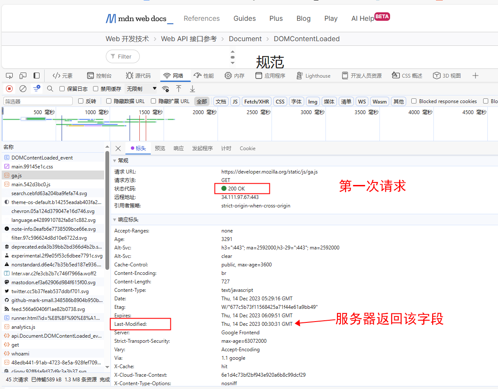
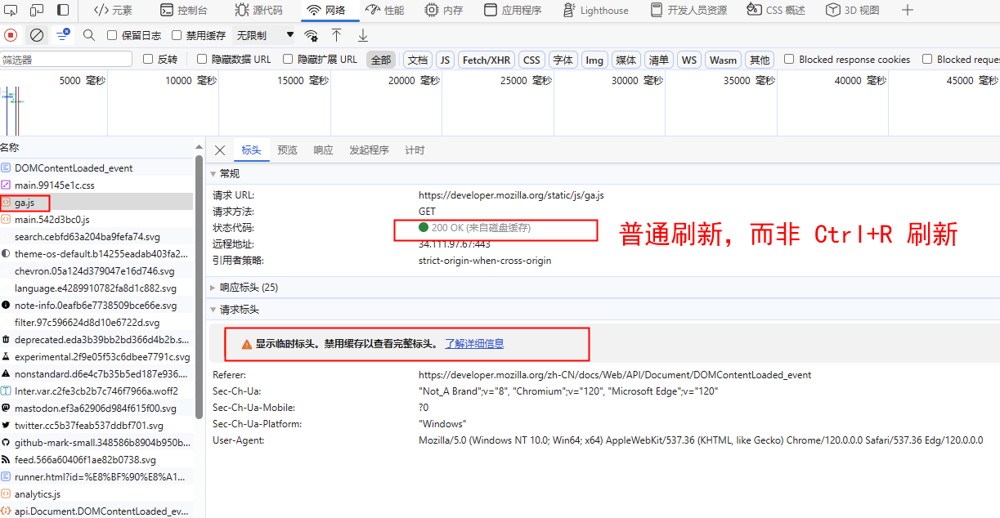
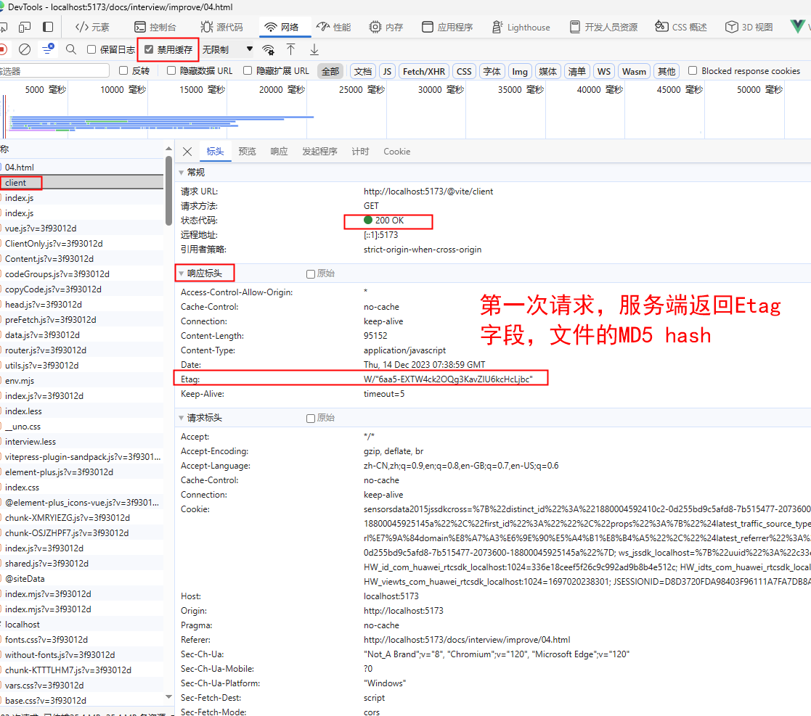
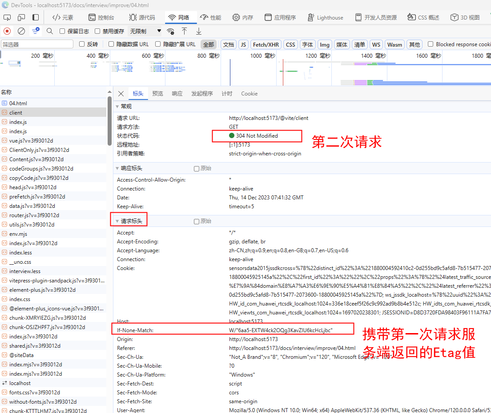
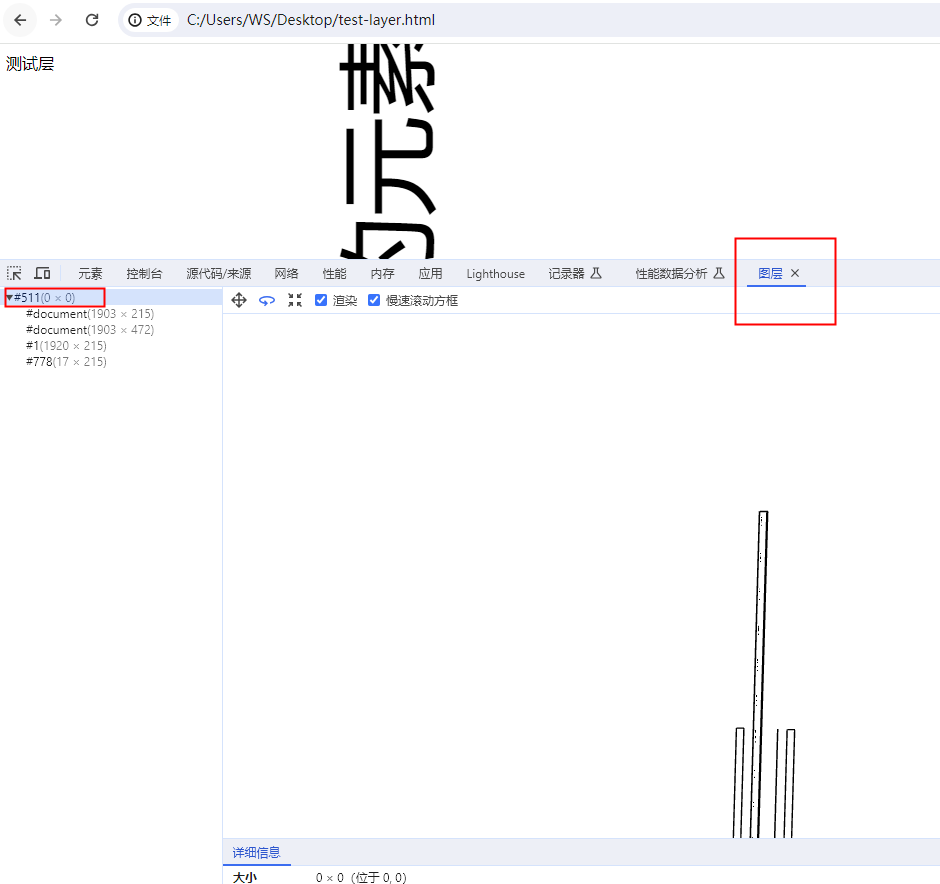

# 四、浏览器


## 1 浏览器架构

**单进程浏览器时代**

> 单进程浏览器是指浏览器的所有功能模块都是运行在同一个进程里，这些模块包含了网络、插件、JavaScript运行环境、渲染引擎和页面等。其实早在2007年之前，市面上浏览器都是单进程的


-   缺点
    -   不稳定：一个插件的意外崩溃会引起整个浏览器的崩溃
    -   不流畅：所有页面的渲染模块、JavaScript执行环境以及插件都是运行在同一个线程中的，这就意味着同一时刻只能有一个模块可以执行
    -   不安全：可以通过浏览器的漏洞来获取系统权限，这些脚本获取系统权限之后也可以对你的电脑做一些恶意的事情，同样也会引发安全问题
-   以上这些就是当时浏览器的特点，`不稳定，不流畅，而且不安全`

**多进程浏览器时代**

-   由于`进程是相互隔离的`，所以当一个页面或者插件崩溃时，影响到的仅仅是当前的页面进程或者插件进程，并不会影响到浏览器和其他页面，这就完美地解决了页面或者插件的崩溃会导致整个浏览器崩溃，也就是不稳定的问题
-   JavaScript也是运行在渲染进程中的，所以即使JavaScript阻塞了渲染进程，影响到的也只是当前的渲染页面，而并不会影响浏览器和其他页面，因为其他页面的脚本是运行在它们自己的渲染进程中的
-   Chrome把插件进程和渲染进程锁在沙箱里面，这样即使在渲染进程或者插件进程里面执行了恶意程序，恶意程序也无法突破沙箱去获取系统权限。


> 最新的Chrome浏览器包括：`1个浏览器（Browser）主进程`、`1个 GPU 进程`、`1个网络（NetWork）进程`、`多个渲染进程`和`多个插件进程`

-   **浏览器进程**。主要负责界面显示、用户交互、子进程管理，同时提供存储等功能。
-   **渲染进程**。核心任务是将 `HTML、CSS` 和 JavaScript
    转换为用户可以与之交互的网页，排版引擎Blink和JavaScript引擎V8都是运行在该进程中，默认情况下，Chrome会为每个Tab标签创建一个渲染进程。出于安全考虑，渲染进程都是运行在沙箱模式下。
-   **GPU进程**。其实，Chrome刚开始发布的时候是没有GPU进程的。而GPU的使用初衷是为了实现3D
    CSS的效果，只是随后网页、Chrome的UI界面都选择采用GPU来绘制，这使得GPU成为浏览器普遍的需求。最后，Chrome在其多进程架构上也引入了GPU进程。
-   **网络进程**。主要负责页面的网络资源加载，之前是作为一个模块运行在浏览器进程里面的，直至最近才独立出来，成为一个单独的进程。
-   **插件进程**。主要是负责插件的运行，因插件易崩溃，所以需要通过插件进程来隔离，以保证插件进程崩溃不会对浏览器和页面造成影响

## 2 JavaScript单线程模型

> JavaScript语言的一大特点就是单线程，也就是说，同一时间只能做一件事，前面的任务没做完，后面的任务只能等着。

**1. 为什么JavaScript是单线程的呢?**

-   这主要与JavaScript用途有关。它的主要用途是与用户互动，以及操作DOM。如果JavaScript是多线程的，会带来很多复杂的问题，假如
    JavaScript有A和B两个线程，A线程在DOM节点上添加了内容，B线程删除了这个节点，应该是哪个为准呢?
    所以，为了避免复杂性，所以设计成了单线程。
-   虽然 HTML5 提出了Web Worker标准。Web Worker 的作用，就是为
    JavaScript 创造多线程环境，允许主线程创建 Worker
    线程，将一些任务分配给后者运行。但是子线程完全受主线程控制，且不得操作DOM。所以这个并没有改变JavaScript单线程的本质。一般使用
    Web Worker
    的场景是代码中有很多计算密集型或高延迟的任务，可以考虑分配给 Worker
    线程。
-   但是使用的时候一定要注意，worker
    线程是为了让你的程序跑的更快，但是如果 worker
    线程和主线程之间通信的时间大于了你不使用worker线程的时间，结果就得不偿失了。

**2. 浏览器内核中线程之间的关系**

-   GUI渲染线程和JS引擎线程互斥
    -   js是可以操作DOM的，如果在修改这些元素的同时渲染页面（js线程和ui线程同时运行），那么渲染线程前后获得的元素数据可能就不一致了。
-   JS阻塞页面加载
    -   js如果执行时间过长就会阻塞页面

**3. 浏览器是多进程的优点**

-   默认新开 一个 tab 页面 新建 一个进程,所以单个 tab
    页面崩溃不会影响到整个浏览器。
-   第三方插件崩溃也不会影响到整个浏览器。
-   多进程可以充分利用现代 CPU 多核的优势。
-   方便使用沙盒模型隔离插件等进程,提高浏览器的稳定性。

**4. 进程和线程又是什么呢**

进程（process）和线程（thread）是操作系统的基本概念。

-   进程是 CPU 资源分配的最小单位（是能拥有资源和独立运行的最小单位）。
-   线程是 CPU 调度的最小单位（是建立在进程基础上的一次程序运行单位）。

> 由于每个进程至少要做一件事,所以一个进程至少有一个线程。系统会给每个进程分配独立的内存,因此进程有它独立的资源。同一进程内的各个线程之间共享该进程的内存空间（包括代码段,数据集,堆等）。

进程可以理解为一个工厂不不同车间，相互独立。线程是车间里的工人，可以自己做自己的事情,也可以相互配合做同一件事情。

**5. 任务队列**

-   单线程就意味着，所有任务都要排队执行，前一个任务结束，才会执行后一个任务。
-   如果一个任务需要执行，但此时JavaScript引擎正在执行其他任务，那么这个任务就需要放到一个队列中进行等待。等到线程空闲时，就可以从这个队列中取出最早加入的任务进行执行（类似于我们去银行排队办理业务，单线程相当于说这家银行只有一个服务窗口，一次只能为一个人服务，后面到的就需要排队，而任务队列就是排队区，先到的就优先服务）

**注意：**
如果当前线程空闲，并且队列为空，那每次加入队列的函数将立即执行。

> 为什么会有任务队列？ 由于 JS
> 是单线程的，同步执行任务会造成浏览器的阻塞，所以我们将 JS
> 分成一个又一个的任务，通过不停的循环来执行事件队列中的任务。

## 3 Chrome 打开一个页面需要启动多少进程？分别有哪些进程？

打开 1 个页面至少需要 1 个网络进程、1 个浏览器进程、1 个 GPU 进程以及 1
个渲染进程，共 4 个；

最新的 Chrome 浏览器包括：1个浏览器（Browser）主进程、1 个 GPU 进程、1个网络（NetWork）进程、多个渲染进程和多个插件进程。

-   `浏览器进程`：主要负责界面显示、用户交互、子进程管理，同时提供存储等功能。
-   `渲染进程`：核心任务是将 HTML、CSS 和 JavaScript
    转换为用户可以与之交互的网页，排版引擎 Blink 和 JavaScript 引擎 V8
    都是运行在该进程中，默认情况下，Chrome 会为每个 Tab
    标签创建一个渲染进程。出于安全考虑，渲染进程都是运行在沙箱模式下。
-   `GPU 进程`：其实，Chrome 刚开始发布的时候是没有 GPU 进程的。而 GPU
    的使用初衷是为了实现 3D CSS 的效果，只是随后网页、Chrome 的 UI
    界面都选择采用 GPU 来绘制，这使得 GPU
    成为浏览器普遍的需求。最后，Chrome 在其多进程架构上也引入了 GPU
    进程。
-   `网络进程`：主要负责页面的网络资源加载，之前是作为一个模块运行在浏览器进程里面的，直至最近才独立出来，成为一个单独的进程。
-   `插件进程`：主要是负责插件的运行，因插件易崩溃，所以需要通过插件进程来隔离，以保证插件进程崩溃不会对浏览器和页面造成影响。

## 4 渲染机制

### 1. 浏览器如何渲染网页

**概述：浏览器渲染一共有五步**

1.  处理 `HTML` 并构建 `DOM` 树。
2.  处理 `CSS`构建 `CSSOM` 树。
3.  将 `DOM` 与 `CSSOM` 合并成一个渲染树。
4.  根据渲染树来布局，计算每个节点的位置。
5.  调用 `GPU` 绘制，合成图层，显示在屏幕上

> 第四步和第五步是最耗时的部分，这两步合起来，就是我们通常所说的渲染

具体如下图过程如下图所示


**渲染**

-   网页生成的时候，至少会渲染一次
-   在用户访问的过程中，还会不断重新渲染

> 重新渲染需要重复之前的第四步(重新生成布局)+第五步(重新绘制)或者只有第五个步(重新绘制)

-   在构建 `CSSOM` 树时，会阻塞渲染，直至 `CSSOM`树构建完成。并且构建
    `CSSOM`
    树是一个十分消耗性能的过程，所以应该尽量保证层级扁平，减少过度层叠，越是具体的
    `CSS` 选择器，执行速度越慢
-   当 `HTML` 解析到 `script` 标签时，会暂停构建
    `DOM`，完成后才会从暂停的地方重新开始。也就是说，如果你想首屏渲染的越快，就越不应该在首屏就加载
    `JS` 文件。并且`CSS`也会影响 `JS` 的执行，只有当解析完样式表才会执行
    `JS`，所以也可以认为这种情况下，`CSS` 也会暂停构建 `DOM`

### 2. 浏览器渲染五个阶段

**2.1 第一步：解析HTML标签，构建DOM树**

> 在这个阶段，引擎开始解析`html`，解析出来的结果会成为一棵`dom`树
> `dom`的目的至少有`2`个

-   作为下个阶段渲染树状图的输入
-   成为网页和脚本的交互界面。(最常用的就是`getElementById`等等)

**当解析器到达script标签的时候，发生下面四件事情**

1.  `html`解析器停止解析,
2.  如果是外部脚本，就从外部网络获取脚本代码
3.  将控制权交给`js`引擎，执行`js`代码
4.  恢复`html`解析器的控制权

> 由此可以得到第一个结论1

-   由于`<script>`标签是阻塞解析的，将脚本放在网页尾部会加速代码渲染。
-   `defer`和`async`属性也能有助于加载外部脚本。
-   `defer`使得脚本会在`dom`完整构建之后执行；
-   `async`标签使得脚本只有在完全`available`才执行，并且是以非阻塞的方式进行的

**2.2 第二步：解析CSS标签，构建CSSOM树**

-   我们已经看到`html`解析器碰到脚本后会做的事情，接下来我们看下`html`解析器碰到样式表会发生的情况
-   `js`会阻塞解析，因为它会修改文档(`document`)。`css`不会修改文档的结构，如果这样的话，似乎看起来`css`样式不会阻塞浏览器`html`解析。但是事实上
    `css`样式表是阻塞的。阻塞是指当`cssom`树建立好之后才会进行下一步的解析渲染

**通过以下手段可以减轻cssom带来的影响**

-   将`script`脚本放在页面底部
-   尽可能快的加载`css`样式表
-   将样式表按照`media type`和`media query`区分，这样有助于我们将`css`资源标记成非阻塞渲染的资源。
-   非阻塞的资源还是会被浏览器下载，只是优先级较低

**2.3 第三步：把DOM和CSSOM组合成渲染树（render tree）**


**2.4 第四步：在渲染树的基础上进行布局，计算每个节点的几何结构**

> 布局(`layout`)：定位坐标和大小，是否换行，各种`position`, `overflow`,
> `z-index`属性

**2.5 调用 GPU 绘制，合成图层，显示在屏幕上**

> 将渲染树的各个节点绘制到屏幕上，这一步被称为绘制`painting`

### 3. 渲染优化相关

**3.1 Load 和 DOMContentLoaded 区别**

-   `Load` 事件触发代表页面中的
    `DOM`，`CSS`，`JS`，图片已经全部加载完毕。
-   `DOMContentLoaded` 事件触发代表初始的 `HTML`
    被完全加载和解析，不需要等待 `CSS`，`JS`，图片加载

- [load-MDN](https://developer.mozilla.org/zh-CN/docs/Web/API/Window/load_event)
- [DOMContentLoaded - MDN](https://developer.mozilla.org/zh-CN/docs/Web/API/Document/DOMContentLoaded_event)

#### document.readyState  文档状态

 [readyState - MDN](https://developer.mozilla.org/zh-CN/docs/Web/API/Document/readyState#loading)

- loading 加载中
- interactive 可交互  文档已被解析，正在加载状态结束，但是诸如图像，样式表和框架之类的子资源仍在加载。
- complete 完成  文档和所有子资源已完成加载。表示 load 状态的事件即将被触发。


#### readystatechange，DOMContentLoaded ， load执行顺序

1. readystatechange 事件触发， loading 或者 interactive 状态
-  <span class='color-red'>(如果存在的话)</span> script 中有 defer 或者 type='module'的脚本**下载并执行完毕** 后，再触发 DOMContentLoaded 事件
2. DOMContentLoaded 事件触发
3. readystatechange 事件触发 ， 状态变为 complete
4. load 事件触发

<<<./demo-04/04.html

执行结果

```text
document.readyState interactive
开始
结束
DOMContentLoaded--事件
document.readyState complete
load 事件
```

<div class='flex gap-2'>
  <el-tag>readyState </el-tag>
  <el-tag>DOMContentLoaded </el-tag>
  <el-tag>onload/load </el-tag>
  <el-tag>beforeunload </el-tag>
  <el-tag>unload </el-tag>
  <el-tag>pageHide </el-tag>
</div>


**3.2 图层**

> 一般来说，可以把普通文档流看成一个图层。特定的属性可以生成一个新的图层。不同的图层渲染互不影响，所以对于某些频繁需要渲染的建议单独生成一个新图层，提高性能。但也不能生成过多的图层，会引起反作用。

chrome浏览器调试控制台可以看到 `图层`的 概念, 3d的效果


**通过以下几个常用属性可以生成新图层**

-   `3D` 变换：`translate3d`、`translateZ`
-   `will-change`
-   `video`、`iframe` 标签
-   通过动画实现的 `opacity` 动画转换
-   `position: fixed`

**3.3 重绘（Repaint）和回流（Reflow）**

> 重绘和回流是渲染步骤中的一小节，但是这两个步骤对于性能影响很大

-   重绘是当节点需要更改外观而不会影响布局的，比如改变 `color`
    就叫称为重绘
-   回流是布局或者几何属性需要改变就称为回流。

> 回流必定会发生重绘，重绘不一定会引发回流。回流所需的成本比重绘高的多，改变深层次的节点很可能导致父节点的一系列回流

**以下几个动作可能会导致性能问题**

-   改变 `window` 大小
-   改变字体
-   添加或删除样式
-   文字改变
-   定位或者浮动
-   盒模型

**很多人不知道的是，重绘和回流其实和 Event loop 有关**

-   当 `Event loop` 执行完`Microtasks` 后，会判断 `document`
    是否需要更新。因为浏览器是 `60Hz` 的刷新率，每 `16ms` 才会更新一次。
-   然后判断是否有 `resize` 或者 `scroll` ，有的话会去触发事件，所以
    `resize` 和 `scroll` 事件也是至少
    `16ms`才会触发一次，并且自带节流功能。
-   判断是否触发了 `media query`
-   更新动画并且发送事件
-   判断是否有全屏操作事件
-   执行 `requestAnimationFrame` 回调
-   执行 `IntersectionObserver`
    回调，该方法用于判断元素是否可见，可以用于懒加载上，但是兼容性不好
-   更新界面
-   以上就是一帧中可能会做的事情。如果在一帧中有空闲时间，就会去执行
    `requestIdleCallback` 回调

**常见的引起重绘的属性**

-   `color`
-   `border-style`
-   `visibility`
-   `background`
-   `text-decoration`
-   `background-image`
-   `background-position`
-   `background-repeat`
-   `outline-color`
-   `outline`
-   `outline-style`
-   `border-radius`
-   `outline-width`
-   `box-shadow`
-   `background-size`

**3.4 常见引起回流属性和方法**

> 任何会改变元素几何信息(元素的位置和尺寸大小)的操作，都会触发重排，下面列一些栗子

-   添加或者删除可见的`DOM`元素；
-   元素尺寸改变------边距、填充、边框、宽度和高度
-   内容变化，比如用户在`input`框中输入文字
-   浏览器窗口尺寸改变------`resize`事件发生时
-   计算 `offsetWidth` 和 `offsetHeight` 属性
-   设置 `style` 属性的值

**回流影响的范围**

> 由于浏览器渲染界面是基于流式布局模型的，所以触发重排时会对周围DOM重新排列，影响的范围有两种

-   全局范围：从根节点`html`开始对整个渲染树进行重新布局。
-   局部范围：对渲染树的某部分或某一个渲染对象进行重新布局

**全局范围回流**

<<<./demo-04/01.html

> 当`p`节点上发生`reflow`时，`hello`和`body`也会重新渲染，甚至`h5`和`ol`都会受到影响

**局部范围回流**

> 用局部布局来解释这种现象：把一个`dom`的宽高之类的几何信息定死，然后在`dom`内部触发重排，就只会重新渲染该`dom`内部的元素，而不会影响到外界

**3.5 减少重绘和回流**

> 使用 `translate` 替代 `top`

<<<./demo-04/02.html

-   使用 `visibility` 替换 `display: none`
    ，因为前者只会引起重绘，后者会引发回流（改变了布局）
-   把 `DOM` 离线后修改，比如：先把 `DOM` 给 `display:none` (有一次
    `Reflow)`，然后你修改`100`次，然后再把它显示出来
-   不要把 `DOM` 结点的属性值放在一个循环里当成循环里的变量

<<<./demo-04/03.js

-   不要使用 `table` 布局，可能很小的一个小改动会造成整个 `table`
    的重新布局
-   动画实现的速度的选择，动画速度越快，回流次数越多，也可以选择使用
    `requestAnimationFrame`
-   `CSS`选择符从右往左匹配查找，避免 `DOM`深度过深
-   将频繁运行的动画变为图层，图层能够阻止该节点回流影响别的元素。比如对于
    `video`标签，浏览器会自动将该节点变为图层。


## 5 缓存机制

**1. 首先得明确 http 缓存的好处**

-   减少了冗余的数据传输，减少网费
-   减少服务器端的压力
-   `Web` 缓存能够减少延迟与网络阻塞，进而减少显示某个资源所用的时间
-   加快客户端加载网页的速度

**2. 常见 http 缓存的类型**

-   私有缓存（一般为本地浏览器缓存）
-   代理缓存

**3. 然后谈谈本地缓存**

> 本地缓存是指浏览器请求资源时命中了浏览器本地的缓存资源，浏览器并不会发送真正的请求给服务器了。它的执行过程是

-   第一次浏览器发送请求给服务器时，此时浏览器还没有本地缓存副本，服务器返回资源给浏览器，响应码是`200 OK`，浏览器收到资源后，把资源和对应的响应头一起缓存下来
-   第二次浏览器准备发送请求给服务器时候，浏览器会先检查上一次服务端返回的响应头信息中的`Cache-Control`，它的值是一个相对值，单位为秒，表示资源在客户端缓存的最大有效期，过期时间为第一次请求的时间减去`Cache-Control`的值，过期时间跟当前的请求时间比较，如果本地缓存资源没过期，那么命中缓存，不再请求服务器
-   如果没有命中，浏览器就会把请求发送给服务器，进入缓存协商阶段。

> 与本地缓存相关的头有：`Cache-Control`、`Expires`，`Cache-Control`有多个可选值代表不同的意义，而`Expires`就是一个日期格式的绝对值。

**3.1 Cache-Control**

> `Cache-Control`是`HTPP`缓存策略中最重要的头，它是`HTTP/1.1`中出现的，它由如下几个值

-   `no-cache`：不使用本地缓存。需要使用缓存协商，先与服务器确认返回的响应是否被更改，如果之前的响应中存在`ETag`，那么请求的时候会与服务端验证，如果资源未被更改，则可以避免重新下载
-   `no-store`：直接禁止游览器缓存数据，每次用户请求该资源，都会向服务器发送一个请求，每次都会下载完整的资源
-   `public`：可以被所有的用户缓存，包括终端用户和`CDN`等中间代理服务器。
-   `private`：只能被终端用户的浏览器缓存，不允许`CDN`等中继缓存服务器对其缓存。
-   `max-age`：从当前请求开始，允许获取的响应被重用的最长时间（秒）。
-   `must-revalidate`，当缓存过期时，需要去服务端校验缓存的有效性。


```bash
# 例如：
  Cache-Control: public, max-age=1000
  # 表示资源可以被所有用户以及代理服务器缓存，最长时间为1000秒。
```

> 注意，虽然你可能在其他资料中看到可以使用 meta标签来设置缓存，比如像下面的形式：

```text
<meta http-equiv="expires" content="Wed, 20 Jun 2021 22:33:00 GMT"
```

但在 HTML5规范中，并不支持这种方式，所以`尽量不要使用 meta 标签来设置缓存`。

**3.2 Expires**

> `Expires`是`HTTP/1.0`出现的头信息，同样是用于决定本地缓存策略的头，它是一个绝对时间，时间格式是如`Mon, 10 Jun 2015 21:31:12 GMT`，只要发送请求时间是在`Expires`之前，那么本地缓存始终有效，否则就会去服务器发送请求获取新的资源。如果同时出现`Cache-Control：max-age`和`Expires`，那么`max-age`优先级更高。他们可以这样组合使用

<<<./demo-04/05.txt

**3.3 所谓的缓存协商**

> 当第一次请求时服务器返回的响应头中存在以下情况时

-   没有 `Cache-Control` 和 `Expires`
-   `Cache-Control` 和 `Expires` 过期了
-   `Cache-Control` 的属性设置为 `no-cache` 时

> 那么浏览器第二次请求时就会与服务器进行协商，询问浏览器中的缓存资源是不是旧版本，需不需要更新，此时，服务器就会做出判断，如果缓存和服务端资源的最新版本是一致的，那么就无需再次下载该资源，服务端直接返回`304 Not Modified`
> 状态码，如果服务器发现浏览器中的缓存已经是旧版本了，那么服务器就会把最新资源的完整内容返回给浏览器，状态码就是`200 Ok`，那么服务端是根据什么来判断浏览器的缓存是不是最新的呢？其实是根据`HTTP`的另外两组头信息，分别是：`Last-Modified/If-Modified-Since`
> 与 `ETag/If-None-Match`。

#### Last-Modified 与 If-Modified-Since

具体工作流程如下：

-   浏览器第一次请求资源时，服务器会把资源的最新修改时间`Last-Modified:Thu, 29 Dec 2011 18:23:55 GMT`放在响应头中返回给浏览器



现在2023-12-14 发现， chrome 如果第二次普通刷新，查看资源，直接就不会显示比较多的请求头内容




-   第二次请求时，浏览器就会把上一次服务器返回的修改时间放在请求头`If-Modified-Since:Thu, 29 Dec 2011 18:23:55`发送给服务器，服务器就会拿这个时间跟服务器上的资源的最新修改时间进行对比
-   服务端再次收到请求，根据请求头 `If-Modified-Since`
    的值，判断相关资源是否有变化，如果没有，则返回
    `304 Not Modified`，并且不返回资源内容，浏览器使用资源缓存值；否则正常返回资源内容，且更新`Last-Modified`
    响应头内容。

> 如果两者相等或者大于服务器上的最新修改时间，那么表示浏览器的缓存是有效的，此时缓存会命中，服务器就不再返回内容给浏览器了，同时`Last-Modified`头也不会返回，因为资源没被修改，返回了也没什么意义。如果没命中缓存则最新修改的资源连同`Last-Modified`头一起返回

**这种方式虽然能判断缓存是否失效，但也存在两个问题：**

-   **精度问题**，`Last-Modified` 的时间精度为秒，如果在 `1`
    秒内发生修改，那么缓存判断可能会失效；
-   **准度问题**，考虑这样一种情况，如果一个文件被修改，然后又被还原，内容并没有发生变化，在这种情况下，浏览器的缓存还可以继续使用，但因为修改时间发生变化，也会重新返回重复的内容。

<<<./demo-04/06.bash

```bash
# 第二次请求的请求头信息
If-Modified-Since: Wed, Jan 10 2018 00:27:04 GMT
```


> 这组头信息是基于资源的修改时间来判断资源有没有更新，另一种方式就是根据资源的内容来判断，就是接下来要讨论的
> `ETag` 与 `If-None-Match`

#### ETag与If-None-Match

为了`解决精度问题和准度问题`，HTTP
提供了另一种不依赖于修改时间，而依赖于文件哈希值的精确判断缓存的方式，那就是响应头部字段
ETag 和请求头部字段 If-None-Match。

`ETag/If-None-Match`与`Last-Modified/If-Modified-Since`的流程其实是类似的，唯一的区别是它基于资源的内容的摘要信息（比如`MD5 hash`）来判断

浏览器发送第二次请求时，会把第一次的响应头信息`ETag`的值放在`If-None-Match`的请求头中发送到服务器，与最新的资源的摘要信息对比，如果相等，取浏览器缓存，否则内容有更新，最新的资源连同最新的摘要信息返回。用`ETag`的好处是，如果因为某种原因到时资源的修改时间没改变，那么用`ETag`就能区分资源是不是有被更新。

**具体工作流程如下：**

-   浏览器第一次请求资源，服务端在返响应头中加入 `Etag` 字段，`Etag`
    字段值为该资源的哈希值



-   当浏览器再次跟服务端请求这个资源时，在请求头上加上
    `If-None-Match`，值为之前响应头部字段 `ETag` 的值；



-   服务端再次收到请求，将请求头 `If-None-Match`
    字段的值和响应资源的哈希值进行比对，如果两个值相同，则说明资源没有变化，返回
    `304 Not Modified`；否则就正常返回资源内容，无论是否发生变化，都会将计算出的哈希值放入响应头部的
    `ETag` 字段中

这种缓存比较的方式也会存在一些问题，具体表现在以下两个方面。

-   **计算成本**。生成哈希值相对于读取文件修改时间而言是一个开销比较大的操作，尤其是对于大文件而言。如果要精确计算则需读取完整的文件内容，如果从性能方面考虑，只读取文件部分内容，又容易判断出错。
-   **计算误差**。HTTP
    并没有规定哈希值的计算方法，所以不同服务端可能会采用不同的哈希值计算方式。这样带来的问题是，同一个资源，在两台服务端产生的
    Etag
    可能是不相同的，所以对于使用服务器集群来处理请求的网站来说，使用
    Etag 的缓存命中率会有所降低。

> 需要注意的是，`强制缓存的优先级高于协商缓存`，在协商缓存中，`Etag 优先级比 Last-Modified`
> 高


```bash
# 第一次请求返回的响应头：
Cache-Control: public, max-age=31536000
ETag: "15f0fff99ed5aae4edffdd6496d7131f"
```

```bash
# 第二次请求的请求头信息：
If-None-Match: "15f0fff99ed5aae4edffdd6496d7131f"
```

#### 缓存位置

浏览器缓存的位置的话，可以分为四种,优先级从高到低排列分别👇

-   `Service Worker`
-   `Memory Cache`
-   `Disk Cache`
-   `Push Cache`

**Service Worker**

> 这个应用场景比如PWA，它借鉴了Web
> Worker思路，由于它脱离了浏览器的窗体，因此无法直接访问DOM。它能完成的功能比如：`离线缓存`、`消息推送`和`网络代理`，其中`离线缓存`就是**Service
> Worker Cache**。

**Memory Cache**

> 指的是内存缓存，从效率上讲它是最快的，从存活时间来讲又是最短的，当渲染进程结束后，内存缓存也就不存在了。

**Disk Cache**

> 存储在磁盘中的缓存，从存取效率上讲是比内存缓存慢的，优势在于存储容量和存储时长。

**Disk Cache VS Memory Cache**

两者对比，主要的策略👇

-   内容使用率高的话，文件优先进入磁盘
-   比较大的JS，CSS文件会直接放入磁盘，反之放入内存。

**Push Cache**

> 推送缓存，这算是浏览器中最后一道防线吧，它是`HTTP/2`的内容

#### 浏览器缓存总结

> 浏览器缓存分为强缓存和协商缓存。当客户端请求某个资源时，获取缓存的流程如下

-   先根据这个资源的一些 http header判断它是否命中强缓存，先检查`Cache-Control`，如果命中，则直接从本地获取缓存资源，不会发请求到服务器；
-   当强缓存没有命中时，客户端会发送请求到服务器，服务器通过另一些request
    header验证这个资源是否命中协商缓存，称为http再验证，如果命中，服务器将请求返回，但不返回资源，而是返回304告诉客户端直接从缓存中获取，客户端收到返回后就会从缓存中获取资源；（服务器通过请求头中的`If-Modified-Since`或者`If-None-Match`字段检查资源是否更新）
-   强缓存和协商缓存共同之处在于，如果命中缓存，服务器都不会返回资源；
    区别是，强缓存不对发送请求到服务器，但协商缓存会。
-   当协商缓存也没命中时，服务器就会将资源发送回客户端。
-   当 ctrl+f5 强制刷新网页时，直接从服务器加载，跳过强缓存和协商缓存；
-   当 f5刷新网页时，跳过强缓存，但是会检查协商缓存；

##### 强缓存

-   Expires（该字段是 http1.0 时的规范，值为一个绝对时间的 GMT
    格式的时间字符串，代表缓存资源的过期时间）
-   Cache-Control:max-age（该字段是 http1.1的规范，强缓存利用其 max-age
    值来判断缓存资源的最大生命周期，它的值单位为秒）

##### 协商缓

-   Last-Modified（值为资源最后更新时间，随服务器response返回，即使文件改回去，日期也会变化）
-   If-Modified-Since（通过比较两个时间来判断资源在两次请求期间是否有过修改，如果没有修改，则命中协商缓存）
-   ETag（表示资源内容的唯一标识，随服务器response返回，仅根据文件内容是否变化判断）
-   If-None-Match（服务器通过比较请求头部的If-None-Match与当前资源的ETag是否一致来判断资源是否在两次请求之间有过修改，如果没有修改，则命中协商缓存）

## 6 浏览器存储

> 我们经常需要对业务中的一些数据进行存储，通常可以分为 短暂性存储 和
> 持久性储存。

-   短暂性的时候，我们只需要将数据存在内存中，只在运行时可用
-   持久性存储，可以分为 浏览器端 与 服务器端
    -   浏览器:
        -   `cookie`: 通常用于存储用户身份，登录状态等
            -   `http` 中自动携带， 体积上限为 `4K`， 可自行设置过期时间
        -   `localStorage / sessionStorage`: 长久储存/窗口关闭删除，
            体积限制为 `4~5M`
        -   `indexDB`
    -   服务器:
        -   分布式缓存 `redis`
        -   数据库

**cookie和localSrorage、session、indexDB 的区别**

  |特性       |      cookie                                       |  localStorage               |  sessionStorage  |   indexDB |
  |--------------|  --------------------------------------------|  -------------------------- | ----------------|  --------------------------|
  数据生命周期|   一般由服务器生成，可以设置过期时间        |   除非被清理，否则一直存在 |  页面关闭就清理   |除非被清理，否则一直存在|
  数据存储大小 |  `4K`                                    |       `5M`            |           `5M`     |        无限|
  与服务端通信  | 每次都会携带在 header 中，对于请求性能影响|   不参与    |                   不参与 |          不参与|

> 从上表可以看到，`cookie`
> 已经不建议用于存储。如果没有大量数据存储需求的话，可以使用
> `localStorage`和 `sessionStorage` 。对于不怎么改变的数据尽量使用
> `localStorage` 存储，否则可以用 `sessionStorage` 存储。

**对于 `cookie`，我们还需要注意安全性**

  |属性  |        作用|
  |-------------| ----------------------------------------------------------------|
  |`value`     |  如果用于保存用户登录态，应该将该值加密，不能使用明文的用户标识|
 | `http-only` |  不能通过 `JS`访问 `Cookie`，减少 `XSS`攻击|
 | `secure`      |只能在协议为 `HTTPS` 的请求中携带|
 | `same-site`  | 规定浏览器不能在跨域请求中携带 `Cookie`，减少 `CSRF` 攻击|


-   `Name`，即该 `Cookie` 的名称。`Cookie` 一旦创建，名称便不可更改。
-   `Value`，即该 `Cookie` 的值。如果值为 `Unicode`
    字符，需要为字符编码。如果值为二进制数据，则需要使用 `BASE64` 编码。
-   `Max Age`，即该 `Cookie` 失效的时间，单位秒，也常和 `Expires`
    一起使用，通过它可以计算出其有效时间。`Max Age`如果为正数，则该
    `Cookie` 在 `Max Age` 秒之后失效。如果为负数，则关闭浏览器时
    `Cookie` 即失效，浏览器也不会以任何形式保存该 `Cookie`。
-   `Path`，即该 `Cookie` 的使用路径。如果设置为 `/path/`，则只有路径为
    `/path/` 的页面可以访问该 `Cookie`。如果设置为
    `/`，则本域名下的所有页面都可以访问该 `Cookie`。
-   `Domain`，即可以访问该 `Cookie` 的域名。例如如果设置为
    `.zhihu.com`，则所有以 `zhihu.com`，结尾的域名都可以访问该
    `Cookie`。
- `Size` 字段，即此 `Cookie` 的大小。
-   `Http` 字段，即 `Cookie` 的 `httponly` 属性。若此属性为
    `true`，则只有在 `HTTP Headers` 中会带有此 Cookie 的信息，而不能通过
    `document.cookie` 来访问此 Cookie。
-   `Secure`，即该 `Cookie`
    是否仅被使用安全协议传输。安全协议。安全协议有 `HTTPS、SSL`
    等，在网络上传输数据之前先将数据加密。默认为 `false`。

## 7 跨域方案

> 很多种方法，但万变不离其宗，都是为了搞定同源策略。重用的有
> `jsonp`、`iframe`、`cors`、`img`、`HTML5 postMessage`等等。其中用到
> `html` 标签进行跨域的原理就是 `html` 不受同源策略影响。但只是接受
> `Get` 的请求方式，这个得清楚。

> **延伸1：img iframe script 来发送跨域请求有什么优缺点？**

**1. `iframe`**

-   优点：跨域完毕之后`DOM`操作和互相之间的`JavaScript`调用都是没有问题的
- 缺点：
  - 1.若结果要以`URL`参数传递，这就意味着在结果数据量很大的时候需要分割传递，巨烦。
  - 2.还有一个是`iframe`本身带来的，母页面和`iframe`本身的交互本身就有安全性限制。

**2. script**

-   优点：可以直接返回`json`格式的数据，方便处理
-   缺点：只接受`GET`请求方式

**3. 图片ping**

-   优点：可以访问任何`url`，一般用来进行点击追踪，做页面分析常用的方法
-   缺点：不能访问响应文本，只能监听是否响应

> **延伸2：配合 webpack 进行反向代理？**

`webpack` 在 `devServer` 选项里面提供了一个 `proxy`
的参数供开发人员进行反向代理


<<<./demo-04/07.js

> 然后再配合 `http-proxy-middleware` 插件对 `api` 请求地址进行代理

<<<./demo-04/08.js

> 然后再用 `nginx` 把允许跨域的源地址添加到报头里面即可

> 说到 `nginx` ，可以再谈谈 `CORS` 配置，大致如下

<<<./demo-04/09-nginx.txt

## 8 XSS 和 CSRF


**1. XSS**

> 涉及面试题：什么是 `XSS` 攻击？如何防范 `XSS` 攻击？什么是 `CSP`？

-   `XSS`
    简单点来说，就是攻击者想尽一切办法将可以执行的代码注入到网页中。
-   `XSS` 可以分为多种类型，但是总体上我认为分为两类：持久型和非持久型。
-   持久型也就是攻击的代码被服务端写入进数据库中，这种攻击危害性很大，因为如果网站访问量很大的话，就会导致大量正常访问页面的用户都受到攻击。

> 举个例子，对于评论功能来说，就得防范持久型 `XSS`
> 攻击，因为我可以在评论中输入以下内容


-   这种情况如果前后端没有做好防御的话，这段评论就会被存储到数据库中，这样每个打开该页面的用户都会被攻击到。
-   非持久型相比于前者危害就小的多了，一般通过修改 `URL`
    参数的方式加入攻击代码，诱导用户访问链接从而进行攻击。

> 举个例子，如果页面需要从 `URL`
> 中获取某些参数作为内容的话，不经过过滤就会导致攻击代码被执行


```html
<!-- http://www.domain.com?name=<script>alert(1)</script> -->
  <div>{{name}}</div>
```


> 但是对于这种攻击方式来说，如果用户使用 `Chrome`
> 这类浏览器的话，浏览器就能自动帮助用户防御攻击。但是我们不能因此就不防御此类攻击了，因为我不能确保用户都使用了该类浏览器。


> 对于 `XSS` 攻击来说，通常有两种方式可以用来防御。

1.  **转义字符**

> 首先，对于用户的输入应该是永远不信任的。最普遍的做法就是转义输入输出的内容，对于引号、尖括号、斜杠进行转义

<<<./demo-04/10.js


> 通过转义可以将攻击代码 `<script>alert(1)</script>` 变成


```js
// -> &lt;script&gt;alert(1)&lt;&#x2F;script&gt;
  escape('<script>alert(1)</script>')


```


> 但是对于显示富文本来说，显然不能通过上面的办法来转义所有字符，因为这样会把需要的格式也过滤掉。对于这种情况，通常采用白名单过滤的办法，当然也可以通过黑名单过滤，但是考虑到需要过滤的标签和标签属性实在太多，更加推荐使用白名单的方式


```js
const xss = require('xss')
  let html = xss('<h1 id="title">XSS Demo</h1><script>alert("xss");</script>')
  // -> <h1>XSS Demo</h1>&lt;script&gt;alert("xss");&lt;/script&gt;
  console.log(html)


```


> 以上示例使用了 `js-xss` 来实现，可以看到在输出中保留了 `h1`
> 标签且过滤了 `script`标签

2.  **CSP**

Content-Security-Policy

> `CSP`
> 本质上就是建立白名单，开发者明确告诉浏览器哪些外部资源可以加载和执行。我们只需要配置规则，如何拦截是由浏览器自己实现的。我们可以通过这种方式来尽量减少
> `XSS` 攻击。

**通常可以通过两种方式来开启 CSP**：

-   设置 `HTTP Header` 中的 `Content-Security-Policy`
-   设置 `meta` 标签的方式 `<meta http-equiv="Content-Security-Policy">`

这里以设置 `HTTP Header` 来举例

**只允许加载本站资源**


```text
Content-Security-Policy: default-src ‘self’
```


**只允许加载 HTTPS 协议图片**

```text
Content-Security-Policy: img-src https://*
```


**允许加载任何来源框架**

```text
Content-Security-Policy: child-src 'none'
```


> 当然可以设置的属性远不止这些，你可以通过查阅
> [文档](https://developer.mozilla.org/en-US/docs/Web/HTTP/Headers/Content-Security-Policy)
> 的方式来学习，这里就不过多赘述其他的属性了。

> 对于这种方式来说，只要开发者配置了正确的规则，那么即使网站存在漏洞，攻击者也不能执行它的攻击代码，并且
> `CSP` 的兼容性也不错。


**2 CSRF**

> 跨站请求伪造（英语：`Cross-site request forgery`），也被称为
> `one-click attack`或者 `session riding`，通常缩写为 `CSRF` 或者
> `XSRF`，
> 是一种挟制用户在当前已登录的`Web`应用程序上执行非本意的操作的攻击方法

> `CSRF` 就是利用用户的登录态发起恶意请求

**如何攻击**

> 假设网站中有一个通过 Get
> 请求提交用户评论的接口，那么攻击者就可以在钓鱼网站中加入一个图片，图片的地址就是评论接口


```text

```


```js
res.setHeader('Set-Cookie', `username=poetry2;sameSite = strict;path=/;httpOnly;expires=${getCookirExpires()}`)
```


> 在B网站，危险网站向A网站发起请求


```html
<!DOCTYPE html>
  <html>
    <body>
    <!-- 利用img自动发送请求 -->
      
    </body>
  </html>
```


会带上A网站的cookie


```js
// 在A网站下发cookie的时候，加上sameSite=strict，这样B网站在发送A网站请求，不会自动带上A网站的cookie，保证了安全


  // NAME=VALUE    赋予Cookie的名称及对应值
  // expires=DATE  Cookie 的有效期
  // path=PATH     赋予Cookie的名称及对应值
  // domain=域名   作为 Cookie 适用对象的域名 （若不指定则默认为创建 Cookie 的服务器的域名） (一般不指定)
  // Secure        仅在 HTTPS 安全通信时才会发送 Cookie
  // HttpOnly      加以限制，使 Cookie 不能被 JavaScript 脚本访问
  // SameSite      Lax|Strict|None  它允许您声明该Cookie是否仅限于第一方或者同一站点上下文

  res.setHeader('Set-Cookie', `username=poetry;sameSite=strict;path=/;httpOnly;expires=${getCookirExpires()}`)


```


**如何防御**

-   `Get` 请求不对数据进行修改
-   不让第三方网站访问到用户 `Cookie`
-   阻止第三方网站请求接口
-   请求时附带验证信息，比如验证码或者 `token`
-   `SameSite Cookies`:
    只能当前域名的网站发出的http请求，携带这个`Cookie`。当然，由于这是新的cookie属性，在兼容性上肯定会有问题

> CSRF攻击，仅仅是利用了http携带cookie的特性进行攻击的，但是攻击站点还是无法得到被攻击站点的cookie。这个和XSS不同，XSS是直接通过拿到Cookie等信息进行攻击的

**在CSRF攻击中，就Cookie相关的特性：**

-   http请求，会自动携带Cookie。
-   携带的cookie，还是http请求所在域名的cookie。

**3 密码安全**

**加盐**

> 对于密码存储来说，必然是不能明文存储在数据库中的，否则一旦数据库泄露，会对用户造成很大的损失。并且不建议只对密码单纯通过加密算法加密，因为存在彩虹表的关系

-   通常需要对密码加盐，然后进行几次不同加密算法的加密


```js
// 加盐也就是给原密码添加字符串，增加原密码长度
  sha256(sha1(md5(salt + password + salt)))
```


> 但是加盐并不能阻止别人盗取账号，只能确保即使数据库泄露，也不会暴露用户的真实密码。一旦攻击者得到了用户的账号，可以通过暴力破解的方式破解密码。对于这种情况，通常使用验证码增加延时或者限制尝试次数的方式。并且一旦用户输入了错误的密码，也不能直接提示用户输错密码，而应该提示账号或密码错误

**前端加密**

> 虽然前端加密对于安全防护来说意义不大，但是在遇到中间人攻击的情况下，可以避免明文密码被第三方获取

**4. 总结**

-   `XSS`：跨站脚本攻击，是一种网站应用程序的安全漏洞攻击，是代码注入的一种。常见方式是将恶意代码注入合法代码里隐藏起来，再诱发恶意代码，从而进行各种各样的非法活动

> 防范：记住一点 "所有用户输入都是不可信的"，所以得做输入过滤和转义

-   `CSRF`：跨站请求伪造，也称
    `XSRF`，是一种挟制用户在当前已登录的`Web`应用程序上执行非本意的操作的攻击方法。与
    `XSS`
    相比，`XSS`利用的是用户对指定网站的信任，`CSRF`利用的是网站对用户网页浏览器的信任。

> 防范：用户操作验证（验证码），额外验证机制（`token`使用）等

## 9 Service Worker

> `Service workers`
> 本质上充当Web应用程序与浏览器之间的代理服务器，也可以在网络可用时作为浏览器和网络间的代理。它们旨在（除其他之外）使得能够创建有效的离线体验，拦截网络请求并基于网络是否可用以及更新的资源是否驻留在服务器上来采取适当的动作。他们还允许访问推送通知和后台同步API

**浏览器对 ServiceWorker 做了很多限制**

-   在 `ServiceWorker` 中无法直接访问 `DOM`，但可以通过 `postMessage`
    接口发送的消息来与其控制的页面进行通信
-   `ServiceWorker` 只能在本地环境下或 `HTTPS` 网站中使用
-   `ServiceWorker` 有作用域的限制，一个 `ServiceWorker`
    脚本只能作用于当前路径及其子路径；

**目前该技术通常用来做缓存文件，提高首屏速度**

::: code-group
<<<./demo-04/11.js
<<<./demo-04/12.js
:::

> 打开页面，可以在开发者工具中的 `Application` 看到 `Service Worker`
> 已经启动了


> 在 Cache 中也可以发现我们所需的文件已被缓存


> 当我们重新刷新页面可以发现我们缓存的数据是从 `Service` `Worker`
> 中读取的

## 10 DOM 节点操作

**（1）创建新节点**

<<<./demo-04/13.js

**（2）添加、移除、替换、插入**

<<<./demo-04/14.js

**（3）查找**

<<<./demo-04/15.js

**（4）属性操作**


```js
getAttribute(key);
setAttribute(key, value);
hasAttribute(key);
removeAttribute(key);
```

## 11 掌握页面的加载过程

**网页加载流程**

-   当我们打开网址的时候，浏览器会从服务器中获取到 HTML 内容
-   浏览器获取到 HTML 内容后，就开始从上到下解析 HTML 的元素
-   `<head>`元素内容会先被解析，此时`浏览器还没开始渲染页面`
    -   我们看到`<head>`元素里有用于描述页面元数据的`<meta>`元素，还有一些`<link>`元素涉及外部资源（如`图片、CSS 样式`等），此时浏览器会去获取这些外部资源。除此之外，我们还能看到`<head>`元素中还包含着不少的`<script>`元素，这些`<script>`元素通过`src`属性指向外部资源
-   当浏览器解析到这里时（步骤 3），会暂停解析并下载 JavaScript 脚本
-   当 JavaScript 脚本下载完成后，浏览器的控制权转交给 JavaScript
    引擎。当脚本执行完成后，控制权会交回给渲染引擎，渲染引擎继续往下解析
    `HTML` 页面
-   此时`<body>`元素内容开始被解析，浏览器开始渲染页面

> -   在这个过程中，我们看到`<head>`中放置的`<script>`元素会阻塞页面的渲染过程：把
>     JavaScript 放在`<head>`里，意味着必须把所有 JavaScript
>     代码都`下载、解析和解释完成后，才能开始渲染页面`。
> -   如果外部脚本加载时间很长（比如一直无法完成下载），就会造成网页长时间失去响应，浏览器就会呈现"假死"状态，用户体验会变得很糟糕
> -   因此，对于对性能要求较高、需要快速将内容呈现给用户的网页，常常会将
>     JavaScript
>     脚本放在`<body>`的最后面。这样`可以避免资源阻塞，页面得以迅速展示`。我们还可以使用`defer/async/preload`等属性来标记`<script>`标签，来控制
>     JavaScript 的加载顺序

**延迟加载的方式有哪些**

> js 的加载、解析和执行会阻塞页面的渲染过程，因此我们希望 js
> 脚本能够尽可能的延迟加载，提高页面的渲染速度。

**几种方式是：**

-   将 js 脚本放在文档的底部，来使 js 脚本尽可能的在最后来加载执行
-   给 js 脚本添加 `defer`
    属性，这个属性会让脚本的加载与文档的解析同步解析，然后在文档解析完成后再执行这个脚本文件，这样的话就能使页面的渲染不被阻塞。多个设置了
    `defer`
    属性的脚本按规范来说最后是顺序执行的，但是在一些浏览器中可能不是这样
-   给 js 脚本添加
    `async`属性，这个属性会使脚本异步加载，不会阻塞页面的解析过程，但是当脚本加载完成后立即执行
    js脚本，这个时候如果文档没有解析完成的话同样会阻塞。多个 `async`
    属性的脚本的执行顺序是不可预测的，一般不会按照代码的顺序依次执行
-   动态创建 `DOM`
    标签的方式，我们可以对文档的加载事件进行监听，当文档加载完成后再动态的创建
    `script` 标签来引入 js 脚本


**怎么判断页面是否加载完成**

-   `Load` 事件触发代表页面中的
    `DOM`，`CSS`，`JS`，图片已经全部加载完毕。
-   `DOMContentLoaded` 事件触发代表初始的 `HTML`
    被完全加载和解析，不需要等待 `CSS`，`JS`，图片加载

## 12 从输入URL到页面展示过程


**1. DNS域名解析**


-   根 DNS 服务器 ：返回顶级域 DNS 服务器的 IP 地址
-   顶级域 DNS 服务器：返回权威 DNS 服务器的 IP 地址
-   权威 DNS 服务器 ：返回相应主机的 IP 地址

> DNS的域名查找，在客户端和浏览器，本地DNS之间的查询方式是递归查询；在本地DNS服务器与根域及其子域之间的查询方式是迭代查询；


在客户端输入 URL
后，会有一个递归查找的过程，从`浏览器缓存中查找->本地的hosts文件查找->找本地DNS解析器缓存查找->本地DNS服务器查找`，这个过程中任何一步找到了都会结束查找流程。

如果本地DNS服务器无法查询到，则根据本地DNS服务器设置的转发器进行查询。若未用转发模式，则迭代查找过程如下图：


结合起来的过程，可以用一个图表示：


**在查找过程中，有以下优化点：**

-   DNS存在着多级缓存，从离浏览器的距离排序的话，有以下几种:
    `浏览器缓存，系统缓存，路由器缓存，IPS服务器缓存，根域名服务器缓存，顶级域名服务器缓存，主域名服务器缓存`。
-   在域名和 IP
    的映射过程中，给了应用基于域名做负载均衡的机会，可以是简单的负载均衡，也可以根据地址和运营商做全局的负载均衡。

**2. 建立TCP连接**

> 首先，判断是不是https的，如果是，则HTTPS其实是HTTP + SSL / TLS
> 两部分组成，也就是在HTTP上又加了一层处理加密信息的模块。服务端和客户端的信息传输都会通过TLS进行加密，所以传输的数据都是加密后的数据

进行三次握手，建立TCP连接。

-   第一次握手：建立连接。客户端发送连接请求报文段
-   第二次握手：服务器收到SYN报文段。服务器收到客户端的SYN报文段，需要对这个SYN报文段进行确认
-   第三次握手：客户端收到服务器的SYN+ACK报文段，向服务器发送ACK报文段

**SSL握手过程**

-   第一阶段 建立安全能力 包括协议版本 会话Id 密码构件
    压缩方法和初始随机数
-   第二阶段 服务器发送证书
    密钥交换数据和证书请求，最后发送请求-相应阶段的结束信号
-   第三阶段 如果有证书请求客户端发送此证书 之后客户端发送密钥交换数据
    也可以发送证书验证消息
-   第四阶段 变更密码构件和结束握手协议

完成了之后，客户端和服务器端就可以开始传送数据

**发送HTTP请求，服务器处理请求，返回响应结果**

> TCP连接建立后，浏览器就可以利用 `HTTP／HTTPS`
> 协议向服务器发送请求了。服务器接受到请求，就解析请求头，如果头部有缓存相关信息如`if-none-match与if-modified-since`，则验证缓存是否有效，若有效则返回状态码为`304`，若无效则重新返回资源，状态码为`200`

这里有发生的一个过程是HTTP缓存，是一个常考的考点，大致过程如图：


**3. 关闭TCP连接**

**4. 浏览器渲染**

> 按照渲染的时间顺序，流水线可分为如下几个子阶段：构建 DOM
> 树、样式计算、布局阶段、分层、栅格化和显示。如图：


-   渲染进程将 HTML 内容转换为能够读懂DOM 树结构。
-   渲染引擎将 CSS 样式表转化为浏览器可以理解的 `styleSheets`，计算出
    `DOM` 节点的样式。
-   创建布局树，并计算元素的布局信息。
-   对布局树进行分层，并生成分层树。
-   为每个图层生成绘制列表，并将其提交到合成线程。合成线程将图层分图块，并栅格化将图块转换成位图。
-   合成线程发送绘制图块命令给浏览器进程。浏览器进程根据指令生成页面，并显示到显示器上。

**构建 DOM 树**


-   转码（Bytes -\> Characters）------ 读取接收到的 HTML
    二进制数据，按指定编码格式将字节转换为 HTML 字符串
-   Tokens 化（Characters -\> Tokens）------ 解析 HTML，将 HTML
    字符串转换为结构清晰的 Tokens，每个 Token
    都有特殊的含义同时有自己的一套规则
-   构建 Nodes（Tokens -\> Nodes）------ 每个 Node
    都添加特定的属性（或属性访问器），通过指针能够确定 Node
    的父、子、兄弟关系和所属 treeScope（例如：iframe 的 treeScope
    与外层页面的 treeScope 不同）
-   构建 DOM 树（Nodes -\> DOM Tree）------
    最重要的工作是建立起每个结点的父子兄弟关系

**样式计算**

渲染引擎将 CSS 样式表转化为浏览器可以理解的 styleSheets，计算出 DOM
节点的样式。

> CSS 样式来源主要有 3 种，分别是通过 link 引用的外部 CSS
> 文件、style标签内的 CSS、元素的 style 属性内嵌的 CSS。

**页面布局**

> 布局过程，即`排除 script、meta 等功能化、非视觉节点`，排除
> `display: none`
> 的节点，计算元素的位置信息，确定元素的位置，构建一棵只包含可见元素布局树。如图：


> 其中，这个过程需要注意的是回流和重绘

**生成分层树**

> 页面中有很多复杂的效果，如一些复杂的 3D 变换、页面滚动，或者使用
> z-indexing 做 z
> 轴排序等，为了更加方便地实现这些效果，渲染引擎还需要为特定的节点生成专用的图层，并生成一棵对应的图层树（LayerTree）

**栅格化**

> 合成线程会按照视口附近的图块来优先生成位图，实际生成位图的操作是由栅格化来执行的。所谓栅格化，是指将图块转换为位图


通常一个页面可能很大，但是用户只能看到其中的一部分，我们把用户可以看到的这个部分叫做视口（viewport）。在有些情况下，有的图层可以很大，比如有的页面你使用滚动条要滚动好久才能滚动到底部，但是通过视口，用户只能看到页面的很小一部分，所以在这种情况下，要绘制出所有图层内容的话，就会产生太大的开销，而且也没有必要。

**显示**

最后，合成线程发送绘制图块命令给浏览器进程。浏览器进程根据指令生成页面，并显示到显示器上，渲染过程完成。

## 13 渲染引擎什么情况下才会为特定的节点创建新的图层

`层叠上下文`是HTML元素的三维概念，这些HTML元素在一条假想的相对于面向（电脑屏幕的）视窗或者网页的用户的z轴上延伸，HTML元素依据其自身属性按照优先级顺序占用层叠上下文的空间。

1.  拥有层叠上下文属性的元素会被提升为单独的一层。

拥有层叠上下文属性：

-   根元素 (HTML),
-   z-index 值不为 \"auto\"的 绝对/相对定位元素，
-   position,固定（fixed） /
    沾滞（sticky）定位（沾滞定位适配所有移动设备上的浏览器，但老的桌面浏览器不支持）
-   z-index值不为 \"auto\"的 flex 子项 (flex item)，即：父元素 display:
    flex\|inline-flex，
-   z-index值不为\"auto\"的grid子项，即：父元素display：grid
-   opacity 属性值小于 1 的元素（参考 the specification for opacity），
-   transform 属性值不为 \"none\"的元素，
-   mix-blend-mode 属性值不为 \"normal\"的元素，
-   filter值不为\"none\"的元素，
-   perspective值不为\"none\"的元素，
-   clip-path值不为\"none\"的元素
-   mask / mask-image / mask-border不为\"none\"的元素
-   isolation 属性被设置为 \"isolate\"的元素
-   在 will-change 中指定了任意CSS属性（参考 这篇文章）
-   -webkit-overflow-scrolling 属性被设置 \"touch\"的元素
-   contain属性值为\"layout\"，\"paint\"，或者综合值比如\"strict\"，\"content\"

2.  需要剪裁（clip）的地方也会被创建为图层。

这里的剪裁指的是，假如我们把 div 的大小限定为 200 \* 200 像素，而 div
里面的文字内容比较多，文字所显示的区域肯定会超出 200 \* 200
的面积，这时候就产生了剪裁，渲染引擎会把裁剪文字内容的一部分用于显示在
div
区域。出现这种裁剪情况的时候，渲染引擎会为文字部分单独创建一个层，如果出现滚动条，滚动条也会被提升为单独的层。


<div class='color-red'>2023-12-15 ， chrome 版本 120.0.6099.72</div>

- root 根元素会创建突出
- fixed 元素
- position: related 或者 absolute 的元素 并不会产生图层
- background 是否有颜色（透明），也不会产生图层
- video 元素不会产生图层
- svg 元素不会产生图层
- canvas 元素不会产生图层
- transform 使用了  scale， rotate 等会产生图层




## 14 定时器与requestAnimationFrame、requestIdleCallback

#### 1. setTimeout

> setTimeout的运行机制：执行该语句时，是立即把当前定时器代码推入事件队列，当定时器在事件列表中满足设置的时间值时将传入的函数加入任务队列，之后的执行就交给任务队列负责。但是如果此时任务队列不为空，则需等待，所以执行定时器内代码的时间可能会大于设置的时间


```js
setTimeout(() => {
    console.log(1);
}, 0)
console.log(2);
```


输出 2， 1；

> `setTimeout`的第二个参数表示在执行代码前等待的毫秒数。上面代码中，设置为0，表面意思为
> 执行代码前等待的毫秒数为0，即立即执行。但实际上的运行结果我们也看到了，并不是表面上看起来的样子，千万不要被欺骗了。

实际上，上面的代码并不是立即执行的，这是因为`setTimeout`有一个最小执行时间，HTML5标准规定了`setTimeout()`的第二个参数的最小值（最短间隔）`不得低于4毫秒`。
当指定的时间低于该时间时，浏览器会用最小允许的时间作为`setTimeout`的时间间隔，也就是说即使我们把`setTimeout`的延迟时间设置为0，实际上可能为
`4毫秒后才事件推入任务队列`。

> 定时器代码在被推送到任务队列前，会先被推入到事件列表中，当定时器在事件列表中满足设置的时间值时会被推到任务队列，但是如果此时任务队列不为空，则需等待，所以执行定时器内代码的时间可能会大于设置的时间


```js
setTimeout(() => {
  console.log(111);
}, 100);
```


上面代码表示`100ms`后执行`console.log(111)`，但实际上实行的时间肯定是大于100ms后的，
100ms 只是表示 100ms
后将任务加入到\"任务队列\"中，必须等到当前代码（执行栈）执行完，主线程才会去执行它指定的回调函数。要是当前代码耗时很长，有可能要等很久，所以并没有办法保证，回调函数一定会在`setTimeout()`指定的时间执行。

#### 2. setTimeout 和 setInterval区别

-   `setTimeout`:
    指定延期后调用函数，每次`setTimeout`计时到后就会去执行，然后执行一段时间后才继续`setTimeout`,中间就多了误差，（误差多少与代码的执行时间有关）。
-   `setInterval`：以指定周期调用函数，而`setInterval`则是每次都精确的隔一段时间推入一个事件（但是，事件的执行时间不一定就不准确，还有可能是这个事件还没执行完毕，下一个事件就来了）.


```js
btn.onclick = function(){
  setTimeout(function(){
      console.log(1);
  },250);
}
```


> 击该按钮后，首先将`onclick`事件处理程序加入队列。该程序执行后才设置定时器，再有`250ms`后，指定的代码才被添加到队列中等待执行。
> 如果上面代码中的`onclick`事件处理程序执行了`300ms`，那么定时器的代码至少要在定时器设置之后的`300ms`后才会被执行。队列中所有的代码都要等到javascript进程空闲之后才能执行，而不管它们是如何添加到队列中的。


如图所示，尽管在`255ms`处添加了定时器代码，但这时候还不能执行，因为`onclick`事件处理程序仍在运行。定时器代码最早能执行的时机是在`300ms`处，即`onclick`事件处理程序结束之后。

#### 3. setInterval存在的一些问题：

JavaScript中使用 `setInterval`开启轮询。定时器代码可能在代码再次被添加到队列,之前还没有完成执行，结果导致定时器代码连续运行好几次，而之间没有任何停顿。而javascript引擎对这个问题的解决是：当使用`setInterval()`时，仅当没有该定时器的任何其他代码实例时，才将定时器代码添加到队列中。这确保了定时器代码加入到队列中的最小时间间隔为指定间隔。

但是，这样会导致两个问题：

-   某些间隔被跳过；
-   多个定时器的代码执行之间的间隔可能比预期的小

假设，某个`onclick`事件处理程序使用`setInterval()`设置了`200ms`间隔的定时器。如果事件处理程序花了`300ms`多一点时间完成，同时定时器代码也花了差不多的时间，就会同时出现跳过某间隔的情况


例子中的第一个定时器是在`205ms`处添加到队列中的，但是直到过了`300ms`处才能执行。当执行这个定时器代码时，在405ms处又给队列添加了另一个副本。在下一个间隔，即605ms处，第一个定时器代码仍在运行，同时在队列中已经有了一个定时器代码的实例。结果是，在这个时间点上的定时器代码不会被添加到队列中

使用`setTimeout`构造轮询能保证每次轮询的间隔。


```js
setTimeout(function () {
  console.log('我被调用了');
  setTimeout(arguments.callee, 100);
}, 100);
```


> `callee` 是 `arguments`
> 对象的一个属性。它可以用于引用该函数的函数体内当前正在执行的函数。

> 在严格模式下，第5版ECMAScript (ES5)禁止使用`arguments.callee()`。

> 当一个函数必须调用自身的时候, 避免使用`arguments.callee()`,通过要么给函数表达式一个名字,要么使用一个函数声明.


```js
setTimeout(function fn(){
    console.log('我被调用了');
    setTimeout(fn, 100);
},100);
```


这个模式链式调用了`setTimeout()`，每次函数执行的时候都会创建一个新的定时器。第二个`setTimeout()`调用当前执行的函数，并为其设置另外一个定时器。这样做的好处是，在前一个定时器代码执行完之前，不会向队列插入新的定时器代码，确保不会有任何缺失的间隔。而且，它可以保证在下一次定时器代码执行之前，至少要等待指定的间隔，避免了连续的运行。

#### 4. requestAnimationFrame

**4.1 `60fps`与设备刷新率**

目前大多数设备的屏幕刷新率为`60次/秒`，如果在页面中有一个动画或者渐变效果，或者用户正在滚动页面，那么浏览器渲染动画或页面的每一帧的速率也需要跟设备屏幕的刷新率保持一致。

卡顿：其中每个帧的预算时间仅比`16毫秒`多一点（`1秒/ 60 = 16.6毫秒`）。但实际上，浏览器有整理工作要做，因此您的所有工作是需要在`10毫秒`内完成。如果无法符合此预算，帧率将下降，并且内容会在屏幕上抖动。此现象通常称为卡顿，会对用户体验产生负面影响。

跳帧: 假如动画切换在 16ms, 32ms,
48ms时分别切换，跳帧就是假如到了32ms，其他任务还未执行完成，没有去执行动画切帧，等到开始进行动画的切帧，已经到了该执行48ms的切帧。就好比你玩游戏的时候卡了，过了一会，你再看画面，它不会停留你卡的地方，或者这时你的角色已经挂掉了。必须在下一帧开始之前就已经绘制完毕;

> Chrome devtool 查看实时 FPS, 打开 More tools =\> Rendering, 勾选 FPS
> meter

**4.2 `requestAnimationFrame`实现动画**

`requestAnimationFrame`是浏览器用于定时循环操作的一个接口，类似于setTimeout，主要用途是按帧对网页进行重绘。

在 `requestAnimationFrame` 之前，主要借助 `setTimeout/ setInterval`
来编写 JS
动画，而动画的关键在于动画帧之间的时间间隔设置，这个时间间隔的设置有讲究，一方面要足够小，这样动画帧之间才有连贯性，动画效果才显得平滑流畅；另一方面要足够大，确保浏览器有足够的时间及时完成渲染。

显示器有固定的刷新频率（60Hz或75Hz），也就是说，每秒最多只能重绘60次或75次，`requestAnimationFrame`的基本思想就是与这个刷新频率保持同步，利用这个刷新频率进行页面重绘。此外，使用这个API，一旦页面不处于浏览器的当前标签，就会自动停止刷新。这就节省了CPU、GPU和电力。

`requestAnimationFrame`
是在主线程上完成。这意味着，如果主线程非常繁忙，`requestAnimationFrame`的动画效果会大打折扣。

`requestAnimationFrame`
使用一个回调函数作为参数。这个回调函数会在浏览器重绘之前调用。


<<<./demo-04/17.js

上面的代码按照1秒钟60次（大约每16.7毫秒一次），来模拟`requestAnimationFrame`。

#### 5. requestIdleCallback()

> MDN上的解释：`requestIdleCallback()`方法将在浏览器的空闲时段内调用的函数排队。这使开发者能够在主事件循环上执行后台和低优先级工作，而不会影响延迟关键事件，如动画和输入响应。函数一般会按先进先调用的顺序执行，然而，如果回调函数指定了执行超时时间timeout，则有可能为了在超时前执行函数而打乱执行顺序。

`requestAnimationFrame`会在每次屏幕刷新的时候被调用，而`requestIdleCallback`则会在每次屏幕刷新时，判断当前帧是否还有多余的时间，如果有，则会调用`requestIdleCallback`的回调函数，


图片中是两个连续的执行帧，大致可以理解为两个帧的持续时间大概为16.67，图中黄色部分就是空闲时间。所以，`requestIdleCallback`
中的回调函数仅会在每次屏幕刷新并且有空闲时间时才会被调用.

利用这个特性，我们可以在动画执行的期间，利用每帧的空闲时间来进行数据发送的操作，或者一些优先级比较低的操作，此时不会使影响到动画的性能，或者和`requestAnimationFrame`搭配，可以实现一些页面性能方面的的优化，

> react 的 `fiber` 架构也是基于 `requestIdleCallback` 实现的,
> 并且在不支持的浏览器中提供了 `polyfill`

**总结**

-   从`单线程模型和任务队列`出发理解
    `setTimeout(fn, 0)`，并不是立即执行。
-   JS 动画, 用`requestAnimationFrame` 会比 `setInterval` 效果更好
-   `requestIdleCallback()`常用来切割长任务，利用空闲时间执行，避免主线程长时间阻塞
