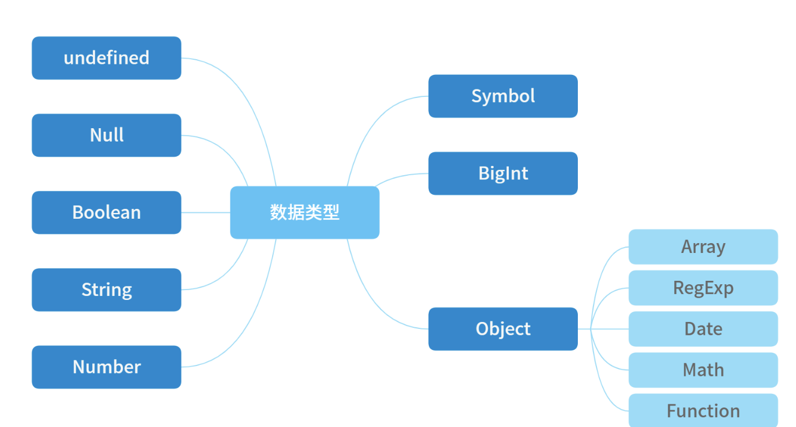

# 进阶篇

## 一、JS基础

### 1 类型及检测方式

JavaScript 的数据类型有下图所示

> 其中，前 7 种类型为基础类型，最后 `1 种（Object）为引用类型`
> ，也是你需要重点关注的，因为它在日常工作中是使用得最频繁，也是需要关注最多技术细节的数据类型

- `JavaScript` 一共有8种数据类型，其中有7种基本数据类型：`Undefined`
  、`Null` 、`Boolean` 、`Number` 、`String` 、`Symbol` （`es6`
  新增，表示独一无二的值）和`BigInt` （`es10` 新增）；
- 1种引用数据类型——`Object`
  （Object本质上是由一组无序的名值对组成的）。里面包含
  `function、Array、Date`
  等。JavaScript不支持任何创建自定义类型的机制，而所有值最终都将是上述 8
  种数据类型之一。
  - **引用数据类型:** 对象`Object` （包含普通对象-`Object`
    ，数组对象-`Array` ，正则对象-`RegExp` ，日期对象-`Date`
    ，数学函数-`Math` ，函数对象-`Function` ）

> 在这里，我想先请你重点了解下面两点，因为各种 JavaScript
> 的数据类型最后都会在初始化之后放在不同的内存中，因此上面的数据类型大致可以分成两类来进行存储：

- **原始数据类型**
  ：基础类型存储在栈内存，被引用或拷贝时，会创建一个完全相等的变量；占据空间小、大小固定，属于被频繁使用数据，所以放入栈中存储。
- **引用数据类型**
  ：引用类型存储在堆内存，存储的是地址，多个引用指向同一个地址，这里会涉及一个“共享”的概念；占据空间大、大小不固定。引用数据类型在栈中存储了指针，该指针指向堆中该实体的起始地址。当解释器寻找引用值时，会首先检索其在栈中的地址，取得地址后从堆中获得实体。

**JavaScript 中的数据是如何存储在内存中的？**

> 在 JavaScript
> 中，原始类型的赋值会完整复制变量值，而引用类型的赋值是复制引用地址。

在 JavaScript 的执行过程中， 主要有三种类型内存空间，分别是`代码空间`
、`栈空间` 、`堆空间`。其中的代码空间主要是存储可执行代码的，原始类型(`Number、String、Null、Undefined、Boolean、Symbol、BigInt`
)的数据值都是直接保存在“栈”中的，引用类型(Object)的值是存放在“堆”中的。因此在栈空间中(执行上下文)，原始类型存储的是变量的值，而引用类型存储的是其在
"堆空间 "中的地址，当 JavaScript需要访问该数据的时候，是通过栈中的引用地址来访问的，相当于多了一道转手流程。

在编译过程中，如果 JavaScript引擎判断到一个闭包，也会在堆空间创建换一个`“closure(fn)”`的对象（这是一个内部对象，JavaScript是无法访问的），用来保存闭包中的变量。所以闭包中的变量是存储在“堆空间”中的。

JavaScript引擎需要用栈来维护程序执行期间上下文的状态，如果栈空间大了话，所有的数据都存放在栈空间里面，那么会影响到上下文切换的效率，进而又影响到整个程序的执行效率。通常情况下，栈空间都不会设置太大，主要用来存放一些原始类型的小数据。而引用类型的数据占用的空间都比较大，所以这一类数据会被存放到堆中，堆空间很大，能存放很多大的数据，不过缺点是分配内存和回收内存都会占用一定的时间。因此需要“栈”和“堆”两种空间。

