## [\#](#四、event-loop详细版){.header-anchor} 四、Event Loop详细版 {#四、event-loop详细版}

### [\#](#为什么-gui-渲染线程为什么与-js-引擎线程互斥){.header-anchor} 为什么 GUI 渲染线程为什么与 JS 引擎线程互斥

-   这是由于 JS 是可以操作 DOM 的，如果同时修改元素属性并同时渲染界面(即
    JS线程和 UI线程同时运行)
-   那么渲染线程前后获得的元素就可能不一致了
-   因此，为了防止渲染出现不可预期的结果，浏览器设定 GUI渲染线程和
    JS引擎线程为互斥关系
-   当 JS引擎线程执行时
    GUI渲染线程会被挂起，GUI更新则会被保存在一个队列中等待
    JS引擎线程空闲时立即被执行

### [\#](#从-event-loop-看-js-的运行机制){.header-anchor} 从 Event Loop 看 JS 的运行机制

**先理解一些概念：**

-   `JS` 分为同步任务和异步任务
-   同步任务都在JS引擎线程上执行，形成一个 执行栈
-   事件触发线程管理一个 任务队列，异步任务触发条件达成，将回调事件放到
    任务队列中
-   执行栈中所有同步任务执行完毕，此时JS引擎线程空闲，系统会读取
    任务队列，将可运行的异步任务回调事件添加到 执行栈中，开始执行

    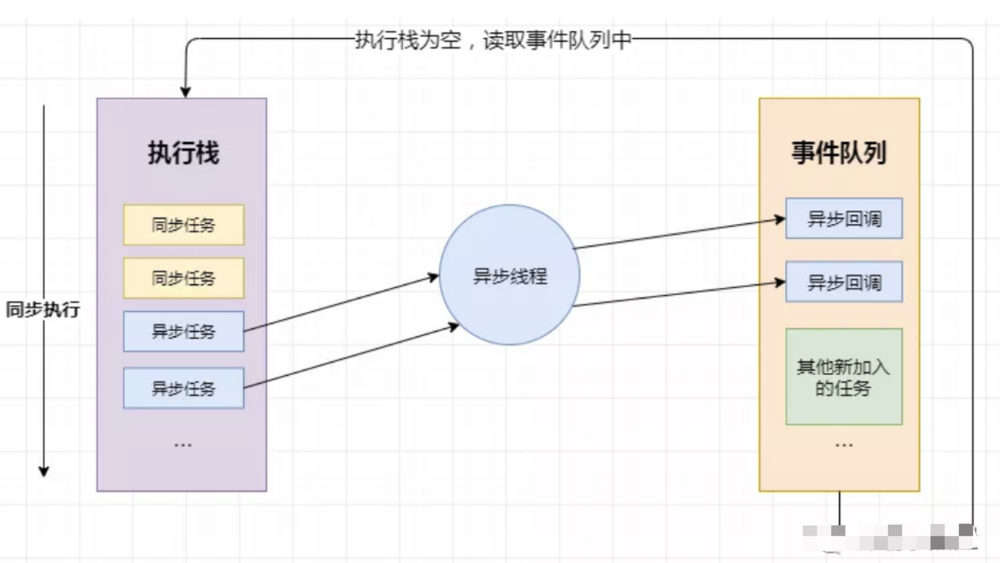

    -   前端开发中我们会通过 `setTimeout/setInterval` 来指定定时任务，会通过
    `XHR/fetch` 发送网络请求
-   接下来简述一下 `setTimeout/setInterval` 和 `XHR/fetch`
    到底做了什么事
-   我们知道，不管是 `setTimeout/setInterval` 和 `XHR/fetch`
    代码，在这些代码执行时，
    本身是同步任务，而其中的回调函数才是异步任务
-   当代码执行到 `setTimeout/setInterval` 时，实际上是 JS引擎线程通知
    定时触发器线程，间隔一个时间后，会触发一个回调事件
-   而定时触发器线程在接收到这个消息后，会在等待的时间后，将回调事件放入到由
    事件触发线程所管理的事件队列中
-   当代码执行到 `XHR/fetch` 时，实际上是 `JS` 引擎线程通知 异步`http`
    请求线程，发送一个网络请求，并制定请求完成后的回调事件
-   而异步`http`
    请求线程在接收到这个消息后，会在请求成功后，将回调事件放入到由
    事件触发线程所管理的 事件队列中
-   当我们的同步任务执行完，`JS` 引擎线程会询问事件触发线程，在
    事件队列中是否有待执行的回调函数，如果有就会加入到执行栈中交给
    JS引擎线程执行

    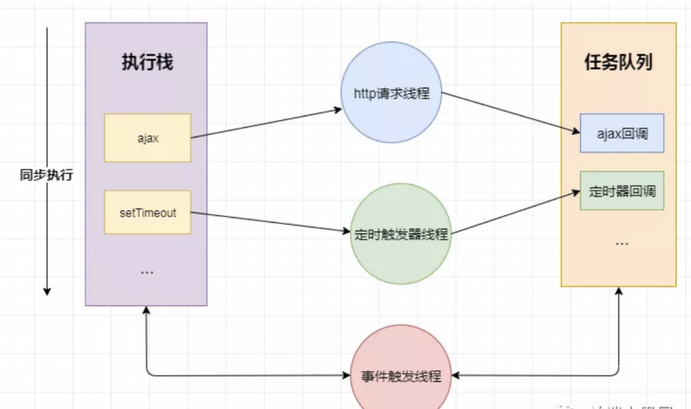

    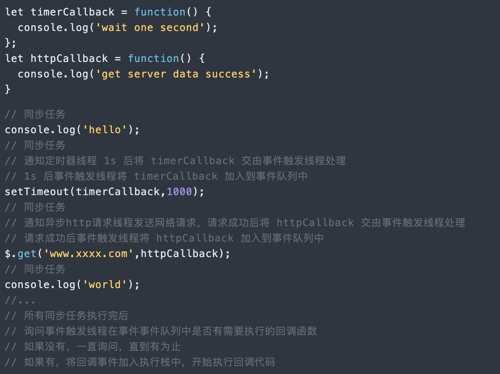

**总结一下：**

-   JS引擎线程只执行执行栈中的事件
-   执行栈中的代码执行完毕，就会读取事件队列中的事件
-   事件队列中的回调事件，是由各自线程插入到事件队列中的
-   如此循环

> 当我们基本了解了什么是执行栈，什么是事件队列之后，我们深入了解一下事件循环中
> 宏任务、 微任务

### [\#](#什么是宏任务){.header-anchor} 什么是宏任务

-   我们可以将每次执行栈执行的代码当做是一个宏任务（包括每次从事件队列中获取一个事件回调并放到执行栈中执行）
-   每一个宏任务会从头到尾执行完毕，不会执行其他。

> 我们前文提到过 JS引擎线程和 GUI渲染线程是互斥的关系，浏览器为了能够使
> 宏任务和 DOM任务有序的进行，会在一个 宏任务执行结果后，在下一个
> 宏任务执行前， GUI渲染线程开始工作，对页面进行渲染。

``` js
    // 宏任务-->渲染-->宏任务-->渲染-->渲染．．
```

> 主代码块，`setTimeout` ，`setInterval` 等，都属于宏任务

**第一个例子：**

我们可以将这段代码放到浏览器的控制台执行以下，看一下效果：

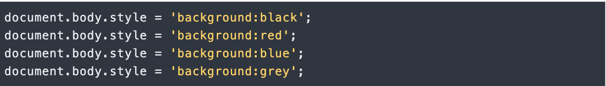

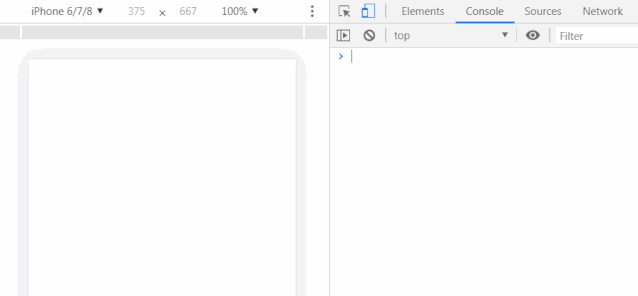

> 我们会看到的结果是，页面背景会在瞬间变成白色，以上代码属于同一次
> 宏任务，所以全部执行完才触发 页面渲染，渲染时
> GUI线程会将所有UI改动优化合并，所以视觉效果上，只会看到页面变成灰色

**第二个例子：**

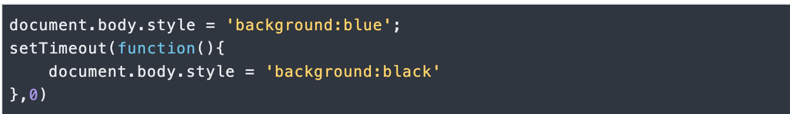

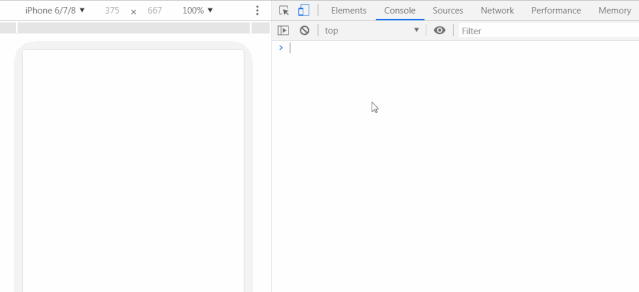

> 我会看到，页面先显示成蓝色背景，然后瞬间变成了黑色背景，这是因为以上代码属于两次
> 宏任务，第一次
> 宏任务执行的代码是将背景变成蓝色，然后触发渲染，将页面变成蓝色，再触发第二次宏任务将背景变成黑色

### [\#](#什么是微任务){.header-anchor} 什么是微任务

-   我们已经知道 宏任务结束后，会执行渲染，然后执行下一个 宏任务，
-   而微任务可以理解成在当前 宏任务执行后立即执行的任务。
-   也就是说，**当 宏任务执行完，会在渲染前，将执行期间所产生的所有
    微任务都执行完** 。

> `Promise` ，`process.nextTick` 等，属于 微任务。

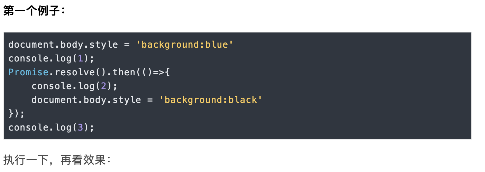

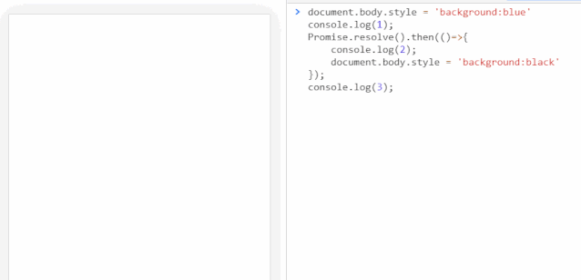

-   控制台输出 1 3 2 , 是因为 promise 对象的 then
    方法的回调函数是异步执行，所以 2 最后输出
-   页面的背景色直接变成黑色，没有经过蓝色的阶段，是因为，我们在宏任务中将背景设置为蓝色，但在进行渲染前执行了微任务，在微任务中将背景变成了黑色，然后才执行的渲染

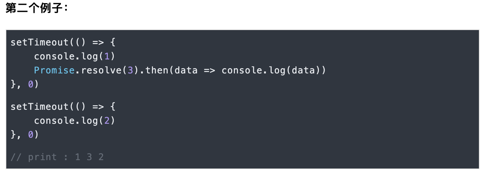

> 上面代码共包含两个 `setTimeout` ，也就是说除主代码块外，共有两个
> 宏任务， 其中第一个 宏任务执行中，输出 1 ，并且创建了
> 微任务队列，所以在下一个 宏任务队列执行前，先执行 微任务，在
> 微任务执行中，输出 3 ，微任务执行后，执行下一次 宏任务，执行中输出 2

### [\#](#总结){.header-anchor} 总结

-   执行一个 宏任务（栈中没有就从 事件队列中获取）
-   执行过程中如果遇到 微任务，就将它添加到 微任务的任务队列中
-   宏任务执行完毕后，立即执行当前 微任务队列中的所有 微任务（依次执行）
-   当前 宏任务执行完毕，开始检查渲染，然后 GUI线程接管渲染
-   渲染完毕后， JS线程继续接管，开始下一个 宏任务（从事件队列中获取）

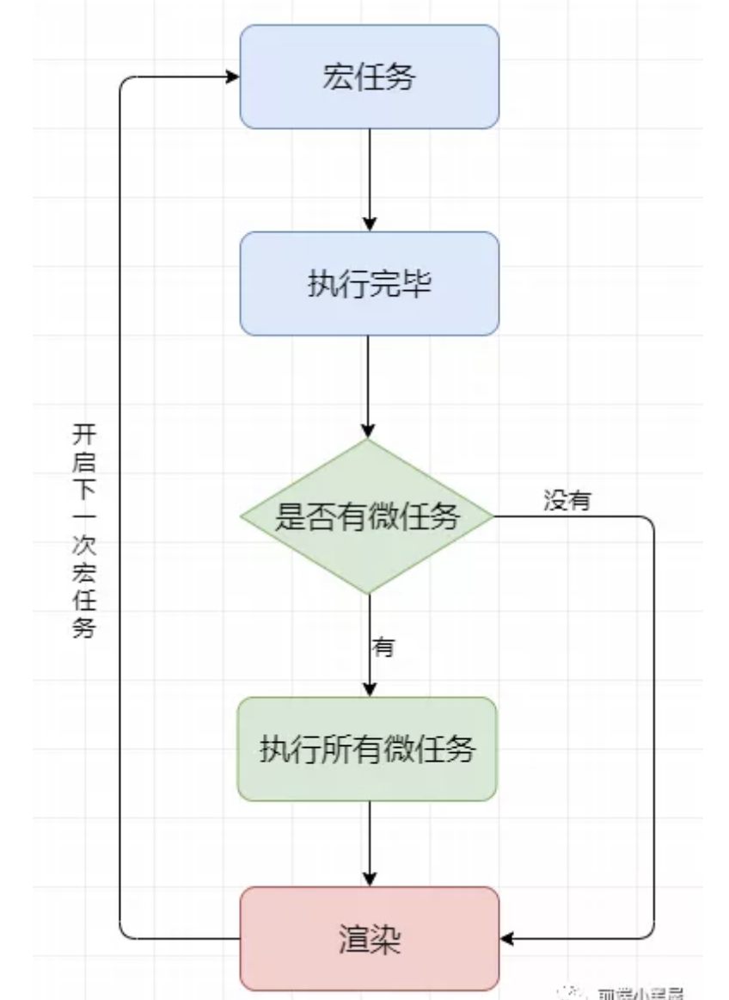