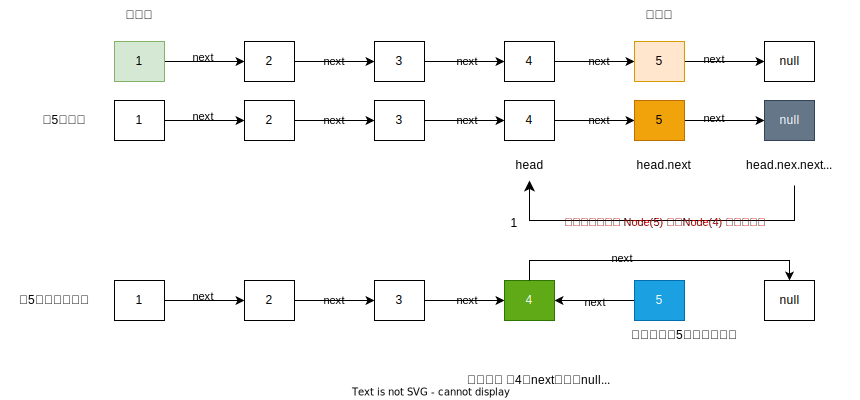

# 链表

## 链表反转

链表的特性是： 每个节点`Node` 只知道下一个节点是谁，不知道上一个是谁

- 链表有一个 next, 指向下一个`Node`
- 链表最后一个节点的 next 指向 `null`

```javascript
1->2->3->4->5

希望得到
5->4->3->2->1
```

### 遍历链表

<<<./demo/01.js

### 方法一： 迭代
<<<./demo/02.js

**复杂度分析**

- 时间复杂度： O(n) 其中 n 是链表的长度。需要遍历链表一次。
- 空间复杂度： O(1)


### 方法二： 递归

- 为了保证 链表节点不断， 必须从最后一个节点开始进行查找和操作（更改next指向）
- head.next = null 是为了避免环形链表的出现

```
1 -> 2 -> 3 -> 4 -> 5

fn(链表的node1)
```

希望得到的是

```
第一次：  head.next = 2
如果翻转了   head.next(2)--> 需要指向1, 则实际表达是  【head(1).next(2)】.next = head(1)
则1需要指向 null  就实现了   1->2 翻转为  2-> 1

注意： head(1).next(2) 不能再指向2了， 否则就形成了  1->2   2-> 1 形成环形链表
head.next = null 需要指向为null
```


<<<./demo/03.js

