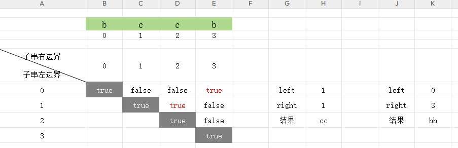

# 5. 最长回文子串

[5. 最长回文子串](https://leetcode.cn/problems/longest-palindromic-substring/)


## 思路

1. 长度为1的输入，回文串最大长度就是1 , 所以 ,如果 f(n<2) , 则返回n
2. 假设一个字符串不是回文串， 则遍历完了以后， 最大回文串 长度为1， 比如， 'abc'


### 检验一个字符串是不是回文串

对一个字符串遍历， 左边 === 右边， 就是回文， left++ , right--， 如果有不是的，直接判定为不是回文串


## 解题

### 暴力解法

<<<./demo-1.js

### 中心扩散法

- 枚举所有可能的回文字符的中间位置
- 中间位置可能是1个字符， 也有可能是2个字符

例如： "e  a c c a  h"  则回文字符串为 'acca'  中心位置右2个字符 'cc'

例如： 'bab'  中心位置为 a  1个字符

就是需要考虑 回文字符串 的  奇偶性

<<<./demo-2.js

- 时间复杂度： O(n^2)  枚举中间位置个数是 2(n - 1) , 每次向两边扩散，检测字符串是否为回文
- 空间复杂度： O(1) 只用到了几个临时变量


### 动态规划

```
p(i, j) 是回文， i和 j是下标的意思

  1. true  当只有一个字符， 一定是回文
  2. 当 0 < j-i <=2 当字符有2个或者3个，比如是2个字符， 要求2个字符相同， 'aa' 是回文， 比如 'aba' 3个的情况， 也是回文
  3. s[i] ===s[j] && p(i+1, j-1)   j-i > 2 也符合的条件，也是回文， 字符串至少有4个字符
```

<<<./demo-3.js

时间复杂度： O(n^2)

空间复杂度： O(n^2)  存储已经计算过的状态所需要的空间 dp


